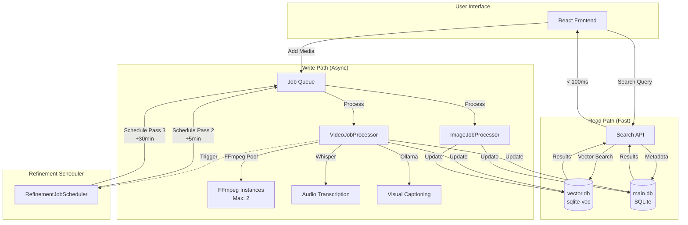
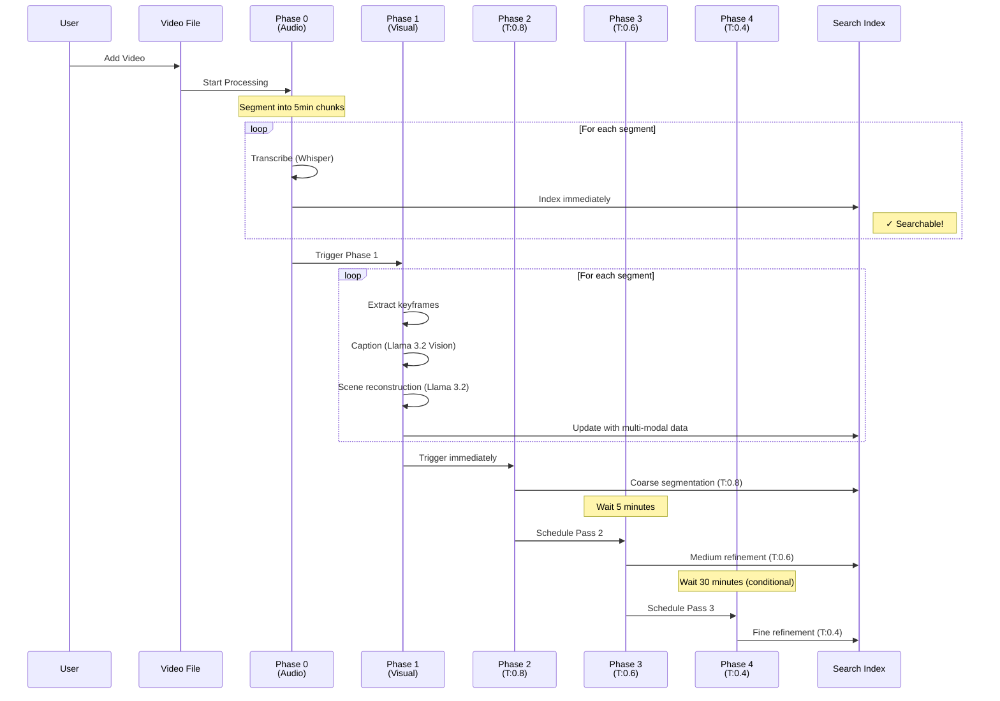
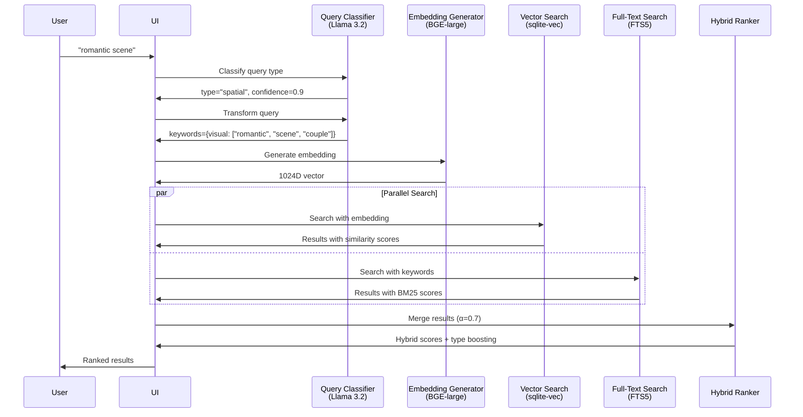

[Download](https://github.com/ikouchiha47/cinestar-release/releases/tag/v0.1.53)


## 1. Core Principle: Privacy-First, Local AI

The design of Cinestar originates from a commitment to user privacy. The goal was to create a powerful media search tool that does not require cloud uploads. This privacy-first principle dictated the first major technical decision: the exclusive use of **local AI models**.

The initial prototype was an Electron application focused on local image search. The `ImageJobProcessor` performed two key tasks on the user's machine:

1.  **Local Image Captioning:** A locally-run LLM generated a descriptive caption for each image.
2.  **Local Indexing:** Captions and metadata were stored in a local SQLite database.

This approach provided a powerful keyword search for photos while ensuring that all data and processing remained on the user's machine.

## 2. Video Processing: Resource Management and FFmpeg

Extending the system to video introduced the complexity of `ffmpeg`. The initial approach of shelling out `ffmpeg` commands directly led to severe resource contention and UI freezes. A single large video file could overwhelm the system.

### The FFmpeg Journey: Trial and Error

Several approaches were tested before arriving at the current solution:

**Attempt 1: Direct Shell Execution**

```bash
ffmpeg -i video.mp4 -vn -acodec pcm_s16le audio.wav
```

- **Problem**: No resource limits, multiple concurrent processes caused CPU spikes to 100%
- **Result**: UI freezes, system instability

**Attempt 2: Sequential Processing**

```bash

ffmpeg -i video.mp4 -vn -acodec pcm_s16le audio.wav && \
ffmpeg -i video.mp4 -vf "select='eq(pict_type,I)'" -vsync vfr frame_%04d.png
```

- **Problem**: Blocking operations, no parallelism
- **Result**: Extremely slow for large video libraries

**Attempt 3: Resource-Aware Pool (Final Solution)**

- Implemented a semaphore-based pool limiting concurrent FFmpeg instances (default: 2)
- Job queue with priority scheduling
- Graceful degradation under load
- **Result**: Stable performance, predictable resource usage

The solution was the implementation of a **resource-aware processing pool**. This system manages a limited number of concurrent `ffmpeg` instances, queuing jobs and executing them as resources become available. This was a critical step towards a stable and scalable architecture.

## 3. Architectural Model: CQRS for a Responsive UI

While the `ffmpeg` resource pool solved stability, it revealed a deeper architectural challenge: the conflict between long-running write operations (indexing) and instantaneous read operations (searching). Mixing these two concerns resulted in a sluggish user experience.

The adoption of a **Command Query Responsibility Segregation (CQRS)**-inspired model addressed this. A hard line was drawn between the read and write paths:



**The Write Path:** A robust, asynchronous job processing system (`JobQueue`, `VideoJobProcessor`, `ImageJobProcessor`) designed for throughput and resilience. Its sole responsibility is to ingest and process media to update the search index.

**The Read Path:** A highly optimized query system designed for speed. It directly queries the search index and has no knowledge of the background processing.

This separation is key to the application's responsive UI, allowing for seamless user interaction during intensive indexing tasks.

## 4. The Five-Phase Indexing Pipeline

The CQRS architecture enabled a focused approach to the core video search problem. The goal was to make a video searchable *while it is still being processed*, and then continuously improve search quality over time. This was achieved through a five-phase processing pipeline with progressive threshold-based refinement.



### Phase 0: Iterative Audio Indexing

The primary goal of this phase is **immediate searchability**. The process is as follows:

1.  **Segmentation:** The `BatchProcessor` splits the video into 5-minute segments (300 seconds).
2.  **Transcription:** The audio of each segment is transcribed using **Whisper** (local model).
3.  **Embedding Generation:** Text is embedded using **BGE-large** (1024-dimensional vectors).
4.  **Immediate Indexing:** As soon as a segment's transcription is complete, it is immediately indexed in both `video-rag.db` (metadata) and `vector.db` (searchable embeddings). This allows a user to start searching a long video moments after it has been added.

**Performance:** A 60-minute video becomes searchable in ~40 seconds (12 segments × ~3s each).

### Phase 1: Multi-Modal Enrichment

After the initial audio indexing, a deeper, multi-modal analysis begins for each segment:

1.  **Keyframe Extraction:** 4 keyframes are extracted per segment at 20%, 40%, 60%, and 80% positions using FFmpeg.
2.  **Visual Captioning:** **Moondream:v2** (2B parameters, running via Ollama) generates captions for each keyframe.
3.  **Scene Reconstruction with Temporal Context:** The system uses **Llama 3.2** (3B parameters) to synthesize a scene description by combining:
   - **Current segment data:** Audio transcription + 4 keyframe captions + OCR text (if available)
   - **Temporal context:** Reconstructed scenes from previous segments (configurable context window)
   
   This RNN-style approach allows the model to understand scene continuity and narrative flow across the video.
   
4.  **Enhanced Embedding:** A new multi-modal embedding is generated from the combined text:
   ```
   [Transcription] + Visual Context: [Captions] + Scene: [Reconstruction]
   ```
5.  **Index Enhancement:** The search index is updated with this new multi-modal data, replacing the audio-only embedding.

**Performance:** ~10-15 seconds per 5-minute segment (4-8s captioning, 2-3s reconstruction, 0.5s embedding).

**Search Impact:** Enables queries like "romantic scene in dimly lit room" or "action sequence" that would be impossible with audio alone.

#### Semantic Scene Understanding with Temporal Context

The scene reconstruction process creates a rich, contextual understanding that goes beyond simple object detection. By combining audio, visual information, **and temporal context from previous segments**, the system can understand:

**Object Interactions:**

- "person handing object to another person"
- "dog playing with ball in park"
- "chef chopping vegetables on cutting board"

**Spatial Relationships:**

- "car parked next to building"
- "people sitting around table"
- "mountains in the background behind the lake"

**Temporal Actions:**

- "person walking towards camera"
- "door opening slowly"
- "liquid pouring into glass"

**Contextual Scenes:**

- "tense conversation in office setting" (combines facial expressions, body language, dialogue tone)
- "celebration with people dancing" (combines movement, audio cues, visual atmosphere)
- "cooking demonstration with ingredients on counter" (combines objects, actions, spatial layout)

**Narrative Continuity (Temporal Context):**

The system maintains a sliding window of previous segment descriptions, enabling it to understand:
- Scene transitions: "After the introduction, the speaker begins the demonstration"
- Character tracking: "The same person continues explaining the concept"
- Story progression: "Following the setup, the action sequence begins"

**Example Scene Reconstruction Prompt:**

```txt
Previous segments: 
  → "Person introduces topic in office setting" 
  → "Close-up of whiteboard with diagrams"

Current segment:
Time: 120s-180s
Audio: "So as you can see from this example..."
Visual: Person pointing at screen. Audience visible. Presentation slide.
Text (OCR): "Key Findings 2024"

Write a paragraph describing what happens in this scene:
```

This RNN-style temporal context allows the model to understand that this is a **continuation** of the presentation, not an isolated scene. The system effectively creates a "semantic memory" of the video that captures not just what objects are present, but how they relate to each other, what's happening, and how the narrative flows over time.

### Phases 2-4: Progressive Threshold-Based Refinement

After the initial indexing and enrichment, the system enters a continuous improvement loop with three additional refinement passes, each using progressively lower confidence thresholds:

**Phase 2 - Coarse Segmentation (Threshold: 0.8)**

- Triggered: Immediately after Phase 1
- Purpose: Initial coarse segmentation for immediate results
- Creates broader segments with high-confidence content

**Phase 3 - Medium Refinement (Threshold: 0.6)**

- Triggered: 5 minutes after initial processing
- Purpose: Medium-grained analysis to capture more nuanced content
- Identifies additional segments that were missed in the first pass

**Phase 4 - Fine Refinement (Threshold: 0.4)**

- Triggered: 30 minutes after initial processing (conditional)
- Purpose: Deep analysis for maximum search coverage
- Conditional execution based on video length and existing segment count
- Captures subtle content changes and low-confidence segments

The `RefinementJobScheduler` manages this process:
- Schedules future passes with configurable delays and jitter (±20%) to prevent system overload
- Tracks metrics for each pass (segments created, processing time, search quality)
- Applies conditional logic to skip unnecessary refinement (e.g., short videos, already well-segmented content)

This five-phase approach ensures videos are searchable almost instantly (Phase 0), enriched with multi-modal understanding (Phase 1), and progressively refined over time (Phases 2-4) for maximum search quality.


## 5. The Search System: Intelligence Through Multi-Modal Query Understanding

The search system is designed to understand what users are looking for, not just match keywords. This is achieved through a sophisticated multi-stage pipeline that analyzes queries, generates appropriate embeddings, and intelligently ranks results.

### Query Classification and Transformation

When a user types a search query, the system first analyzes it to understand the **intent** and **modality**:

**Step 1: Query Type Classification**

The system uses Llama 3.2 (3B) to classify queries into five types:

1. **TEMPORAL** - Time-based queries ("beginning", "first 5 minutes", "after 2:30")
2. **SPATIAL** - Visual object queries ("red car", "mountains", "person wearing hat")
3. **AUDIO** - Sound/speech queries ("talking about cooking", "music playing")
4. **ACTION** - Activity queries ("person jumping", "someone cooking", "dancing")
5. **MIXED** - Combinations ("beginning where someone is cooking")

**Example Classification:**

```typescript
// Query: "romantic scene in dimly lit room"
classification = {
  type: "spatial",
  confidence: 0.92,
  spatialElements: ["romantic scene", "dimly lit room"],
  audioElements: [],
  actionElements: []
}
```

**Step 2: Multi-Modal Query Transformation**

Based on the classification, the query is transformed and expanded with modality-specific keywords:

```typescript
// Original: "person talking about technology"
transformed = {
  searchKeywords: {
    text: ["person", "technology"],
    visual: ["person", "speaking", "presentation"],
    audio: ["talking", "technology", "speech"],
    action: ["talking", "speaking"],
    temporal: []
  },
  transformed: "person speaking about technology, visual: person presenting, audio: technology discussion"
}
```

This transformation ensures the search understands both what's being said (audio) and what's being shown (visual).

### Hybrid Search Architecture

The system uses a **hybrid search** approach that combines two complementary methods:

**1. Vector Similarity Search (70% weight)**

- Uses `sqlite-vec` extension for efficient vector operations
- Searches 1024-dimensional BGE-large embeddings
- Finds semantically similar content even without exact keyword matches
- L2 distance threshold: 15.0 (strict) for high-quality matches

**2. Full-Text Search / FTS (30% weight)**

- Uses SQLite's FTS5 with BM25 ranking
- Matches exact keywords and phrases
- Handles queries with specific terminology
- Complements vector search for precise term matching

**Hybrid Scoring Formula:**

```
final_score = α × vector_similarity + (1 - α) × fts_score
```
Where α = 0.7 (configurable)

**Why Hybrid?**
- **Vector-only** misses exact term matches (e.g., searching for "iPhone" might miss if only described as "smartphone")
- **FTS-only** misses semantic similarity (e.g., "romantic scene" won't match "couple in candlelit dinner")
- **Hybrid** gets the best of both: semantic understanding + precise matching

### Query-Aware Score Boosting

Results are further enhanced based on query type:

```typescript
// Temporal queries boost video segments with timestamps
if (queryType === 'temporal' && result.path.includes('#t=')) {
  score *= 1.1; // 10% boost
}

// Spatial queries boost full videos over segments
if (queryType === 'spatial' && result.type === 'video') {
  score *= 1.05; // 5% boost
}
```

This ensures that:

- Time-based queries prioritize specific segments
- Visual queries favor complete videos with full context
- Audio queries weight transcription matches higher

### Search Performance Optimizations

**1. Database Architecture**

- `SQLite` with `sqlite-vec` extension for local vector search
- Separate FTS5 virtual table (`media_fts`) for text search
- Indexed joins for fast result merging

**2. Search Cancellation**

- Robust cancellation mechanism for responsive UI
- Old queries immediately cancelled when user types new query
- Prevents resource waste on stale searches

**3. Result Deduplication**

- Parent videos and segments deduplicated intelligently
- Shows parent video with "(X segments match)" indicator
- Preserves segment information for precise navigation

### Search Flow Example



This multi-stage approach ensures that searches are both **intelligent** (understanding intent) and **precise** (matching relevant content), delivering results that match the user's mental model of what they're looking for.

### Media-Specific Search Optimizations

The search system applies different strategies for images vs. videos, reflecting their fundamental differences in content structure:

#### Image Search

**Indexing:**

- Single-step captioning using Moondream:v2 vision model
- One caption per image describing visual content
- Caption → Text embedding (BGE-large 1024D)

**Search:**

- Query against single caption embedding
- No temporal context (images are static)
- Standard hybrid search (vector + FTS)

**Example:**

```
Image: sunset-beach.jpg
Caption: "Golden sunset over ocean with silhouetted palm trees"
Embedding: [1024D vector from caption]
Search: "beach sunset" → Direct similarity match
```

#### Video Search

**Indexing:**

- Multi-stage, multi-modal process across 5 phases
- Each 5-minute batch generates:
  - **Audio transcription** → `transcription_embedding`
  - **4 keyframe captions** → `caption_embedding`
  - **Scene reconstruction** (audio + visual + temporal context) → `reconstruction_embedding`
- Multiple embeddings per video segment

**Search:**

- Query against multi-modal embeddings (audio + visual + scene)
- **Query-aware score boosting:**
  - Temporal queries (`"beginning"`, `"first 5 minutes"`) → Boost segments with timestamps (1.1×)
  - Spatial queries (`"red car"`, `"mountains"`) → Boost full videos over segments (1.05×)
  - Audio queries (`"talking about technology"`) → Weight transcription matches higher
- **Video deduplication:** Parent videos and segments merged to prevent duplicates
- **Segment navigation:** Results link to specific timestamps

**Example:**

```
Video: presentation.mp4 (20 minutes)
Batch 1 (0-5min):
  - Transcription: "Welcome everyone, today we'll discuss..."
  - Keyframes: ["Speaker at podium", "Title slide", "Audience", "Diagram"]
  - Scene: "Professional presentation begins in conference room with speaker introducing topic to seated audience"
  - Temporal context: [Start of video]
  - Embedding: [Multi-modal 1024D vector]

Batch 2 (5-10min):
  - Transcription: "As you can see from this example..."
  - Keyframes: ["Close-up of screen", "Pointing gesture", "Data chart", "Audience reaction"]
  - Scene: "Continuing the presentation, speaker explains technical concepts using visual aids while audience takes notes"
  - Temporal context: ["Professional presentation begins..."]
  - Embedding: [Enhanced with narrative continuity]

Search: "presentation about technology" 
  → Matches both batches with different scores
  → Deduplicates to show parent video with "2 segments match"
  → Clicking opens video player with segment navigation
```

**Key Differences:**

| Aspect | Images | Videos |
|--------|--------|--------|
| **Granularity** | 1 item = 1 image | 1 video = N segments/batches |
| **Embeddings** | 1 caption embedding | 3 embeddings per segment (audio, visual, scene) |
| **Temporal Context** | None (static) | RNN-style sliding window |
| **Query Boosting** | Standard scoring | Type-aware (temporal/spatial/audio) |
| **Result Deduplication** | Not needed | Parent + segments merged |
| **Navigation** | Direct image view | Timestamp-based seeking |
| **Processing Time** | ~2-5s per image | ~40s for 60min video (Phase 0) |


This differentiated approach ensures that each media type is indexed and searched in a way that matches how users naturally think about that content—images as single visual moments, videos as temporal narratives with multiple modalities.

## 6. Challenges and Solutions

### Challenge 1: Ollama Resource Contention

**Problem:** Search queries took 10+ seconds during video indexing because Phase 1 captioning and search embeddings competed for the same Ollama instance.

**Solution:** Implemented dual Ollama architecture:
- **Search embeddings** → Direct Ollama (port 11434) - No queuing, fast response
- **Indexing operations** → Nginx load balancer (port 11435) → 2 Ollama instances

**Result:** Search latency reduced from 10,281ms to 500-1000ms during active indexing.

### Challenge 2: Database Synchronization

**Problem:** Video segments were stored in `video-rag.db` but not indexed in `vector.db`, causing 0 search results despite successful processing.

**Solution:** Added immediate vector indexing step in Phase 0, right after segment storage. Both databases are now kept in sync.

**Result:** Videos become searchable immediately after transcription completes.

### Challenge 3: Progress Tracking Across Phases

**Problem:** UI showed incorrect progress when jobs were resumed after app restart.

**Solution:** Implemented phase-specific progress tracking with database persistence. Each phase tracks 0-100% independently, and the system can resume from any phase.

**Result:** Accurate progress display and graceful resume capability.

## 7. Performance Metrics

### Video Processing Timeline (20-minute video)

| Phase | Duration | Cumulative | Status |
|-------|----------|------------|--------|
| Phase 0 (Audio) | ~40s | 40s | ✓ Searchable |
| Phase 1 (Visual) | ~60s | 100s | ✓ Multi-modal |
| Phase 2 (T:0.8) | ~10s | 110s | ✓ Coarse |
| Phase 3 (T:0.6) | +5min | +5min | ✓ Medium |
| Phase 4 (T:0.4) | +30min | +30min | ✓ Fine |


### Search Performance

- **Vector search latency:** 7-50ms (database query)
- **Embedding generation:** 500-1000ms (BGE-large)
- **Total search time:** < 1 second (typical)
- **Search during indexing:** < 1 second (with dual Ollama setup)

### Resource Usage

- **FFmpeg pool:** Max 2 concurrent instances
- **Ollama instances:** 2 (load-balanced for indexing) + 1 (dedicated for search)
- **Memory:** ~4GB (with all models loaded)
- **Disk:** ~500MB per hour of video (embeddings + metadata)

## 8. Technology Stack

### Core Framework

| Component | Technology | Purpose |
|-----------|-----------|---------|
| Desktop Framework | Electron | Cross-platform desktop app |
| Frontend | React + TypeScript | UI components |
| Styling | TailwindCSS + shadcn/ui | Modern, responsive design |
| Icons | Lucide | Consistent iconography |


### AI & ML Models

| Model | Parameters | Purpose | Runtime |
|-------|-----------|---------|---------|
| Whisper | Base | Audio transcription | Local CPU |
| BGE-large | 335M | Text embeddings (1024D) | Ollama |
| Moondream:v2 | 2B | Visual captioning | Ollama |
| Llama 3.2 | 3B | Scene reconstruction & query analysis | Ollama |


### Data Layer

| Component | Technology | Purpose |
|-----------|-----------|---------|
| Main Database | SQLite | Metadata, jobs, configuration |
| Vector Database | SQLite + sqlite-vec | Semantic search with embeddings |
| Video Database | SQLite (video-rag.db) | Video segments, batches, transcriptions |


### Media Processing

| Tool | Purpose |
|------|---------|
| FFmpeg | Video/audio extraction, keyframe generation |
| FFprobe | Video metadata analysis |
| Sharp | Image processing (thumbnails, compression) |


### Infrastructure

| Component | Technology |
|-----------|-----------|
| AI Runtime | Ollama (2 instances + nginx load balancer) |
| Process Management | Node.js child processes with semaphore pools |
| IPC | Electron IPC (main ↔ renderer) |


## 9. Future Enhancements

### Short-term

- **Intelligent Query Cache:** Semantic caching layer using embeddings to eliminate redundant search operations. Expected 35-55% cache hit rate with <5ms latency for cached queries
- **OCR Integration:** Extract text from video frames for document/presentation search
- **Audio Fingerprinting:** Detect duplicate videos and similar content
- **Batch Export:** Export search results with timestamps for video editing workflows

### Medium-term

- **Face Recognition:** Local face detection and clustering for person-based search
- **Object Detection:** Identify and track objects across video frames
- **Multi-language Support:** Extend transcription beyond English

### Long-term

- **Distributed Processing:** Support for processing across multiple machines
- **Plugin System:** Allow community-developed processors and search filters
- **Mobile Companion App:** View and search indexed content from mobile devices

## Conclusion

Cinestar's architecture is the result of an iterative engineering process. The core principles of a CQRS-inspired model, phased processing, and a steadfast commitment to privacy through local AI have resulted in a platform that is both powerful and responsive. This demonstrates that a world-class search experience can be delivered without compromising user privacy, with all processing and data storage handled on the local machine.

The five-phase pipeline ensures that users get immediate value (Phase 0) while the system continuously improves search quality in the background (Phases 1-4). The dual-database architecture (metadata + vectors) and dual-Ollama setup (search + indexing) provide both speed and intelligence without sacrificing user experience.

**Key Takeaways:**

- **Privacy is non-negotiable:** Local AI models can match cloud services
- **Progressive enhancement works:** Users don't wait for perfection
- **CQRS enables responsiveness:** Separate read/write paths prevent UI blocking
- **Threshold-based refinement:** Continuous improvement without user intervention
