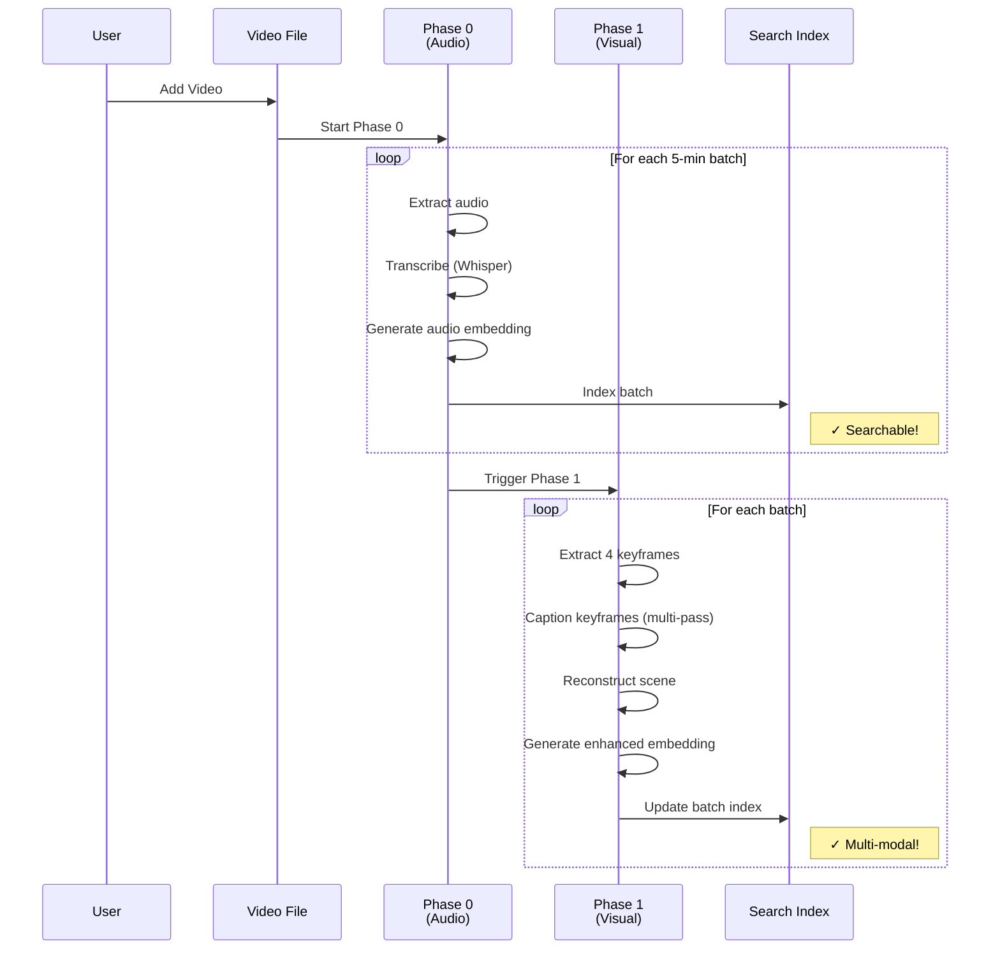

## Introduction

Ever try to find "that video where my mom laughed at the beach" or an image of "a sunset over the ocean from last summer"? Your personal media library is full of memories, but finding them relies on remembering file names and dates—or endless scrolling.

**Cinestar changes that.** It's a local-first media search engine that indexes images and videos entirely on your machine. No cloud uploads, no privacy compromises—just powerful AI running locally to make your entire media library searchable in natural language.

Search for "romantic scene in dimly lit room" and find that exact moment in a 2-hour video. Search for "sunset over ocean" and surface every beach photo from the last decade. All processed locally, all private, all instant.

This post explores the architectural decisions, technical challenges, and production lessons learned while building a system that processes 60-minute videos in under 2 minutes and makes them searchable by both audio and visual content.

---

## 1. Core Principle: Privacy-First, Local AI

The design of Cinestar originates from a commitment to user privacy. The goal was to create a powerful media search tool that does not require cloud uploads. This privacy-first principle dictated the first major technical decision: the exclusive use of **local AI models**.

All processing happens on the user's machine:
- **Transcription**: Whisper (local binary)
- **Vision**: Configurable provider (Ollama, OpenAI, Gemini, or LiteLLM proxy)
- **Embeddings**: BGE-large (1024D) via local Ollama or cloud providers
- **Text Generation**: Provider-agnostic LLM for scene reconstruction

**Key Insight**: Privacy and performance aren't mutually exclusive. With proper architecture, local processing can match or exceed cloud-based solutions while keeping all data on-device.

---

## 2. Database Architecture: Unified System with Specialized Indexes

Cinestar uses a **unified database architecture** with specialized indexes for different search modalities:

### Core Databases

```
~/.cinestar/
├── media.db          # Canonical media catalog (metadata)
├── jobs.db           # Processing jobs and batches
├── av_search.db      # Audio/video search indexes (FTS + vectors)
├── image_search.db   # Image search indexes (FTS + vectors)
└── config.db         # Strategy flags and partitions
```

### Database Responsibilities

| Database | Purpose | Key Tables |
|----------|---------|------------|
| **media.db** | Media catalog | `media_items`, `sources` |
| **jobs.db** | Processing pipeline | `job_runs`, `processing_batches`, `video_job_metadata` |
| **av_search.db** | Video search | `video_segment_embeddings`, `transcripts_fts`, `av_meta_cache` |
| **image_search.db** | Image search | `image_embeddings`, `image_fts`, `image_meta_cache` |
| **config.db** | Configuration | `configs`, `partitions`, `source_partition_map` |

**Why Separate Databases?**
- **Performance**: Specialized indexes for different search types
- **Scalability**: Each database can be optimized independently
- **Maintainability**: Clear separation of concerns
- **Migration**: Easier to evolve schema without affecting other components

---

## 3. CQRS-Inspired Architecture: Separation of Concerns

Cinestar employs a **CQRS-inspired** (Command Query Responsibility Segregation) architecture, separating write operations (indexing) from read operations (search):

### Write Side: Background Indexing

```typescript
// Electron Main Process
VideoJobOrchestrator → BatchManager → {
  Phase 0: TranscriptionProcessor + EmbeddingCoordinator
  Phase 1: CaptioningCoordinator + EmbeddingCoordinator
} → VideoPersistenceService → {media.db, av_search.db}
```

**Key Components**:
- `VideoJobOrchestrator`: Manages job lifecycle and worker coordination
- `BatchManager`: Coordinates Phase 0 (audio) and Phase 1 (visual) processing
- `VideoPersistenceService`: Writes results to databases with transaction safety

### Read Side: Real-Time Search

```typescript
// Renderer Process (React)
SearchBar → IPC → MainMediaAPI → {
  AVHybridStore: Hybrid search (vector + FTS)
  ImageHybridStore: Image search
} → Results
```

**Key Components**:
- `AVHybridStore`: Combines vector similarity + full-text search for videos
- `ImageHybridStore`: Combines vector similarity + full-text search for images
- `MainMediaAPI`: Unified API for all media operations

This separation is key to the application's responsive UI, allowing for seamless user interaction during intensive indexing tasks.

> **Architectural Takeaway**: The two-phase pipeline delivers immediate value (audio search in ~40 seconds) while incrementally enhancing quality (multi-modal visual search) in the background. Users are never left waiting.

---

## 4. The Two-Phase Video Processing Pipeline

The goal was to make videos searchable *while still being processed*, then continuously improve search quality over time. This was achieved through a **two-phase processing pipeline**:



### Phase 0: Immediate Audio Indexing

**Goal**: Make video searchable within ~60 seconds

**Process**:
1. **Segmentation**: `BatchProcessor` splits video into 5-minute batches (300 seconds)
2. **Transcription**: Whisper transcribes each batch's audio
3. **Embedding**: BGE-large generates 1024D embedding from transcription
4. **Indexing**: Write to `av_search.db`:
   - `video_segment_embeddings`: Vector for similarity search
   - `transcripts_fts`: Full-text search index
   - `av_meta_cache`: Metadata for result display

**Performance**: 60-minute video → 12 batches × ~3s each = **~40 seconds**

**Code Flow**:
```typescript
// src/core/video-processing/BatchManager.ts
async processPhase0(context: VideoProcessingContext) {
  const batches = await this.batchProcessor.createAudioBatches(
    context.videoId, context.videoPath, videoDuration
  );
  
  for (const batch of batches) {
    // Transcribe
    const transcription = await this.transcriptionProcessor.transcribeBatch(batch);
    
    // Generate audio-only embedding
    const embedding = await this.embeddingCoordinator.generateAudioEmbedding(transcription);
    
    // Save to jobs.db
    await this.batchProcessor.updateBatchTranscription(batch.id, transcription, embedding);
    await this.batchProcessor.updateBatchStatus(batch.id, 'audio_only');
  }
  
  // Write to search databases
  await this.persistenceService.storeBatchResults(results);
}
```

### Phase 1: Multi-Modal Enhancement

**Goal**: Add rich visual context for semantic search

**Process**:
1. **Keyframe Extraction**: 4 keyframes per batch at 20%, 40%, 60%, 80% positions
2. **Multi-Pass Captioning**: For each keyframe:
   - **Phase 1**: Vision model generates comprehensive caption
   - **Phase 2**: LLM extracts structured elements (objects, people, setting, mood)
   - **Phase 3**: Vision model spatial analysis (optional)
   - **Phase 4**: Vision model temporal analysis (optional)
3. **Scene Reconstruction**: LLM combines transcription + keyframe captions into rich scene description
4. **Enhanced Embedding**: Generate new embedding from:
   ```
   [Transcription] + Visual Context: [Captions] + Scene: [Reconstruction]
   ```
5. **Index Update**: Replace audio-only embedding with enhanced multi-modal embedding

**Performance**: ~10-15 seconds per 5-minute batch
- Keyframe extraction: ~2-3s (4 frames)
- Multi-pass captioning: ~4-8s (4 keyframes)
- Scene reconstruction: ~2-3s
- Embedding: ~0.5s

**Code Flow**:
```typescript
// src/core/video-processing/BatchManager.ts
async processPhase1(context: VideoProcessingContext) {
  const batches = await this.batchProcessor.getBatchesForVideo(context.jobId);
  
  for (const batch of batches) {
    // Extract keyframes
    const keyframes = await this.batchProcessor.extractBatchKeyframes(batch, context.videoPath);
    
    // Multi-pass captioning (provider-agnostic)
    const captionedKeyframes = await this.captioningCoordinator.captionKeyframes(keyframes);
    
    // Scene reconstruction
    const sceneReconstruction = await this.captioningCoordinator.reconstructScene(
      batch.transcription, captionedKeyframes
    );
    
    // Enhanced embedding
    const embedding = await this.embeddingCoordinator.generateEnhancedEmbedding(
      batch.transcription, captionedKeyframes, sceneReconstruction
    );
    
    // Update database
    await this.batchProcessor.updateBatchVisualData(batch.id, captions);
    await this.batchProcessor.updateBatchSceneReconstruction(batch.id, sceneReconstruction);
    await this.batchProcessor.updateBatchTranscription(batch.id, batch.transcription, embedding);
    await this.batchProcessor.updateBatchStatus(batch.id, 'enhanced');
  }
}
```

**Search Impact**:
- **Before Phase 1**: "romantic scene" → No results (audio-only)
- **After Phase 1**: "romantic scene" → Matches! (visual context in embedding)
- **Enables**: Abstract queries like "action sequence", "dimly lit room", "sunset over ocean"

> **Why Multi-Modal Matters**: Audio transcription tells you *what was said*. Visual analysis tells you *what was shown*. Scene reconstruction tells you *what was happening*. Combining all three creates embeddings that understand the full context of each moment.

---

## 5. Multi-Pass Captioning: From Simple to Structured

Both images and videos use **multi-pass captioning** to extract rich, structured information from visual content.

### Image Processing

```typescript
// src/core/image-job-processor.ts
async processImage(job: ImageJob) {
  // 1. Optional compression
  const inferencePath = await this.compressIfNeeded(job.filePath);
  
  // 2. Multi-pass captioning (if enabled)
  if (config.multiPass?.enabled) {
    const multiPassResult = await this.multiPassService.analyzeImage(inferencePath);
    caption = multiPassResult.caption;
    multiPassData = {
      caption: multiPassResult.caption,
      captionElements: multiPassResult.elements,  // Objects, people
      captionSpatial: multiPassResult.spatial,    // Spatial relationships
      captionTemporal: multiPassResult.temporal,  // Actions, movement
      captionTokens: multiPassResult.tokens
    };
  } else {
    // Fallback: Simple single-pass captioning
    caption = await this.llm.generateImageDescription(inferencePath);
  }
  
  // 3. Generate embedding
  const embedding = await this.llm.generateImageEmbedding(inferencePath);
  
  // 4. Write to image_search.db
  this.searchWriter.updateCaption(itemId, caption);
  this.searchWriter.updateEmbedding(itemId, embedding);
  this.searchWriter.updateMetaCache(itemId, multiPassData);
}
```

### Multi-Pass Service Architecture

```typescript
// src/core/processors/multi-pass-captioning-service.ts
export class MultiPassCaptioningService {
  private visionService: VisionService;           // Provider-agnostic vision
  private extractionService: LLMExtractionService; // Provider-agnostic LLM
  
  async analyzeImage(imagePath: string) {
    // Phase 1: Comprehensive caption
    const captionResult = await this.visionService.caption(imagePath, {
      prompt: 'Describe this image in detail, including setting, objects, people, activities, colors, lighting, and mood.'
    });
    
    // Phase 2: Extract structured elements
    const elements = await this.extractionService.extractElements(captionResult.caption);
    
    // Phase 3: Spatial analysis (optional)
    if (config.enableSpatial) {
      const spatialPrompt = this.queryBuilder.buildSpatialPrompt(elements);
      spatial = await this.visionService.caption(imagePath, { prompt: spatialPrompt });
    }
    
    // Phase 4: Temporal analysis (optional)
    if (config.enableTemporal) {
      const temporalPrompt = this.queryBuilder.buildTemporalPrompt(elements);
      temporal = await this.visionService.caption(imagePath, { prompt: temporalPrompt });
    }
    
    return { caption, elements, spatial, temporal, tokens };
  }
}
```

**Structured Elements Extracted**:
```typescript
interface ExtractedElements {
  objects: string[];      // ["laptop", "coffee mug", "desk"]
  people: string[];       // ["person in blue shirt"]
  setting: string;        // "modern office"
  mood: string;           // "professional, focused"
  colors: string[];       // ["blue", "white", "gray"]
  lighting: string;       // "natural daylight from window"
}
```

**Benefits**:
- **Richer search**: Find images by mood, lighting, specific objects
- **Better ranking**: Structured data improves relevance scoring
- **Incremental refinement**: Optional spatial/temporal passes for deeper analysis

> **Design Philosophy**: Start simple (single caption), then progressively enhance (extract structure, analyze spatial relationships, understand temporal context). Each phase adds value without blocking the previous one.

---

## 6. Provider-Agnostic AI: Flexibility Without Lock-In

Cinestar supports **multiple AI providers** through a unified adapter system:

### Supported Providers

| Provider | Type | Use Case | API Key Required |
|----------|------|----------|------------------|
| **Ollama** | Local | Privacy-first, free | ❌ No |
| **OpenAI** | Cloud | GPT-4V, best quality | ✅ Yes |
| **Google Gemini** | Cloud | Gemini Pro Vision | ✅ Yes |
| **LiteLLM Proxy** | Cloud/Local | Unified proxy for 100+ providers | ⚠️ Optional |

### Provider Manager Architecture

```typescript
// src/core/llm/provider-manager.ts
export class ProviderManager {
  private providers: Map<string, LLMProvider>;
  private adapters: Map<string, ILLMAdapter>;
  
  getProviderForTask(task: TaskType): ILLMAdapter {
    const provider = this.providers.get(this.activeProviderId);
    const adapter = this.createAdapter(provider);
    return adapter;
  }
  
  getModelForTask(task: TaskType): string {
    const provider = this.providers.get(this.activeProviderId);
    const model = provider.config.models.find(m => m.task === task);
    return model.modelName;
  }
}
```

### Adapter Interface

```typescript
// src/core/llm/types.ts
export interface ILLMAdapter {
  chat(messages: Message[], options?: ChatOptions): Promise<ChatResponse>;
  embed(text: string, options?: EmbedOptions): Promise<EmbedResponse>;
  vision(imageUrl: string, prompt: string, options?: VisionOptions): Promise<ChatResponse>;
  isAvailable(): Promise<boolean>;
}
```

### Service Integration

```typescript
// src/core/processors/vision-service.ts
export class VisionService {
  constructor(private providerManager: ProviderManager) {}
  
  async caption(imagePath: string, options: any) {
    const adapter = this.providerManager.getProviderForTask('vision');
    const model = this.providerManager.getModelForTask('vision');
    
    const response = await adapter.vision(imagePath, options.prompt, { model });
    return { caption: response.content };
  }
}
```

**Benefits**:
- **No vendor lock-in**: Switch providers without code changes
- **Cost optimization**: Use local Ollama for development, cloud for production
- **Quality control**: Test multiple providers and choose best results
- **Graceful degradation**: Fallback to simpler models if primary fails

> **Flexibility Principle**: The best AI provider today won't be the best tomorrow. Build abstractions that let you swap providers in minutes, not months.

---

## 7. The Search System: Hybrid Multi-Modal Query Understanding

Cinestar uses **hybrid search** combining vector similarity and full-text search for maximum relevance.

### Video Search Architecture

```typescript
// src/core/av-hybrid-store.ts
export class AVHybridStore {
  async search(ftsQuery: string, embeddingQuery: string, limit: number) {
    // 1. Generate query embedding
    const queryEmbedding = await this.llm.generateEmbedding(embeddingQuery);
    
    // 2. Hybrid search (vector + FTS)
    const results = await this.moddb.searchHybrid(ftsQuery, queryEmbedding, {
      limit,
      minScore: 0.3,
      weights: { vector: 0.7, fts: 0.3 }
    });
    
    // 3. Deduplicate parent + segments
    return this.deduplicateResults(results);
  }
}
```

### Search Query Flow

```
User Query: "romantic scene in dimly lit room"
    ↓
1. Generate embedding: [1024D vector]
2. FTS query: "romantic scene dimly lit room"
3. Vector search: Find similar embeddings
4. FTS search: Find matching transcriptions
5. Combine scores: 0.7 × vector + 0.3 × FTS
6. Deduplicate: Merge parent video + segments
7. Return results with timestamps
```

### Image vs Video Search Differences

| Aspect | Image Search | Video Search |
|--------|-------------|--------------|
| **Granularity** | Single item | 5-minute batches + parent video |
| **Embeddings** | 1 per image | Multiple per video (audio + visual) |
| **FTS Content** | Caption only | Transcription + captions + scene |
| **Query Boosting** | Standard scoring | Type-aware (temporal/spatial/audio) |
| **Result Deduplication** | Not needed | Parent + segments merged |
| **Navigation** | Direct image view | Timestamp-based seeking |
| **Processing Time** | ~2-5s per image | ~40s for 60min video (Phase 0) |

> **Why Hybrid Search?** Vector search finds conceptual matches ("a happy moment"), while FTS finds literal matches ("President Obama"). Combining them (70% vector + 30% FTS) ensures users find exactly what they're looking for, whether they remember the vibe or the exact words.

---

## 8. Production Challenges and Solutions

### Challenge 1: Whisper Binary ASAR Packaging

**The Problem**: Whisper transcription failed in production DMG. The native `whisper-cli` binary was packaged inside `app.asar`, making it non-executable. Node's module resolution loaded code from ASAR instead of the unpacked folder.

**Failed Approaches**:
- Postinstall patching of `nodejs-whisper/dist/constants.js` - Patch existed but was never loaded
- `Module.prototype.require` monkey-patching - Constants already cached before patch ran
- `Module._resolveFilename` override - Too late in ASAR resolution chain

**The Solution**: Created `WhisperDirectService` that bypasses `nodejs-whisper` wrapper entirely and directly calls the binary from its `app.asar.unpacked` location:

```typescript
// src/core/processors/whisper-direct-service.ts
private getWhisperBinaryPath(): string {
  if (process.resourcesPath && fs.existsSync(process.resourcesPath)) {
    // Production: Binary in app.asar.unpacked
    const binaryPath = path.join(
      process.resourcesPath,
      'app.asar.unpacked',
      'node_modules/nodejs-whisper/cpp/whisper.cpp/build/bin/whisper-cli'
    );
    return binaryPath;
  }
  
  // Development: Binary in node_modules
  return path.join(process.cwd(), 'node_modules/nodejs-whisper/cpp/whisper.cpp/build/bin/whisper-cli');
}
```

**The Takeaway**: ✅ Never assume your development environment (like `node_modules`) mirrors production (like `app.asar`). Always build explicit paths for critical native binaries in ASAR-packaged applications.

### Challenge 2: SQLite Vec Extension in Production

**The Problem**: Migrations 036-037 (creating vec0 virtual tables) failed with "no such module: vec0". System's built-in `/usr/bin/sqlite3` is old (SQLite 3.32) and doesn't support the `.load` extension command needed for vector search.

**The Solution**: Use `better-sqlite3` (which supports native extensions) for migrations requiring the vec extension, while keeping the CLI for regular migrations:

```typescript
// src/core/unified-migrator.ts
if (needsVecExtension) {
  const db = new Database(targetDb);
  const extPath = this.getSqliteVecExtensionPath();
  db.loadExtension(extPath);
  const sql = fs.readFileSync(scriptPathToApply, 'utf-8');
  db.exec(sql);
  db.close();
} else {
  // Use CLI for regular migrations
  execSync(`sqlite3 "${targetDb}" < "${scriptPathToApply}"`);
}
```

**The Takeaway**: ✅ System SQLite CLI varies across platforms. For extensions, use `better-sqlite3` which provides consistent native extension loading across dev and production.

### Challenge 3: FTS5 Schema Mismatches

**The Problem**: FTS5 virtual tables use `rowid` as an INTEGER primary key, but our code was trying to use string segment IDs like `"video_segment_a13077cf-41d4-1383-9dbd-640ac7a34067_0_300"`. This caused datatype mismatch errors.

**The Solution**: Add a `segment_id UNINDEXED` column to FTS tables for linking, following the pattern used by other FTS tables in the codebase:

```sql
-- migrations_flat/040_fix_transcripts_fts_schema.sql
DROP TABLE IF EXISTS transcripts_fts;
CREATE VIRTUAL TABLE transcripts_fts USING fts5(
  segment_id UNINDEXED,
  transcript,
  tokenize = 'porter unicode61'
);
```

```typescript
// src/core/av-search-writer.ts
updateTranscription(segmentId: string, transcription: string): void {
  this.db.prepare(`DELETE FROM transcripts_fts WHERE segment_id = ?`).run(segmentId);
  this.db.prepare(`INSERT INTO transcripts_fts(segment_id, transcript) VALUES (?, ?)`).run(segmentId, transcription);
}
```

**The Takeaway**: ✅ FTS5 virtual tables have special constraints. Always use `rowid` for internal indexing and add separate UNINDEXED columns for external references.

### Challenge 4: Transcription Enabled Flag Mismatch

**The Problem**: Whisper model downloaded successfully during onboarding, but `aiServices.transcription.enabled` was never set to `true`. This caused Phase 0 to skip transcription even though the model was present—a silent failure that was hard to debug.

**The Solution**: Added a config normalizer that runs at startup to enforce invariants between feature flags, model presence, and enabled state:

```typescript
// electron/main.ts
async function normalizeConfigAtStartup() {
  const cfg = await loadConfig();
  const hasMediaFeatures = cfg.features?.videos || cfg.features?.audio;
  const whisperDownloaded = cfg.aiServices?.transcription?.modelDownloaded || false;
  const transcriptionEnabled = cfg.aiServices?.transcription?.enabled || false;
  
  if (hasMediaFeatures && whisperDownloaded && !transcriptionEnabled) {
    cfg.aiServices.transcription.enabled = true;
    await saveConfig(cfg);
    console.log('[CONFIG-NORMALIZE] Enabled transcription because features require it and model is present');
  }
}

// Run 100ms after app start
setTimeout(normalizeConfigAtStartup, 100);
```

**The Takeaway**: ✅ Config flags should have clear invariants. Use startup normalizers to enforce relationships between related flags and prevent silent failures.

---

## 9. Performance Metrics

### Video Processing Timeline (20-minute video)

| Phase | Duration | Cumulative | Status |
|-------|----------|------------|--------|
| Phase 0 (Audio) | ~40s | 40s | ✓ Searchable |
| Phase 1 (Visual) | ~60s | 100s | ✓ Multi-modal |

### Search Performance

| Operation | Latency | Notes |
|-----------|---------|-------|
| Hybrid search (10 results) | <100ms | Vector + FTS combined |
| Embedding generation | ~50ms | BGE-large 1024D |
| FTS query | <10ms | SQLite FTS5 |
| Result deduplication | <5ms | Parent + segment merging |

### Database Sizes (1000 videos, 5000 images)

| Database | Size | Growth Rate |
|----------|------|-------------|
| media.db | ~50MB | Linear with item count |
| jobs.db | ~200MB | Linear with batches |
| av_search.db | ~1.5GB | Linear with embeddings |
| image_search.db | ~500MB | Linear with embeddings |

---

## 10. AI Models and Infrastructure

### Local Models (Ollama)

| Model | Size | Task | Performance |
|-------|------|------|-------------|
| Whisper Base | ~150MB | Audio transcription | ~3s per 5-min batch |
| BGE-large | 335M | Text embeddings (1024D) | ~50ms per text |
| Moondream:v2 | 2B | Visual captioning | ~2s per image |
| Llama 3.2 | 3B | Scene reconstruction | ~2-3s per scene |

### Cloud Models (Optional)

| Provider | Model | Task | Cost |
|----------|-------|------|------|
| OpenAI | GPT-4V | Vision | $0.01/image |
| OpenAI | text-embedding-3-large | Embeddings | $0.00013/1K tokens |
| Google | Gemini Pro Vision | Vision | $0.0025/image |
| Google | text-embedding-004 | Embeddings | Free (rate limited) |

### Data Layer

```
Storage:
├── SQLite databases (with sqlite-vec extension)
├── FTS5 virtual tables for full-text search
├── Vec0 virtual tables for vector similarity
└── WAL mode for concurrent reads/writes

Indexes:
├── B-tree indexes on foreign keys
├── FTS5 indexes on text content
└── Vector indexes on embeddings (HNSW-like)
```

---

## 11. Future Enhancements

### Short-term
- **Incremental Spatial/Temporal Refinement**: Progressive passes to improve embedding quality over time
- **Smart Batch Sizing**: Adaptive batch duration based on content density
- **Provider Health Monitoring**: Auto-fallback when primary provider fails

### Medium-term
- **Face Recognition**: Local face detection and clustering for person-based search
- **Object Detection**: Identify and track objects across video frames
- **Multi-language Support**: Extend transcription beyond English

### Long-term
- **Distributed Processing**: Support for processing across multiple machines
- **Plugin System**: Allow community-developed processors and search filters
- **Mobile Companion App**: View and search indexed content from mobile devices

---

## Conclusion

Cinestar's architecture demonstrates that privacy and performance aren't mutually exclusive. The core principles of a CQRS-inspired model, phased processing, provider-agnostic AI, and a steadfast commitment to local-first design have resulted in a platform that is both powerful and responsive.

**Key Takeaways**:
- **Privacy is non-negotiable**: Local AI models can match cloud services
- **Phased processing**: Immediate value (Phase 0) + continuous improvement (Phase 1)
- **Provider flexibility**: No vendor lock-in, choose best tool for each task
- **Hybrid search**: Vector similarity + full-text search = maximum relevance
- **Production matters**: ASAR packaging, native binaries, and SQLite extensions require careful handling

The two-phase pipeline ensures users get immediate value (Phase 0 audio indexing in ~40s) while the system continuously improves search quality in the background (Phase 1 visual enhancement). The unified database architecture with specialized indexes provides both speed and intelligence without sacrificing user experience.

### We're Just Getting Started

Cinestar is **open source** and built by the community. The architecture described here is the foundation, but there's so much more to do.

**We're actively looking for contributors** to help with:
- 🔍 Building new search filters and query types
- 🤖 Integrating new AI providers (Anthropic Claude, Azure OpenAI, etc.)
- ⚡ Optimizing the processing pipeline for faster indexing
- 🌍 Adding multi-language transcription support
- 📱 Building a mobile companion app

**Get Involved**:
1. ⭐ Star the project at [github.com/yourusername/cinestar](https://github.com/yourusername/cinestar)
2. 📥 Try it on your own media library
3. 🐛 Report bugs or request features
4. 💻 Submit your first pull request

Whether you're interested in AI, databases, Electron, or just want to make your media library searchable—there's a place for you in the Cinestar community.

---

## Technical Appendix

### Code References

All code examples in this post are from the actual production codebase:

- **Video Processing**: `src/core/video-processing/BatchManager.ts`
- **Image Processing**: `src/core/image-job-processor.ts`
- **Multi-Pass Captioning**: `src/core/processors/multi-pass-captioning-service.ts`
- **Provider Management**: `src/core/llm/provider-manager.ts`
- **Search**: `src/core/av-hybrid-store.ts`, `src/core/image-hybrid-store.ts`
- **Persistence**: `src/core/video-processing/VideoPersistenceService.ts`

### Database Schema

Latest migrations: `migrations_flat/` (052 migrations as of Nov 2025)

Key tables:
- `processing_batches`: Video batch metadata with transcriptions, captions, embeddings
- `video_segment_embeddings`: 1024D vectors for similarity search
- `transcripts_fts`: Full-text search on transcriptions
- `av_meta_cache`: Metadata for search result display
- `image_embeddings`: Image vectors
- `image_fts`: Image caption full-text search

### Configuration

Example `config.json`:

```json
{
  "features": {
    "videos": true,
    "audio": true,
    "images": true
  },
  "aiServices": {
    "transcription": {
      "enabled": true,
      "modelDownloaded": true
    }
  },
  "multiPass": {
    "enabled": true,
    "image": {
      "singlePassMode": false,
      "enableSpatial": true,
      "enableTemporal": false
    },
    "video": {
      "singlePassMode": false,
      "enableSpatial": true,
      "enableTemporal": true
    }
  },
  "llm": {
    "activeProvider": "ollama",
    "privacyMode": "private",
    "providers": {
      "ollama": {
        "id": "ollama",
        "name": "Ollama (Local)",
        "type": "local",
        "adapter": "ollama",
        "privacy": "private",
        "enabled": true,
        "config": {
          "baseUrl": "http://localhost:11434",
          "models": [
            { "task": "vision", "modelName": "moondream:v2" },
            { "task": "embedding", "modelName": "qllama/bge-large-en-v1.5" },
            { "task": "text", "modelName": "llama3.2" }
          ]
        }
      }
    }
  }
}
```

---

*Last updated: November 3, 2025*

**Key Takeaways:**
- **Privacy is non-negotiable:** Local AI models can match cloud services
- **Progressive enhancement works:** Users don't wait for perfection
- **CQRS enables responsiveness:** Separate read/write paths prevent UI blocking
- **Threshold-based refinement:** Continuous improvement without user intervention
