[Code](https://github.com/ikouchiha47/adaptui)


# Building UI on Demand: The AdaptUI Architecture

## The Big Idea

Why do we need a different app for every single thing? A travel app, a food app, a comparison app, a planning app. Each with its own interface, its own navigation patterns, its own way of showing information.

What if the UI could just adapt to what you're asking for?

That's AdaptUI. One app that generates custom interfaces on demand. You ask for "romantic restaurants in Paris," you get a list with romantic-themed filters. You ask "compare DSLR vs mobile camera," you get a comparison table. You ask "plan a 3 day trip to Tokyo," you get an itinerary timeline. Same app, different UI, every time.

The key insight: **Don't build HTML. Build with pre-built components and pass variants to select the right one.**

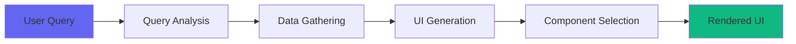

## The Two-Phase Architecture

The system works in two completely separate phases:

**Phase 1: Data Gathering** - Complex reasoning, multi-source fetching, enrichment  
**Phase 2: UI Generation** - Component selection and variant configuration

This separation is critical. Phase 1 can take 3-5 seconds doing real work (API calls, parallel searches, photo fetching). Phase 2 takes 1-2 seconds just selecting components.

```mermaid
graph TD
    subgraph Phase1["Phase 1: Data Gathering (3-5s)"]
        A1[Query Analysis] --> A2[Multi-Source Fetching]
        A2 --> A3[Data Enrichment]
        A3 --> A4[Clustering & Ranking]
    end
    
    subgraph Phase2["Phase 2: UI Generation (1-2s)"]
        B1[Component Selection] --> B2[Variant Configuration]
        B2 --> B3[Schema Generation]
    end
    
    A4 --> B1
    
    style Phase1 fill:#1E293B
    style Phase2 fill:#0F172A
```

---

## Phase 1: Data Gathering (The Heavy Lifting)

This is where all the intelligence happens. The system takes your query, figures out what data you need, fetches it from multiple sources, and enriches it with context.

### Step 1: Query Analysis

QueryAnalysisService uses an LLM to extract structured parameters from natural language:

```typescript
Input: "romantic restaurants in Paris"

Output: {
  intent: "search",
  categories: ["dining"],
  sentiment: {
    emotion: "romantic",
    intensity: "high",
    vibe: ["intimate", "quiet", "candlelit"]
  },
  temporal: {
    suggestedTimeOfDay: "evening",
    timeReasoning: "Romantic dining is best enjoyed during sunset and evening hours"
  },
  parameters: {
    destination: "Paris",
    establishments: ["restaurant"],
    keywords: ["romantic", "intimate"]
  }
}
```

This isn't keyword matching. It understands context, emotion, and intent.

### Step 2: Query Expansion & Parallel Fetching

In advanced mode, QueryProcessingService expands the query:

```
"romantic restaurants" 
  → ["romantic restaurants", "intimate dining", "candlelit dinner", "date night spots"]
```

Then executes all searches in parallel against Google Places API. This gives you 10-15 highly relevant places instead of just the top 5 from a single search.

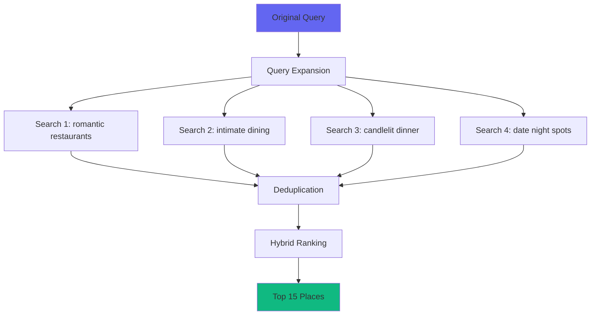

### Step 3: Data Enrichment (Manual Control Layer)

This is where we add the manual control layer. DataEnrichmentService has a pluggable architecture:

```typescript
class DataEnrichmentService {
  private enrichers: Map<string, CategoryEnricher> = new Map();
  
  async enrichPlace(place: Place, analysis: QueryAnalysis): Promise<EnrichedPlace> {
    const category = analysis.categories[0]; // 'dining', 'accommodation', etc.
    const enricher = this.enrichers.get(category);
    
    if (enricher) {
      // Use registered enricher (fast, rule-based)
      return enricher.enrich(place, analysis);
    } else {
      // Fall back to LLM enrichment (flexible, slower)
      return this.llmEnrich(place, analysis);
    }
  }
}
```

For travel queries, we could register a TravelEnricher with rule-based logic:

```typescript
class TravelEnricher implements CategoryEnricher {
  async enrich(place: Place, analysis: QueryAnalysis): Promise<string[]> {
    const vibes: string[] = [];
    
    // Rule-based vibe tagging
    if (place.priceLevel === 1) vibes.push('budget', 'affordable');
    if (place.priceLevel >= 4) vibes.push('luxury', 'upscale');
    if (place.rating >= 4.3 && place.userRatingsTotal < 1500) vibes.push('hidden-gem');
    if (place.userRatingsTotal >= 5000) vibes.push('popular', 'touristy');
    
    // Match with query emotion
    if (analysis.sentiment.emotion === 'romantic') {
      if (place.types?.includes('fine_dining')) vibes.push('romantic', 'intimate');
    }
    
    return vibes;
  }
}
```

_But this is far from reality, it needs extensive research and analysis and rate-limiter dance to gather data to quantify like so_

**Why manual enrichment?** Because it gives us control over what services become tools in agents or nodes in flows. We can decide which categories get fast rule-based enrichment (travel) and which fall back to LLM enrichment (products, services).

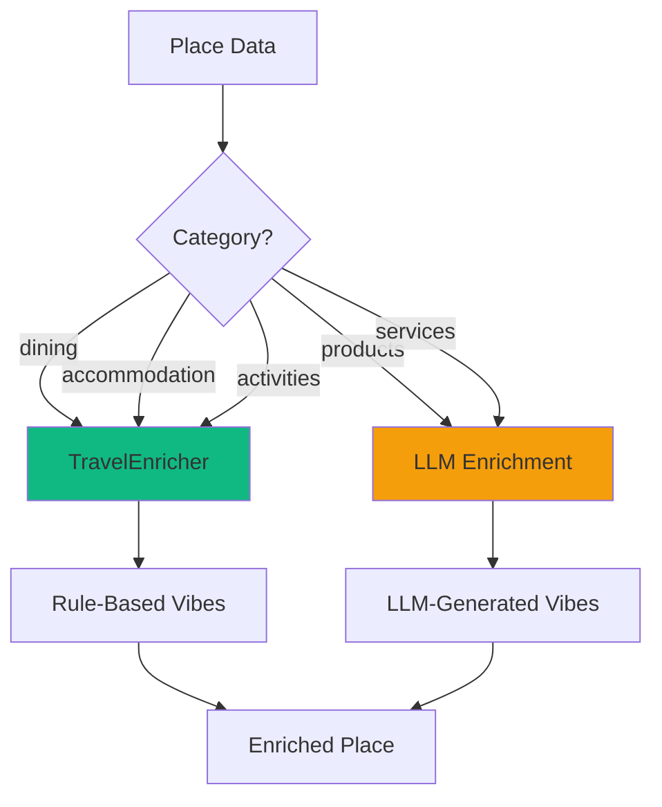

### Step 4: Photo Fetching & Coordinate Validation

For each place, we fetch:
- Up to 5 photos from Google Places API
- Opening hours and current status
- Validated coordinates (with geocoding fallback)

### Step 5: Geographical Clustering

Places are clustered by proximity using k-means. Instead of showing 15 individual places, you get 3-5 geographical areas, each with 3-5 places. The LLM names each cluster ("Sukhumvit Nightlife", "Old Town Heritage").

### Step 6: Ranking with Multiple Signals

RankingService applies:
- Base score: rating × log(review count)
- Crowd intelligence: quiet/moderate/busy based on review count
- Temporal relevance: boost places that are open now
- LLM relevance: semantic match to query intent

**Output of Phase 1:**

```typescript
{
  places: [
    {
      name: "Le Jules Verne",
      priceLevel: 4,
      rating: 4.8,
      photoUrls: ["url1", "url2", "url3"],
      coordinates: { lat: 48.8584, lng: 2.2945 },
      enrichment: {
        vibe: ['romantic', 'upscale', 'view', 'fine-dining'],
        popularity: { crowdLevel: 'moderate', localFavorite: false }
      }
    }
  ]
}
```

Clean, enriched, clustered data. Everything the UI needs.

---

## Phase 2: UI Generation (Component Selection)

This is where the magic happens. But it's surprisingly simple because Phase 1 did all the hard work.

### The Component-Based Approach

Instead of generating HTML, we select from pre-built components and pass variants:

```typescript
// Component Registry
{
  'filter-chips': FilterChipsRenderer,
  'card-travel': CardTravelRenderer,
  'card-restaurant': CardRestaurantRenderer,
  'list-travel': ListTravelRenderer,
  'photo-grid': PhotoGridRenderer,
  'badge-time': TimeBadgeRenderer,
  'badge-crowd': CrowdBadgeRenderer
}
```

The LLM doesn't generate UI code. It selects components and configures variants:

```typescript
{
  type: "filter-chips",
  props: {
    options: [
      { id: "romantic", label: "Romantic", icon: "heart", selected: true },
      { id: "intimate", label: "Intimate", icon: "candle" },
      { id: "upscale", label: "Upscale", icon: "diamond" }
    ]
  }
}
```

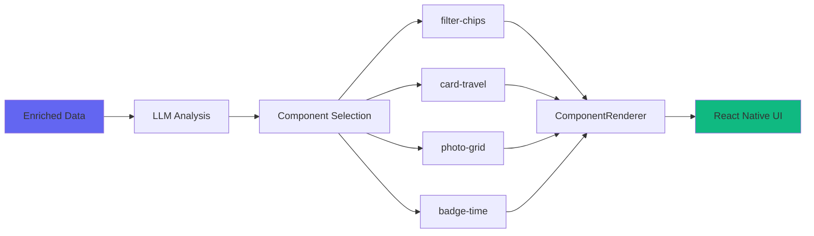

### Dynamic Filter Generation

This is the breakthrough. The LLM generates filters based on three sources:

1. **Query emotion**: "romantic" → prioritize romantic, intimate, candlelit
2. **Data vibes**: What's actually in the enriched data (romantic, upscale, cozy, quiet)
3. **Data characteristics**: Price levels, crowd levels, ratings

```typescript
// LLM sees:
Query emotion: romantic
Data vibes: romantic, intimate, upscale, cozy, candlelit, quiet
Data characteristics: Price levels 2-4, Ratings 4.5-4.9, Crowd: quiet to moderate

// LLM generates:
{
  type: "filter-chips",
  props: {
    options: [
      { id: "romantic", label: "Romantic", icon: "heart", selected: true },
      { id: "intimate", label: "Intimate", icon: "candle" },
      { id: "candlelit", label: "Candlelit", icon: "flame" },
      { id: "upscale", label: "Upscale", icon: "diamond" },
      { id: "cozy", label: "Cozy", icon: "home" }
    ]
  }
}
```

Different query, different filters:

```
"fun bars in Bangkok" → [Party, Live Music, Rooftop, Budget, Popular]
"peaceful temples in Kyoto" → [Zen, Garden, Hidden Gem, Traditional, Peaceful]
```

### Photo Grid Variants

Each highlight card can have different photo layouts:

```typescript
photoGridVariant: "hero-left" | "hero-right" | "equal-row"
```

```
┌─────────┬───┐  "hero-left" - Hero photo left, 2 stacked right
│    1    │ 2 │  Use for: Romantic, luxury, featured attractions
│  HERO   ├───┤
│         │ 3 │
└─────────┴───┘

┌───┬─────────┐  "hero-right" - 2 stacked left, hero photo right  
│ 1 │         │  Use for: Temples, nature, cultural sites
├───┤    3    │
│ 2 │  HERO   │
└───┴─────────┘
```

The LLM mixes variants across highlights for visual interest.

### Device-Aware Layout

The LLM adjusts layout based on screen size:

```typescript
// < 375px: Single column, large touch targets (48px)
// 375-768px: Single or 2-column grid
// > 768px: 2-3 column grid
```

It also adjusts component density based on emotion intensity. High-intensity romantic queries get more spacious layouts. High-intensity fun queries get more compact, energetic layouts.

### Capability-Based Components

CapabilityDetector checks what's available:

```typescript
{
  photos: true,      // Can show photo grids
  maps: true,        // Can show map views
  location: true,    // User location available
  transport: true,   // Can show transport tickets
  neighborhood: true // Can show area insights
}
```

The LLM only generates components for available capabilities. No photo grids if photos aren't available. No map views if maps aren't supported.

**Output of Phase 2:**

```typescript
{
  id: "schema-123",
  version: "1.0",
  uiType: "list",
  title: "Romantic Restaurants in Paris",
  theme: { colors, typography, spacing, borderRadius },
  layout: { type: "stack", config: { flexDirection: "column" } },
  components: [
    { type: "filter-chips", props: { options: [...] } },
    { type: "list-travel", props: { items: [...] } }
  ]
}
```

ComponentRenderer takes this schema and renders it to React Native components. No hydration. No manual data mapping. The schema is complete.

---

## The Plugin System: Extensibility

The plugin system allows registering new components and capabilities:

```typescript
pluginRegistry.register({
  id: 'neighborhood',
  label: 'Neighborhood Insights',
  component: NeighborhoodPlugin,
  capability: { id: 'neighborhood', label: 'Neighborhood', icon: 'map' }
});
```

When a plugin is registered:

1. **Component is added to registry**: ComponentRenderer can now render it
2. **Capability is detected**: CapabilityDetector includes it in available features
3. **LLM knows about it**: UI generation prompt includes the new capability
4. **LLM can use it**: Can generate UI with the new component

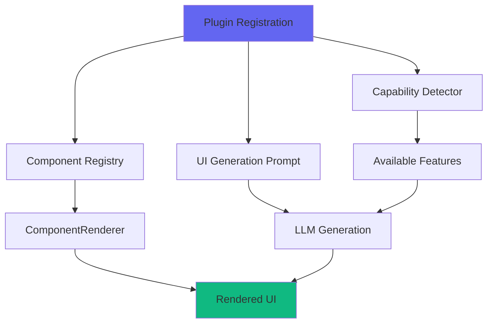

This means you can extend the system without changing core code. Add a new plugin, and the LLM can immediately use it.

---

## Where We Are vs Where We're Going

### Current State: Simplified UI Generation

The system uses a simplified approach:

**Static Mode**: Uses the existing TravelScreen component. Fixed layout, fixed filters. Fast and reliable.

**Dynamic Mode**: LLM generates a complete UISchema with all data populated. No hydration. No manual mapping.

The prompt includes:
- Full enriched data (sanitized to remove API keys)
- Query analysis with intent, sentiment, temporal context
- Device context with screen dimensions
- Capabilities (photos, maps, location, transport)
- Data characteristics extracted dynamically

The LLM returns a complete schema. ComponentRenderer renders it. That's it.

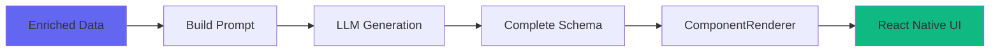

### What Changed: Deleted the Hydration Layer

The original hybrid approach had a `hydrateStructure()` method with 200+ lines of code. It manually:
- Populated badges
- Converted filter options
- Collected photos
- Flattened data structures
- Handled 10+ special cases

Every new component type needed new hydration logic. Every edge case needed new conditionals.

**We deleted all that.** The LLM does it now. Better prompts, better models (GPT-4, Claude 3.5), better validation.

### Why It Works Now

1. **Data is already enriched**: Phase 1 did all the hard work. Photos are URLs, coordinates are validated, vibes are tagged.

2. **Prompt is comprehensive**: The LLM has everything it needs to make intelligent decisions.

3. **Components are pre-built**: The LLM doesn't generate code. It selects components and configures variants.

4. **Validation is simple**: Check if schema has components, theme, layout. If not, fall back to static mode.

### Why Simple 1-Shot Prompt Doesn't Work

The naive approach would be: "Generate a UI for romantic restaurants in Paris" and let the LLM create everything from scratch.

**This fails catastrophically.**

The problem isn't that the LLM can't generate UI. It can. The problem is **you can't fix bad UI with text alone.**

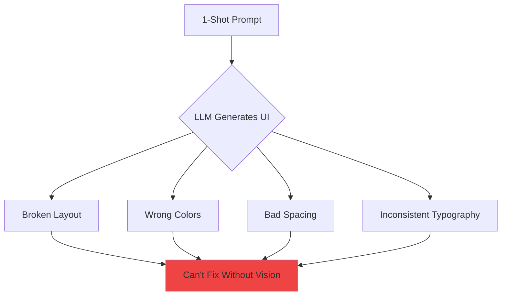

**In a production system:**
- ✅ **Broken UI can be iterated and fixed** - validation errors, missing fields, wrong component types
- ❌ **Bad UI can't be fixed without vision** - ugly colors, poor spacing, inconsistent design

The LLM has no visual feedback loop. It can't see that the colors clash, the spacing is cramped, or the typography is inconsistent. It's generating JSON blind.

### The Component Registry Constraint

The solution: **Don't let the LLM generate UI. Let it select from pre-built components.**

```typescript
// Component Registry - Pre-built, visually validated components
{
  'filter-chips': FilterChipsRenderer,      // ✅ Spacing tested
  'card-travel': CardTravelRenderer,        // ✅ Colors validated
  'list-travel': ListTravelRenderer,        // ✅ Typography consistent
  'photo-grid': PhotoGridRenderer,          // ✅ Layout responsive
  'badge-time': TimeBadgeRenderer,          // ✅ Icons aligned
  'badge-crowd': CrowdBadgeRenderer         // ✅ Contrast checked
}
```

The LLM's job is **component selection and configuration**, not UI generation:

```typescript
// LLM doesn't generate this:
<View style={{ padding: 16, backgroundColor: '#1E293B', borderRadius: 12 }}>
  <Text style={{ fontSize: 16, color: '#F1F5F9' }}>Romantic</Text>
</View>

// LLM generates this:
{
  type: "filter-chips",
  props: {
    options: [
      { id: "romantic", label: "Romantic", icon: "heart" }
    ]
  }
}
```

The actual rendering is done by pre-built components that have been visually validated by humans.

### What Didn't Work: Full Autonomous Generation (v1)

The initial attempt at full autonomous generation failed because:

1. **LLM hallucinated components**: Generated `<ComparisonTable>` that didn't exist in the registry
2. **Inconsistent data binding**: Sometimes used `place.name`, sometimes `place.title`, sometimes `place.destination`
3. **No validation**: Invalid schemas crashed the renderer with cryptic errors
4. **No fallback**: When generation failed, the app showed a blank screen

The solution was to add:
- **Component registry validation**: Only allow registered component types, reject unknown components
- **Schema validation**: Check required fields before rendering, provide helpful error messages
- **Fallback to static mode**: If generation fails, use the pre-built TravelScreen
- **Comprehensive prompts**: Include full component documentation with examples

Now it works 95%+ of the time. The 5% failures fall back gracefully to static mode.

---

## The Future: Where We're Heading

### Streaming Results

Phase 1 takes 3-5 seconds. That's too long. The plan is to stream results as they come in:

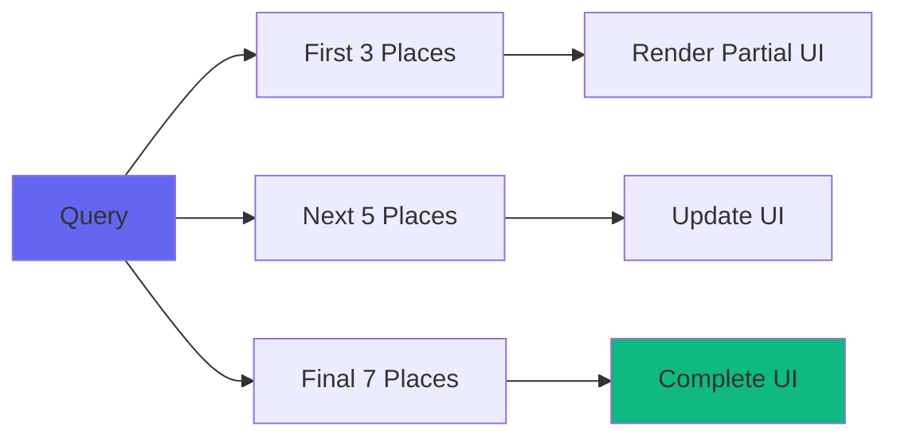

Show the first 3 places while fetching the rest. Update the UI incrementally. The schema supports this - just update the `items` array.

### Predictive Caching

CacheService already caches API responses and UI schemas. The next step is predictive caching:

- Pre-fetch common queries ("romantic restaurants in Paris", "fun bars in Bangkok")
- Use user location to predict likely queries
- Cache expires after 24 hours

### Better Ranking

RankingService uses multiple signals, but it's still basic. The plan is to add:

- **User preferences**: Learn from past selections
- **Time-based boosting**: Breakfast places in morning, bars at night
- **Distance-based filtering**: Only show places within X km
- **Social signals**: Trending on Instagram, mentioned on Reddit

### Multi-Intent Support

QueryAnalysisService can return multiple intents. "Romantic restaurants and hotels in Paris" should generate two separate UI sections:

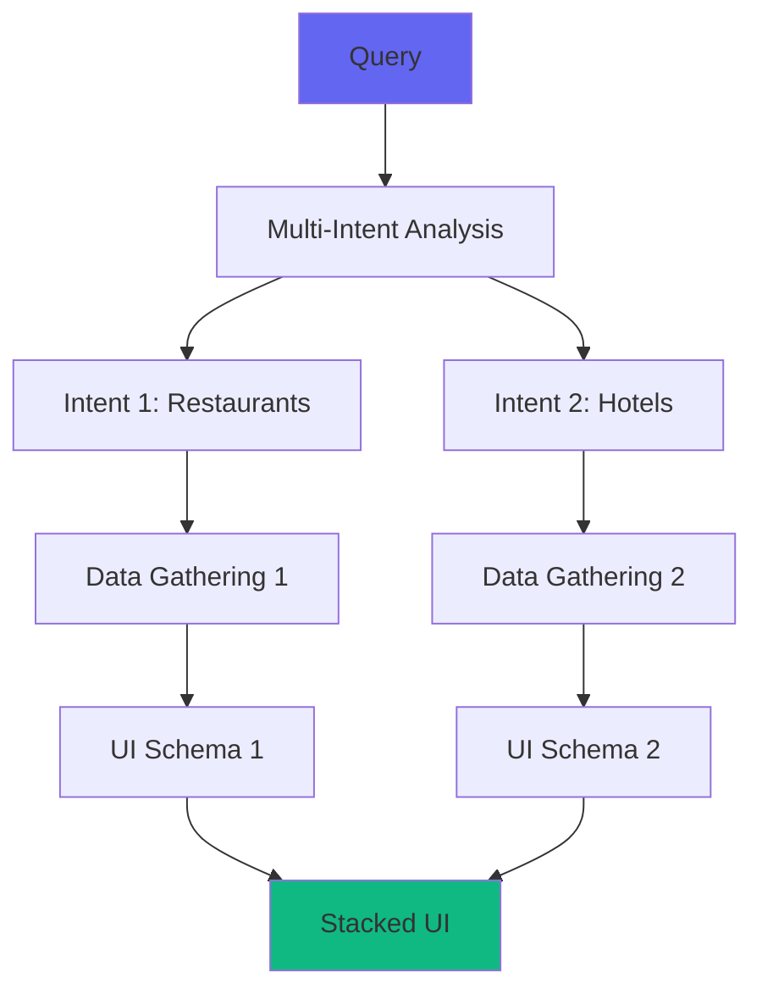

The architecture supports this - just generate multiple schemas and stack them.

### LLM-Generated Theming System

Right now, themes are hardcoded. Every UI uses the same color palette, typography, and spacing.

The next step is **LLM-generated themes** that match the query emotion.

**The Problem:** You can't fix bad colors with text alone. The LLM needs visual feedback.

**The Solution:** Use vision models (GPT-4V, Claude 3.5 Sonnet) to validate generated themes.

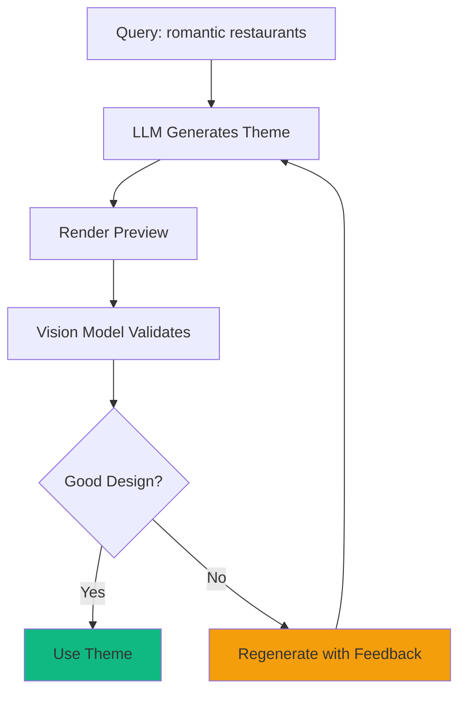

**The Flow:**

1. **LLM generates theme** based on query emotion:
   ```typescript
   Query: "romantic restaurants in Paris"
   Emotion: romantic
   
   Theme: {
     colors: {
       primary: "#FF6B9D",      // Soft pink
       secondary: "#C44569",    // Deep rose
       background: "#2D1B2E",   // Dark purple
       surface: "#3E2C41",      // Muted purple
       accent: "#FFD700"        // Gold
     },
     typography: {
       heading: { fontSize: 28, fontWeight: "600", letterSpacing: 0.5 },
       body: { fontSize: 16, fontWeight: "400", lineHeight: 24 }
     },
     spacing: { base: 20, tight: 12, loose: 32 }
   }
   ```

2. **Render preview** with the generated theme

3. **Vision model validates** the design:
   ```
   Prompt: "Does this UI have good color contrast, readable typography, 
   and appropriate spacing for a romantic restaurant app? 
   Rate 1-10 and explain issues."
   
   Response: "7/10 - Good color harmony but primary pink (#FF6B9D) 
   has poor contrast against dark background. Suggest #FF8FB3 instead."
   ```

4. **Iterate until validated** (max 3 attempts)

**Why This Works:**

- ✅ **Vision models can see** what text-only models can't
- ✅ **Iterative refinement** fixes issues before users see them
- ✅ **Emotion-matched themes** enhance the experience
- ✅ **Automated validation** scales better than human review

**Inspired by:** [OpenAI Cookbook - GPT-5 Frontend Generation](https://cookbook.openai.com/examples/gpt-5/gpt-5_frontend)

This is the gateway to fully autonomous UI generation. Once themes are validated visually, we can trust the LLM to generate complete UIs without human oversight.

### Cross-Platform Rendering

The UISchema is platform-agnostic. Right now it renders to React Native. But the same schema could render to:

- **React** for web
- **SwiftUI** for iOS
- **Jetpack Compose** for Android

Just implement ComponentRenderer for each platform. Write once, render anywhere.

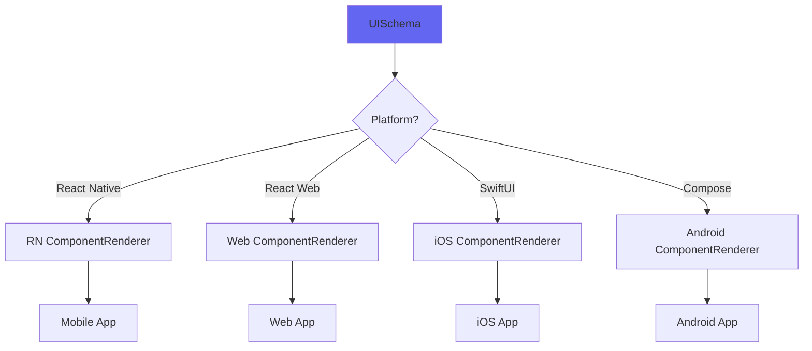

---

## The Bet

The bet is that **component selection** is good enough now, and **theme generation** is the next frontier.

### What Works Today:

✅ **Query analysis**: 90%+ accuracy on intent, sentiment, temporal context  
✅ **Data enrichment**: Photos, coordinates, crowd levels - all reliable  
✅ **Component selection**: GPT-4 and Claude 3.5 select valid components 95%+ of the time  
✅ **Filter generation**: Dynamic filters match query emotion and data characteristics  
✅ **Device adaptation**: Different layouts for different screen sizes  
✅ **Capability detection**: Only generates UI for available features  

### What Doesn't Work Yet:

⚠️ **Speed**: 3-5 seconds is too slow. Needs streaming and predictive caching.  
⚠️ **Theming**: Hardcoded colors don't match query emotion. Needs LLM-generated themes with vision validation.  
⚠️ **Consistency**: Same query sometimes generates slightly different UIs. Needs better caching.  
⚠️ **Multi-intent**: Can't handle complex queries with multiple intents yet.  

### The Key Insight:

**In production, broken UI can be iterated and fixed. Bad UI can't be fixed without vision.**

That's why we constrain the LLM to component selection. The components are pre-built and visually validated. The LLM just picks which ones to use and how to configure them.

But themes are different. Themes need to be generated dynamically to match the query emotion. And that requires vision models to validate the design before users see it.

**The theming system is the gateway to fully autonomous UI generation.** Once we can trust the LLM to generate good-looking themes with vision validation, we can trust it to generate complete UIs.

The technology is there. The architecture is there. It just needs the vision feedback loop.

That's the bet.

---

## Architecture Summary

```mermaid
graph TD
    subgraph Input["User Input"]
        A[Natural Language Query]
    end
    
    subgraph Phase1["Phase 1: Data Gathering (3-5s)"]
        B[Query Analysis] --> C[Query Expansion]
        C --> D[Parallel Fetching]
        D --> E[Data Enrichment]
        E --> F[Clustering]
        F --> G[Ranking]
    end
    
    subgraph Phase2["Phase 2: UI Generation (1-2s)"]
        H[Component Selection] --> I[Variant Configuration]
        I --> J[Schema Generation]
    end
    
    subgraph Output["Rendered Output"]
        K[React Native UI]
    end
    
    A --> B
    G --> H
    J --> K
    
    style Input fill:#6366F1
    style Phase1 fill:#1E293B
    style Phase2 fill:#0F172A
    style Output fill:#10B981
```

**46 services. 2 phases. 1 goal: UI that adapts to what you need.**

