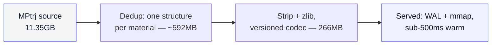

[materialsDB](https://github.com/ikouchiha47/materialsDB) is a small Go API serving 145,923 materials from the Materials Project, backed by a single SQLite file. Live at [materials-db.fly.dev](https://materials-db.fly.dev/).

The source data is **11.35GB**. The database it actually runs on is **266MB**. This is the story of what happens in between, and why most of that 11GB was never something the API needed in the first place.

---

## What's Actually in the Dataset

The source is [MPtrj](https://figshare.com/articles/dataset/Materials_Project_Trjectory_MPtrj_Dataset/23713842) — the Materials Project Trajectory dataset. One file, `MPtrj_2022.9_full.json`, 11.35GB. It's the training corpus behind **CHGNet**, a machine-learned interatomic potential that predicts energy, force, and stress for arbitrary atomic arrangements.

That's the detail that explains everything else in this post: CHGNet's whole job is predicting energy, force, and stress for *any* atomic arrangement, not just the relaxed ground state — that's what makes it useful for running new relaxations on structures nobody's computed yet. To train a model that generalizes across the energy landscape, you need labeled examples away from the minimum too: high-pressure configurations, partially-relaxed intermediate steps, structures that are "wrong" by various amounts. That's exactly what a material's other relaxation tasks are — points along a trajectory at different pressures and energies, each one a training example teaching the model "here's what the forces look like when the structure is bent this way."

So the dataset isn't 1.58M rows because someone was sloppy about deduplication. It's 1.58M rows because each material's relaxation run gets sampled at several points, and every point is a valid (structure, energy, force, stress) training tuple for the model this data was built for.

## The mp-149 Example

Concretely — material `mp-149` (silicon) has 7 tasks in the dataset:

| task_id | energy/atom (eV) | pressure (GPa) | structure kept? |
|---|---|---|---|
| `mp-655585-0-0` | -5.4253 | -0.13 | **yes** |
| `mp-149-1-1` | -5.4243 | -11.87 | no |
| `mp-149-1-0` | -5.4228 | 19.25 | no |
| `mp-11721-1-1` | -5.4205 | -24.46 | no |
| `mp-11721-1-0` | -5.4149 | 40.82 | no |
| `mp-1057366-1-1` | -5.2118 | -116.43 | no |
| `mp-1057366-1-0` | -5.0935 | 311.51 | no |

Seven snapshots of the same material under different amounts of strain, all valid CHGNet training data. materialsDB keeps the structure for exactly one of them — the lowest-energy task — because its job is "what does silicon's ground state actually look like," not "teach a neural network the shape of silicon's energy surface." Six structures get discarded per material, on average, for a job that was never asking for them.

## What Gets Thrown Away, and Why That's a Real Cost

Worth being honest about this rather than calling it free cleanup: those six structures are a real loss, not redundant data.

The schema keeps `max_force` — a single scalar, the largest force magnitude across all atoms in that task. It does not keep the full per-atom force vectors, and it doesn't keep the structure those forces were computed against. That's the actual damage: a force value only means something in reference to which atom sat where. `max_force` with no structure attached is a diagnostic number. It can't be replayed into a training loop, can't be used to fine-tune a potential, can't reconstruct the energy surface's curvature around the minimum, can't be reused the next time someone wants to benchmark a newer model against MPtrj's reference structures.

So this isn't "we pruned redundant data." It's "we discarded scientifically real training value that MPtrj was built to provide, because this API's job — look up a material's ground-state properties — never needed it." A legitimate scope decision. Not a free lunch.

## Dedup: The First ~20x

The first and biggest reduction happens before any compression, in the ingest step:

```sql
WITH ranked AS (
    SELECT *,
        ROW_NUMBER() OVER (
            PARTITION BY material_id
            ORDER BY energy_per_atom ASC NULLS LAST
        ) AS rn
    FROM raw
)
SELECT ... FROM ranked WHERE rn = 1
```

One structure per material, picked by lowest energy. Every other task keeps its five scalar properties in a separate `material_tasks` table — cheap, no JSON, no BLOB — but loses its structure. That single decision takes the dataset from 11.35GB down to roughly **592MB**: a ~20x reduction, and it happens purely from deciding what the API needs to answer, before a single byte gets compressed.

## Compression: 592MB → 266MB

The remaining 592MB is ~96% `structure_json` — one pymatgen `Structure` blob per material. Two more things happen to it.

**Strip before compressing.** Raw pymatgen JSON is verbose — `{"species":[{"element":"Si","occu":1}],"abc":[0,0,0]}` per site. A benchmark script (`scripts/bench_encoding.py`) compared four encodings head to head — raw JSON, zlib-only, stripped-JSON-only, stripped+zlib — by sampling 1,000 random structures and measuring both size and decode latency. Stripped-then-compressed won: verbose JSON key names don't compress as well relative to their size as a compact positional array does. The on-disk shape is:

```
{"l":[[...]],"s":[["Si",0,0,0,1],["Si",0.25,0.25,0.25,1]]}
```

`l` = lattice matrix, `s` = sites as `[element, a, b, c, occupancy]` arrays. Then zlib on top of that.

**Version the wire format, don't do a hard cutover.** Each blob gets a 4-byte header — magic byte, version, codec id, reserved — before the payload:

```go
header := [4]byte{0x53, version, codecByte, 0x00}
```

A `Registry` decodes by dispatching on the version byte, and legacy uncompressed rows (no magic byte at the front) get returned as-is instead of erroring. That's what let the actual production database get migrated in place with a one-time script, rather than requiring a full re-ingest or a moment where old and new rows couldn't coexist.

End result: 592MB → **266MB**. Combined with the dedup step, that's roughly a **97.7% reduction** from the original 11.35GB source file.



## Serving It Fast

None of the size work matters if queries are slow, so the serving side gets its own set of decisions:

- **WAL mode + 1GB mmap** — at 266MB, the entire database fits comfortably inside a single mmap region, so reads hit page cache instead of disk after the first touch.
- **A channel-based pool of read-only connections**, sized to `GOMAXPROCS`, each one running warmup queries against the key indexes (primary key, formula, bandgap, the material→task foreign key) on boot — so the *first* real request isn't also the *first* time an index gets touched.
- **Singleflight** collapses concurrent identical requests into one query — 100 requests for the same material in flight becomes one SQLite call, replayed to all 100 callers.
- **An LRU cache** in front of both material lookups and search results, since the data is static — no invalidation logic needed.

Worth stating the honest caveat rather than only the good number: this is all *warm-path* performance. On a 512MB Fly.io VM, the very first request after a cold start pays the cost of mmap page-fault warmup against a 266MB file — 15 to 24 seconds. Every request after that is sub-500ms. That tradeoff is a property of running on a small VM with a memory-mapped file, not something the caching layers paper over — it's worth knowing about if you're the one hitting the API first after a deploy.

## What It Adds Up To

Most of the size reduction here didn't come from a clever encoding trick — it came from asking what the API actually needed to answer, and being honest that the answer to "do we need the other six structures" was no, even though those structures were genuinely valuable for the job the dataset was originally built for. The compression work (266MB from 592MB) is the smaller, more mechanical half of the story. The bigger number (592MB from 11.35GB) came from a single `ROW_NUMBER()` and a decision about scope.
