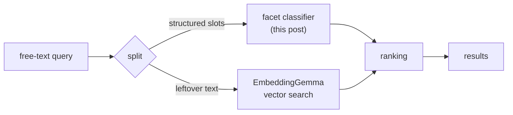
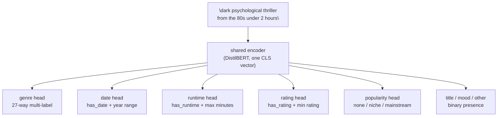
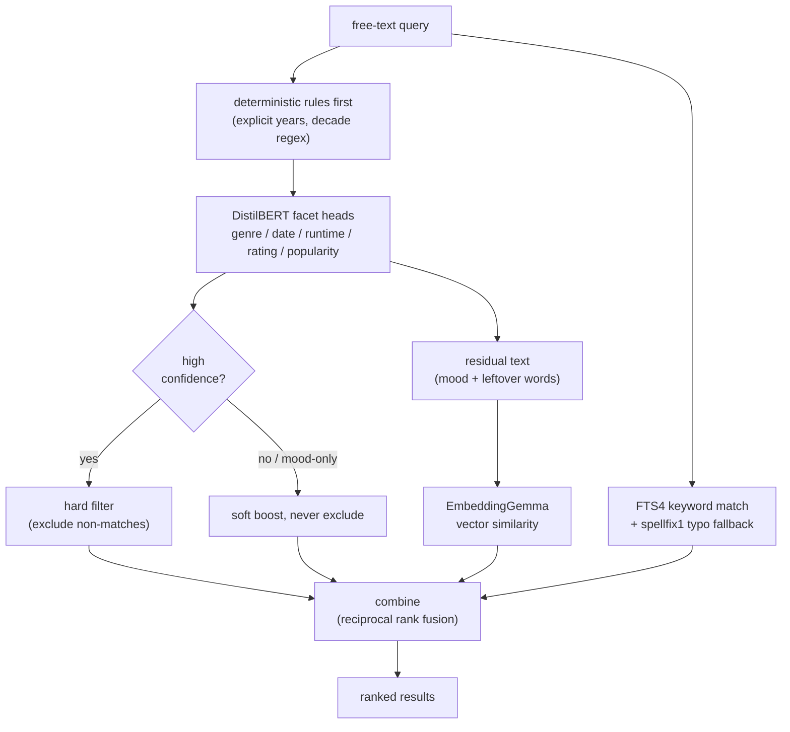

## What Mofy is

Mofy is a personal movie and TV library app for Android. Point it at the folders where your media lives, or let it match torrents you already have, and it builds a local catalog with posters, overviews, genres, ratings, the works - pulled from TMDB once, cached forever after. It plays what you own, resumes where you left off, and lets you watch something with someone else in a different room, in sync, over a room code.

None of this touches a server you don't control, and none of it ever will: it's not going on an app store, so there was never a pressure to phone home for analytics, ads, or a subscription check. That constraint sounds like a limitation. It turned out to be the most useful constraint in the whole project, because it ruled out the easy answer to the one hard problem the app has: search.

Everyone who has actually managed a personal media library knows the boring version of this problem. You have three hundred movies. You do not remember which folder "that one with the guy who loses his memory" is in. Typing "memento" works, if you remember it's called Memento. Typing "a guy loses his memory every day and writes notes to himself" should also work, and on Mofy, it does - that query correctly surfaces Memento as the top result. Getting there is the subject of this post.

## The two shapes of a search query, and why one API call can't cleanly do both

Sit with real queries for a minute and they split into two families that want completely different handling:

- **Structured queries**: "90s highly rated action", "dark thriller from the 80s under 2 hours", "download inception 2010 1080p". These have facets - a date range, a genre, a runtime ceiling, a rating floor - that are either right or wrong. There's no partial credit for guessing 1985 when the user meant "the 90s."
- **Vibe queries**: "feeling nostalgic", "something to watch when I don't want to think", "a guy loses his memory every day and writes notes to himself". These have no correct discrete answer. They want *similar*, not *equal*.

The naive move is to throw the whole query at an LLM and ask it to return both - hand back a JSON blob with `genre`, `date_range`, `mood_embedding_hint`, done. That's the shape every hosted-API tutorial reaches for, and it's the first thing that was off the table here, for a reason that had nothing to do with model quality:

> No API-based LLM calls, anywhere in the app, no exceptions.

A personal media app that ships nothing to a store has no business making its search feature depend on someone else's uptime, someone else's rate limit, or someone else's server logging every query a user types. If it can't run on the phone with the network off, it doesn't belong in the app.

So the real question was never "which API." It was: how much of "understand what the user meant" can actually run inside a Compose app on a mid-range Android phone, with no server on the other end of it.

The answer turned out to be two separate small models doing two separate small jobs, not one model doing everything. This post is about how that split got found, including the part where the first several attempts at the structured half were quietly, confidently wrong in a way that a loss curve does not tell you about.

Next: why the vibe half was the easy half, and why the obvious move for the structured half - just generate JSON - turned out to be a dead end worth documenting in detail.

## The vibe half: embeddings, run entirely on the phone

Start with the part that turned out to be simpler than expected, because it sets the baseline the rest of the post keeps referring back to.

An embedding model turns a sentence into a fixed-length vector - a few hundred numbers - such that sentences with similar meaning end up as vectors that point in similar directions. "A guy loses his memory every day" and Memento's actual plot summary don't share many words, but they point roughly the same way in that space. Cosine similarity between two vectors gives you a single number for "how alike," and that's the entire mechanism behind "search by vibe": embed the query once, embed every movie's overview once (offline, ahead of time), and rank movies by how close their vector lands to the query's.

Two decisions made this work fully offline:

**The model**: [EmbeddingGemma-300M](https://ai.google.dev/gemma/docs/embeddinggemma), a sub-`500M`-parameter embedding model from Google that leads its size class on MTEB (the standard embedding benchmark), shipped as a ready-made `.tflite` file that runs through LiteRT, Google's on-device inference runtime. No conversion pipeline to build - Google already did the export.

The same checkpoint runs twice: once offline in Python to embed the entire movie catalog ahead of time, and once on-device to embed whatever the user types. Query and catalog vectors have to come from the exact same model and the exact same prompt template, or the comparison is meaningless - more on that below.

**The storage**: plain SQLite BLOB columns, one float32 array per movie, about `3KB` per vector. That sounds almost too simple for a "vector database," and that's deliberate - Google's own AI Edge RAG Library ships the identical pattern (`SqliteVectorStore`) for exactly this reason. The alternative, a native `vec0` virtual table via the `sqlite-vec` extension, needs a custom SQLite driver loaded underneath Room, Android's usual database layer, and Room's default driver doesn't support that.

At a personal-library scale - hundreds to a few thousand titles - a brute-force scan comparing the query vector against every stored vector is fast enough that the native extension buys nothing but integration risk. Retrieval is a streaming top-K scan with a min-heap, so the whole catalog never has to sit in memory at once, just the heap and whichever row is currently being decoded.

One detail that looked cosmetic and wasn't: EmbeddingGemma doesn't take a raw sentence. It expects a fixed prefix depending on what you're embedding - `task: search result | query: {text}` for a search query, `title: {title} | text: {text}` for a document.

These are literal strings baked into the model's own `config_sentence_transformers.json`, the file `sentence-transformers` reads at load time. Skip the prefix, or reformat it as `{title}: {text}` because that reads more naturally, and the model gets an input shape it was never fine-tuned to see, which quietly degrades retrieval quality without throwing any error you'd notice.

That's the trap with a lot of "the model card says X" claims: docs drift from what a release actually ships, so it's worth pulling the config the model itself loads and reading the literal keys rather than trusting the paraphrase. With the correct templates, a plain title search like "the dark knight" correctly ranks the exact title first, and the Memento plot query ranks Memento first - the retrieval-tuned prompt pair working as documented, not just documented.

That's the whole vibe path: embed, store as a blob, brute-force cosine similarity, rank. No training, no labeled data, no classifier - just a general-purpose sentence encoder pointed at overview text. It handles "feeling nostalgic" and "a guy loses his memory every day" equally well, because neither of those has a *correct* discrete answer, only a *closer* one.

It does not, however, know what "under 2 hours" means. Ask it and it will happily return movies with no relationship to runtime at all, because nothing in a 768-dimensional similarity space encodes an inequality. That's a different kind of problem, and it needed a completely different kind of model.

## The other half of the vibe problem: getting text worth embedding at all

None of the retrieval mechanism above matters if the overview text it's embedding is thin or missing. The catalog is `31,785` titles filtered from IMDb's public datasets, and combining a static Kaggle movie dataset with scoped TMDB API calls got real overview text for `63.2%` of them. TMDB's API is generous about rate limits, free tier included, so calling it wasn't the bottleneck; TMDB simply doesn't have overview text for every title in its database, particularly older, lower-profile, or less mainstream ones. That gap is a coverage limit of the source itself, not a throttling problem, and it left roughly `11,700` titles with no usable text: no overview at all, or a degenerate one (empty, the title copied verbatim into the overview field, or a "No overview found." sentinel).

Direct bulk-scraping imdb.com is against IMDb's own terms of service, and it was already ruled out for that reason during the catalog build. What's fine, and what this used, is driving a real browser session through pages one at a time, the same way a person clicking through IMDb would, using [Browser MCP](https://browsermcp.io), a Chrome extension that exposes an MCP-shaped interface to a real Chrome tab.

The stock extension is built to be driven by an actual MCP server over a WebSocket handshake. That layer wasn't needed here, so `ml/scripts/05_fetch_imdb_plots.py` skips it and speaks the extension's plain JSON protocol directly: it opens a WebSocket listener on `localhost:9009`, the extension dials into it, and the script drives it title by title, navigating to each `imdb.com/title/{id}/plotsummary/` page and pulling the Plot Summaries and Synopsis text out of the page's accessibility snapshot.

Two problems showed up running this at the actual scale needed, and both needed a small patch to the extension itself (vendored into `vendor/browser-mcp-extension/`, not just used as-is from the Chrome Web Store):

- **Chrome kills the extension's background service worker after about 30 seconds of idle, and an open WebSocket does not keep it alive.** The connection just dies with the worker, silently, mid-run. The patch adds a `chrome.alarms` wake every 30 seconds that revives the worker and re-establishes the socket, so a dropped connection reconnects within roughly a second instead of stranding the run.
- **The stock extension can only read the page, not run arbitrary JavaScript in it**, which matters for pages where the useful text isn't in a clean accessibility-tree label. The patch adds a `browser_evaluate` tool that runs a JS expression in the connected tab via the already-attached debugger connection and returns the result directly.

Even patched, this wasn't fast: real page loads, a deliberate wait between titles to look like a human browsing rather than a script hammering the site, and the reconnect handling above every time Chrome decided to nap the worker mid-batch. The whole run to fetch `9,311` titles took on the order of **30 hours**, most of it just waiting on page loads and reconnects rather than doing any real work per title. It also checkpoints after every single title to a JSONL file (atomic rewrite, not appended-and-hope), so a run interrupted at hour 20 resumes at title 9,000-something rather than starting over, and a `--skip-existing` flag distinguishes titles that actually succeeded from ones tagged `failed` for retry on the next pass.

Thirty hours of a script babysitting a browser tab is not a glamorous part of the pipeline. But EmbeddingGemma's retrieval quality is only as good as the text it's given to embed, and a plot query like "a guy loses his memory every day and writes notes to himself" resolving correctly to Memento depends on that title actually having real synopsis text in the catalog in the first place, not a sentinel string. The unglamorous scraping stint is what the "vibe half" of this whole post is quietly standing on.

## The structured half: why "just generate JSON" doesn't work

"Under 2 hours" is a number. "The 80s" is a range. "Highly rated" is a threshold. None of these are vibes to get *close to* - they're predicates a movie either satisfies or doesn't, and the only acceptable failure mode is "didn't extract it," never "extracted the wrong year and silently filtered out the right movie." That distinction, approximate is fine for vibes, wrong is not fine for facets, is what ruled out reusing the embedding approach here.

It's worth actually testing before assuming it, since "embeddings can do everything" is a seductive idea. The test: take six facet types (date, genre, rating, popularity, runtime, mood), write two or three example phrases for each, embed all of them with EmbeddingGemma's classification prompt, and see whether a new query fragment lands closest to the right bucket by nearest neighbor.

Genre, date, rating, popularity, and runtime routed correctly with decent margins. But `nostalgic` landed closest to the *date* anchors, not mood, because nostalgia is semantically entangled with "the past," and an embedding space that was never asked to separate those two things won't separate them for you.

That's a real, reproducible failure mode, and it's exactly the kind of quietly-wrong-but-plausible-looking result a hard filter cannot tolerate: mood queries would get mistakenly hard-filtered by year and silently return nothing. Embeddings are the right tool for "how similar," and the wrong tool for "which exact year range."

So facets needed something that outputs a fixed, typed structure, correctly. The instinctive approach - and the one that got tried first, several different ways - was to lean on a small generative model and just ask it to produce JSON.

- **Attempt 1 - flan-t5-small, generate JSON spans directly.** Feed it the query, ask it to emit something like `{"type": "genre", "span": "thriller"}`. This broke for a reason that had nothing to do with the model's reasoning: T5's tokenizer, built on SentencePiece, doesn't have `{` or `}` as tokens it was trained to use fluently for structured output. The model emitted garbled fragments like `s"pan:…type:mod`, malformed text that no downstream parser could recover, rather than anything close to valid JSON.

- **Attempt 2 - switch formats, not architecture.** The instinct at this point was "the format is the problem," so the code switched to TANL-style spans (`[ span | type | norm ]`, the augmented natural language format from an AWS entity-tagging writeup, built for exactly this kind of information-extraction task) instead of JSON, on the theory that a simpler flat grammar would be easier for a small seq2seq model to reproduce reliably. It wasn't - the underlying checkpoint had already been trained toward JSON-shaped outputs, so the model kept reverting to its old shape regardless of what the training data now looked like. Still free-form generation, still needing a brittle string parser to turn output back into a structure, just with a different string to fail at.

A handful of other output formats got weighed at the same time, on paper, before deciding none of them were worth a full training run:

- **S-expressions** (`(genre thriller) (date 1980 1989)`) - same bracket-tokenization risk as JSON, if the base tokenizer doesn't treat `(` and `)` as first-class tokens.
- **BIO tagging** (`B-GENRE I-GENRE O O`) - a solid format for sequence labeling, but it assumes the model is tagging each input token, not generating output text. Doesn't fit a seq2seq decoder without a different architecture entirely.
- **Pipe-delimited fields** (`genre=thriller|date=1980-1989`) - sidesteps the bracket problem, but it's still free-form text generation underneath, with the same failure mode as TANL: nothing stops the model from emitting a value that isn't in the schema, or dropping a field silently.

Every one of these is a better string format than raw JSON. None of them changes the actual problem: a decoder generating output token by token has no built-in notion of "this field must be one of these 27 genres." That constraint lives only in the training data's shape, not in the model's output space, so it can be violated as easily as followed.

- **Attempt 3 - few-shot prompting, smaller models.** Gemma 270M and Qwen 0.5B, prompted with a handful of examples instead of fine-tuned, asked to emit either JSON or a simpler binary "which facets are present" answer. Open-ended generation from a model that size, with only a few examples in context, is unreliable - and even where it worked, binary presence detection only answers "is there a date facet in this query," not "what is the actual year range," which is the part that matters for filtering.

- **Attempt 4 - DSPy chain-of-thought span typing.** Qwen variants, prompted to reason step by step about each span before typing it. Same failure family: parse errors on the output, and the model inventing span types that were never in the schema in the first place - the model isn't being unreasonable, it's doing exactly what generative models do when the output space isn't constrained, which is produce something plausible-looking rather than something valid.

The pattern across all four is the same one, and it's the real lesson to take from this whole detour:

> A low training loss on any of these did not mean usable output.

`flan-t5-small`'s cross-entropy loss looked fine in every one of these runs. Loss measures "did the model get closer to predicting the next token the training data expects," and every one of these checkpoints did that.

None of them measures "if I now run this output through a real parser, does it come out as a valid, correct structure." That number, measured by actually decoding real outputs rather than reading a training curve, was bad in every attempt.

The lesson that survived all four attempts: small generative models are bad at freestyle structure, and they are fine at classification into a schema that's fixed in advance. Those are different problems, and only one of them was actually being asked here.

## What actually worked: stop generating, start classifying

The reframe that ended the JSON detour came from, of all places, a conversation with Grok - asked to sanity-check the whole "small model outputs structured facets" problem from scratch, it was the one that pushed back on generation entirely and suggested going the classification-head route instead of trying yet another output grammar. Worth crediting plainly, because the four failed attempts above all shared the same unexamined assumption - "the model needs to produce the structure as text" - and it took an outside prompt to actually question that assumption rather than iterate on top of it.

The reframe: don't ask a model to write down a genre name character by character and hope it spells "Sci-Fi" correctly. Ask it "is Sci-Fi one of the genres in this query, yes or no" - for every genre the catalog has, all at once, in a single forward pass. That's a classification problem, and classification problems don't have a parsing step, because the output is a fixed vector of numbers, not text.

The architecture is one shared encoder - BERT-family, reads the query once, produces one `[CLS]` vector - with a small linear layer, a **head**, hanging off that same vector for each slot the schema needs.

One detail worth being precise about: this is a genuine fine-tune, not a frozen-encoder linear probe. The training loop hands DistilBERT's own weights to the optimizer alongside the heads (`AdamW(model.parameters(), ...)`, no `requires_grad = False` anywhere), so gradients flow back through the whole 66M-parameter encoder on every step, not just through the small classification layers bolted on top of fixed embeddings. That's a heavier training job than a linear probe, but it's also why a much smaller encoder like BERT-tiny genuinely can't be patched around later: the representations themselves are shaped by training, not just the heads reading them.

Every head reads the same 768-dim CLS vector; nothing is generated token by token, so there's no parser and no malformed-output failure mode - the output is always the same seven keys, always the same types, whether the query is empty, garbled, or perfectly formed. That validity guarantee comes directly from the architecture, not from any extra checking layered on top: a linear layer followed by a sigmoid or softmax cannot emit `{` mistranslated as `<unk>`, because it never emits characters at all.

The genre head is multi-label (`27` catalog genres, sigmoid per class, since a movie and a query can both carry more than one genre at once), with a `pos_weight` term capped at `20x` so that a plausible catch-all genre like Drama doesn't dominate every prediction just because it's overrepresented in the training data. With 27 unevenly-sized classes, an unweighted loss will happily learn "always predict Drama" and call that a local minimum.

Date, runtime, and rating are two-part heads: a "does this slot exist at all" binary flag, plus a regression value that's masked out of the loss entirely for the majority of examples where the slot doesn't apply, so the model isn't penalized for a runtime guess on a query that never mentioned runtime.

Popularity is a plain three-way softmax (none / niche / mainstream). Title, mood, and "other", meaning leftover tokens like "1080p" or "download" that belong to neither structured facets nor vibe search, are simple yes/no presence flags. The actual text for these is handled downstream by catalog full-text search and format-token matching, not by the encoder.

## A second dead end, one step earlier: generating the training data itself

Before any of the four generation attempts above got to a training run, there was a smaller, earlier problem: where do 4,200 labeled queries even come from. Nobody has a public dataset of "search box text mapped to genre/date/runtime facets" lying around, so the training data had to be generated, and the first approach to generating it hit its own version of the same wall the T5 experiments hit later - it looked fine up close and broke down at scale.

**First attempt: free-floating persona prompts.** Describe a persona ("a Grazer looking for a mood-based comedy") and ask an LLM (Gemma, then a larger model) to write plausible search queries for that persona, over and over, to build up volume. This works fine for the first few dozen examples. Past a few hundred, it stops working in a specific, boring way: the model runs out of genuinely different things to say about the same abstract persona and starts recycling phrasing - not exact copies, but near-duplicates close enough that they teach the classifier nothing it didn't already learn from the first one. A hundred rephrasings of "something funny and lighthearted" is a hundred rows in the file and one effective training example.

**The fix, and it's the same fix as the vibe-search half of this whole post: point an embedding layer at the problem of "how similar are these two things."** Every newly generated query gets embedded with the same EmbeddingGemma checkpoint already doing retrieval elsewhere in the pipeline, deliberately reusing it rather than standing up a second embedding setup just for data QA.

Each new query is then checked for near-duplicates against the existing pool: scoped first by persona and genre (a mood query and a structured-facet query are never meaningfully "similar" to each other regardless of embedding distance), and only then compared by cosine similarity within that narrowed set, rather than a brute-force compare against the entire accumulated pool as it grows into the thousands. Past a threshold, a candidate gets flagged as a near-duplicate and either dropped or used as a signal that the generator needs steering somewhere else.

That "somewhere else" needed its own answer, because "reject duplicates" alone just produces fewer examples, not more diverse ones. The approach borrowed from [NVIDIA's writeup on synthetic data generation with NeMo Curator](https://resources.nvidia.com/en-us-financial-services-industry/synthetic-data-generation-for-financial-ai-research-with-nvidia-nemo), a case study on generating half a million unique financial news headlines that hit the identical wall for the identical reason: their naive first batch of `50,000` headlines came back `65%` near-duplicates, because a single large generation run against a fixed set of few-shot examples just repeats the same handful of phrasings at scale, no matter how big the batch is.

Their fix is an iterative loop rather than one large run:

1. Generate a batch.
2. Deduplicate it against the *entire accumulated corpus so far* (not just the new batch), using embeddings and k-means clustering.
3. Pull few-shot examples for the next round from whichever generated headline sits farthest from its own cluster's centroid, the most atypical phrasing in that cluster, not the generic center-of-mass one.
4. Reject any of those candidate examples that are too similar to one already used in a previous round, so the steering set itself doesn't go stale.

Their own numbers make the shape of the problem concrete: yield dropped from about `35%` net-new headlines per batch early on to about `15%` by the time the corpus passed `100,000`, because every new headline has to be distinct from an ever-larger accumulated pool, not just from the current batch. That's the same mechanism applied here, just clustering within a persona's query pool instead of within a financial-headline corpus.

**A more predictable step past that: stop asking for queries about an abstract persona, and ground each one in real catalog data instead.** Pick two or three real movies that share a genre, show the model their actual titles, overviews, and ratings, and ask it to write a query a person might type looking for something like those. The title itself is deliberately never shown, so the generated query reflects real plot and tone signal rather than word-association off a title the model already recognizes. A handful of real, specific movies is inherently more varied input than one abstract sentence describing a persona, giving the model something concrete to react to instead of an empty room to free-associate in.

For the facets that don't need any of this, genre, date, rating, popularity, title, all things a real catalog row already has ground truth for, a separate, fully deterministic script builds queries straight from string templates filled with real catalog values. No model call, no dedup step, because the label is correct by construction rather than something that has to be checked.

The shape of the lesson repeats from the facet-classification story, just one layer earlier in the pipeline: the expensive-looking, more "AI-native" approach (open-ended generation from an abstract prompt) quietly degraded in a way that only showed up at scale, and a cheap, boring measurement step, embedding similarity, is what fixed it, applied on top of the thing that was already unreliable on its own.

Training ran on roughly `4,200` labeled queries (hand-seeded examples plus scaled-up synthetic templates) on [Modal](https://modal.com), a serverless GPU platform: an `L4` instance for a few dollars an hour, spun up on demand and torn down when the run finishes, rather than provisioning and babysitting a persistent box for something that trains in minutes.

Three model sizes went through the same training script on that L4 before settling on one: `BERT-tiny` (`4.4M` parameters, 2 layers, 128 hidden units) first, as the cheapest possible thing to test the pipeline against; a mid-size BERT variant next, to see whether something between "tiny" and "full DistilBERT" would close the gap; and `DistilBERT` (`66M` parameters, the standard distillation of BERT-base) last, 8 epochs, which is what actually closed it.

The training script and the quantization step both live in `ml/`, so the same command that trains a checkpoint on the L4 also runs it back through `torchao`'s `Int8WeightOnlyConfig` afterward. The entire round trip, from labeled queries to an int8 checkpoint ready to export, is one pipeline rather than a training step and a separate manual compression step bolted on later.

| Metric | DistilBERT | BERT-tiny |
|---|---|---|
| genre F1 | **0.85** | 0.38 |
| popularity accuracy | 0.93 | 0.91 |
| has_date F1 | 0.99 | 0.98 |
| has_runtime F1 | 0.95 | 0.92 |
| has_rating F1 | 0.91 | 0.86 |
| has_mood F1 | 0.94 | 0.89 |
| date error (years) | ~5.5 | ~7 |
| runtime error (minutes) | ~14 | ~16 |

The table only shows the two ends of the size range, but the mid-size BERT variant tried in between is what made the comparison worth trusting rather than assuming: it landed closer to BERT-tiny's genre collapse than to DistilBERT's 0.85, confirming this wasn't a smooth "bigger is linearly better" curve where any mid-point model would do - genre F1 held basically flat until DistilBERT's extra depth and hidden size, then jumped. That's the actual reason three sizes went through the same training run on Modal instead of stopping at two: a two-point comparison can't tell you whether the gap is a cliff or a slope, and here it was a cliff.

The binary presence flags - "is there a date in this query at all" - are close between the two extremes shown, both comfortably above 0.9 F1. The gap is entirely in genre: 0.85 versus 0.38. A BERT-tiny genre head effectively collapses under that gap, either over-firing on common genres or missing rarer ones, because 27-way multi-label classification with meaningful class imbalance needs more representational capacity than 4.4M parameters and two transformer layers give you. DistilBERT shipped as the quality model on the strength of that one number.

A few honest weak spots came out of this, worth stating plainly rather than rounding off:

- **Decades land approximately, not exactly** - "80s" resolves to something centered near the 80s but with roughly 5 years of slop, because the regression head is learning a continuous year value from a discrete decade phrase. Explicit numeric years ("2012") and regex-extractable decade patterns are handled by rules ahead of the model, with the head as a fallback rather than the primary path for date.
- **Genre bleed** - the model occasionally adds an extra genre, usually Drama, and rarer genres are still weaker than common ones, which tracks with training-data frequency more than anything architectural.
- **Title extraction is the weakest head** (F1 ~0.75) - titles make up only about 7% of the training data, and title-in-query is exactly the kind of thing that catalog full-text search already does well, so the model doesn't need to carry that weight alone.
- **Mood is presence-only** - the head answers "does this query have mood language," not "which mood." The actual mood text still flows to EmbeddingGemma as residual, which is the right split anyway: mood is a similarity problem, not a classification problem, per the earlier section.

A follow-up test suite (38 tests spanning every head, including excluded-genre phrasing like "not a horror movie" and negation handling) locked in the decode behavior once the training data itself started covering those cases, so a future retrain can't silently regress a head that used to work.

## Winning the benchmark doesn't mean it fits on the phone

DistilBERT's checkpoint, saved as a plain PyTorch state dict straight off the Modal L4, is about `253MB` in fp32. That number matters a lot more here than it would for a server-side model, because it has to sit on a phone next to EmbeddingGemma, which is already budgeted at under `500MB` for the whole on-device model story.

This is the actual constraint that shaped every decision in this section, stated plainly:

> Two models, one phone, one storage and RAM budget shared with everything else the app does.

There's no server to offload either model to, so whatever ships has to fit on a mid-range Android device alongside posters, a local catalog database, and the rest of the app, not just fit inside some abstract "model size" line item.

fp32 at 253MB doesn't fit that budget comfortably next to EmbeddingGemma, so quantization decides whether this ships at all, not just how tidy the build is. The pipeline runs it as the last step of the same Modal job that does training: `torchao`'s `Int8WeightOnlyConfig` applied to the trained checkpoint, weights collapsed from float32 to int8, before the result gets pulled back down from the L4 instance.

int8 weight-only quantization typically lands a model like this in the `60-70MB` range, the same ballpark as an earlier int8 plan that had been considered for the T5 experiments, before those got dropped for the tokenizer and generation problems described above. A second ~60-70MB encoder alongside EmbeddingGemma is a reasonable footprint on a phone; a 250MB unquantized PyTorch checkpoint is not, and the fp32 checkpoint never had a real path to shipping on its own.

BERT-tiny, for reference, quantizes down to `5-8MB`, genuinely tiny, but as the size comparison above shows, it isn't shipping for genre until either more training data or distillation from the DistilBERT checkpoint closes that `0.85`-vs-`0.38` gap.

## Putting the pieces back together

There are actually three retrieval mechanisms running here, not two, and none of them runs alone at query time - a query gets split, and the pieces feed three different signals that only get reconciled at the very end:

The third path, running independently of both models, is a plain SQLite `FTS4` virtual table over title, overview, and original-title fields, doing ordinary keyword and prefix matching, the same kind of search that's existed in relational databases for decades, no model involved. It's there because embeddings and a facet classifier both answer "what does this query *mean*," and neither one is the right tool for "the user typed a title with one letter wrong."

FTS4's prefix match handles the common case. When that misses entirely, a `spellfix1`-backed fallback tries typo-tolerant suggestions per token before giving up, so "the dark knigt" still finds The Dark Knight without needing either model to have ever seen that misspelling. Titles saved into the library before this indexing existed get backfilled once, in the background, in batches, rather than needing a full re-scan on every app launch.

All three signals, the facet-filtered/boosted set, the embedding-similarity set, and the FTS4 keyword set, get combined with **reciprocal rank fusion** (`RRF`): each item's final score is the sum of `1 / (k + rank)` across whichever of the three lists it appears in, so an item that shows up near the top of two different signals outranks an item that's merely the single best match on one.

That's a deliberately simple combination rule, chosen over trying to hand-tune relative weights between three signals with very different score distributions. A BM25-ish FTS score, a cosine similarity, and a facet-match boolean don't live on comparable scales, but rank position always does.

The rule that governs the facet side of this diagram is one sentence:

> A high-confidence structured facet becomes a hard filter. Everything else is a soft signal that can boost a result but never silently drops one.

That asymmetry is deliberate, not an oversight, and it's the direct fix for the "nostalgic gets classified as a date" failure mode from earlier.

A genuinely ambiguous signal degrading to "rank slightly higher" is recoverable if it's wrong. A genuinely ambiguous signal degrading to "excluded from results entirely" is not, and the user has no way to tell the difference between "nothing matched" and "the wrong thing got filtered out before it had a chance to match."

That's also why explicit numeric years and decade phrases go through regex first, ahead of the DistilBERT date head - a rule either matches "2012" exactly or it doesn't, with zero ambiguity, while the head's ~5-year slop is a reasonable fallback for phrasing a regex can't anticipate, not a reasonable primary path for a case regex handles perfectly.

## What Mofy's search can actually answer today

Concretely, this is the range of query a single search box handles now, resolved through the split above rather than through separate search modes the user has to pick between:

- **Structured, single facet**: "action movies", "movies from the 90s", "highly rated", "under 90 minutes" - a single head fires, the rest of the pipeline is a no-op.
- **Structured, compound**: "dark psychological thriller from the 80s under 2 hours" - genre, date, and runtime heads all fire in the same forward pass, combined as hard filters.
- **Pure vibe**: "feeling nostalgic", "something to watch when I don't want to think" - no facet head fires with confidence, the whole query flows to EmbeddingGemma as residual text.
- **Plot description with no title given**: "a guy loses his memory every day and writes notes to himself" - resolves via embedding similarity to Memento's stored overview vector, with no genre or date filtering involved at all.
- **Mixed structured and vibe in one sentence**: "something dark from the 2000s" - date resolves as a hard range filter, "dark" survives as residual text into the semantic search, and the two signals combine at ranking time rather than one silently overriding the other.
- **Format/logistics queries**: "download inception 2010 1080p" - title and date heads fire, "1080p" and "download" are caught by the "other" presence flag and handled by catalog matching rather than the encoder, since that's a lookup problem, not a language-understanding one.

Two things it deliberately still skips:

- It folds all mood language into one similarity search, rather than resolving an exact mood vocabulary ("cozy" vs. "melancholic" as distinct, structured categories).
- It never runs a generative model on-device to paraphrase or expand a query.

Both are staged as later, optional work: an on-device small language model for richer multi-aspect query decomposition, and a ColBERT-style multi-vector upgrade if single-vector retrieval ever turns out to be an actual bottleneck rather than a hypothetical one. Deferred specifically because the three-signal split above already covers the real query traffic without needing either.

## The actual lesson

None of this needed a frontier model. It needed the query correctly split into the things it actually is - a small number of exact facts, a fuzzy remainder, and plain keyword lookup for when the user already knows the title - and then a genuinely boring approach applied to each: a 66M-parameter encoder doing seven small classification jobs at once, a sub-300M embedding model doing nearest-neighbor lookup, and a SQLite feature that's existed since before either model was trained.

The expensive, interesting-looking approach, generate structured JSON with a small LLM, failed four different ways before a classification reframe fixed it, and every one of those failures looked, from the training loss alone, like it was working. What actually mattered was what came out the other end of a real parser, on a real device, with the network off, and that only shows up if you go check.

