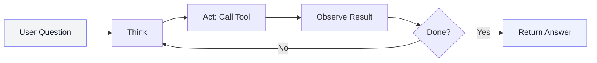
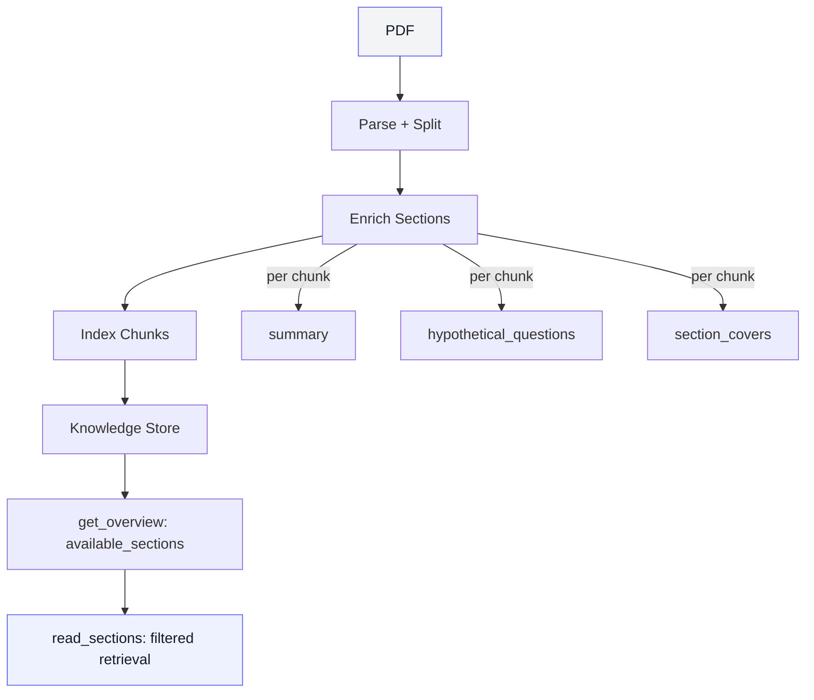
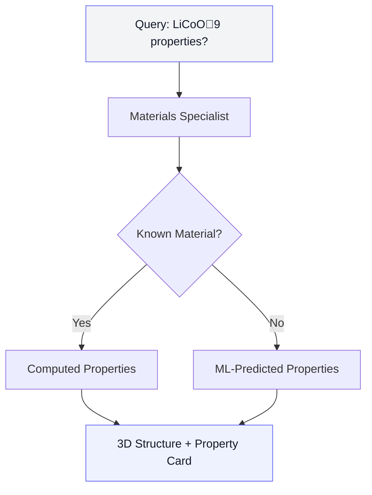
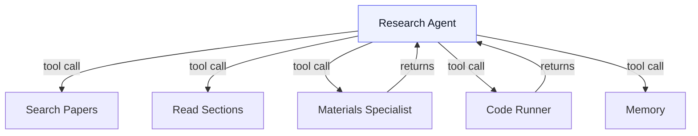
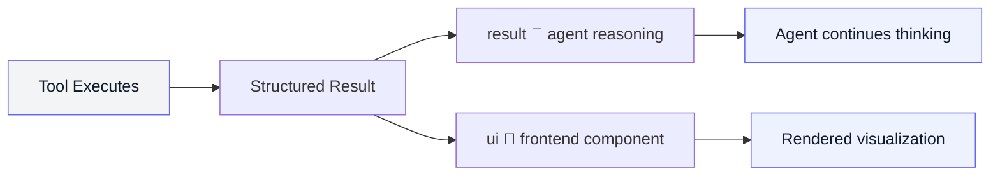
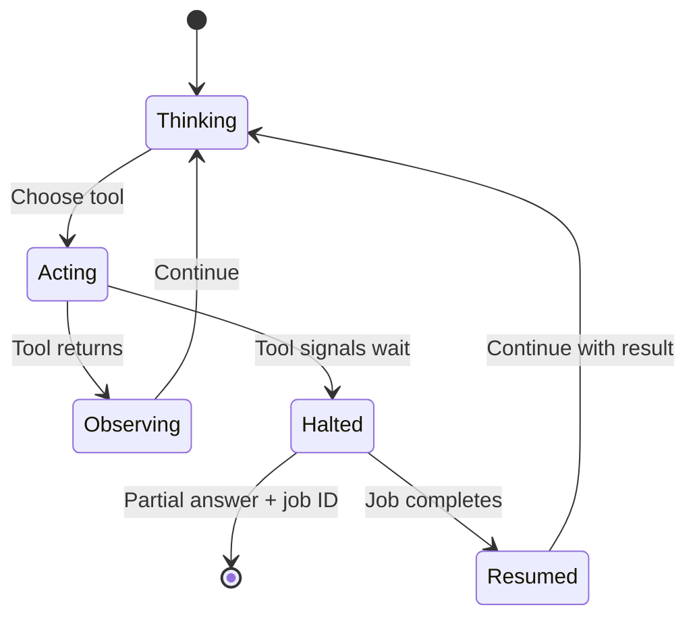
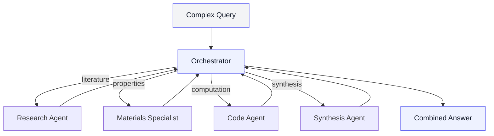

A researcher uploads three papers on perovskite stability and asks: *"Which compositions showed the lowest formation energy, and how do the reported values compare to computed predictions?"*

That question touches four different systems. The agent needs to read the papers, locate the relevant tables, look up computed properties from a materials database, and compare the numbers. A keyword search gives you links. Our agent gives you a table with citations.

This post is about how that works.

## The Reasoning Loop

Most AI tools generate a response in one shot: question in, answer out. That works for trivia. It falls apart the moment an answer requires *looking something up*.

Our agent runs a **reasoning loop** — a cycle where the model thinks about what to do, calls a tool, reads the result, and decides whether it has enough to answer or needs to go deeper.

This is the **ReAct** pattern (Reason + Act). The model doesn't need to memorize every material property — it needs to know which tool to reach for. The knowledge lives in the databases and documents. The model provides the judgment.

A typical question takes 3–8 iterations. A complex literature comparison might take 12 — searching, reading, refining search terms, querying external data, synthesizing — all within a single response.

## What the Agent Has Access To

Around 20 tools, in three categories:

**Your workspace** — the papers you've uploaded:
- Search across papers with hybrid semantic + keyword matching
- Read specific sections — methods, results, supplementary
- Extract structured data: datasets, figures, tables, formulas

**The broader literature:**
- Discover related papers you haven't read yet
- Filter by research field, author, or date range
- Surface papers that cite the same datasets

**Analysis:**
- Query materials property databases — over 150,000 computed structures with energies, bandgaps, elastic properties, crystal structures
- Run Python code in a sandboxed environment
- Search the agent's own memory from earlier in the conversation

The agent selects tools based on the question. It's not following a fixed sequence. A question about a single paper triggers section reads. A comparison across sources triggers paper search *and* database queries *and* potentially code to generate a comparison table.

## The Paper Skeleton (section_covers)

A paper is not a blob of text. It is a machine with named parts.

When we index and enrich a paper, we do not just store chunks. Each chunk is tagged with a **small fixed taxonomy** called `section_covers`.

Think of it as turning a PDF into an addressable map:

- instead of "find me the paragraph about X"
- you get "methods" vs "results" vs "datasets" as a first-class routing layer

That taxonomy is intentionally constrained (literal values like `abstract`, `methods`, `results`, `datasets`, `references`, plus a safe `others`). Constrained labels beat clever labels here: they keep tool signatures stable, keep filtering deterministic, and prevent the agent from inventing new section names that don't exist.

This is what makes `read_sections(paper_id, section_type="methods")` work like a surgical instrument instead of a prompt.

The crucial detail: `get_overview` can aggregate `section_covers` across indexed chunks to show the agent which sections actually exist in the paper. That prevents the classic RAG failure mode of querying a section that isn't there.

## Enrichment That Makes RAG Behave

Most RAG systems embed raw text. Scientific papers punish that approach: raw text is long, repetitive, and full of details that are irrelevant to the user question.

We embed **the thing users actually query for**:

- a short section summary
- plus a few *hypothetical questions* that this chunk answers

The raw text stays stored for display and grounding, but the embedding space is built on a representation that matches real research questions.

That has two direct effects:

- **Recall improves** because "question-shaped" queries match "question-shaped" embeddings.
- **Precision improves** because summaries drop noise and keep the chunk's purpose sharp.

On top of that, we run a **multi-model hybrid retrieval** pipeline. Each chunk is embedded by two models: a general-purpose embedder (OpenAI or Jina v4) for broad semantic coverage, and **AllenAI SPECTER** for scientific-domain awareness — SPECTER is trained on citation graphs and understands how research papers relate to each other.

At query time, both models retrieve independently and results are fused using **Reciprocal Rank Fusion (RRF)**. RRF is rank-based, not score-based, so it sidesteps the calibration problem of mixing scores from different embedding spaces. A document that ranks highly in both models surfaces to the top; a document that only one model likes gets a moderate rank instead of being drowned out.

On top of that, we layer keyword matching for exact-symbol and exact-name retrieval — formula names, element symbols, and database IDs that semantic models tend to fumble.

## Self-Correcting Retrieval (CRAG v2)

Sometimes a query is easy: one paper, one section, one answer.

Sometimes it is not: contradictions, missing context, multiple candidate mechanisms. In those cases, we switch to a self-correcting loop (CRAG v2).

CRAG v2 treats retrieval as an iterative control problem:

1. retrieve candidate evidence
2. critique: do we have enough, and is it consistent?
3. expand/repair the query
4. retrieve again

It stops early when scores plateau, and it carries section metadata (`section_covers`, page grounding) through the loop so the agent can narrow reads to the right parts of the right papers.

The analogy is race engineering, not chat: when the telemetry doesn't reconcile, you do another lap of instrumentation with a tighter hypothesis, not a longer paragraph.

## Visual Retrieval When Text Is Not Enough

A lot of the signal in materials papers is not in sentences. It is in a phase diagram, a band structure plot, a microscopy image, or a table layout.

For that, we run two visual pipelines on every page:

**ColPali v1.3** for visual retrieval — each page is encoded into ~1030 patch vectors (128 dims each), and queries get token-level embeddings. Scoring is MaxSim over page patches: you can retrieve a page because it *looks* like the thing you asked for, even when the caption is weak or the text extraction missed a table.

**An LLM-based OCR model** for structured text extraction — a vision-language model that reads page images and produces clean markdown with tables, equations, and headings preserved. This replaces traditional OCR for pages where layout matters, which in scientific papers is most of them.

This matters because it lets the agent answer questions like:

- "find the plot where bandgap changes with composition"
- "show the phase diagram"
- "which page has the ablation table"

without pretending that those are purely text search problems.

## The Materials Specialist

When the agent encounters a question about a specific compound or crystal structure, it calls a **materials specialist** — a sub-agent purpose-built for property lookups.

The specialist returns computed properties for known materials — energy, stability, electronic structure — along with 3D crystal structure data for interactive visualization. For novel compositions that aren't in the database, it falls back to machine learning predictions.

The researcher doesn't need to know which database to query, what format the data comes in, or how to map a formula to a structure ID. They ask a question. The answer comes back with a rotatable crystal structure and a property card.

## Computation on Demand

Some questions need more than lookups. Curve fitting against extracted data points, statistical comparisons across papers, custom visualizations — these require computation.

The agent writes Python code, submits it to an isolated execution environment, and weaves the results into its answer. The sandbox is locked down: no network access, no filesystem outside the container, strict resource limits.

The difference from a notebook: the agent decides *when* code is needed, writes it with full conversation context, and explains the output. The researcher stays in the conversation. No tab-switching. No exporting data to another tool.

## Agents as Tools

We started with separate agents — one for papers, one for materials, one for code — and tried connecting them with a router that classified intent. It didn't work well for questions that span multiple domains, which turned out to be most of them.

The fix was elegant: **make agents into tools**.

One research agent orchestrates everything. The materials specialist isn't a peer — it's a tool, callable mid-reasoning. Same for code execution. Same for memory search.

This means the agent can read a results section, extract a candidate composition, then immediately consult the materials specialist to compare reported values against computed stability. The ReAct loop has access to both paper evidence and material evidence, so it can tighten the hypothesis instead of inflating the prose.

New capabilities are added by registering new tools. No routing logic to update. No handoff protocols to maintain.

## Structured Results: Splitting Thought from Display

When the materials specialist returns crystal structure data, two things need to happen. The agent needs a text summary to continue reasoning. The frontend needs atomic coordinates to render a 3D model. These are fundamentally different representations of the same result.

Every tool in the system returns a structured result with two parts:
- **`result`** — a clean text summary for the agent to reason with
- **`ui`** (optional) — typed data for the frontend to render

The agent never sees rendering configs. The frontend never parses natural language. Clean boundary.

These structured outputs — we call them **blocks** — accumulate as the agent works. Text, dataset references, figures, code, 3D structures — each is a typed unit. The final response assembles from these blocks, keeping only what the agent actually cited in its answer.

## Components from Data

The block system opens up something powerful. If every tool produces typed, structured data, the frontend can generate the right visualization automatically.

A lightweight **UI agent** takes structured tool output and produces rendering specifications:

- Crystal structure coordinates → interactive 3D viewer
- Numerical comparisons → charts
- Tabular data → sortable grids with filtering

These components appear embedded in the conversation, tailored to each specific answer. The researcher didn't ask for a chart — the agent determined that a visual comparison was the clearest way to present the result, and the system rendered it.

Adding a new visualization type means adding a frontend component. The agents don't change.

## Teaching the Agent to Pause

Code execution can take 90 seconds. In a standard reasoning loop, the agent blocks, the user stares at a spinner, and the connection risks timing out.

We extended the loop with a **halt signal**. Any tool can tell the agent: *stop here, come back when I'm done*.

The code runner returns immediately with a job ID and sets the halt flag. The agent delivers a partial answer — context it's already gathered, what it's computing, and what to expect — then steps aside. The computation runs in the background. When it finishes, the conversation resumes with full results.

The researcher isn't blocked. They can read the partial analysis, browse their papers, or start a new question. Research doesn't fit in a single request-response cycle, and the system doesn't pretend it does.

## Toward an Orchestrator

As we add more specialized agents — synthesis planning, experimental design, simulation management — the architecture evolves. A single research agent can't coordinate everything when the scope expands.

The next layer: a **lightweight orchestrator** using a fast, compact model that reads complex questions, breaks them into sub-tasks, and delegates to the right specialist.

The orchestrator stays lightweight — understanding intent and coordinating is a smaller task than deep reasoning. The expensive models run only in the specialists that need them.

Each specialist becomes an **actor**: an independent process that receives tasks, executes, and returns results. Actor state is serializable — it can be saved to storage, the process can release resources, and it resumes exactly where it left off when results arrive. A synthesis agent that needs to wait for simulation results over hours doesn't hold up anything. It saves its state and comes back.

The halt-and-resume pattern we built for code execution extends naturally to this scale.

## Memory: Three Layers of Continuity

**Within a question** — a scratchpad accumulates everything the agent finds. Later tools in the same chain can query it. The agent doesn't redundantly re-search for data it already retrieved.

**Across a conversation** — each turn chains to the previous one via context IDs. Follow-up questions like "what about the third paper?" or "rerun that analysis with a tighter cutoff" resolve correctly because the agent holds the full thread.

**Across sessions** — the workspace remembers. Upload papers on Monday, ask questions on Wednesday, run analysis on Friday. The conversation history persists. The activity feed shows what changed since your last visit — papers indexed, extractions completed, jobs finished.

Research happens across days and weeks. The tools reflect that.

## What It Adds Up To

A single question can trigger paper search, section reading, property lookup, code execution, visual retrieval, and 3D visualization — all within one coherent reasoning chain. The agent pauses for long computations instead of blocking. The UI renders components from typed data instead of templates. Memory carries context across days.

The result: a researcher types a question and gets back something that would have taken an afternoon of cross-referencing across five browser tabs.

Not replacing judgment. Replacing the mechanical work between a question and an answer.

---

