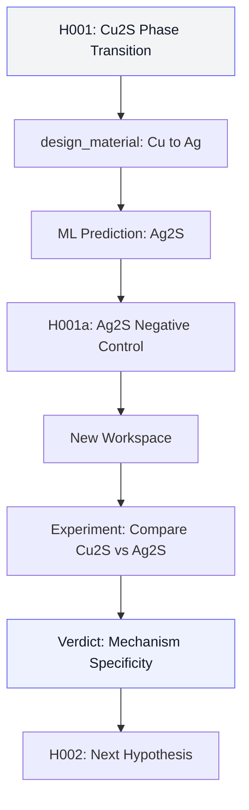
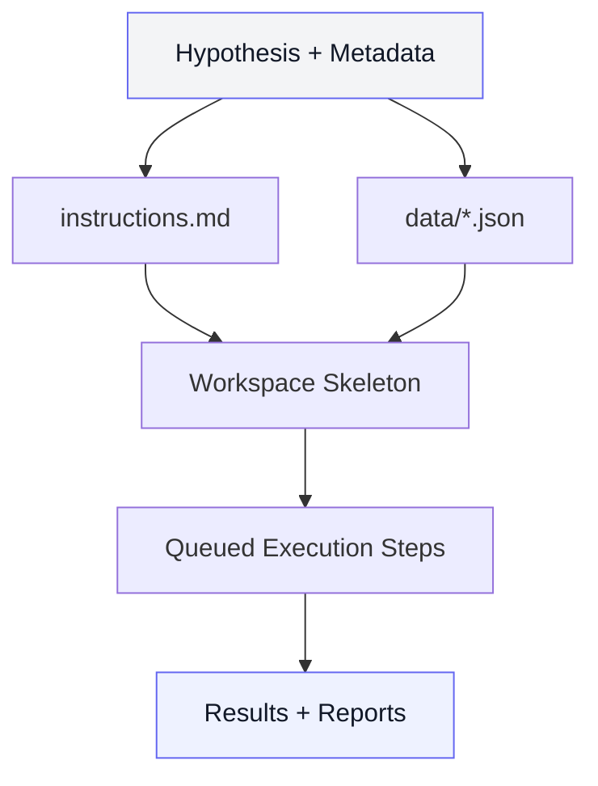
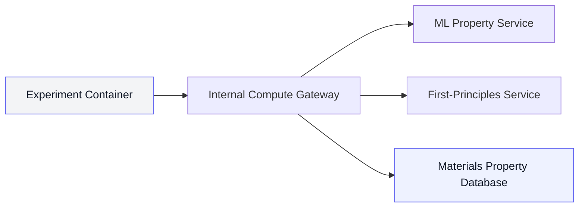

A materials science researcher reads a new preprint about LK-99. Then another. Then eight more, each contradicting the last. Some claim superconductivity. Others blame Cu2S impurities. One reports diamagnetic response above the transition. Another shows XRD peaks that should not be there.

The researcher is not confused because they lack expertise. They are stuck because the literature itself is conflicted, and the cost of testing the wrong hypothesis first is three weeks of compute time and a grad student's morale.

This is the problem we built for.

## What a Researcher Actually Needs

Before diving into architecture, consider what a materials researcher dealing with a contested claim actually needs:

1. **A ranked reading of the evidence** — not "here are ten papers", but "here is what they collectively say, where they disagree, and which disagreement is most testable."
2. **A concrete test plan** — not "consider running first-principles calculations", but a workspace with scripts, validation targets, and success criteria ready to execute.
3. **Material candidates evaluated before the expensive run** — not "Cu2S is worth investigating", but "here is the energy landscape for Cu2S, Ag2S, and Cu2Se from ML predictions, and here is which one actually discriminates between hypotheses."
4. **An audit trail that a PI can review** — every hypothesis traces back to specific paper sections, every experiment has explicit falsification criteria, every result is JSON-serializable.

## The Core Loop

Our system runs a three-part loop:

1. Read and cross-reference a paper set.
2. Generate ranked hypotheses with falsification criteria.
3. Materialize those hypotheses into executable experiment workspaces.


The important detail: each stage emits structured outputs, not freeform text. That keeps the system composable and debuggable.

## Stage 1: Hypothesis Generation Across a Paper Chain

The hypothesis engine does not produce one "best guess" and stop. It builds a ranked set of testable claims, each with:

- a mechanism statement
- supporting and counter evidence from specific paper sections
- explicit falsification criteria
- suggested experimental methods with estimated cost
- physical parameters extracted from the corpus

Think of it as a compiler pass over literature. Raw prose in, typed claims out.

A typical deep pass over a paper chain uses a phased strategy:

- scan the full corpus for contradictions and convergences
- deep-read high-signal sections (results, methods, supplementary data)
- synthesize contradictions into ranked hypotheses with confidence scores

This separation matters. Without it, systems either stay shallow or burn cycles in unstructured exploration. A researcher already knows how to deep-read one paper. What they cannot do efficiently is cross-reference ten papers, identify the three testable disagreements, and rank them by information gain.

### What a Generated Hypothesis Actually Looks Like

This is a trimmed output from a real run against the LK-99 paper corpus:

```json
{
  "hypothesis_id": "H001",
  "statement": "The anomalous resistivity drop observed in LK-99 at ~385 K is caused by a first-order structural phase transition in Cu2S impurity phases, not superconductivity.",
  "confidence": 0.75,
  "mechanism": "Cu2S undergoes a known monoclinic-to-hexagonal phase transition at 377-380 K, causing a sudden change in resistivity of Cu2S inclusions embedded in the Pb-apatite matrix.",
  "supporting_evidence": [
    {"paper_id": "2307.12008", "finding": "Sharp resistivity drop at ~385 K in polycrystalline LK-99"},
    {"paper_id": "2308.01516", "finding": "Cu2S phase detected via XRD in LK-99 samples"}
  ],
  "counter_evidence": [
    {"paper_id": "2307.12037", "finding": "Diamagnetic response persists above 385 K in some samples"}
  ],
  "falsification_criteria": [
    "Cu2S phase transition temperature differs from observed LK-99 transition by > 20 K",
    "Cu2S resistivity change at transition is < 10% of LK-99 observed change",
    "No Cu2S detected in XRD patterns of samples showing resistivity drop"
  ]
}
```

Every hypothesis carries explicit falsification criteria. The system is not trying to confirm a belief. It is trying to find the fastest way to rule one out.

For a researcher, this means the first conversation with a PI about which experiment to run next starts with data, not intuition. For a group with limited compute budget, it means the most information-dense experiment gets priority.

### What This Produced in a Real Run

We ran this pipeline end-to-end against the LK-99 corpus: ten papers spanning the original claim, replication attempts, and debunking analyses.

The hypothesis engine generated three ranked hypotheses. H001 (Cu2S phase transition, confidence 0.75) was selected for workspace execution. The system then generated experiment instructions, provisioned a Docker container with compute access, and ran five experiments autonomously:

| Stage | Duration | What happened |
|-------|----------|---------------|
| Hypothesis generation | ~30 seconds | 3 ranked hypotheses with falsification criteria |
| Instruction synthesis | ~15 seconds | `instructions.md` + `hypothesis.json` + `physical_parameters.json` |
| Workspace provisioning | ~2.5 minutes | Container with compute API client, templates, data files |
| Experiment execution | ~16.5 minutes | 5 Python scripts written, executed, outputs verified |
| Analysis report | ~3.5 minutes | Structured verdict with evidence chain |

The runner agent wrote each script, called the compute gateway for ML predictions and materials database queries, verified outputs against validation targets, and moved to the next experiment. When one script produced an unexpected energy value, the agent flagged it in the results rather than silently continuing.

The final analysis report scored 5 out of 5 on target keyword coverage and produced a composite evaluation score of 1.0 against the held-out resolution paper. The system correctly identified the Cu2S phase transition as the dominant mechanism, consistent with the later consensus in the literature.

> *This does not mean the system is complete or the best at what it does. It is one data point on one controversy. The value is having a repeatable evaluation harness — run it against different paper sets, different domains, and see how the system fares against both manual review and other autonomous discovery approaches. The score tells you where you are, not that you've arrived.*

> **Important caveat:** The LK-99 controversy was widely covered and discussed before the foundational model's training cutoff. The papers, the debates, and the eventual consensus were all in the training data. So scoring 5/5 here doesn't demonstrate true discovery — it demonstrates that the system can structure and surface what the model already knows. A fairer test would use a controversy that resolved *after* the model's training cutoff, where the model genuinely cannot have seen the answer. Until that test is run, this score measures retrieval and reasoning architecture, not novel scientific discovery.

Total wall-clock time from "here are ten papers" to "here is a scientific verdict with evidence": approximately 23 minutes.

For context, a graduate student doing this manually — reading the papers, setting up the calculations, running them, and writing an analysis — would typically need one to two weeks.

## Material Discovery Is Part of the Loop, Not a Separate Workflow

The biggest shift is this: hypothesis generation and material discovery are not sequential stages. They are coupled in the same agent loop.

When the agent proposes a mechanism, it can immediately test feasibility against candidate materials, known structures, and computed properties through its tool set. That changes the role of discovery from "later validation" to "real-time pruning."

### The `design_material` Tool: From One Hypothesis to a Material Family

This is where the loop gets interesting for researchers who think in terms of compositional space, not individual compounds.

The system includes a `design_material` tool that proposes new material compositions by element substitution on known crystal structures. Given a source structure from a materials property database and a substitution map, it:

1. Applies the substitution to the crystal structure (e.g., replace all Cu atoms with Ag)
2. Runs an ML property prediction on the modified structure (~1 second)
3. Returns predicted energy, forces, stability assessment, lattice parameters, and a CIF file
4. Registers the designed material as a trackable entity in the answer state

This is not a lookup. It is a structural transformation followed by a physics prediction.

### Derived Hypotheses: How One Experiment Spawns the Next

Here is the pattern that makes this a loop rather than a pipeline:

Suppose H001 states that Cu2S impurity phase transitions explain the LK-99 resistivity anomaly. The agent runs experiments on Cu2S and the evidence supports the hypothesis. A naive system would stop here and declare victory.

But a materials researcher would immediately ask: *Does this mechanism generalize? What about Ag2S? Cu2Se? What if I substitute the cation and the transition disappears?*

This is exactly what the next iteration does. The agent can call `design_material` to create Ag2S from the Cu2S template:

```
design_material(
  material_id="mp-560588",     # Cu2S (chalcocite)
  substitutions={"Cu": "Ag"},  # Replace Cu with Ag
  relax=True                   # Predict properties with ML potential
)
```

The ML potential returns the predicted energy landscape for Ag2S. If the monoclinic-to-hexagonal transition energy differs significantly from Cu2S, that strengthens H001 by providing a negative control: a structurally related sulfide where the mechanism should not produce the same resistivity anomaly.

This generates a derived hypothesis:

> **H001a:** "If the Cu2S phase transition mechanism is correct, substituting Cu with Ag should eliminate the resistivity anomaly near 385 K, because Ag2S undergoes its monoclinic-to-orthorhombic transition at 450 K — outside the LK-99 observation window."

The derived hypothesis carries its own falsification criteria, its own material references, and its own experiment plan. It feeds back into the loop as a new workspace.



The researcher gets a systematic exploration of compositional space, not a single-point answer.

In practice, this means:

- impossible candidates are eliminated before expensive first-principles runs
- promising material families are expanded with structure-aware variants
- each hypothesis carries discovery context with database IDs, not just text rationale
- negative controls are generated automatically, not as an afterthought

For a university group with limited compute budget, this reduces dead-end simulations by pruning with ML screening (~1 second) before committing to first-principles calculations (~20-120 seconds each). For an engineering team, it reduces iteration latency from days to minutes. For investors evaluating a materials startup, it provides a measurable, auditable trail of what was explored and why.

## Tool Impact Inside the Hypothesis Agent

A good agent toolset is not about having many tools. It is about making each tool change a decision boundary.

In our hypothesis loop, tool calls do three high-value jobs:

- **Evidence compression:** distill multi-paper contradictions into comparable hypothesis objects with confidence scores and falsification criteria
- **Discovery grounding:** retrieve known materials, design new compositions, and validate structural feasibility before downstream execution
- **Execution readiness:** package selected hypotheses into reproducible workspaces with explicit commands, status tracking, and analysis hooks

The compute tools available inside the loop span the full fidelity ladder:

| Tool | Method | Cost | Use case |
|------|--------|------|----------|
| `predict_properties` | ML potential | ~1s | Fast screening across many structures |
| `design_material` | Substitution + ML | ~1s | Compositional exploration |
| `simulate_md` | ML molecular dynamics | ~30s | Thermal stability, phase transitions |
| `compute_phase_diagram` | Thermodynamic DB | ~2s | Stability analysis |
| `predict_first_principles` | First-principles | ~20s | High-fidelity single-point energy |
| `relax_first_principles` | First-principles | ~60s | Geometry optimization |
| `compute_band_structure` | First-principles | ~120s | Electronic structure |
| `compute_dos` | First-principles | ~120s | Density of states |

The agent navigates this fidelity ladder during hypothesis evaluation: screen with ML predictions, confirm with first-principles calculations, report with explicit error bars. A researcher manually managing this ladder across ten candidate materials would spend most of their time on bookkeeping. The system handles the bookkeeping and lets the researcher focus on the science.

The result is a system that does not just "suggest ideas." It commits ideas into testable operating artifacts with compute results attached.

## Stage 2: Workspace Synthesis, Not Just "Generated Code"

Once a hypothesis is selected, we do not generate one throwaway script.

We generate a full research workspace with:

- `instructions.md` (research context, experiment list, success criteria)
- `data/hypothesis.json` (structured claim + metadata)
- `data/physical_parameters.json` (numeric anchors from the literature)
- experiment command templates and agent roles
- analysis/report scaffolding



### A Generated Experiment Plan

Here is a trimmed excerpt from an experiment specification produced for the Cu2S phase transition hypothesis:

```markdown
### Experiment 1: Cu2S Phase Transition Energy Landscape

**Objective:** Determine the energy difference between monoclinic and hexagonal Cu2S phases.

**Approach:** Use ML potential to compute total energies for both Cu2S polymorphs. Calculate relative stability and approximate transition temperature.

**Expected Output:** `results/cu2s_energy_difference.json`

**Validation Targets:** T_Cu2S_transition_K = 377 K +/- 10 K
```

Four experiments like this are generated from a single hypothesis. Each has explicit inputs, outputs, and validation targets. The workspace includes data files, a compute API client, and agent roles to execute every step autonomously.

## Stage 3: Internal Compute Gateway (Security by Topology)

A key requirement is running materials computation from experiment containers without leaking upstream credentials.

This is not a theoretical concern. Experiment containers run agent-generated code. They call ML prediction services, first-principles solvers, and materials databases. Each of those services requires authentication — API keys, database credentials, service tokens. If the experiment container holds those credentials directly, a single code generation error could expose them in logs, error messages, or network traces.

We solve this with an internal compute gateway that enforces security through network topology, not policy:

- experiment containers call a local gateway endpoint on a private Docker network
- the gateway forwards requests to upstream compute services, injecting credentials server-side
- containers never see, store, or transmit upstream secrets
- if the gateway cannot reach a service, it returns a clean 503 — the container knows something is unavailable, but learns nothing about the upstream topology



The 503 response is a deliberate design choice. When the gateway has no upstream URL configured for a service, the response is identical to a temporary outage: a generic "service unavailable." The experiment container cannot distinguish between "this service is not configured" and "this service is temporarily down." That ambiguity is the security property. An experiment that probes endpoint availability learns nothing about the infrastructure behind the gateway.

For developers, this gives a clean client module inside each workspace — a single base URL, no credential management. For security teams, it constrains the credential blast radius by design: even if a container is fully compromised, the attacker gains access to zero upstream credentials and cannot map the service topology.

For researchers, the benefit is simpler: the compute client inside the workspace just works. They do not need to manage API keys for ML services, first-principles solvers, or the materials database. They point at the gateway, and the gateway handles the rest.

## What This Means in Practice

### For researchers reading contested claims

You drop a paper set into a workspace and get back ranked hypotheses with explicit evidence chains, not a summary paragraph. Each hypothesis tells you which papers support it, which contradict it, and what specific measurement would falsify it. That is the starting point for a lab meeting, not a literature review.

The system then generates a full experiment plan and executes it. You get results in 23 minutes, not two weeks. If the results support the hypothesis, the system proposes derived hypotheses by exploring related material compositions. If the results falsify it, the next-highest-ranked hypothesis gets its turn.

### For university materials groups with limited compute

The fidelity ladder matters here. ML screening at ~1 second per structure lets you evaluate fifty candidate materials before committing a single first-principles run at ~2 minutes each. The `design_material` tool generates structural variants programmatically, so compositional exploration does not require manual CIF editing.

A group that previously explored three compositions per week can now screen fifty and confirm the top five from first principles in a single afternoon.

### For PIs reviewing student work

Every hypothesis carries a JSON-serializable audit trail: which papers contributed, what confidence level was assigned, what would falsify it, and what experiments were run. The analysis report includes explicit validation targets and whether they were met.

This means a PI can review a student's hypothesis-to-experiment cycle by reading structured outputs, not by re-running calculations or trusting narrative summaries.

### For engineering teams and investors

The moat is in orchestration quality: the speed and reliability of moving from ambiguous evidence to executable, auditable experimental decisions.

Progress is not a narrative. It is a data structure. Each iteration of the loop produces:

- a versioned hypothesis with provenance
- a workspace with deterministic assembly (same inputs, same workspace)
- experiment results with explicit success/failure criteria
- a structured verdict that feeds the next iteration

For investors evaluating a materials discovery company, this is the difference between "we ran some simulations" and "here is the decision tree, here are the branch points, and here is the evidence at each node." The loop is auditable end-to-end because every intermediate artifact is JSON-serializable and every tool call is logged with inputs and outputs.

## The "Withheld Final Paper" Check

The hypothesis agent was reverse-engineered from this evaluation method. We started with the question: *how do you know if a hypothesis engine is any good?* The answer shaped the architecture.

The pattern:

- pick a resolved scientific controversy with a known outcome
- build the paper chain *without* the final resolution paper
- feed the incomplete chain to the hypothesis agent
- score the generated hypotheses against the withheld paper using an LLM-as-a-judge

The judge model receives the generated hypothesis, the withheld resolution paper, and a scoring rubric. It evaluates on target keyword coverage (did the hypothesis identify the right mechanism, materials, and phenomena?), directional correctness (does it point toward the same conclusion?), and falsification quality (are the proposed tests the ones that would actually resolve the question?). The scores are structured — not a vibes-based "looks good" — so we can track improvements across agent iterations.

This evaluation loop was the testing ground before the agent was ever used on live research questions. Every change to the reasoning loop, tool selection, or hypothesis ranking was validated against held-out papers first.

In our LK-99 run, the system scored 5/5 on target keyword coverage against the withheld consensus paper, with a composite evaluation score of 1.0. The hypothesis it ranked highest was the one the community eventually converged on. The same caveat applies here — LK-99 was in the training data. This validates the architecture's ability to structure known knowledge, not its ability to discover the unknown.

## Engineering Principles We Optimized For

1. **Structured outputs over narrative outputs** — every hypothesis, experiment, and verdict is a typed data structure
2. **Deterministic assembly over ad hoc generation** — same hypothesis produces the same workspace, every time
3. **Discovery integrated into hypothesis generation** — `design_material` and property prediction run inside the reasoning loop, not after it
4. **Secure internal routing over distributed secret handling** — credentials never enter experiment containers
5. **Asynchronous execution with explicit status lifecycle** — workspaces report provisioning, running, completed, or failed states via SSE
6. **Evaluation loops that can disagree with your prior belief** — falsification criteria are first-class citizens, not afterthoughts

Those principles let us support multi-paper reasoning and material discovery without turning the system into a black box.

If you want to see this loop in action, open the app and run a hypothesis-to-workspace cycle on your own paper set.

## References: LK-99 Paper Corpus

The input chain (10 papers fed to the hypothesis agent):

1. Lee et al., "The First Room-Temperature Ambient-Pressure Superconductor" — [arXiv:2307.12008](https://arxiv.org/abs/2307.12008)
2. Lee et al., "Superconductor Pb₁₀₋ₓCuₓ(PO₄)₆O showing levitation at room temperature" — [arXiv:2307.12037](https://arxiv.org/abs/2307.12037)
3. Si & Held, "Origin of correlated isolated flat bands in copper-substituted lead phosphate apatite" — [arXiv:2307.16892](https://arxiv.org/abs/2307.16892)
4. Kumar et al., "Synthesis of possible room temperature superconductor LK-99:Pb₉Cu(PO₄)₆O" — [arXiv:2307.16402](https://arxiv.org/abs/2307.16402)
5. Griffin, "Electronic Structure and Vibrational Stability of Copper-substituted Lead Apatite" — [arXiv:2308.01135](https://arxiv.org/abs/2308.01135)
6. Hou et al., "Successful growth and room temperature ambient-pressure magnetic levitation of LK-99" — [arXiv:2308.01516](https://arxiv.org/abs/2308.01516)
7. Liu et al., "Absence of superconductivity in LK-99 at ambient conditions" — [arXiv:2308.03544](https://arxiv.org/abs/2308.03544)
8. Guo et al., "First order transition in Pb₁₀₋ₓCuₓ(PO₄)₆O containing Cu₂S" — [arXiv:2308.04353](https://arxiv.org/abs/2308.04353)
9. Jain et al., "Superionic phase transition of copper(I) sulfide and its implication for purported superconductivity of LK-99" — [arXiv:2308.05222](https://arxiv.org/abs/2308.05222)
10. Puphal et al., "Single crystal synthesis, structure, and magnetism of Pb₁₀₋ₓCuₓ(PO₄)₆O" — [arXiv:2308.06256](https://arxiv.org/abs/2308.06256)

Withheld resolution paper (used for LLM-as-judge evaluation):

- Habamahoro et al., "Replication and study of anomalies in LK-99 — the alleged ambient-pressure, room-temperature superconductor" — [arXiv:2311.03558](https://arxiv.org/abs/2311.03558)

