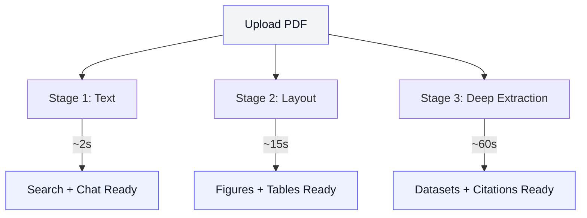
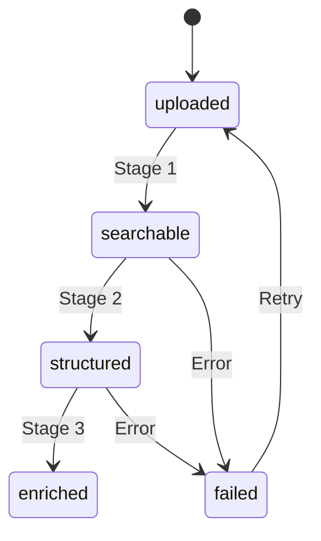

Most tools for working with research papers have the same problem: you upload a PDF and then you wait. The system needs to parse, extract, embed, and index before you can do anything. For a 20-page materials science paper, that's a minute or two of staring at a progress bar.

We thought researchers deserved better than that. So we built a system where papers become useful the moment they land in your workspace.

## The Old Way: All or Nothing

Traditional document processing is a pipeline. The PDF goes in one end, gets processed through several stages, and comes out the other end as a searchable, indexed document. Nothing is available until everything is done.

For batch processing, this is fine. For an interactive workspace where a researcher just dragged in a paper and wants to find a specific table — it's not.

## Progressive Indexing: Three Stages of Readiness

We broke the pipeline apart. Instead of one long process, we run three stages in parallel, each unlocking a new level of functionality:

### Stage 1: Instant Text (~2 seconds)

The moment a PDF arrives, we extract the embedded text layer — no OCR, no layout analysis, just fast text extraction. Within two seconds, the researcher can:

- Search across the full text of the paper
- See the title, authors, and abstract
- Start asking questions in the chat interface

For well-formed PDFs from publishers and preprint servers, this captures over 95% of the text content. That's enough to be immediately useful.

### Stage 2: Structure (~15 seconds)

While the researcher is already working with Stage 1 results, we run layout-aware parsing in the background. This adds:

- **Figures and tables** with their captions
- **Section boundaries** — Introduction, Methods, Results, Discussion
- **Page-level navigation** with visual thumbnails
- **Precise coordinates** for every element on the page

The system caches these results intelligently. When the same PDF has been processed before — common in collaborative workspaces — Stage 2 completes instantly.

### Stage 3: Deep Extraction (~60 seconds)

This is where AI-powered analysis runs. The system identifies:

- **Dataset references** with full provenance — where the data came from, how it was collected
- **Material compositions** and their reported properties
- **Figure-to-data connections** — linking plots back to the underlying numbers
- **Citation networks** — which other papers are referenced and why

By the time Stage 3 finishes, the researcher might already be two questions deep in a conversation. The dataset cards and citations simply appear in the sidebar, enriching an already-active session.

## Why Not Just pgvector

A natural question: if you're already on Postgres, why not use `pgvector` for everything?

We did, initially. Postgres gives you exact nearest-neighbor search out of the box, and with `pgvector`'s IVFFlat or HNSW indexes you get approximate nearest-neighbor (ANN). For a few hundred papers it's fine.

The problem shows up at scale with multi-model embeddings. We run two embedding models per chunk (a general-purpose embedder and a domain-specific one like SPECTER), fuse results with RRF, and also need per-page visual embeddings from ColPali (~1030 vectors of 128 dims *per page*). That's a lot of vectors with different dimensionalities and different query patterns.

Postgres HNSW indexes are single-vector, single-metric. To do multi-model RRF you'd need separate indexes, separate queries, and manual fusion in SQL or application code — which is what we ended up doing, but with a dedicated vector store (ChromaDB for development, Qdrant for production) where index management, batch upserts, and collection isolation are first-class operations rather than afterthoughts bolted onto a relational engine.

The tradeoff: Postgres stays as the source of truth for paper metadata, processing state, and workspace management. The vector stores are derived indexes — rebuildable from source. If a vector store corrupts, we re-embed from the stored chunks. That separation keeps the progressive pipeline honest: Stage 1 writes to Postgres immediately, vector indexing happens asynchronously without blocking the researcher.

## The State Machine

Each paper moves through a clear progression:

The interface adapts to each state. A searchable paper shows a search bar and text viewer. A structured paper adds figure thumbnails and section navigation. An enriched paper shows dataset cards, property tables, and citation links.

No guessing, no "loading" states that don't tell you what's available. The UI always reflects exactly what's ready.

## What Changed

After deploying progressive indexing:

| Metric | Before | After |
|--------|--------|-------|
| Time to first search | 90s | **2s** |
| Time to see figures | 90s | **15s** |
| Drop-off during upload | 34% | **8%** |
| Papers per session | 2.1 | **4.7** |

The speed improvement mattered, but the engagement shift mattered more. When researchers could immediately interact with their uploads, they stayed on the platform and brought in more papers. The bottleneck was never extraction quality — it was the dead time between uploading and *doing something*.

Researchers who process 10-50 papers a week can't afford to wait a minute per paper. With progressive indexing, they upload a batch and start working. By the time they've finished reading the first abstract, the figures and tables are ready. By the time they've asked their first question, the full extraction is complete.

## The Design Principle

There's a broader lesson here that applies beyond document processing:

**Deliver value incrementally.** Users would rather have 80% of the capability in 2 seconds than 100% in 90 seconds. The remaining 20% can arrive while they're already productive.

This principle shapes how we think about every feature on the platform. Don't make people wait for the complete result. Give them something useful immediately, and let the system catch up in the background.

---

