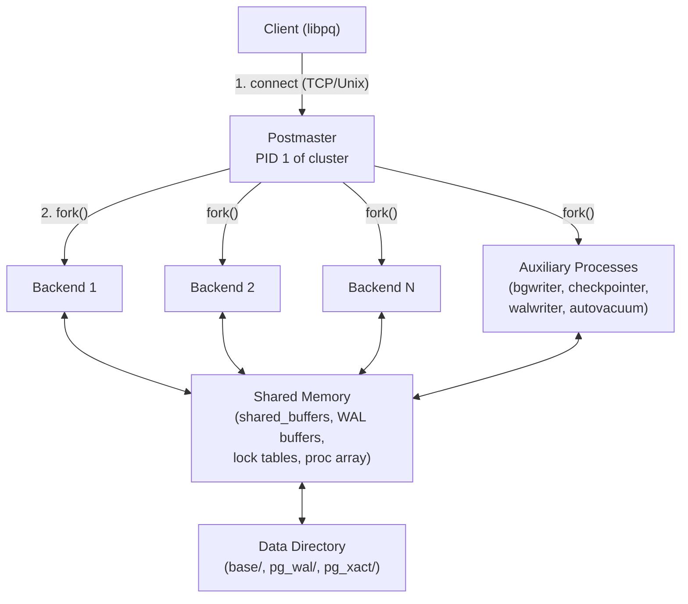

# Chapter 0: Architecture

> *PostgreSQL is a multi-process, shared-memory relational database where every client connection gets its own Unix process, and all coordination happens through a carefully partitioned region of shared memory.*

## Why Start Here

Before tracing a single SQL statement through its lifecycle, you need a mental model of
the machine that runs it. PostgreSQL's architecture is shaped by a decision made in the
early 1990s: use OS processes, not threads, for concurrency. Every design choice that
follows --- how memory is organized, how locks are managed, how crash recovery works ---
flows from that single constraint.

This chapter builds that mental model in three layers. First, the **process model**:
which processes exist, who spawns them, and how they communicate. Second, the **memory
layout**: what lives in shared memory versus process-local memory, and how PostgreSQL's
memory context system prevents leaks without a garbage collector. Third, the **query
lifecycle**: the complete path a SQL string travels from the network socket to the result
rows sent back to the client.

## Chapter Map

| Topic | File | What You Will Learn |
|-------|------|---------------------|
| [Process Model](process-model) | `process-model.md` | Postmaster, backend processes, auxiliary processes, background workers |
| [Memory Layout](memory-layout) | `memory-layout.md` | Shared memory segments, local memory contexts, the `palloc`/`pfree` system |
| [Query Lifecycle](query-lifecycle) | `query-lifecycle.md` | Parse, analyze, rewrite, plan, execute --- the full pipeline |

## Bird's-Eye View

## Key Source Entry Points

These are the files you will encounter most often when reading PostgreSQL source code.
Every topic page in this chapter references specific lines within them.

| File | Role |
|------|------|
| `src/backend/postmaster/postmaster.c` | Main loop of the postmaster; accepts connections and forks backends |
| `src/backend/tcop/postgres.c` | The "traffic cop" --- main loop of every backend process |
| `src/backend/utils/mmgr/mcxt.c` | Memory context infrastructure (`palloc`, `pfree`, context tree) |
| `src/include/nodes/memnodes.h` | `MemoryContextData` struct definition |
| `src/include/libpq/libpq-be.h` | `Port` struct --- per-connection state |
| `src/include/storage/proc.h` | `PGPROC` struct --- per-backend shared memory slot |
| `src/include/storage/shmem.h` | Shared memory allocator API |
| `src/backend/parser/parser.c` | Entry point for the raw SQL parser |
| `src/backend/parser/analyze.c` | Semantic analysis (parse analysis) |
| `src/backend/optimizer/plan/planner.c` | Query planner / optimizer entry point |
| `src/backend/executor/execMain.c` | Executor entry point |
| `src/backend/tcop/pquery.c` | Portal-level query execution |

## How the Pieces Fit Together

1. The **postmaster** listens on a TCP port. When a client connects, it `fork()`s a new
   **backend process**. That backend inherits the postmaster's address space, including
   pointers into **shared memory**.

2. The backend reads SQL from the client socket into a **MessageContext** (local memory),
   parses it, analyzes it, rewrites it, plans it, and executes it. Each phase allocates
   in short-lived memory contexts that are reset between queries.

3. During execution, the backend reads and writes **shared buffers** (the buffer pool in
   shared memory), acquires **locks** (also in shared memory), and writes **WAL records**
   to the WAL buffer. Auxiliary processes like the **bgwriter** and **checkpointer**
   flush dirty buffers to disk asynchronously.

4. When the client disconnects, the backend process exits. The postmaster detects this
   via `waitpid()` and reclaims the child's `PMChild` slot.

## Connections to Other Chapters

- **Chapter 1 (Shared Buffers)** --- builds on the shared memory layout described here
- **Chapter 2 (WAL)** --- the WAL buffer and walwriter process introduced here are
  explored in depth
- **Chapter 3 (Transactions)** --- the `PGPROC` array and `xid`/`xmin` fields shown
  here are the foundation of MVCC visibility
- **Chapter 4 (Query Planning)** --- the planner stage in the query lifecycle is expanded
  into a full chapter
