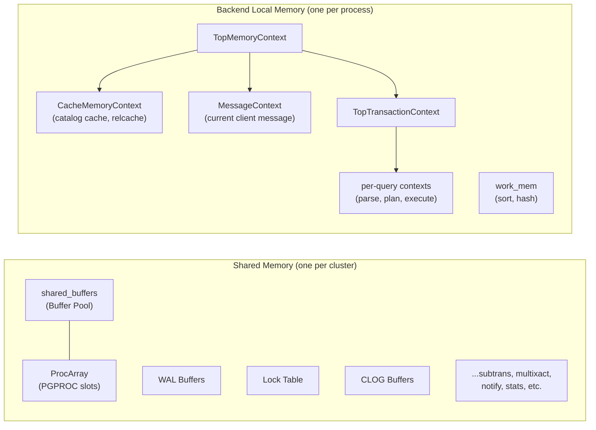
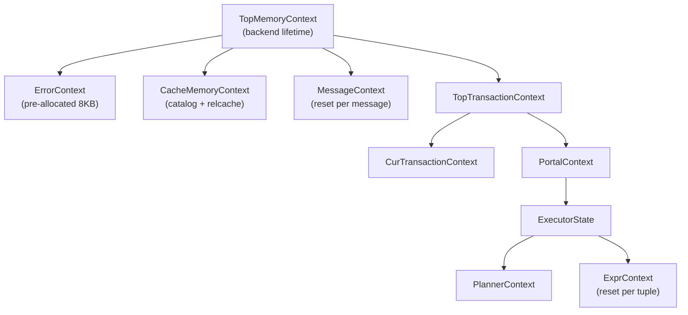

# Memory Layout

> *PostgreSQL divides memory into two worlds: shared memory that all processes can see, and private memory managed by a tree of contexts that make manual memory management almost as safe as garbage collection.*

## Overview

Every PostgreSQL cluster has exactly one region of **shared memory**, created by the
postmaster at startup and inherited by all child processes via `fork()`. This region
holds the buffer pool (`shared_buffers`), WAL buffers, the lock table, the `PGPROC`
array, and dozens of other structures that require cross-process coordination. Shared
memory is allocated once and never grows; its total size is determined at startup from
GUC parameters.

Each backend process also has its own **private (local) memory**. This includes the
plan cache, catalog cache, sort/hash memory (`work_mem`), and all the transient
allocations made during query processing. Local memory is managed through PostgreSQL's
**memory context** system --- a hierarchical allocator where every allocation belongs to
a named context, and freeing a context automatically frees all of its children and their
allocations. This eliminates the most common class of memory leaks: forgetting to free
intermediate results.

The memory context system is the single most important abstraction to understand before
reading any PostgreSQL backend code. Nearly every function allocates into "the current
context," and the lifecycle of that context determines when the memory is freed. A
per-query context is reset after each query. A per-transaction context survives until
commit or abort. A cache context lives for the entire backend session.

## Key Source Files

| File | Purpose |
|------|---------|
| `src/backend/utils/mmgr/mcxt.c` | Core memory context operations: create, reset, delete, palloc, pfree |
| `src/backend/utils/mmgr/aset.c` | `AllocSet` --- the default general-purpose allocator |
| `src/backend/utils/mmgr/generation.c` | `Generation` context --- optimized for allocate-many-then-free-all patterns |
| `src/backend/utils/mmgr/slab.c` | `Slab` context --- fixed-size chunk allocator |
| `src/backend/utils/mmgr/bump.c` | `Bump` context --- append-only, no individual free |
| `src/include/nodes/memnodes.h` | `MemoryContextData` and `MemoryContextMethods` struct definitions |
| `src/include/utils/memutils.h` | Public API: `AllocSetContextCreate`, standard context globals |
| `src/include/utils/palloc.h` | `palloc()`, `pfree()`, `MemoryContext` typedef |
| `src/include/storage/shmem.h` | Shared memory allocator: `ShmemAlloc`, `ShmemInitStruct` |
| `src/backend/storage/ipc/ipci.c` | `CreateSharedMemoryAndSemaphores()` --- orchestrates shared memory setup |
| `src/backend/storage/ipc/shmem.c` | Shared memory allocator implementation |
| `src/backend/utils/mmgr/portalmem.c` | Portal memory management |

## How It Works

### High Level



### Deep Dive: Shared Memory

Shared memory is created in `CreateSharedMemoryAndSemaphores()` (`src/backend/storage/ipc/ipci.c`).
The postmaster calculates the total size needed, requests it from the OS via `shmget()`
or `mmap()`, and then initializes each subsystem's region by calling its `ShmemInit`
function. The layout is roughly:

| Region | Sized By | Typical Size |
|--------|----------|-------------|
| Buffer pool | `shared_buffers` | 128 MB -- 32 GB+ |
| Buffer descriptors | `NBuffers * sizeof(BufferDesc)` | ~64 bytes per buffer |
| WAL buffers | `wal_buffers` | 16 MB default |
| PGPROC array | `max_connections + autovacuum_max_workers + aux` | ~1 KB per slot |
| Lock table | `max_locks_per_transaction * max_connections` | varies |
| CLOG buffers | fixed | small |

Shared memory uses a simple bump allocator (`ShmemAlloc`). There is no shared-memory
`free()` --- structures are allocated once at startup and live for the lifetime of the
cluster. The shared memory index (`ShmemInitHash` with key `"ShmemIndex"`) is a hash
table that maps string names to their locations, allowing subsystems to find each other.

### Deep Dive: Memory Contexts

#### The Context Tree

Every backend maintains a tree of memory contexts rooted at `TopMemoryContext`. The
standard top-level contexts (declared in `src/include/utils/memutils.h`) are:

| Context | Lifetime | Typical Contents |
|---------|----------|-----------------|
| `TopMemoryContext` | Backend lifetime | Root of the tree; holds long-lived data |
| `PostmasterContext` | Postmaster only | Freed after fork in backends |
| `CacheMemoryContext` | Backend lifetime | System catalog cache, relation cache |
| `MessageContext` | One client message | Raw query string from the network |
| `TopTransactionContext` | One transaction | Transaction-scoped allocations |
| `CurTransactionContext` | One subtransaction | Subtransaction-scoped allocations |
| `ErrorContext` | Backend lifetime | Pre-allocated for out-of-memory error recovery |
| `PortalContext` | Transient | Active portal's memory |

#### The Four Allocator Implementations

Memory contexts are an abstract interface. The concrete implementations are:

| Type | Node Tag | Best For | Strategy |
|------|----------|----------|----------|
| **AllocSet** | `T_AllocSetContext` | General purpose | Power-of-two free lists, blocks double in size |
| **Slab** | `T_SlabContext` | Fixed-size objects | Chunks are all the same size; O(1) alloc/free |
| **Generation** | `T_GenerationContext` | Bulk alloc then bulk free | No per-chunk free list; whole blocks freed at once |
| **Bump** | `T_BumpContext` | Append-only workloads | No individual free at all; fastest allocator |

The default is `AllocSet`. You create one with:

```c
MemoryContext ctx = AllocSetContextCreate(
    TopMemoryContext,        /* parent */
    "MyContext",             /* name (must be a string literal) */
    ALLOCSET_DEFAULT_SIZES   /* minSize=0, initSize=8KB, maxSize=8MB */
);
```

#### How palloc Works

`palloc(size)` allocates `size` bytes in `CurrentMemoryContext`. Under the hood:

1. It calls `context->methods->alloc(context, size, 0)`, which dispatches to the
   concrete allocator (e.g., `AllocSetAlloc`).
2. `AllocSetAlloc` checks its free list for a chunk of the right size class. If none
   is available, it allocates from the current block. If the current block is full,
   it allocates a new block (doubling in size up to `maxBlockSize`).
3. Each chunk has a small header that points back to its owning context, enabling
   `pfree()` and `GetMemoryChunkContext()` to work without the caller passing the
   context explicitly.

#### Context Reset vs Delete

- `MemoryContextReset(ctx)` frees all allocations within the context but keeps the
  context node itself alive (and keeps one empty block for future allocations). This is
  the common fast path --- used after every query to clean up transient memory.
- `MemoryContextDelete(ctx)` frees everything including the context node itself, and
  recursively deletes all children.

## Key Data Structures

### MemoryContextData (`src/include/nodes/memnodes.h:117`)

The base "class" for all memory contexts.

```c
typedef struct MemoryContextData
{
    NodeTag     type;            /* T_AllocSetContext, T_SlabContext, etc. */
    bool        isReset;         /* true if no allocations since last reset */
    bool        allowInCritSection; /* allow palloc in critical sections */
    Size        mem_allocated;   /* total bytes allocated for this context */
    const MemoryContextMethods *methods; /* virtual function table */
    MemoryContext parent;        /* NULL if this is TopMemoryContext */
    MemoryContext firstchild;    /* head of child linked list */
    MemoryContext prevchild;     /* sibling link (previous) */
    MemoryContext nextchild;     /* sibling link (next) */
    const char *name;            /* context name (constant string) */
    const char *ident;           /* optional additional identifier */
    MemoryContextCallback *reset_cbs; /* callbacks invoked on reset/delete */
} MemoryContextData;
```

- The `parent`/`firstchild`/`prevchild`/`nextchild` links form a tree. Deleting a
  context recursively deletes all descendants.
- `methods` is a virtual function table --- this is how PostgreSQL achieves polymorphism
  in C. Each allocator type provides its own `alloc`, `free_p`, `realloc`, `reset`,
  `delete_context`, and `stats` functions.

### MemoryContextMethods (`src/include/nodes/memnodes.h:58`)

The vtable that each allocator implements.

```c
typedef struct MemoryContextMethods
{
    void   *(*alloc)(MemoryContext context, Size size, int flags);
    void    (*free_p)(void *pointer);
    void   *(*realloc)(void *pointer, Size size, int flags);
    void    (*reset)(MemoryContext context);
    void    (*delete_context)(MemoryContext context);
    MemoryContext (*get_chunk_context)(void *pointer);
    Size    (*get_chunk_space)(void *pointer);
    bool    (*is_empty)(MemoryContext context);
    void    (*stats)(MemoryContext context, MemoryStatsPrintFunc printfunc,
                     void *passthru, MemoryContextCounters *totals,
                     bool print_to_stderr);
} MemoryContextMethods;
```

### ShmemIndexEnt (`src/include/storage/shmem.h:55`)

An entry in the shared memory index hash table.

```c
typedef struct
{
    char    key[SHMEM_INDEX_KEYSIZE]; /* string name (up to 48 bytes) */
    void   *location;                 /* pointer into shared memory */
    Size    size;                      /* requested size */
    Size    allocated_size;            /* actual allocated size (aligned) */
} ShmemIndexEnt;
```

## Memory Context Tree Diagram



The key insight is the **nesting of lifetimes**. `ExprContext` is reset after every
tuple. `ExecutorState` is destroyed after the query finishes. `TopTransactionContext` is
destroyed at commit/abort. This layering means PostgreSQL rarely needs explicit `pfree()`
calls --- most memory is cleaned up automatically when its containing context is reset.

## Connections

**Depends on:**
- OS shared memory primitives (`shmget`/`mmap`)
- OS process model (shared memory is inherited via `fork()`)

**Used by:**
- Every subsystem in PostgreSQL allocates via `palloc` / memory contexts
- The buffer manager lives entirely in shared memory
- The lock manager lives entirely in shared memory

**See also:**
- [Process Model](process-model) --- shared memory is created by the postmaster and
  inherited by backends
- [Query Lifecycle](query-lifecycle) --- each query phase uses different memory contexts
