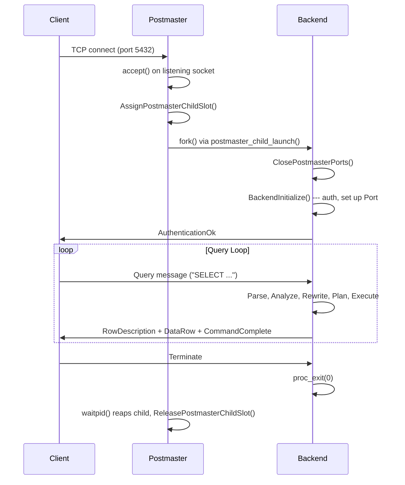
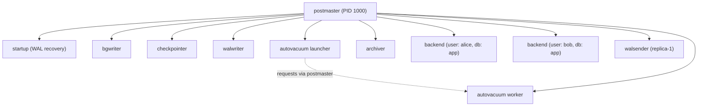

# Process Model

> *PostgreSQL uses one OS process per connection --- no thread pools, no coroutines, just `fork()`.*

## Overview

PostgreSQL follows a classic multi-process architecture. A single long-lived daemon
called the **postmaster** listens for incoming connections and spawns a new child process
for each one. These child processes --- called **backends** --- handle the full lifecycle
of a client session: authentication, SQL parsing, planning, execution, and result
delivery. When the client disconnects, the backend exits.

In addition to client backends, the postmaster also launches several **auxiliary
processes** that perform essential housekeeping: flushing dirty buffers to disk
(bgwriter, checkpointer), writing WAL (walwriter), archiving WAL segments (archiver),
and cleaning up dead tuples (autovacuum launcher and workers). All of these processes
share a single region of shared memory, but the postmaster itself deliberately avoids
touching that shared memory so it can survive backend crashes and orchestrate recovery.

The process-per-connection model has a clear trade-off. It provides robust isolation ---
a crash in one backend does not bring down others --- at the cost of higher memory usage
and connection overhead compared to threaded architectures. This is why connection
poolers like PgBouncer are common in production deployments with hundreds of concurrent
clients.

## Key Source Files

| File | Purpose |
|------|---------|
| `src/backend/postmaster/postmaster.c` | Postmaster main loop: listens, accepts, forks |
| `src/backend/postmaster/launch_backend.c` | `postmaster_child_launch()` --- fork + process setup |
| `src/backend/postmaster/fork_process.c` | Thin wrapper around `fork()` |
| `src/backend/postmaster/pmchild.c` | `PMChild` slot management (assign, release, find by PID) |
| `src/backend/tcop/backend_startup.c` | Backend initialization after fork |
| `src/backend/tcop/postgres.c` | Backend main loop (the "traffic cop") |
| `src/include/postmaster/postmaster.h` | `PMChild` struct, postmaster exports |
| `src/include/libpq/libpq-be.h` | `Port` struct (per-connection state) |
| `src/include/storage/proc.h` | `PGPROC` struct (per-backend shared memory slot) |
| `src/include/miscadmin.h` | `BackendType` enum |

## How It Works

### High Level



1. The postmaster calls `select()` (or `poll()`) on its listening sockets inside
   `ServerLoop()` in `postmaster.c`.
2. On a new connection, it calls `accept()`, allocates a `PMChild` slot via
   `AssignPostmasterChildSlot()`, and calls `postmaster_child_launch()` which
   invokes `fork()`.
3. The child process closes the postmaster's listening sockets
   (`ClosePostmasterPorts()`), initializes its `Port` struct, performs
   authentication, and enters the main query loop in `PostgresMain()`.
4. When the backend exits, the postmaster detects it through `waitpid()` in its
   signal handler and releases the child's `PMChild` slot.

### Deep Dive

#### The Postmaster State Machine

The postmaster tracks the cluster's overall state using a state machine defined in
`postmaster.c`. Key states include:

- **PM_INIT** --- postmaster is starting up
- **PM_STARTUP** --- startup process is running (WAL recovery)
- **PM_RUN** --- normal operations, accepting connections
- **PM_STOP_BACKENDS** --- shutting down, sending signals to backends
- **PM_SHUTDOWN** --- all backends gone, running final checkpoint

When a backend crashes, the postmaster transitions to a recovery state: it sends
`SIGQUIT` to all surviving children, waits for them to exit, resets shared memory
by launching a new startup process, and returns to `PM_RUN`.

#### Backend Types

PostgreSQL classifies child processes using the `BackendType` enum (defined in
`src/include/miscadmin.h`). The postmaster uses this to track which processes are
running and apply type-specific policies (for example, autovacuum workers do not
count against `max_connections`).

| BackendType | Description |
|-------------|-------------|
| `B_BACKEND` | Regular client backend (or walsender before relabeling) |
| `B_AUTOVAC_LAUNCHER` | Autovacuum launcher (singleton) |
| `B_AUTOVAC_WORKER` | Autovacuum worker |
| `B_BG_WORKER` | Background worker (registered via `RegisterBackgroundWorker`) |
| `B_BG_WRITER` | Background writer |
| `B_CHECKPOINTER` | Checkpointer |
| `B_STARTUP` | Startup process (WAL recovery) |
| `B_WAL_RECEIVER` | WAL receiver (standby replication) |
| `B_WAL_SENDER` | WAL sender (primary replication) |
| `B_WAL_WRITER` | WAL writer |
| `B_ARCHIVER` | WAL archiver |

#### How fork() Works on Unix

`postmaster_child_launch()` in `launch_backend.c` calls `fork_process()`, which is
a thin wrapper around `fork()`. After the fork:

- **Parent (postmaster)**: records the new child's PID in the `PMChild` struct and
  continues accepting connections.
- **Child (backend)**: inherits the entire address space, including pointers to shared
  memory. It closes sockets it does not need, sets up its `PGPROC` entry in shared
  memory, and enters its type-specific main function.

On Windows (EXEC_BACKEND mode), `fork()` is not available so PostgreSQL uses
`CreateProcess()` + `exec()`. The child must re-attach to shared memory and
re-initialize global state, which is why EXEC_BACKEND mode is also used for testing
on Unix.

## Key Data Structures

### PMChild (`src/include/postmaster/postmaster.h:40`)

The postmaster's record for each child process.

```c
typedef struct
{
    pid_t       pid;             /* OS process ID of the child */
    int         child_slot;      /* index into PMChildFlags array (0 = dead-end child) */
    BackendType bkend_type;      /* B_BACKEND, B_AUTOVAC_WORKER, etc. */
    struct RegisteredBgWorker *rw; /* bgworker info, if applicable */
    bool        bgworker_notify; /* receives bgworker start/stop notifications */
    dlist_node  elem;            /* link in ActiveChildList */
} PMChild;
```

- `child_slot` is used as an index into the `PMChildFlags[]` array in shared memory,
  which allows backends to advertise their state to the postmaster without signals.
- Dead-end children (launched only to send a rejection message) have `child_slot == 0`.

### Port (`src/include/libpq/libpq-be.h:128`)

Per-connection state, available in every backend as the global `MyProcPort`.

```c
typedef struct Port
{
    pgsocket    sock;            /* client socket file descriptor */
    bool        noblock;         /* is the socket in non-blocking mode? */
    ProtocolVersion proto;       /* FE/BE protocol version */
    SockAddr    laddr;           /* local address (server side) */
    SockAddr    raddr;           /* remote address (client side) */
    char       *remote_host;     /* client hostname or IP */
    char       *remote_hostname; /* resolved hostname, if available */
    char       *remote_port;     /* client port as text */
    char       *database_name;   /* from startup packet */
    char       *user_name;       /* from startup packet */
    char       *cmdline_options; /* from startup packet */
    List       *guc_options;     /* GUC overrides from startup packet */
    HbaLine    *hba;             /* matched pg_hba.conf line */
    /* ... SSL, GSSAPI, keepalive fields omitted for brevity ... */
} Port;
```

### PGPROC (`src/include/storage/proc.h:185`)

Each backend's slot in the shared `ProcArray`. This is how backends discover each
other's transaction state for MVCC visibility checks.

```c
struct PGPROC
{
    dlist_node  links;           /* list link (free list or lock wait queue) */
    PGSemaphore sem;             /* semaphore for sleeping on */
    ProcWaitStatus waitStatus;   /* OK, WAITING, or ERROR */
    Latch       procLatch;       /* generic latch for wakeups */
    TransactionId xid;           /* current top-level transaction ID */
    TransactionId xmin;          /* horizon: oldest xid this backend cares about */
    int         pid;             /* OS process ID (0 for prepared xacts) */
    int         pgxactoff;       /* offset into ProcGlobal mirrored arrays */
    /* ... many more fields ... */
};
```

- `xid` and `xmin` are **mirrored** into dense arrays in `ProcGlobal` for fast
  snapshot computation. Writing these fields requires holding `ProcArrayLock` or
  `XidGenLock`.
- The `procLatch` is used extensively for inter-process signaling without Unix signals.

## Process Tree Diagram



All processes are direct children of the postmaster. The autovacuum launcher requests
new workers by signaling the postmaster (via the `AutoVacuumShmem` structure in shared
memory), but the postmaster is the one that actually forks them.

## Connections

**Depends on:**
- Operating system `fork()` / process management
- Shared memory (initialized by postmaster before any child is launched)

**Used by:**
- Every other subsystem --- the process model is the foundation of all concurrency in
  PostgreSQL

**See also:**
- [Memory Layout](memory-layout) --- how memory is partitioned between processes
- [Query Lifecycle](query-lifecycle) --- what happens inside a backend process
