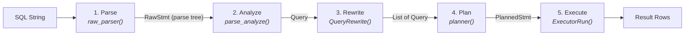
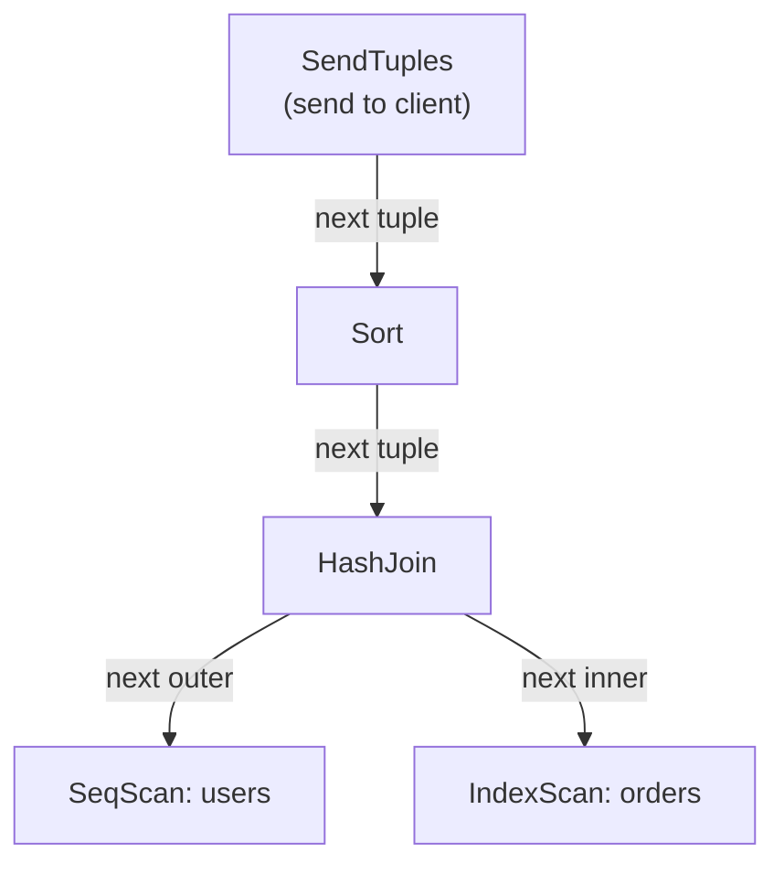

# Query Lifecycle

> *A SQL string travels through five distinct stages --- parse, analyze, rewrite, plan, execute --- each with its own data structure, its own memory context, and its own set of source files.*

## Overview

When a client sends `SELECT name FROM users WHERE id = 42`, the backend process does
not simply "run" it. The query passes through a structured pipeline that transforms a
flat string into a tree of physical operations, executes those operations one tuple at
a time, and streams results back over the wire. Understanding this pipeline is essential
because every performance problem, every planner misestimate, and every strange error
message maps to a specific stage.

The five stages are: **Parse** (SQL text to raw parse tree), **Analyze** (raw tree to
Query with resolved names and types), **Rewrite** (apply rules, including views),
**Plan** (Query to executable Plan tree), and **Execute** (Plan tree to result tuples).
In the simple query protocol, all five stages run in sequence for each statement. In the
extended query protocol (used by most client libraries), parsing and planning can be
separated from execution, enabling prepared statements.

The entire pipeline is orchestrated by the "traffic cop" in `postgres.c`. For a simple
query, the entry point is `exec_simple_query()`. For the extended protocol, there are
separate message handlers: `exec_parse_message()`, `exec_bind_message()`, and
`exec_execute_message()`.

## Key Source Files

| File | Purpose |
|------|---------|
| `src/backend/tcop/postgres.c` | Traffic cop: `PostgresMain()`, `exec_simple_query()` |
| `src/backend/tcop/pquery.c` | Portal execution: `PortalStart()`, `PortalRun()` |
| `src/backend/tcop/utility.c` | Utility command dispatch (DDL, COPY, etc.) |
| `src/backend/parser/parser.c` | `raw_parser()` --- flex/bison entry point |
| `src/backend/parser/analyze.c` | `parse_analyze_fixedparams()` --- semantic analysis |
| `src/backend/parser/gram.y` | The SQL grammar (bison) |
| `src/backend/parser/scan.l` | The SQL lexer (flex) |
| `src/backend/rewrite/rewriteHandler.c` | `QueryRewrite()` --- rule system / view expansion |
| `src/backend/optimizer/plan/planner.c` | `planner()` --- optimizer entry point |
| `src/backend/optimizer/plan/planmain.c` | `query_planner()` --- core path generation |
| `src/backend/optimizer/path/allpaths.c` | `make_one_rel()` --- generate access paths for all relations |
| `src/backend/executor/execMain.c` | `ExecutorStart()`, `ExecutorRun()`, `ExecutorFinish()`, `ExecutorEnd()` |
| `src/backend/executor/execProcnode.c` | `ExecInitNode()`, `ExecProcNode()` --- node dispatch |
| `src/backend/commands/explain.c` | `EXPLAIN` uses the same pipeline but collects stats |

## How It Works

### High Level



### Deep Dive

#### Stage 1: Parse

**Entry point:** `raw_parser()` in `src/backend/parser/parser.c`

The parser is a standard flex/bison combination. The lexer (`scan.l`) tokenizes the SQL
string, and the grammar (`gram.y`) reduces those tokens into a **raw parse tree** --- a
tree of `Node` structs that represents the syntactic structure of the statement.

At this stage, no catalog lookups have occurred. Table names are just strings.
Column references are unresolved. Type information is absent.

**Output:** A `RawStmt` containing a statement-specific node (e.g., `SelectStmt`,
`InsertStmt`, `CreateStmt`).

**Error example:** `ERROR: syntax error at or near "FORM"` --- this comes from the
parser stage.

#### Stage 2: Analyze (Semantic Analysis)

**Entry point:** `parse_analyze_fixedparams()` in `src/backend/parser/analyze.c`

The analyzer transforms the raw parse tree into a **Query** struct by resolving all
names against the system catalogs:

- Table names are resolved to OIDs via `pg_class`
- Column names are resolved to attribute numbers
- Function calls are resolved to `pg_proc` entries (with overload resolution)
- Type coercions are inserted where needed
- Subqueries are recursively analyzed
- `*` is expanded into the actual column list

**Output:** A `Query` struct (`src/include/nodes/parsenodes.h`) with fully resolved
range tables, target lists, and quals.

**Error example:** `ERROR: column "naem" does not exist` --- this comes from the
analyze stage.

#### Stage 3: Rewrite

**Entry point:** `QueryRewrite()` in `src/backend/rewrite/rewriteHandler.c`

The rewriter applies the **rule system**. The most common use of rules is view
expansion: a query against a view is rewritten to a query against the view's
underlying tables. `INSERT`/`UPDATE`/`DELETE` rules (including `INSTEAD OF` triggers
on views) are also applied here.

The rewriter can produce zero, one, or many `Query` structs from a single input.
For example, a `NOTIFY` rule can add extra queries. An `INSTEAD` rule can replace
the original entirely.

**Output:** A `List` of `Query` structs.

#### Stage 4: Plan (Optimize)

**Entry point:** `planner()` in `src/backend/optimizer/plan/planner.c`

The planner (also called the optimizer) transforms a `Query` into an executable
**PlannedStmt**. This is the most computationally expensive stage and involves:

1. **Path generation** (`make_one_rel()` in `allpaths.c`): For each relation,
   generate candidate access paths (sequential scan, index scan, bitmap scan). For
   joins, consider nested loop, hash join, and merge join strategies.

2. **Cost estimation**: Each path is assigned an estimated startup cost and total cost
   based on statistics from `pg_statistic` and table size from `pg_class`.

3. **Path selection**: The cheapest path (or set of paths, considering different sort
   orders) is chosen.

4. **Plan creation** (`create_plan()` in `createplan.c`): The chosen path is converted
   into a tree of `Plan` nodes (e.g., `SeqScan`, `IndexScan`, `HashJoin`, `Sort`,
   `Agg`).

**Output:** A `PlannedStmt` wrapping a tree of `Plan` nodes.

**Key insight:** The planner does not choose "the best plan." It chooses the cheapest
plan it can find within its search budget. For queries with many joins, it switches from
exhaustive search to the Genetic Query Optimizer (GEQO) when the number of relations
exceeds `geqo_threshold` (default: 12).

#### Stage 5: Execute

**Entry point:** `ExecutorStart()`, `ExecutorRun()`, `ExecutorFinish()`, `ExecutorEnd()`
in `src/backend/executor/execMain.c`

The executor uses a **demand-pull (Volcano/iterator) model**. Each plan node implements
three functions: `Init`, `Next` (called `ExecProcNode`), and `End`. The top node
repeatedly calls `ExecProcNode` on its child, which recursively calls its children,
pulling one tuple at a time up through the tree.



The executor interacts with the **buffer manager** to read pages from shared buffers
(or disk), the **lock manager** to acquire row and table locks, and the **WAL subsystem**
to log modifications.

**Portal abstraction:** In practice, the executor does not run directly from the
traffic cop. Instead, each statement is wrapped in a **Portal** (managed in
`src/backend/tcop/pquery.c` and `src/backend/utils/mmgr/portalmem.c`). Portals handle
cursor semantics: a portal can be executed partially (fetching N rows at a time), which
is how `DECLARE CURSOR` / `FETCH` and the extended query protocol work.

### The Simple Query Protocol in Detail

When `exec_simple_query()` runs in `postgres.c`, the sequence is:

```
1. raw_parser(query_string)            --> list of RawStmt
2. for each RawStmt:
   a. parse_analyze_fixedparams(raw)   --> Query
   b. QueryRewrite(query)              --> list of Query
   c. for each Query:
      i.   pg_plan_query(query)        --> PlannedStmt
      ii.  CreatePortal(...)
      iii. PortalStart(portal, ...)
      iv.  PortalRun(portal, ...)      --> sends rows to client
      v.   PortalDrop(portal, ...)
```

Note that a single query string can contain multiple statements (separated by
semicolons), and the rewriter can expand one statement into many. Each resulting
PlannedStmt gets its own portal.

## Key Data Structures

### Query (`src/include/nodes/parsenodes.h`)

The output of the analyze stage. Represents a fully resolved query.

| Field | Type | Description |
|-------|------|-------------|
| `commandType` | `CmdType` | SELECT, INSERT, UPDATE, DELETE, UTILITY |
| `rtable` | `List *` | Range table (list of `RangeTblEntry`) |
| `jointree` | `FromExpr *` | FROM clause and WHERE clause |
| `targetList` | `List *` | Target list (output columns) |
| `sortClause` | `List *` | ORDER BY specification |
| `groupClause` | `List *` | GROUP BY specification |
| `havingQual` | `Node *` | HAVING clause |
| `limitCount` | `Node *` | LIMIT expression |
| `limitOffset` | `Node *` | OFFSET expression |

### PlannedStmt (`src/include/nodes/plannodes.h`)

Wraps a Plan tree for execution.

| Field | Type | Description |
|-------|------|-------------|
| `commandType` | `CmdType` | Same as Query |
| `planTree` | `Plan *` | Root of the plan node tree |
| `rtable` | `List *` | Range table carried forward from Query |
| `paramExecTypes` | `List *` | Types of executor-internal parameters |
| `hasReturning` | `bool` | Has a RETURNING clause |
| `hasModifyingCTE` | `bool` | Has data-modifying CTEs |

### Plan (base node in `src/include/nodes/plannodes.h`)

All plan nodes inherit from this base struct.

| Field | Type | Description |
|-------|------|-------------|
| `type` | `NodeTag` | T_SeqScan, T_IndexScan, T_HashJoin, etc. |
| `startup_cost` | `Cost` | Estimated cost before first tuple |
| `total_cost` | `Cost` | Estimated total cost |
| `plan_rows` | `Cardinality` | Estimated number of output rows |
| `plan_width` | `int` | Estimated average row width in bytes |
| `targetlist` | `List *` | Columns this node produces |
| `qual` | `List *` | Filter conditions applied at this node |
| `lefttree` | `Plan *` | Left (outer) child |
| `righttree` | `Plan *` | Right (inner) child |

## Connections

**Depends on:**
- [Process Model](process-model) --- the query lifecycle runs inside a backend process
- [Memory Layout](memory-layout) --- each stage allocates in different memory contexts
- System catalogs (`pg_class`, `pg_attribute`, `pg_proc`, `pg_statistic`) for name
  resolution and cost estimation

**Used by:**
- `EXPLAIN` / `EXPLAIN ANALYZE` --- runs the same pipeline but instruments it
- Prepared statements --- split the pipeline between `Prepare` (parse + plan) and
  `Execute`
- PL/pgSQL --- calls into the SPI interface, which re-enters the query pipeline

**See also:**
- Chapter 4 (Query Planning) for a deep dive into the optimizer
- Chapter 5 (Executor) for the Volcano model, join strategies, and parallel query
