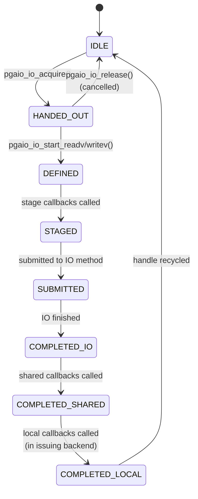
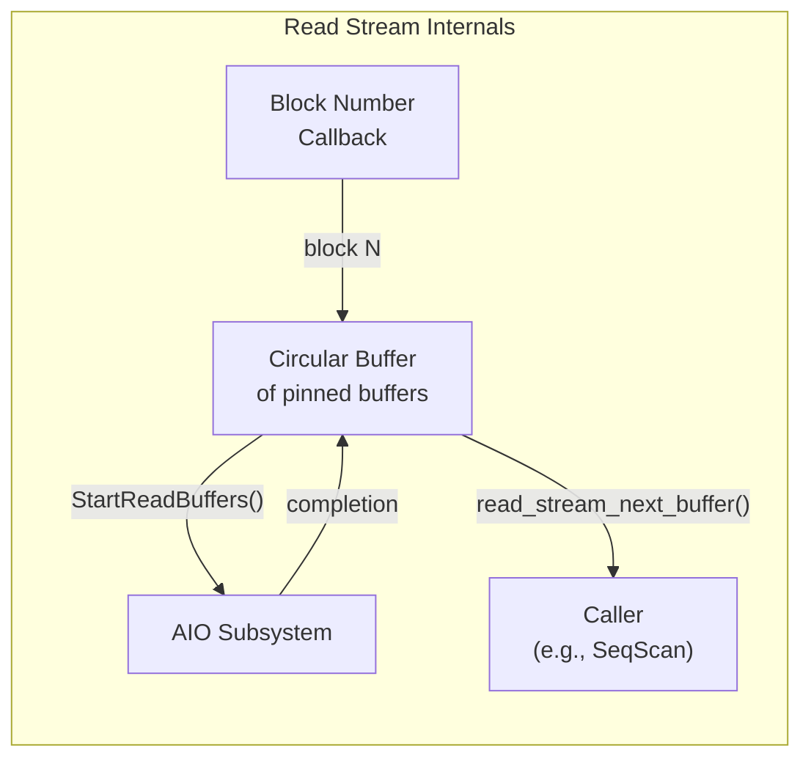

# Asynchronous I/O Framework

PostgreSQL 17+ introduces a native asynchronous I/O (AIO) subsystem that replaces the previous reliance on the operating system's page cache for hiding I/O latency. The framework supports pluggable execution methods (synchronous fallback, worker processes, and io_uring on Linux) and enables the read stream abstraction for look-ahead prefetching.

## Overview

Historically, PostgreSQL performed all I/O synchronously: a backend calling `ReadBuffer()` would block until `pread()` returned. The OS page cache masked much of this latency, but could not help with operations like `fdatasync()` or large sequential scans that outrun the kernel's read-ahead.

The AIO framework introduces:
- **PgAioHandle**: A shared-memory handle representing one in-flight I/O operation.
- **Pluggable methods**: `IOMETHOD_SYNC` (blocking pread/pwrite), `IOMETHOD_WORKER` (background I/O workers), and `IOMETHOD_IO_URING` (Linux kernel io_uring).
- **Completion callbacks**: Registered per-handle callbacks that update buffer descriptors or other state when I/O completes.
- **Read streams**: A higher-level abstraction that automatically prefetches blocks based on a user-provided callback.

The `io_method` GUC selects the execution method. The default is `worker`.

## Key Source Files

| File | Purpose |
|------|---------|
| `src/include/storage/aio.h` | Public AIO API: `pgaio_io_acquire()`, `pgaio_io_start_readv()`, enums for methods/ops/targets |
| `src/include/storage/aio_types.h` | Forward declarations: `PgAioHandle`, `PgAioWaitRef`, `PgAioReturn`, `PgAioResult` |
| `src/include/storage/aio_internal.h` | `PgAioHandle` struct, `PgAioHandleState` enum, internal constants |
| `src/backend/storage/aio/aio.c` | Handle lifecycle: acquire, release, wait, submit |
| `src/backend/storage/aio/aio_io.c` | I/O operation dispatch: `pgaio_io_start_readv()`, `pgaio_io_start_writev()` |
| `src/backend/storage/aio/aio_callback.c` | Callback registration and invocation |
| `src/backend/storage/aio/aio_target.c` | Target abstraction (currently only smgr) |
| `src/backend/storage/aio/aio_init.c` | Shared memory initialization |
| `src/backend/storage/aio/method_sync.c` | Synchronous I/O method (blocking fallback) |
| `src/backend/storage/aio/method_worker.c` | Worker process I/O method |
| `src/backend/storage/aio/method_io_uring.c` | Linux io_uring I/O method |
| `src/backend/storage/aio/read_stream.c` | Read stream: adaptive look-ahead prefetching |
| `src/include/storage/read_stream.h` | Read stream API: `read_stream_begin_relation()`, `read_stream_next_buffer()` |
| `src/backend/storage/aio/README.md` | Comprehensive design document |

## How It Works

### AIO Handle Lifecycle

A `PgAioHandle` moves through a linear state machine:



### PgAioHandle Structure

Defined in `src/include/storage/aio_internal.h`, this struct lives in shared memory:

```c
struct PgAioHandle
{
    uint8            state;         /* PgAioHandleState */
    uint8            target;        /* PgAioTargetID (e.g., PGAIO_TID_SMGR) */
    uint8            op;            /* PgAioOp (READV or WRITEV) */
    uint8            flags;         /* PgAioHandleFlags bitmask */
    uint8            num_callbacks;
    uint8            callbacks[PGAIO_HANDLE_MAX_CALLBACKS];  /* callback IDs */
    uint8            cb_data[PGAIO_HANDLE_MAX_CALLBACKS];    /* per-callback data */
    /* ... owner info, iovec, result, wait reference, handle data ... */
};
```

The struct is kept compact because there is one `PgAioHandle` per in-flight I/O slot in shared memory.

### I/O Methods

| Method | GUC Value | How It Works | Best For |
|--------|-----------|-------------|----------|
| `sync` | `io_method=sync` | Blocking `preadv()`/`pwritev()` in the calling backend | Debugging, platforms without worker support |
| `worker` | `io_method=worker` | I/O is dispatched to a pool of background worker processes | Default; works everywhere |
| `io_uring` | `io_method=io_uring` | Kernel-level async I/O via Linux io_uring | Linux with kernel 5.10+; lowest latency |

The `io_uring` method is only available when compiled with `USE_LIBURING` and not using `EXEC_BACKEND` mode. It submits I/O to a submission queue (SQ) in the kernel, which processes them asynchronously and posts completions to a completion queue (CQ).

### Completion Callbacks

Callbacks are identified by `PgAioHandleCallbackID` rather than function pointers, because handles live in shared memory and function pointers are not stable across `EXEC_BACKEND` processes:

```c
typedef enum PgAioHandleCallbackID
{
    PGAIO_HCB_INVALID = 0,
    PGAIO_HCB_MD_READV,              /* md.c read completion */
    PGAIO_HCB_SHARED_BUFFER_READV,   /* shared buffer read completion */
    PGAIO_HCB_LOCAL_BUFFER_READV,    /* local buffer read completion */
} PgAioHandleCallbackID;
```

Each callback struct provides four hooks:

```c
struct PgAioHandleCallbacks
{
    PgAioHandleCallbackStage    stage;            /* prepare resources before submission */
    PgAioHandleCallbackComplete complete_shared;  /* update shared state after IO */
    PgAioHandleCallbackComplete complete_local;   /* update local state in issuing backend */
    PgAioHandleCallbackReport   report;           /* report errors to the issuing backend */
};
```

The `complete_shared` callback runs in whichever process completes the I/O (could be a worker), so it can only modify shared memory. The `complete_local` callback runs in the original backend and can access process-local state (e.g., local buffer descriptors).

### Batch Mode

For efficiency, multiple I/Os can be batched before submission:

```c
pgaio_enter_batchmode();

/* Acquire and start multiple IOs */
for (int i = 0; i < n; i++)
{
    PgAioHandle *ioh = pgaio_io_acquire(CurrentResourceOwner, &ioret[i]);
    /* configure and start the IO */
    smgrstartreadv(ioh, smgr, forknum, blocknum + i, &pages[i], 1);
}

pgaio_exit_batchmode();  /* submits all staged IOs at once */
```

Batch submission is particularly beneficial for `io_uring`, where the kernel can process multiple requests in a single system call. The maximum batch size is `PGAIO_SUBMIT_BATCH_SIZE = 32`.

Caution: while in batch mode, the calling code must not block on anything that could deadlock with an unsubmitted I/O. If blocking is necessary, call `pgaio_submit_staged()` first.

### PgAioOpData

The operation-specific data for reads and writes:

```c
typedef union
{
    struct {
        int      fd;            /* file descriptor */
        uint16   iov_length;    /* number of iovec entries */
        uint64   offset;        /* byte offset in file */
    } read;

    struct {
        int      fd;
        uint16   iov_length;
        uint64   offset;
    } write;
} PgAioOpData;
```

### Read Streams

The read stream is the primary consumer-facing abstraction built on top of AIO. It provides automatic, adaptive look-ahead prefetching:

```c
/* Create a read stream with a callback that generates block numbers */
ReadStream *stream = read_stream_begin_relation(
    READ_STREAM_DEFAULT,
    strategy,           /* BufferAccessStrategy, e.g., for bulk read ring buffer */
    rel,
    MAIN_FORKNUM,
    my_block_callback,  /* returns the next block number to read */
    callback_data,
    0                   /* per_buffer_data_size */
);

/* Consume buffers one at a time */
Buffer buf;
while ((buf = read_stream_next_buffer(stream, NULL)) != InvalidBuffer)
{
    /* process the page */
    ReleaseBuffer(buf);
}

read_stream_end(stream);
```

The callback function has the signature:

```c
typedef BlockNumber (*ReadStreamBlockNumberCB)(
    ReadStream *stream,
    void *callback_private_data,
    void *per_buffer_data
);
```

It returns `InvalidBlockNumber` to signal end of stream.

**Adaptive look-ahead**: The read stream maintains a circular buffer of pinned pages. It starts with a small look-ahead distance and increases it rapidly when cache misses are detected (I/O is needed), then decreases it gradually when cache hits dominate. This balances prefetching benefit against resource consumption.



Read stream flags control behavior:

| Flag | Value | Meaning |
|------|-------|---------|
| `READ_STREAM_DEFAULT` | 0x00 | Standard tuning with adaptive look-ahead |
| `READ_STREAM_MAINTENANCE` | 0x01 | Use `maintenance_io_concurrency` (for VACUUM, CREATE INDEX) |
| `READ_STREAM_SEQUENTIAL` | 0x02 | Disable sequential detection heuristic |
| `READ_STREAM_FULL` | 0x04 | Skip ramp-up, immediately use maximum look-ahead |
| `READ_STREAM_USE_BATCHING` | 0x08 | Enable AIO batch mode for the callback |

### Integration with Buffer Manager

The AIO framework integrates with the buffer manager through `StartReadBuffers()` and `WaitReadBuffers()`. When a read stream determines that blocks need to be fetched from disk:

1. It calls `StartReadBuffers()` which allocates buffer slots, checks the hash table for hits, and initiates AIO for misses.
2. The `PGAIO_HCB_SHARED_BUFFER_READV` callback updates `BufferDesc` state (sets `BM_VALID`, clears `BM_IO_IN_PROGRESS`) when the I/O completes.
3. Before returning a buffer to the caller, `read_stream_next_buffer()` calls `WaitReadBuffers()` to ensure the I/O has finished.

## Connections

- **Buffer Manager**: AIO completion callbacks update `BufferDesc` state. The read stream is the primary interface between sequential/index scans and the buffer pool.
- **smgr**: `smgrstartreadv()` is the async counterpart to `smgrread()`. It sets up the `PgAioHandle` with the correct file descriptor and offset from `md.c`.
- **Sequential Scans**: Use read streams with `block_range_read_stream_cb` for efficient prefetching.
- **Index Scans**: Bitmap heap scans and index-only scans can use read streams to prefetch heap pages identified by the index.
- **VACUUM**: Uses read streams with `READ_STREAM_MAINTENANCE` flag for efficient scanning of heap pages.
- **WAL**: Future work may extend AIO to asynchronous WAL writes (`fdatasync()` / O_DSYNC), which is especially impactful for commit latency.
- **Direct I/O**: The AIO framework is a prerequisite for direct I/O support (bypassing the kernel page cache), which eliminates double buffering and enables DMA transfers.
