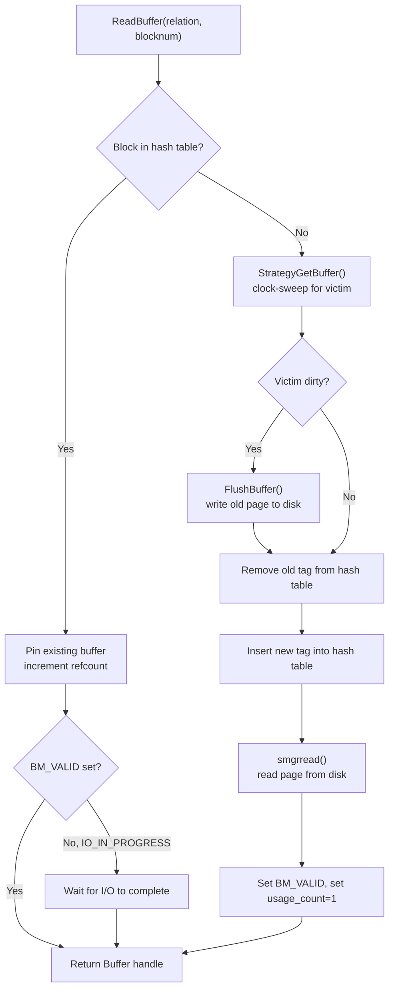
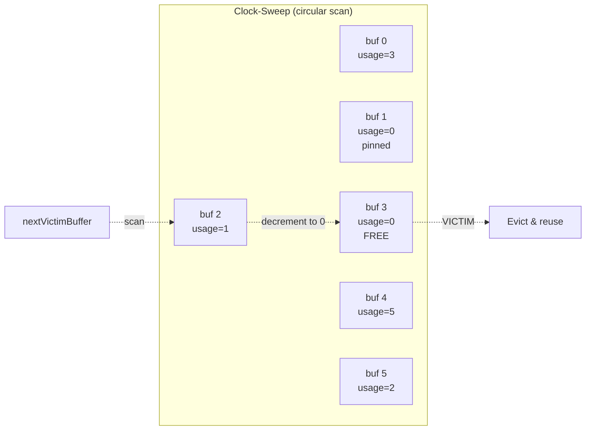

# Buffer Manager

The buffer manager is PostgreSQL's page cache, sitting between access methods and the storage manager. It maintains a pool of shared-memory buffers (sized by `shared_buffers`) and uses a clock-sweep algorithm for eviction. Every page read or written by a backend flows through this layer.

## Overview

The buffer pool is a fixed-size array of 8 KB slots in shared memory. Each slot has a corresponding `BufferDesc` descriptor that tracks the page identity, reference count, usage count, dirty status, and I/O state -- all packed into a single 64-bit atomic variable for lock-free fast-path operations.

Backends interact with the buffer pool through `ReadBuffer()` (which returns a pinned buffer) and `ReleaseBuffer()` (which unpins it). The clock-sweep algorithm approximates LRU replacement by scanning circularly through buffers, decrementing usage counts until it finds a victim with usage count zero and reference count zero.

For bulk operations (sequential scans, VACUUM, bulk writes), PostgreSQL uses **ring buffers** -- small, fixed-size buffer pools that prevent large scans from evicting the entire shared buffer cache.

## Key Source Files

| File | Purpose |
|------|---------|
| `src/include/storage/bufmgr.h` | Public buffer manager API: `ReadBuffer()`, `ReleaseBuffer()`, `MarkBufferDirty()` |
| `src/include/storage/buf_internals.h` | `BufferDesc`, `BufferTag`, state bit definitions, internal functions |
| `src/backend/storage/buffer/bufmgr.c` | Core buffer manager: `ReadBuffer_common()`, `BufferAlloc()`, `FlushBuffer()` |
| `src/backend/storage/buffer/freelist.c` | Clock-sweep eviction (`StrategyGetBuffer()`), ring buffer strategies |
| `src/backend/storage/buffer/buf_table.c` | Shared hash table mapping `BufferTag` to buffer ID |
| `src/backend/storage/buffer/buf_init.c` | Shared memory initialization for buffer descriptors |
| `src/backend/storage/buffer/localbuf.c` | Local (unshared) buffers for temporary tables |
| `src/backend/storage/buffer/README` | Detailed explanation of locking rules and access protocols |

## How It Works

### Buffer Identification: BufferTag

Every buffer slot is identified by a `BufferTag` that uniquely names the on-disk block:

```c
typedef struct buftag
{
    Oid           spcOid;       /* tablespace OID */
    Oid           dbOid;        /* database OID */
    RelFileNumber relNumber;    /* relation file number */
    ForkNumber    forkNum;      /* fork: MAIN_FORKNUM, FSM_FORKNUM, etc. */
    BlockNumber   blockNum;     /* block number within the fork */
} BufferTag;
```

The shared buffer hash table (`buf_table.c`) maps `BufferTag` to a buffer ID. The hash table is partitioned into `NUM_BUFFER_PARTITIONS` (default 128) partitions, each protected by its own LWLock, to reduce contention.

### Buffer Descriptor: BufferDesc

Each of the `NBuffers` slots has a `BufferDesc`, kept under 64 bytes to fit a single cache line:

```c
typedef struct BufferDesc
{
    BufferTag          tag;                   /* which page is stored here */
    int                buf_id;                /* index in BufferDescriptors (0-based) */
    pg_atomic_uint64   state;                 /* atomic: refcount + usagecount + flags + locks */
    int                wait_backend_pgprocno; /* backend waiting for sole pin */
    PgAioWaitRef       io_wref;               /* set while async I/O is in progress */
    proclist_head      lock_waiters;          /* list of PGPROCs waiting for content lock */
} BufferDesc;
```

The 64-bit `state` field packs multiple sub-fields to allow lock-free atomic operations:

```
 Bits  0-17  (18 bits): reference count (pin count)
 Bits 18-21  ( 4 bits): usage count (0..BM_MAX_USAGE_COUNT=5)
 Bits 22-33  (12 bits): flag bits (BM_DIRTY, BM_VALID, BM_TAG_VALID, BM_IO_IN_PROGRESS, etc.)
 Bits 34-53  (20 bits): shared lock + share-exclusive lock + exclusive lock
```

Key flag bits:

| Flag | Bit | Meaning |
|------|-----|---------|
| `BM_DIRTY` | 1 | Page has been modified since last write |
| `BM_VALID` | 2 | Buffer contains a valid page |
| `BM_TAG_VALID` | 3 | Tag is assigned (buffer is in the hash table) |
| `BM_IO_IN_PROGRESS` | 4 | Read or write I/O is currently happening |
| `BM_CHECKPOINT_NEEDED` | 8 | Must be written during current checkpoint |
| `BM_PERMANENT` | 9 | Relation is permanent (not unlogged) |

### ReadBuffer Flow



### Clock-Sweep Eviction

The clock-sweep algorithm in `StrategyGetBuffer()` (`freelist.c`) works as follows:

1. A global `nextVictimBuffer` pointer rotates through the buffer array.
2. For each buffer examined:
   - If `refcount > 0`: skip (buffer is pinned).
   - If `usage_count > 0`: decrement usage count, skip.
   - If `refcount == 0 && usage_count == 0`: this is the victim.
3. The maximum usage count is `BM_MAX_USAGE_COUNT = 5`, so a recently-used buffer survives at most 6 complete passes of the clock hand.

This approximates LRU with O(1) amortized cost per eviction. The tradeoff is that with a large `shared_buffers`, a full scan of the clock hand can be expensive -- but this is rare because most buffers have low usage counts.



### Ring Buffers (BufferAccessStrategy)

Large sequential operations can push the entire working set out of the buffer cache. To prevent this, PostgreSQL uses **ring buffers** -- a private, fixed-size ring of buffer slots that the operation cycles through:

| Strategy | Ring Size | Used By |
|----------|-----------|---------|
| `BAS_BULKREAD` | 256 KB (32 buffers) | Sequential scans of large tables |
| `BAS_BULKWRITE` | 16 MB (2048 buffers) | COPY, CREATE TABLE AS, bulk inserts |
| `BAS_VACUUM` | 256 KB (32 buffers) | VACUUM |

When a ring buffer strategy is active, `StrategyGetBuffer()` first tries to reuse a buffer from the ring. If the buffer is still pinned by someone else, it falls back to the global clock-sweep. The `StrategyRejectBuffer()` function ensures that a buffer evicted by the ring is not a heavily-used buffer (usage count > 1), in which case the eviction is rejected and the next ring slot is tried.

### Buffer Content Locks

Access to the data within a buffer is controlled by content locks, implemented directly in the `BufferDesc.state` field (not as separate LWLocks):

- **Shared lock**: Multiple readers can hold shared locks concurrently. Acquired for reading page contents, scanning tuples.
- **Exclusive lock**: Only one writer. Required for inserting tuples, modifying line pointers, updating hint bits that need WAL logging.

Content locks are separate from and orthogonal to buffer pins. A pin prevents the buffer from being evicted; a content lock controls concurrent access to the page data. The rule is: pin first, then lock.

### Buffer Pins and the WAL Protocol

A pinned buffer cannot be evicted, but it can be written to disk by the background writer or checkpointer. Before flushing a dirty buffer, the system checks `pd_lsn` on the page and ensures WAL has been flushed at least that far. This enforces the fundamental WAL rule: *log before data*.

The sequence for modifying a page:
1. `ReadBuffer()` -- pin the buffer.
2. `LockBuffer(buf, BUFFER_LOCK_EXCLUSIVE)` -- exclusive content lock.
3. `START_CRIT_SECTION()` -- no errors allowed from here.
4. Modify the page data.
5. `MarkBufferDirty()` -- set `BM_DIRTY`.
6. `XLogInsert()` -- write WAL record; this sets `pd_lsn` on the page.
7. `END_CRIT_SECTION()`.
8. `UnlockBuffer()` and eventually `ReleaseBuffer()`.

### Local Buffers

Temporary tables (created with `CREATE TEMP TABLE`) use **local buffers** that are private to the backend process. These bypass all shared-memory locking and are not WAL-logged. Local buffers are managed in `localbuf.c` and use a simpler allocation strategy since there is no concurrency.

## Key Data Structures Summary

| Struct | Header | Key Fields |
|--------|--------|------------|
| `BufferTag` | `buf_internals.h` | `spcOid`, `dbOid`, `relNumber`, `forkNum`, `blockNum` |
| `BufferDesc` | `buf_internals.h` | `tag`, `buf_id`, `state` (atomic: refcount + usagecount + flags + locks) |
| `BufferDescPadded` | `buf_internals.h` | Union padded to 64 bytes for cache-line alignment |
| `WritebackContext` | `buf_internals.h` | Coalesces pending OS writeback requests |

## Connections

- **Page Layout**: The buffer manager delivers raw 8 KB pages. It enforces `pd_lsn` for WAL ordering but is otherwise page-format-agnostic.
- **Storage Manager (smgr)**: On cache miss, the buffer manager calls `smgrread()` / `smgrstartreadv()`. On eviction of dirty buffers, it calls `smgrwrite()`.
- **WAL**: `MarkBufferDirty()` + `XLogInsert()` cooperate to ensure crash safety. The background writer and checkpointer flush dirty buffers in LSN order.
- **Async I/O**: The new AIO framework provides `StartReadBuffers()` for batched, asynchronous page reads, used by the read stream layer.
- **Checkpointer**: Periodically scans for buffers with `BM_CHECKPOINT_NEEDED` set and flushes them, advancing the redo point.
