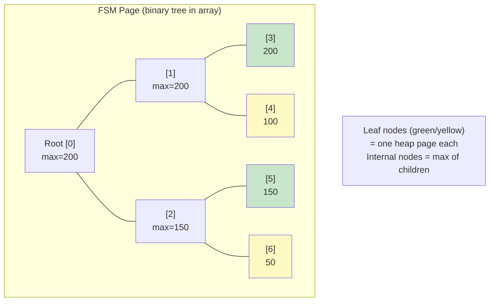
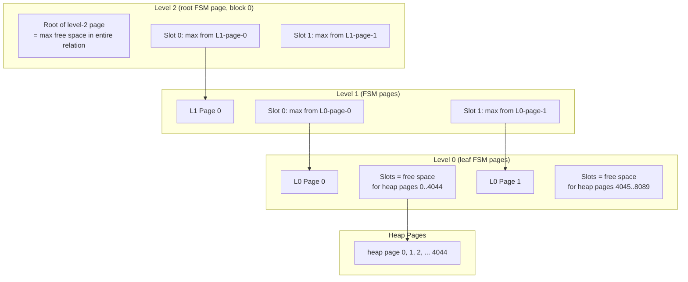

# Free Space Map

The Free Space Map (FSM) is a per-relation data structure that tracks the amount of free space available on each heap page. It enables INSERT to quickly find a page with enough room for a new tuple, without scanning the entire relation.

## Overview

Each relation's FSM is stored in a dedicated fork (`FSM_FORKNUM`, file suffix `_fsm`). Rather than recording exact byte counts, the FSM stores free space at a granularity of `BLCKSZ / 256` (32 bytes with the default 8 KB page size), using a single byte per heap page. A value of 255 means nearly a full page is free; 0 means the page is full.

The FSM is organized as a **three-level tree of pages**, where each FSM page internally contains a **binary tree** (max-heap) of byte values. This design allows finding a page with sufficient free space in O(log N) time, where N is the number of heap pages.

The FSM is not WAL-logged. It is a hint structure that self-corrects: if it is lost or corrupted, the worst case is temporarily suboptimal page selection. VACUUM rebuilds it from scratch.

## Key Source Files

| File | Purpose |
|------|---------|
| `src/include/storage/freespace.h` | Public API: `GetPageWithFreeSpace()`, `RecordPageWithFreeSpace()` |
| `src/include/storage/fsm_internals.h` | `FSMPageData` struct, per-page binary tree constants |
| `src/backend/storage/freespace/freespace.c` | Higher-level FSM logic: tree traversal across pages |
| `src/backend/storage/freespace/fsmpage.c` | Within-page binary tree operations: `fsm_search_avail()`, `fsm_set_avail()` |
| `src/backend/storage/freespace/indexfsm.c` | Simplified FSM interface for index free space |
| `src/backend/storage/freespace/README` | Comprehensive design document for the FSM |

## How It Works

### Space Encoding

Free space is encoded as a single byte using integer division:

```
stored_value = free_bytes / (BLCKSZ / 256)
             = free_bytes / 32          (for BLCKSZ = 8192)
```

This means the FSM can distinguish free space in 32-byte increments. When searching for space to hold a tuple of size S bytes, the search value is:

```
search_value = (S + 31) / 32           (rounding up)
```

### Within-Page Binary Tree

Each FSM page contains a binary tree stored as an array in `FSMPageData`:

```c
typedef struct
{
    int     fp_next_slot;                       /* round-robin starting slot */
    uint8   fp_nodes[FLEXIBLE_ARRAY_MEMBER];    /* binary tree array */
} FSMPageData;
```

The tree has two regions in `fp_nodes[]`:
- Indices `0` to `NonLeafNodesPerPage - 1`: internal (non-leaf) nodes storing the maximum value of their children.
- Indices `NonLeafNodesPerPage` to `NodesPerPage - 1`: leaf nodes, each representing one heap page.

With default `BLCKSZ = 8192`:

| Constant | Value | Formula |
|----------|-------|---------|
| `NodesPerPage` | ~8140 | `BLCKSZ - MAXALIGN(SizeOfPageHeaderData) - offsetof(FSMPageData, fp_nodes)` |
| `NonLeafNodesPerPage` | 4095 | `BLCKSZ / 2 - 1` |
| `LeafNodesPerPage` | ~4045 | `NodesPerPage - NonLeafNodesPerPage` |
| `SlotsPerFSMPage` | ~4045 | Same as `LeafNodesPerPage` |

The binary tree is not quite perfect because the page header consumes some space, so a few rightmost leaf nodes are missing.



**Search** (`fsm_search_avail`): Starting from the root, descend to a leaf where `value >= minvalue`. When both children qualify, use `fp_next_slot` to alternate, spreading concurrent inserts across different pages.

**Update** (`fsm_set_avail`): Set a leaf's value, then bubble up by recomputing each ancestor as `max(left_child, right_child)` until reaching the root or finding no change.

### Three-Level Tree of Pages

A single FSM page with ~4045 slots can track ~4045 heap pages (~31 MB). To support PostgreSQL's maximum relation size of 2^32 blocks (~32 TB), the FSM uses a three-level tree of pages:

| Level | Contains | Represents |
|-------|----------|------------|
| 0 (leaf) | Leaf values = free space on individual heap pages | ~4045 heap pages per FSM page |
| 1 | Leaf values = root values from level-0 pages | ~4045 level-0 pages |
| 2 (root) | Leaf values = root values from level-1 pages | ~4045 level-1 pages |

The root page is always at physical block 0 of the FSM fork. With three levels: `4045^3 > 66 billion > 2^32`, so three levels always suffice.



The physical block number for a given `(level, logical_page)` is computed by a formula that counts how many pages at each level precede it:

```
block = n + (n/F + 1) + (n/F^2 + 1) + ... + 1
```

where `F = SlotsPerFSMPage` and `n` is the logical page number at level 0.

### Search Algorithm (Across Pages)

1. Start at the root page (level 2, block 0).
2. Call `fsm_search_avail()` to find a qualifying slot.
3. The slot number identifies a child page at the next lower level.
4. Descend to that child page and repeat.
5. At level 0, the slot number directly identifies a heap page.

Only one FSM page is locked (shared lock) at a time; the parent is released before locking the child. If the child has been concurrently modified and no longer has enough space, the search restarts from the root after correcting the parent's stale value.

### Update Algorithm

When VACUUM (or INSERT after a failed search) learns the actual free space on a heap page:

1. Compute the level-0 FSM page and slot for the heap page.
2. Call `fsm_set_avail()` to update the leaf and bubble up within the page.
3. If the root of the level-0 page changed, propagate to the parent slot on the level-1 page.
4. Continue propagating up to level 2 if needed.

### Recovery and Self-Correction

The FSM is not WAL-logged. Recovery mechanisms:

- **Corruption detection during search**: If a parent node claims space is available but the child disagrees, the child page is rebuilt (`fsm_rebuild_page()`).
- **Corruption detection during update**: After setting a value and bubbling up, if the root is less than the value just set, the page is rebuilt.
- **VACUUM**: Rewrites all level-0 FSM entries with actual free space from heap pages, then calls `FreeSpaceMapVacuumRange()` to propagate upward.
- **RBM_ZERO_ON_ERROR**: FSM pages are read with this flag, so checksum mismatches cause the page to be zeroed rather than raising an error.
- **MarkBufferDirtyHint()**: FSM writes use hint-bit-style dirty marking, which includes full-page images in WAL only when `wal_log_hints` is enabled.

## Connections

- **INSERT**: Calls `GetPageWithFreeSpace()` to find a target page. If no page has enough space, the relation is extended.
- **VACUUM**: Updates FSM entries for every page it processes, reflecting the actual free space after dead tuple removal.
- **Buffer Manager**: FSM pages are read and written through the standard buffer manager, using `FSM_FORKNUM`.
- **smgr**: The FSM fork is a separate file on disk (e.g., `16384_fsm`), managed by the same smgr/md infrastructure.
- **Page Layout**: FSM pages use the standard `PageHeaderData` header, but the content area is the `FSMPageData` binary tree rather than line pointers and tuples.
- **HOT Updates**: When a HOT update frees space on a page, the FSM is updated so future inserts can use that space.
