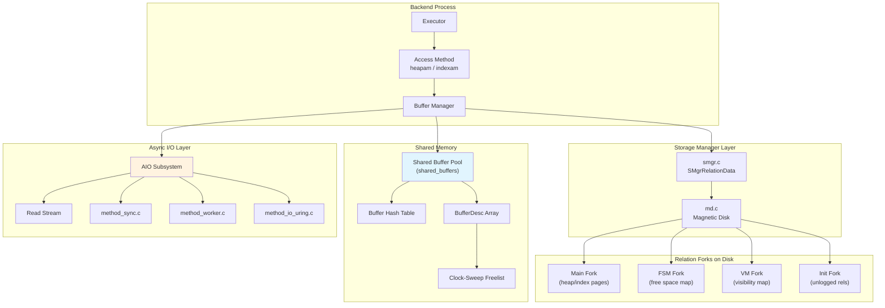

# Chapter 1: Storage Engine

PostgreSQL's storage engine translates logical tables and indexes into physical bytes on disk, managing the full lifecycle of data from write to read through a layered architecture of pages, buffers, and file abstractions.

## Overview

Every relation in PostgreSQL -- whether a heap table, B-tree index, or TOAST table -- is physically stored as a collection of **8 KB pages** in one or more **forks** (main data, free space map, visibility map, init). The **storage manager** (smgr) provides a uniform interface for reading and writing these pages, while the **magnetic disk** (md) layer underneath handles the details of splitting large relations into 1 GB segment files.

Between the on-disk pages and the executor sits the **shared buffer pool**, a fixed-size cache in shared memory. The **buffer manager** uses a clock-sweep eviction algorithm to decide which pages stay resident. Every page modification flows through the buffer pool, and the WAL (write-ahead log) protocol ensures durability: a dirty buffer cannot be flushed to disk until its WAL record has been written.

Two auxiliary per-relation structures accelerate common operations:
- The **Free Space Map** (FSM) tracks available space in each heap page so that INSERT can quickly find room without scanning.
- The **Visibility Map** (VM) tracks which pages contain only tuples visible to all transactions, enabling VACUUM to skip clean pages and enabling **index-only scans** to avoid heap fetches entirely.

PostgreSQL 17+ introduces an **asynchronous I/O** (AIO) framework with pluggable methods (synchronous fallback, worker processes, and io_uring on Linux). The **read stream** abstraction builds on AIO to provide look-ahead prefetching for sequential and index scans.

## Architecture Diagram

## Key Source Files

| Component | Header | Implementation | README |
|-----------|--------|----------------|--------|
| Page Layout | `src/include/storage/bufpage.h` | `src/backend/storage/page/bufpage.c` | `src/backend/storage/page/README` |
| Item Pointers | `src/include/storage/itemid.h` | -- | -- |
| Heap Tuple Header | `src/include/access/htup_details.h` | -- | -- |
| Buffer Manager | `src/include/storage/bufmgr.h` | `src/backend/storage/buffer/bufmgr.c` | `src/backend/storage/buffer/README` |
| Buffer Internals | `src/include/storage/buf_internals.h` | `src/backend/storage/buffer/freelist.c` | -- |
| Storage Manager | `src/include/storage/smgr.h` | `src/backend/storage/smgr/smgr.c` | `src/backend/storage/smgr/README` |
| Magnetic Disk | `src/include/storage/md.h` | `src/backend/storage/smgr/md.c` | -- |
| Fork Numbers | `src/include/common/relpath.h` | `src/common/relpath.c` | -- |
| Free Space Map | `src/include/storage/fsm_internals.h` | `src/backend/storage/freespace/freespace.c` | `src/backend/storage/freespace/README` |
| Visibility Map | `src/include/access/visibilitymap.h` | `src/backend/access/heap/visibilitymap.c` | -- |
| AIO Framework | `src/include/storage/aio.h` | `src/backend/storage/aio/aio.c` | `src/backend/storage/aio/README.md` |
| Read Streams | `src/include/storage/read_stream.h` | `src/backend/storage/aio/read_stream.c` | -- |

## How the Layers Connect

1. **Executor** calls an access method (e.g., `heap_fetch`) which calls `ReadBuffer()`.
2. **Buffer Manager** hashes the `(tablespace, database, relfilenode, fork, block)` tag to check the shared buffer hash table.
3. On a **cache miss**, the buffer manager evicts a victim via clock-sweep, then calls `smgrread()` to load the page from disk.
4. **smgr** dispatches to **md.c**, which translates the block number into a segment file offset and issues a `pread()` (or an async read via the AIO layer).
5. The returned 8 KB page is placed in shared memory, and the backend receives a `Buffer` handle (a small integer index).
6. The access method interprets the page using `PageHeaderData`, `ItemIdData` line pointers, and `HeapTupleHeaderData`.
7. When a tuple is inserted, the **FSM** is consulted to find a page with enough free space. After VACUUM, the **VM** is updated to mark all-visible pages.

## Sections in This Chapter

| Section | Description |
|---------|-------------|
| [Page Layout](page-layout) | The 8 KB page format, line pointers, and tuple headers |
| [Buffer Manager](buffer-manager) | Shared buffer pool, clock-sweep, ring buffers |
| [smgr and Forks](smgr-and-forks) | Storage manager abstraction and relation forks |
| [Free Space Map](freespace-map) | FSM binary tree structure for space tracking |
| [Visibility Map](visibility-map) | VM bits, index-only scans, and VACUUM optimization |
| [Async I/O](aio) | The new AIO framework, io_uring, and read streams |

## Connections to Other Chapters

- **Chapter 2: WAL and Recovery** -- The buffer manager enforces the WAL protocol via `pd_lsn`. Dirty pages cannot be flushed until their WAL records are on disk.
- **Chapter 3: MVCC and Snapshots** -- `HeapTupleHeaderData` fields (`t_xmin`, `t_xmax`, `t_infomask`) drive visibility decisions.
- **Chapter 4: VACUUM** -- VACUUM updates the FSM and VM, and relies on the page layout to identify dead tuples.
- **Chapter 5: Indexes** -- B-tree and other index types use the same page format with a different "special space" trailer.
- **Chapter 6: TOAST** -- Oversized attributes are stored out-of-line, but the TOAST table itself uses the same storage engine.
