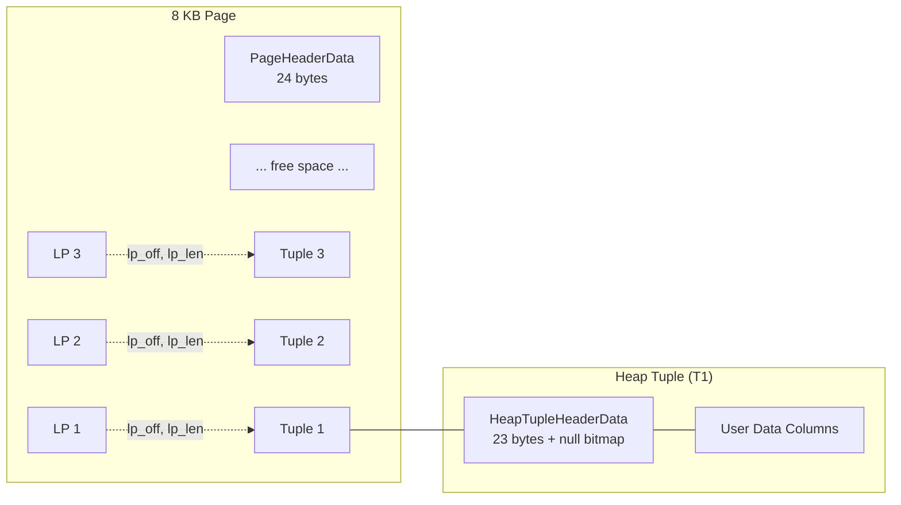

# Page Layout

Every relation in PostgreSQL is stored as an array of fixed-size 8 KB pages (compile-time constant `BLCKSZ`). Each page uses a slotted-page design where a header and an array of line pointers grow forward from the beginning, while tuple data grows backward from the end.

## Overview

The slotted-page design provides a critical level of indirection: external references (e.g., from indexes) point to a *line pointer number* rather than a byte offset, so tuples can be physically rearranged within the page -- for compaction or HOT chain management -- without invalidating any external pointers.

Pages are the universal unit of I/O in PostgreSQL. Heap pages, index pages, FSM pages, and VM pages all share the same `PageHeaderData` header. Access methods differentiate themselves through the "special space" region at the end of the page (e.g., B-tree pages store left/right sibling links there).

## Key Source Files

| File | Purpose |
|------|---------|
| `src/include/storage/bufpage.h` | `PageHeaderData` struct, page access macros and inline functions |
| `src/include/storage/itemid.h` | `ItemIdData` (line pointer) struct and flag definitions |
| `src/include/storage/itemptr.h` | `ItemPointerData` (TID = block number + offset number) |
| `src/include/access/htup_details.h` | `HeapTupleHeaderData`, infomask bits, visibility fields |
| `src/backend/storage/page/bufpage.c` | `PageInit()`, `PageAddItemExtended()`, `PageRepairFragmentation()` |
| `src/backend/storage/page/checksum.c` | Page checksum computation |

## How It Works

### Physical Page Layout

A page is divided into five regions. The header and line pointers grow downward (toward higher offsets), while tuples are allocated from the end of the page growing upward (toward lower offsets). Free space sits in the middle.


The key invariant is: `SizeOfPageHeaderData <= pd_lower <= pd_upper <= pd_special <= BLCKSZ`.

### Page Header: PageHeaderData

Defined in `src/include/storage/bufpage.h`:

```c
typedef struct PageHeaderData
{
    PageXLogRecPtr pd_lsn;          /* LSN of last WAL record that modified this page */
    uint16         pd_checksum;     /* page checksum (if data checksums enabled) */
    uint16         pd_flags;        /* flag bits: PD_HAS_FREE_LINES, PD_PAGE_FULL, PD_ALL_VISIBLE */
    LocationIndex  pd_lower;        /* byte offset to start of free space */
    LocationIndex  pd_upper;        /* byte offset to end of free space */
    LocationIndex  pd_special;      /* byte offset to start of special space */
    uint16         pd_pagesize_version; /* page size and layout version packed together */
    TransactionId  pd_prune_xid;    /* oldest prunable XID (hint for heap pruning) */
    ItemIdData     pd_linp[FLEXIBLE_ARRAY_MEMBER]; /* line pointer array */
} PageHeaderData;
```

The total fixed header size (excluding `pd_linp`) is 24 bytes (`SizeOfPageHeaderData`).

**Field details:**

| Field | Size | Description |
|-------|------|-------------|
| `pd_lsn` | 8 bytes | WAL LSN; the buffer manager will not flush this page until WAL has been flushed past this LSN |
| `pd_checksum` | 2 bytes | FNV-1a based checksum; zero does not mean "no checksum" -- it is a valid checksum value |
| `pd_flags` | 2 bytes | Bit flags: `PD_HAS_FREE_LINES` (0x0001), `PD_PAGE_FULL` (0x0002), `PD_ALL_VISIBLE` (0x0004) |
| `pd_lower` | 2 bytes | Offset to first free byte (end of line pointer array) |
| `pd_upper` | 2 bytes | Offset to last free byte + 1 (start of newest tuple) |
| `pd_special` | 2 bytes | Offset to start of special/opaque area; equals `BLCKSZ` for heap pages |
| `pd_pagesize_version` | 2 bytes | High byte = page size / 256, low byte = layout version (currently 4) |
| `pd_prune_xid` | 4 bytes | Hint: oldest XID among potentially prunable tuples |

### Line Pointers: ItemIdData

Each line pointer is a 4-byte packed structure defined in `src/include/storage/itemid.h`:

```c
typedef struct ItemIdData
{
    unsigned    lp_off:15,      /* byte offset to tuple from start of page */
                lp_flags:2,     /* state of this line pointer */
                lp_len:15;      /* byte length of referenced tuple */
} ItemIdData;
```

**Line pointer states (`lp_flags`):**

| Value | Name | Meaning |
|-------|------|---------|
| 0 | `LP_UNUSED` | Available for reuse. `lp_len` = 0. |
| 1 | `LP_NORMAL` | Points to a live tuple. `lp_len` > 0. |
| 2 | `LP_REDIRECT` | HOT redirect; `lp_off` holds the offset number (not byte offset) of the target. `lp_len` = 0. |
| 3 | `LP_DEAD` | Dead, pending cleanup by VACUUM. May or may not still have storage. |

The 15-bit `lp_off` and `lp_len` fields limit the maximum page size to 32 KB.

### Tuple Identification: ItemPointerData (TID)

An `ItemPointerData` (commonly called a TID or CTID) is 6 bytes and uniquely identifies a tuple within a table:

```c
typedef struct ItemPointerData
{
    BlockIdData ip_blkid;       /* 4 bytes: physical block number */
    OffsetNumber ip_posid;      /* 2 bytes: line pointer index (1-based) */
} ItemPointerData;
```

Index entries store TIDs to point back to heap tuples. HOT chains use `LP_REDIRECT` line pointers so that the index TID remains stable even as the tuple is updated within the same page.

### Heap Tuple Header: HeapTupleHeaderData

Every heap tuple begins with a 23-byte header, defined in `src/include/access/htup_details.h`:

```c
struct HeapTupleHeaderData
{
    union
    {
        HeapTupleFields t_heap;     /* xmin, xmax, cid/xvac for on-disk tuples */
        DatumTupleFields t_datum;   /* length, typmod, typeid for in-memory datums */
    } t_choice;

    ItemPointerData t_ctid;         /* TID of this tuple, or of its newer version */

    uint16      t_infomask2;        /* attribute count + flags (HOT updated, etc.) */
    uint16      t_infomask;         /* visibility flags (XMIN_COMMITTED, etc.) */
    uint8       t_hoff;             /* offset to user data (header + null bitmap + padding) */

    bits8       t_bits[FLEXIBLE_ARRAY_MEMBER]; /* null bitmap, if HEAP_HASNULL */

    /* actual user data follows at offset t_hoff */
};
```

The `HeapTupleFields` within `t_choice` carry the MVCC information:

```c
typedef struct HeapTupleFields
{
    TransactionId t_xmin;       /* inserting transaction ID */
    TransactionId t_xmax;       /* deleting or locking transaction ID */
    union
    {
        CommandId     t_cid;    /* inserting/deleting command ID */
        TransactionId t_xvac;  /* XID for old-style VACUUM FULL */
    } t_field3;
} HeapTupleFields;
```

### Putting It All Together



### Page Operations

**PageInit**: Zeros the page and sets `pd_lower = SizeOfPageHeaderData`, `pd_upper = pd_special = pageSize - specialSize`, and packs `pd_pagesize_version`.

**PageAddItemExtended**: Adds a tuple to the page by:
1. Finding a free line pointer (reusing `LP_UNUSED` slots if `PD_HAS_FREE_LINES` is set, or allocating a new one by advancing `pd_lower`).
2. Copying the tuple data at `pd_upper - MAXALIGN(size)` and decrementing `pd_upper`.
3. Setting the line pointer's `lp_off`, `lp_len`, and `lp_flags = LP_NORMAL`.

**PageRepairFragmentation**: Compacts tuple data by moving all tuples toward the end of the page, closing any gaps left by deleted tuples, and updating line pointers accordingly. Free space becomes contiguous between `pd_lower` and `pd_upper`.

### Page Checksums

When data checksums are enabled (`initdb --data-checksums`), every page gets a checksum computed just before it is written to disk. The algorithm is an FNV-1a variant optimized for the 8 KB block size. The checksum is stored in `pd_checksum` and verified on every read. A checksum of zero is a valid value -- there is intentionally no "checksum not set" sentinel, to avoid relying on page contents to decide whether to verify.

## Connections

- **Buffer Manager** (next section): Pages enter and leave shared memory through the buffer manager. The `pd_lsn` field enforces the WAL-before-data rule.
- **VACUUM**: Uses line pointer states (`LP_DEAD`, `LP_REDIRECT`, `LP_UNUSED`) to track tuple lifecycle. `pd_prune_xid` hints when pruning might be useful.
- **HOT Updates**: When an UPDATE changes only non-indexed columns and the new tuple fits on the same page, the old line pointer becomes `LP_REDIRECT` pointing to the new line pointer. This avoids creating a new index entry.
- **Index Access Methods**: B-tree, GiST, GIN, etc. all use the same `PageHeaderData` and line pointer array. Their per-page metadata lives in the special space region (`pd_special` to end of page).
- **TOAST**: Oversized attributes are replaced with a TOAST pointer in the tuple. The out-of-line data lives in a separate TOAST relation that uses the same page format.
