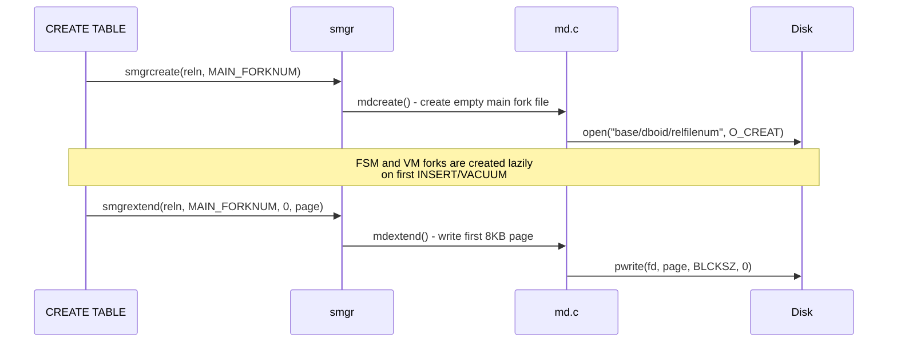

# Storage Manager and Relation Forks

The storage manager (smgr) is PostgreSQL's abstraction layer between the buffer manager and the operating system's file system. It provides a uniform interface for reading and writing blocks of any relation fork, while the magnetic disk (md) layer underneath handles the physical details of segment files.

## Overview

Every relation in PostgreSQL consists of up to four **forks** -- separate physical files that store different kinds of data. The `ForkNumber` enum identifies each:

| Fork | Number | Suffix | Purpose |
|------|--------|--------|---------|
| `MAIN_FORKNUM` | 0 | (none) | Heap tuples or index entries |
| `FSM_FORKNUM` | 1 | `_fsm` | Free space map |
| `VISIBILITYMAP_FORKNUM` | 2 | `_vm` | Visibility map |
| `INIT_FORKNUM` | 3 | `_init` | Init fork for unlogged relations |

On disk, a relation with OID 16384 in tablespace `pg_default` appears as files like:

```
$PGDATA/base/<dboid>/16384        # main fork
$PGDATA/base/<dboid>/16384_fsm    # free space map fork
$PGDATA/base/<dboid>/16384_vm     # visibility map fork
```

When a fork exceeds 1 GB, it is split into segments: `16384`, `16384.1`, `16384.2`, and so on.

## Key Source Files

| File | Purpose |
|------|---------|
| `src/include/storage/smgr.h` | `SMgrRelationData` struct, smgr public API |
| `src/backend/storage/smgr/smgr.c` | SMgrRelation hash table, dispatch to md.c |
| `src/include/storage/md.h` | Magnetic disk API declarations |
| `src/backend/storage/smgr/md.c` | Segment file management, `mdreadv()`, `mdwritev()`, `mdextend()` |
| `src/include/common/relpath.h` | `ForkNumber` enum, `RelFileNumber` type, file naming |
| `src/common/relpath.c` | `forkNames[]` array, path construction helpers |
| `src/backend/storage/smgr/bulk_write.c` | Bulk write interface for efficient relation creation |
| `src/backend/storage/smgr/README` | Design notes on the storage manager |

## How It Works

### SMgrRelationData

The central data structure is `SMgrRelationData`, a cached file handle stored in a process-local hash table keyed by `RelFileLocatorBackend`:

```c
typedef struct SMgrRelationData
{
    RelFileLocatorBackend smgr_rlocator;    /* (spcOid, dbOid, relNumber, backend) */

    BlockNumber smgr_targblock;              /* current insertion target block */
    BlockNumber smgr_cached_nblocks[MAX_FORKNUM + 1]; /* cached fork sizes */

    int         smgr_which;                  /* storage manager selector (always 0 = md) */

    /* md.c per-fork state */
    int              md_num_open_segs[MAX_FORKNUM + 1];
    struct _MdfdVec *md_seg_fds[MAX_FORKNUM + 1];

    /* pinning support */
    int         pincount;
    dlist_node  node;                        /* list link when unpinned */
} SMgrRelationData;
```

Key points:
- `smgropen()` creates or finds the `SMgrRelationData` in the hash table. It does not open any files; file descriptors are opened lazily on first I/O.
- `smgrpin()` / `smgrunpin()` prevent the entry from being destroyed while the relcache holds a pointer to it.
- `smgrdestroy()` drops the hash table entry and closes any open file descriptors.
- Unpinned entries are destroyed at end of transaction by `AtEOXact_SMgr()`.

### The smgr API

The buffer manager and access methods call smgr through a clean interface:

```c
/* Read nblocks starting at blocknum into buffers[] */
void smgrreadv(SMgrRelation reln, ForkNumber forknum,
               BlockNumber blocknum, void **buffers, BlockNumber nblocks);

/* Write nblocks starting at blocknum from buffers[] */
void smgrwritev(SMgrRelation reln, ForkNumber forknum,
                BlockNumber blocknum, const void **buffers,
                BlockNumber nblocks, bool skipFsync);

/* Async read: hand off to AIO subsystem */
void smgrstartreadv(PgAioHandle *ioh, SMgrRelation reln, ForkNumber forknum,
                    BlockNumber blocknum, void **buffers, BlockNumber nblocks);

/* Extend the fork by one block */
void smgrextend(SMgrRelation reln, ForkNumber forknum,
                BlockNumber blocknum, const void *buffer, bool skipFsync);

/* Get current size of a fork in blocks */
BlockNumber smgrnblocks(SMgrRelation reln, ForkNumber forknum);

/* Truncate a fork to nblocks */
void smgrtruncate(SMgrRelation reln, ForkNumber *forknum, int nforks,
                  BlockNumber *old_nblocks, BlockNumber *nblocks);
```

All functions dispatch to `md.c` through function pointers (historically the smgr supported multiple backends; today only md remains, but the dispatch layer persists).

### Magnetic Disk Layer (md.c)

The md layer translates block-level operations into `pread()`/`pwrite()` calls on segment files:

```
block_number -> segment = block_number / RELSEG_SIZE
                offset  = (block_number % RELSEG_SIZE) * BLCKSZ
```

where `RELSEG_SIZE` = 131072 blocks = 1 GB (with default 8 KB BLCKSZ).

Each open segment is tracked in an `MdfdVec`:

```c
typedef struct _MdfdVec
{
    File    mdfd_vfd;       /* virtual file descriptor (fd.c handle) */
    BlockNumber mdfd_segno; /* segment number (0, 1, 2, ...) */
} MdfdVec;
```

The `md_seg_fds` array in `SMgrRelationData` is a per-fork dynamic array of `MdfdVec` entries. Segments are opened lazily: when a read requests block 200000, md opens segment 1 (blocks 131072-262143) if it is not already open.

### Vectorized I/O

Modern PostgreSQL supports vectorized reads and writes (`smgrreadv` / `smgrwritev`) that can read multiple consecutive blocks in a single system call. The `smgrmaxcombine()` function returns how many blocks can be combined starting from a given block number (limited by segment boundaries and `io_combine_limit`).

### Relation File Locator

A `RelFileLocator` fully identifies where a relation's data lives:

```c
typedef struct RelFileLocator
{
    Oid spcOid;          /* tablespace OID (0 = pg_default) */
    Oid dbOid;           /* database OID (0 = shared catalog) */
    RelFileNumber relNumber; /* file number (usually same as OID, but changes on REINDEX/TRUNCATE) */
} RelFileLocator;
```

Note that `relNumber` is distinct from the relation OID. Operations like `TRUNCATE` and `REINDEX` assign a new `relNumber` to create a fresh set of files, while the relation OID remains stable.

### Fork Lifecycle



The FSM fork is created the first time `RecordAndGetPageWithFreeSpace()` is called (typically during the first INSERT after the first page fills up). The VM fork is created by the first VACUUM that sets visibility bits.

### Init Fork

Unlogged relations have an additional `INIT_FORKNUM` fork. This is an empty copy of the main fork that is used to reset the relation to an empty state after a crash (since unlogged relation data is not WAL-logged and cannot be recovered). On clean startup after a crash, the INIT fork replaces the main fork.

## Connections

- **Buffer Manager**: Calls `smgrread()` on cache miss and `smgrwrite()` to flush dirty buffers. The buffer tag contains exactly the fields needed to construct a `BufferTag` that smgr can resolve.
- **Free Space Map**: Stored as `FSM_FORKNUM`, read and written through the same smgr interface.
- **Visibility Map**: Stored as `VISIBILITYMAP_FORKNUM`.
- **WAL**: `smgrwrite()` is called with `skipFsync=true` during normal operation because fsync is deferred to checkpoint time. `smgrimmedsync()` forces an immediate fsync (used during relation creation).
- **Async I/O**: `smgrstartreadv()` hands off a read to the AIO subsystem instead of blocking. The md layer's `mdstartreadv()` sets the file descriptor and offset on the `PgAioHandle`.
- **TOAST**: TOAST relations are separate relations with their own `RelFileLocator` and their own set of forks.
