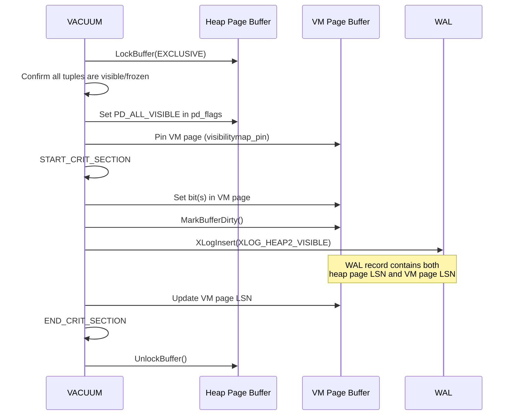
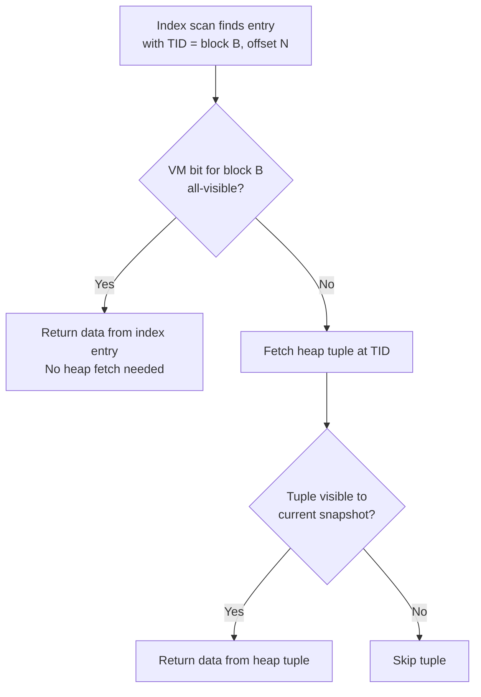

# Visibility Map

The Visibility Map (VM) is a per-relation bitmap that tracks two properties for each heap page: whether all tuples on the page are visible to all transactions (all-visible), and whether all tuples are completely frozen (all-frozen). These bits enable two major optimizations: VACUUM can skip clean pages, and index-only scans can avoid heap fetches.

## Overview

The VM is stored in a dedicated fork (`VISIBILITYMAP_FORKNUM`, file suffix `_vm`). It uses **2 bits per heap page**: one for all-visible and one for all-frozen. A single VM page (8 KB minus the standard page header) can therefore track:

```
MAPSIZE = BLCKSZ - MAXALIGN(SizeOfPageHeaderData)
        = 8192 - 24 = 8168 bytes (approximately)

HEAPBLOCKS_PER_PAGE = MAPSIZE * (8 bits / 2 bits per block)
                    = 8168 * 4
                    = 32672 heap pages per VM page
```

This means a single 8 KB VM page covers about 256 MB of heap data (`32672 * 8 KB`).

The VM is **conservative**: a set bit guarantees the property holds, but a clear bit means nothing -- the page might still be all-visible, we just have not confirmed it. Clearing bits is cheap and safe; setting bits requires holding a buffer lock on the heap page and writing WAL.

## Key Source Files

| File | Purpose |
|------|---------|
| `src/include/access/visibilitymap.h` | Public API: `visibilitymap_set()`, `visibilitymap_get_status()`, `visibilitymap_count()` |
| `src/backend/access/heap/visibilitymap.c` | All VM implementation: bit manipulation, locking protocol, WAL logging |
| `src/include/storage/bufpage.h` | `PD_ALL_VISIBLE` flag in `PageHeaderData.pd_flags` |

## How It Works

### Bit Layout

Each heap page has two bits in the VM:

| Bit | Name | Meaning |
|-----|------|---------|
| Bit 0 | `VISIBILITYMAP_ALL_VISIBLE` | All tuples on the page are visible to every snapshot |
| Bit 1 | `VISIBILITYMAP_ALL_FROZEN` | All tuples on the page are completely frozen (xmin committed and old enough) |

The all-frozen bit is only set when all-visible is also set. The bits are packed consecutively:

```
Byte N:  [page3_frozen, page3_visible, page2_frozen, page2_visible,
          page1_frozen, page1_visible, page0_frozen, page0_visible]
```

Mapping formulas from `visibilitymap.c`:

```c
#define HEAPBLK_TO_MAPBLOCK(x)  ((x) / HEAPBLOCKS_PER_PAGE)
#define HEAPBLK_TO_MAPBYTE(x)   (((x) % HEAPBLOCKS_PER_PAGE) / HEAPBLOCKS_PER_BYTE)
#define HEAPBLK_TO_OFFSET(x)    (((x) % HEAPBLOCKS_PER_BYTE) * BITS_PER_HEAPBLOCK)
```

### Setting Bits (VACUUM)

Setting a VM bit is the more complex operation because it must be crash-safe:



The WAL record is essential because of a race condition: if the VM page reaches disk before the heap page, and a crash occurs, recovery must be able to re-set the VM bit. The WAL record for `XLOG_HEAP2_VISIBLE` contains the information needed to do this.

### Clearing Bits (heapam)

Clearing bits is simpler and does **not** require WAL logging. When any modification makes a page no longer all-visible (INSERT, UPDATE, DELETE, or setting hint bits on a tuple that was not previously committed):

1. Check `PD_ALL_VISIBLE` flag on the heap page.
2. If set, clear `PD_ALL_VISIBLE` on the heap page.
3. Call `visibilitymap_clear()` to clear both bits in the VM.

This is safe without WAL because clearing a bit is always correct -- it might cause extra work (VACUUM revisiting the page, index scan doing a heap fetch) but never causes incorrect results.

### Index-Only Scans

The VM's most impactful optimization is enabling **index-only scans**. When an index contains all columns needed by a query, PostgreSQL can return results directly from the index without fetching heap tuples -- but only if it can confirm the tuples are visible.

The index-only scan algorithm:



This optimization is transformative for read-heavy workloads on tables that are mostly static. If 99% of pages are all-visible, an index-only scan avoids 99% of heap I/O.

The `pg_stat_user_tables.idx_tup_fetch` counter (index tuples that required a heap fetch) versus `pg_stat_user_indexes.idx_tup_read` (index tuples scanned) reveals how effective the VM is for index-only scans.

### VACUUM Skip Optimization

When VACUUM scans a relation, it checks the VM before processing each page:

- **All-visible and all-frozen**: Skip entirely. No dead tuples possible, and no freezing needed.
- **All-visible but not all-frozen**: Skip dead tuple removal, but may need to freeze old tuples (during aggressive/anti-wraparound VACUUM).
- **Neither bit set**: Full processing -- check for dead tuples, update FSM, potentially set VM bits after cleanup.

This is why VACUUM on a mostly-clean table is fast: it only has to process the pages that have been modified since the last VACUUM.

### Relation Between PD_ALL_VISIBLE and VM Bit

There are two representations of "all-visible":
1. `PD_ALL_VISIBLE` in `pd_flags` on the heap page itself.
2. The all-visible bit in the VM.

These are set together by VACUUM, but cleared separately. The heap page flag is the authoritative source; the VM bit is derived from it. When a modification clears `PD_ALL_VISIBLE` on the heap page, it also clears the VM bit. But if only the VM bit were lost (e.g., VM page corruption), the system would still operate correctly -- just with reduced performance until VACUUM re-sets the bits.

## Key Data Structures

The VM does not have its own dedicated struct. It uses:

| Structure | Header | Role in VM |
|-----------|--------|------------|
| `PageHeaderData` | `bufpage.h` | Standard page header for VM pages; content area is the raw bitmap |
| `pd_flags` | `bufpage.h` | `PD_ALL_VISIBLE` (0x0004) on heap pages mirrors the VM all-visible bit |

The VM page content is simply a raw byte array (no `FSMPageData`-style wrapper). The content starts at `MAXALIGN(SizeOfPageHeaderData)` and extends to the end of the page.

## Connections

- **VACUUM**: The primary writer of VM bits. Lazy VACUUM sets all-visible; aggressive VACUUM sets all-frozen. The skip optimization depends entirely on the VM.
- **Index-Only Scans**: Consult `visibilitymap_get_status()` to decide whether a heap fetch is needed.
- **Page Layout**: `PD_ALL_VISIBLE` in `pd_flags` is the page-level mirror of the VM bit. It must be kept in sync.
- **smgr and Forks**: The VM is fork number 2 (`VISIBILITYMAP_FORKNUM`), stored as `<relfilenum>_vm` on disk.
- **WAL**: Setting VM bits is WAL-logged (`XLOG_HEAP2_VISIBLE`) for crash safety. Clearing is not WAL-logged.
- **Free Space Map**: The FSM and VM are complementary per-relation metadata forks. VACUUM updates both during its scan.
- **Autovacuum**: Monitors table modification counts to trigger VACUUM, which in turn maintains the VM. Tables with aggressive insert/update patterns will have fewer all-visible pages.
