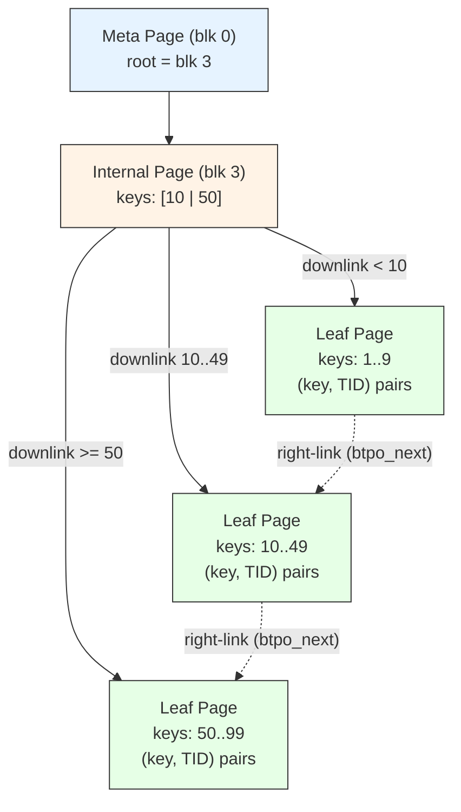

# B-tree Index

## Summary

The B-tree is PostgreSQL's default and most widely used index type. It
implements a **Lehman-Yao style B+tree** with right-links on every page,
enabling concurrent reads and writes without holding locks on the entire tree.
Since PostgreSQL 13, **deduplication** compresses entries with duplicate keys
into posting lists, dramatically reducing index size for low-cardinality
columns.

---

## Key Source Files

| File | Purpose |
|------|---------|
| `src/backend/access/nbtree/nbtree.c` | Entry points: `bthandler()`, `btbuild()`, `btinsert()`, `btgettuple()` |
| `src/backend/access/nbtree/nbtsearch.c` | `_bt_search()` -- descend tree, `_bt_first()` / `_bt_next()` |
| `src/backend/access/nbtree/nbtinsert.c` | `_bt_doinsert()` -- find position, lock, insert, split if needed |
| `src/backend/access/nbtree/nbtsplitloc.c` | `_bt_findsplitloc()` -- optimal split point selection |
| `src/backend/access/nbtree/nbtdedup.c` | `_bt_dedup_one_page()` -- posting list deduplication |
| `src/backend/access/nbtree/nbtpage.c` | Page-level operations, page initialization, deletion |
| `src/backend/access/nbtree/nbtsort.c` | Bottom-up bulk loading for `CREATE INDEX` |
| `src/backend/access/nbtree/nbtreadpage.c` | `_bt_readpage()` -- scan a leaf page and collect matching tuples |
| `src/backend/access/nbtree/nbtpreprocesskeys.c` | Scan key preprocessing and array key handling |
| `src/backend/access/nbtree/nbtutils.c` | Comparison, scan key management, kill-tuple optimization |
| `src/backend/access/nbtree/nbtvalidate.c` | Operator class validation |
| `src/backend/access/nbtree/nbtcompare.c` | Built-in type comparators |
| `src/backend/access/nbtree/README` | Detailed design document |
| `src/include/access/nbtree.h` | All B-tree data structures and macros |

---

## How It Works

### Tree Structure



```
                    +-----------+
                    | meta page |  (blk 0)
                    | root=3    |
                    +-----+-----+
                          |
                    +-----v-----+
                    | internal   |  (blk 3)
                    | [10 | 50] |
                    +--+--+--+--+
                   /   |      \
          +-------+  +-v----+  +-------+
          | leaf  |->| leaf |->| leaf  |  (right-links ->)
          | 1..9  |  |10..49|  |50..99 |
          +-------+  +------+  +-------+
```

- **Meta page** (block 0): stores the root block number and tree level in
  `BTMetaPageData`.
- **Internal pages**: contain `(key, downlink)` entries. Keys are separator
  keys (not actual data values).
- **Leaf pages**: contain `(key, TID)` entries (or posting lists after dedup).
  Linked left-to-right via `BTPageOpaqueData.btpo_next`.

### Lehman-Yao Concurrency

Standard B-tree algorithms require locking from root to leaf. Lehman and Yao
(1981) added **right-links** and **high keys** to allow lock-coupling with
only one page locked at a time:

1. **Right-link**: Every page has a pointer to its right sibling. If a scan
   lands on a page that has been split, it follows the right-link.
2. **High key**: The first item on every non-rightmost page is the high key --
   the upper bound for keys on that page. If the search key exceeds the high
   key, the scan moves right.
3. **Lock coupling**: Descending the tree, a reader locks one page at a time.
   An inserter holds at most one write lock (on the leaf being modified).

This means readers **never block writers** and writers **never block readers**
(except momentarily on the same page).

### Search Path

```
_bt_first(scan)
  -> _bt_search(key)         // descend from root
       for each level:
         lock page (shared)
         binary search for key
         if key > high key: move right
         follow downlink to child
         unlock parent
  -> _bt_readpage()          // collect matching tuples from leaf
  -> _bt_next(scan)          // follow right-links for range scans
```

### Insert Path

```
_bt_doinsert(rel, itup)
  -> _bt_search(key)              // find correct leaf
  -> _bt_check_unique()           // for unique indexes: check for duplicates
  -> _bt_findinsertloc()          // find exact position on leaf
  -> _bt_insertonpg()             // insert the index tuple
       if page full:
         -> _bt_split()           // split page
              -> _bt_findsplitloc()   // choose split point
              -> create new right page
              -> move half the tuples
              -> insert new high key
              -> _bt_insert_parent()  // insert downlink in parent (may cascade)
```

---

## Page Split Strategy

`_bt_findsplitloc()` in `nbtsplitloc.c` does not simply split at the
midpoint. It considers:

- **Suffix truncation**: Internal separator keys can be truncated to the
  shortest prefix that distinguishes left and right pages. Shorter separators
  mean more entries per internal page and a shallower tree.
- **Fill factor**: Controlled by the `fillfactor` storage parameter (default
  90% for B-trees). Leaf pages are filled to this level, leaving room for
  future inserts.
- **Monotonic insert pattern**: For append-only workloads (e.g., serial
  columns), PostgreSQL detects the "fastpath" pattern and creates right-heavy
  splits, avoiding wasted space.

---

## Deduplication (PostgreSQL 13+)

When multiple index entries share the same key, deduplication merges them into
a **posting list**: a single key value followed by an array of TIDs.

```
Before dedup:        After dedup:
  (42, TID_a)          (42, [TID_a, TID_b, TID_c])
  (42, TID_b)
  (42, TID_c)
```

Dedup is performed lazily by `_bt_dedup_one_page()` when a page is about to
split. This avoids the split entirely if enough space is reclaimed.

Key structures:

```c
// src/include/access/nbtree.h
typedef struct BTDedupInterval
{
    OffsetNumber baseoff;   // offset of the posting list tuple
    uint16       ntuples;   // number of TIDs in the posting list
} BTDedupInterval;

typedef struct BTDedupStateData
{
    // ... tracks intervals, sizes, and maximum posting list size
    int          nintervals;
    BTDedupInterval intervals[MaxIndexTuplesPerPage];
} BTDedupStateData;
```

Deduplication is disabled for:
- Unique indexes (no duplicates expected)
- Indexes using non-default operator classes that lack equality semantics
- Indexes with the `deduplicate_items = off` storage parameter

---

## Key Data Structures

### BTPageOpaqueData

```c
// src/include/access/nbtree.h
typedef struct BTPageOpaqueData
{
    BlockNumber btpo_prev;      // left sibling (or P_NONE)
    BlockNumber btpo_next;      // right sibling (or P_NONE)
    uint32      btpo_level;     // 0 = leaf
    uint16      btpo_flags;     // BTP_LEAF, BTP_ROOT, BTP_DELETED, BTP_META, BTP_HALF_DEAD, BTP_HAS_GARBAGE
} BTPageOpaqueData;
```

### BTMetaPageData

```c
// src/include/access/nbtree.h
typedef struct BTMetaPageData
{
    uint32      btm_magic;
    uint32      btm_version;
    BlockNumber btm_root;           // current root page
    uint32      btm_level;          // tree height
    BlockNumber btm_fastroot;       // "fast root" (skip single-child levels)
    uint32      btm_fastlevel;
    // ... fields for oldest btpo_xact, last vacuum cleanup
} BTMetaPageData;
```

### BTScanOpaqueData

```c
// src/include/access/nbtree.h
typedef struct BTScanOpaqueData
{
    // current position (leaf page, offset, array of matching items)
    BTScanPosData currPos;
    BTScanPosData markPos;       // for mark/restore
    // scan key state
    int           numberOfKeys;
    ScanKey       keyData;
    // array key support
    int           numArrayKeys;
    BTArrayKeyInfo *arrayKeys;
    // ...
} BTScanOpaqueData;
```

---

## Diagram: B-tree Page Layout

```
 Page (8 kB)
 +-----------------------------------------------------+
 | PageHeaderData (24 bytes)                            |
 +-----------------------------------------------------+
 | Special area pointer -> BTPageOpaqueData             |
 +-----------------------------------------------------+
 | Line pointers: lp[1] lp[2] ... lp[N]                |
 +-----------------------------------------------------+
 |                                                      |
 |              Free space                              |
 |                                                      |
 +-----------------------------------------------------+
 | Index tuple N | ... | Index tuple 2 | Index tuple 1  |
 +-----------------------------------------------------+
 | BTPageOpaqueData (16 bytes)                          |
 | btpo_prev | btpo_next | btpo_level | btpo_flags      |
 +-----------------------------------------------------+

 Leaf items: lp[1] = high key (upper bound)
             lp[2..N] = (key, TID) or posting list tuples
```

---

## Kill Tuples Optimization

During an index scan, if the heap fetch determines a tuple is dead (invisible
to all snapshots), the B-tree marks that index entry as "killed" by setting
`LP_DEAD` on the item pointer. Future scans skip killed entries. VACUUM
eventually reclaims them.

This is purely an optimization -- it avoids expensive heap fetches for known-
dead entries. Implemented in `_bt_killitems()` within `nbtutils.c`.

---

## Bulk Loading

`CREATE INDEX` uses `nbtsort.c` to build the B-tree bottom-up:

1. Sort all heap tuples by the index key (using `tuplesort`).
2. Write leaf pages left-to-right, filling each to `fillfactor`.
3. Build internal levels bottom-up.
4. Write the meta page last.

This is far faster than inserting one tuple at a time because it avoids tree
traversal and page splits entirely. Parallel builds partition the sort among
workers.

---

## Connections

- **Heap AM**: B-tree leaf entries contain `ItemPointerData` (TIDs) that point
  into heap pages. HOT updates avoid the need for new B-tree entries.
- **Planner**: B-trees set `amcanorder = true`, enabling `ORDER BY`
  optimization. The planner uses `amcostestimate` (`btcostestimate`) for path
  costing.
- **WAL**: `nbtxlog.c` handles redo for inserts, splits, deletes, and
  deduplication.
- **VACUUM**: `nbtree.c` implements `btvacuumcleanup()` which walks the tree
  removing entries that point to dead heap tuples. Page deletion recycles
  empty pages through a half-dead / deleted lifecycle.
- **Unique Constraints**: B-tree is the only built-in AM that supports
  `amcanunique = true`. Uniqueness is checked in `_bt_check_unique()` during
  insert, using snapshot-based duplicate detection.
