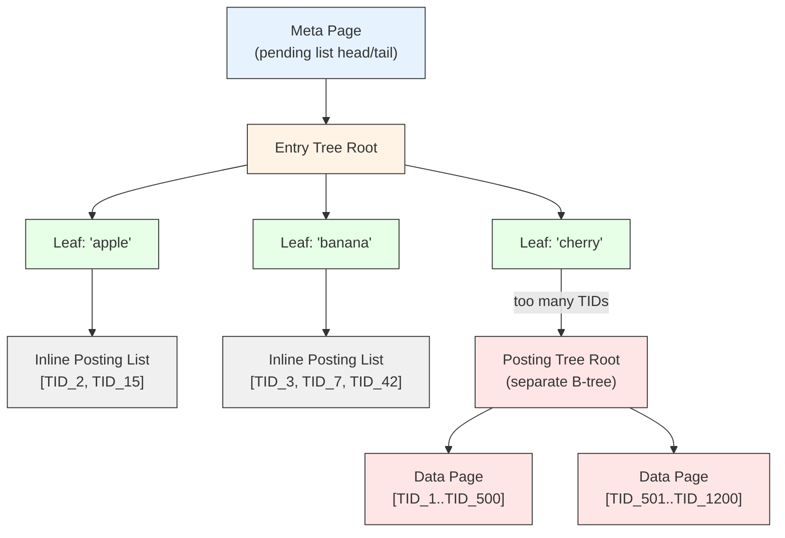

# GIN (Generalized Inverted Index)

## Summary

GIN is an **inverted index** designed for values that contain multiple
elements -- arrays, full-text documents (`tsvector`), JSONB keys. For each
distinct element (key), GIN stores a sorted list of TIDs (a **posting list**)
referencing all heap tuples that contain that element. GIN trades insert speed
for fast multi-element lookups, and its **fast update** buffer amortizes insert
costs over time.

---

## Key Source Files

| File | Purpose |
|------|---------|
| `src/backend/access/gin/gininsert.c` | `gininsert()` -- insert into GIN (or pending list) |
| `src/backend/access/gin/ginfast.c` | Fast update pending list management |
| `src/backend/access/gin/ginget.c` | `gingetbitmap()` -- scan and intersect posting lists |
| `src/backend/access/gin/ginbtree.c` | B-tree operations on the GIN entry tree |
| `src/backend/access/gin/ginentrypage.c` | Entry page (internal tree) management |
| `src/backend/access/gin/gindatapage.c` | Posting tree (data page) management |
| `src/backend/access/gin/ginpostinglist.c` | Varbyte-encoded posting list compression |
| `src/backend/access/gin/ginbulk.c` | Bulk insert accumulator |
| `src/backend/access/gin/ginscan.c` | Scan initialization and key setup |
| `src/backend/access/gin/ginlogic.c` | Consistent function evaluation logic |
| `src/backend/access/gin/ginutil.c` | `ginhandler()`, utilities |
| `src/backend/access/gin/ginvacuum.c` | VACUUM support |
| `src/backend/access/gin/ginxlog.c` | WAL redo |
| `src/backend/access/gin/ginarrayproc.c` | Array opclass support functions |
| `src/backend/access/gin/README` | Design document |
| `src/include/access/gin.h` | `GinStatsData` |
| `src/include/access/ginblock.h` | `GinPageOpaqueData`, `GinMetaPageData`, `PostingItem`, `GinPostingList` |
| `src/include/access/gin_private.h` | `GinState`, `GinBtreeData`, `GinScanKeyData`, `GinScanEntryData` |

---

## How It Works

### Two-Level Structure

GIN has two kinds of B-trees internally:



```
                    +------------------+
                    | Meta page        |
                    | (pending list    |
                    |  head/tail)      |
                    +--------+---------+
                             |
                    +--------v---------+
                    | Entry Tree       |   <-- B-tree of distinct keys
                    | (key1, key2, ..) |       (e.g., lexemes)
                    +--+-----+-----+--+
                       |     |     |
                       v     v     v
                    Posting  Posting  Posting
                    list/    list/    list/
                    tree     tree     tree

  If posting list fits on one page:  stored inline in the entry tuple
  If too large:                      stored as a separate B-tree ("posting tree")
```

1. **Entry tree**: A B-tree whose keys are the distinct indexed elements
   (lexemes, array elements, JSONB keys/values). Each leaf entry either
   contains an inline posting list or a pointer to a posting tree.

2. **Posting list / posting tree**: For each key, the sorted list of TIDs
   referencing heap tuples containing that key. Small lists are stored inline
   (varbyte-compressed). Large lists get their own B-tree of data pages.

### Posting List Compression

`ginpostinglist.c` uses **varbyte encoding** to compress TID lists. Since TIDs
are sorted, only the delta between consecutive TIDs is stored, and each delta
is encoded in a variable number of bytes. This typically achieves 2-3x
compression over raw TID arrays.

```c
// src/include/access/ginblock.h
typedef struct
{
    ItemPointerData first;   // first TID (uncompressed)
    uint16          nbytes;  // size of compressed data
    unsigned char   bytes[FLEXIBLE_ARRAY_MEMBER];  // varbyte-encoded deltas
} GinPostingList;
```

### Fast Update Buffer (Pending List)

Inserting into GIN is expensive because a single heap tuple may contain many
keys (e.g., hundreds of lexemes in a document). Each key requires a B-tree
lookup and potential posting list update.

The **fast update** optimization (`gin_pending_list_limit`, default 4 MB)
defers these inserts:

1. New entries are appended to a **pending list** -- a linked list of heap
   pages stored in the index itself.
2. The pending list is drained (merged into the main entry tree) when:
   - It exceeds `gin_pending_list_limit`.
   - `VACUUM` runs.
   - An explicit `gin_clean_pending_list()` is called.
3. During a scan, GIN checks both the main tree AND the pending list.

Controlled by `fastupdate = on | off` storage parameter.

### Scan Algorithm

```
gingetbitmap(scan)
  -> for each scan key (e.g., 'cat' & 'dog' for ts_query):
       -> look up key in entry tree
       -> retrieve posting list (inline or from posting tree)
       -> scan pending list for additional matches
  -> intersect / union posting lists according to query logic
       (ginlogic.c evaluates consistent / triConsistent)
  -> return TID bitmap
```

GIN always returns a **bitmap** (`amgetbitmap`), never individual tuples
(`amgettuple = NULL`). The executor then does a bitmap heap scan.

---

## Key Data Structures

### GinMetaPageData

```c
// src/include/access/ginblock.h
typedef struct GinMetaPageData
{
    BlockNumber head;              // first page of pending list
    BlockNumber tail;              // last page of pending list
    uint32      tailFreeSize;      // free space on tail page
    int64       nPendingPages;
    int64       nPendingHeapTuples;
    int64       nTotalPages;       // total pages in GIN index
    int64       nEntryPages;       // pages in entry tree
    int64       nDataPages;        // pages in posting trees
    int64       nEntries;          // number of distinct keys
    int32       ginVersion;
} GinMetaPageData;
```

### GinPageOpaqueData

```c
// src/include/access/ginblock.h
typedef struct GinPageOpaqueData
{
    BlockNumber rightlink;    // right sibling
    OffsetNumber maxoff;      // max offset on page
    uint16      flags;        // GIN_DATA, GIN_LEAF, GIN_DELETED, GIN_META,
                              // GIN_LIST, GIN_LIST_PENDING, GIN_COMPRESSED
} GinPageOpaqueData;
```

### GinScanKeyData

```c
// src/include/access/gin_private.h
typedef struct GinScanKeyData
{
    // ... scan key definition
    ScanKey         scanEntry;       // underlying scan key
    GinScanEntry   *scanEntries;     // array of entries to look up
    int             nentries;
    // ... tri-state consistent function, required entries, etc.
    bool          (*triConsistentFn)(GinScanKey key);
} GinScanKeyData;
```

---

## Diagram: GIN Insert Flow

```
  INSERT INTO docs(body) VALUES ('the cat sat on the mat');

  tsvector extraction produces keys: {cat, mat, sat}

  With fastupdate=on:
  +----------+     +----------+     +----------+
  | pending  | --> | pending  | --> | pending  |
  | page 1   |     | page 2   |     | page 3   |
  | (TID,keys)|    | (TID,keys)|    | (TID,keys)|
  +----------+     +----------+     +----------+

  On drain (VACUUM or limit reached):

  Entry tree:          Posting lists:
  +------+
  | cat  | --> [TID_1, TID_47, TID_203]
  +------+
  | mat  | --> [TID_1, TID_88]
  +------+
  | sat  | --> [TID_1, TID_5, TID_12, ...] --> posting tree (if large)
  +------+
```

---

## triConsistent Function

GIN supports a **ternary consistent** function for optimization. Instead of
just true/false, it returns:

- `GIN_TRUE` -- the query definitely matches.
- `GIN_FALSE` -- the query definitely does not match.
- `GIN_MAYBE` -- need to recheck against the heap tuple.

This allows GIN to skip posting lists for keys that cannot affect the outcome,
and to perform partial matching during scan.

---

## Common Use Cases

| Data Type | Operators | Use Case |
|-----------|-----------|----------|
| `tsvector` | `@@` | Full-text search |
| `array` | `@>`, `<@`, `&&`, `=` | Array containment and overlap |
| `jsonb` | `@>`, `?`, `?\|`, `?&` | JSONB key/value existence and containment |
| `hstore` | `@>`, `?`, `?\|`, `?&` | Key-value store queries |

---

## Connections

- **GiST**: For full-text search, GiST uses lossy signatures (smaller index,
  more rechecks). GIN stores exact posting lists (larger index, fewer
  rechecks). Choose based on update frequency vs. query performance needs.
- **Heap AM**: GIN returns TID bitmaps. The executor does bitmap heap scans to
  retrieve actual tuples and apply rechecks.
- **VACUUM**: `ginvacuum.c` removes dead TIDs from posting lists and cleans
  the pending list. Critical for preventing unbounded pending list growth.
- **WAL**: `ginxlog.c` handles redo for entry tree changes, posting list
  updates, pending list operations, and page splits.
