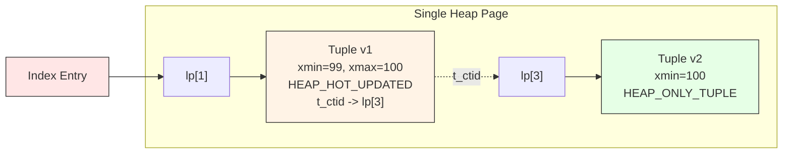

# Heap Access Method

## Summary

The heap is PostgreSQL's default (and currently only built-in) table access
method. It stores tuples in an unordered collection of 8 kB pages. Each tuple
carries MVCC metadata (`xmin`, `xmax`, `cid`, `ctid`) that enables snapshot
isolation without read locks. Two critical optimizations -- **Heap-Only Tuples
(HOT)** and **TOAST** -- address the costs of updates and large values,
respectively.

---

## Key Source Files

| File | Purpose |
|------|---------|
| `src/backend/access/heap/heapam.c` | Core heap operations: insert, delete, update, scan |
| `src/backend/access/heap/heapam_handler.c` | `heap_tableam_handler()` -- wires `TableAmRoutine` callbacks |
| `src/backend/access/heap/heapam_visibility.c` | Snapshot visibility functions (`HeapTupleSatisfiesMVCC`, etc.) |
| `src/backend/access/heap/heaptoast.c` | TOAST storage for oversized attributes |
| `src/backend/access/heap/hio.c` | Heap I/O -- finding free space, extending relations |
| `src/backend/access/heap/pruneheap.c` | Page pruning, dead tuple removal, HOT chain repair |
| `src/backend/access/heap/vacuumlazy.c` | Lazy VACUUM implementation |
| `src/backend/access/heap/visibilitymap.c` | Two bits per page: all-visible, all-frozen |
| `src/backend/access/heap/README.HOT` | Detailed design notes for HOT updates |
| `src/include/access/heapam.h` | `HeapScanDescData`, `HeapTupleFreeze`, `PruneFreezeResult` |
| `src/include/access/htup.h` | `HeapTupleData` -- the in-memory tuple handle |
| `src/include/access/htup_details.h` | `HeapTupleHeaderData`, `HeapTupleFields`, flag bits |
| `src/include/access/hio.h` | `RelationGetBufferForTuple()` prototype |

---

## How It Works

### Page Layout

Every heap page follows the standard PostgreSQL page layout:

```
 0                                                     8192
 +------------------+------+------+-----+--------------+
 | PageHeaderData   | lp1  | lp2  | ... | free space   |
 | (24 bytes)       | (4B) | (4B) |     |              |
 +------------------+------+------+-----+--+-----------+
                                            |
           +--------------------------------+
           v
 +---------+--------+---------+---+--------+
 | tuple N |  ...   | tuple 2 |   | tuple 1|
 +---------+--------+---------+---+--------+
                                           8192
```

- **Line pointers** (`ItemIdData`) grow forward from after the header.
- **Tuples** grow backward from the end of the page.
- `pd_lower` marks the end of line pointers; `pd_upper` marks the start of
  the lowest tuple. Free space is between them.

### Heap Tuple Header

Every on-disk tuple begins with `HeapTupleHeaderData` (23 bytes before
alignment):

```c
// src/include/access/htup_details.h
typedef struct HeapTupleFields
{
    TransactionId t_xmin;   // inserting transaction
    TransactionId t_xmax;   // deleting/locking transaction
    union {
        CommandId   t_cid;  // insert/delete command ID
        TransactionId t_xvac; // old-style VACUUM full xact
    } t_field3;
} HeapTupleFields;
```

Key flags in `t_infomask`:
- `HEAP_XMIN_COMMITTED` / `HEAP_XMIN_INVALID` -- hint bits to skip `pg_xact` lookups
- `HEAP_XMAX_INVALID` -- tuple is live (no deleter)
- `HEAP_HOT_UPDATED` -- this tuple has a HOT successor
- `HEAP_ONLY_TUPLE` -- this tuple is heap-only (not indexed)

### Sequential Scan

`heap_getnextslot()` iterates pages sequentially. For each page:

1. Pin and lock the buffer (`ReadBufferExtended`).
2. Walk line pointers, skip dead/unused items.
3. For each candidate tuple, call `HeapTupleSatisfiesVisibility()`.
4. If visible under the active snapshot, copy into the `TupleTableSlot`.

Synchronized scans (`syncscan.c`) allow concurrent sequential scans on the
same relation to share I/O by starting at similar offsets.

### Insert Path

```
heap_insert()
  -> RelationGetBufferForTuple()   // find page with enough free space (via FSM)
  -> heap_prepare_insert()         // set xmin, infomask, alignment
  -> XLogInsert()                  // write WAL record
  -> PageAddItemExtended()         // copy tuple into page
  -> MarkBufferDirty()
```

### Update Path

`heap_update()` is effectively delete-old + insert-new, with special handling
for HOT. It:

1. Locks the old tuple's buffer.
2. Sets `t_xmax` on the old tuple to the current XID.
3. If HOT is possible, inserts the new version on the **same page** and chains
   via `t_ctid`.
4. Otherwise, inserts on any page (new tuple gets a fresh index entry).

---

## HOT Updates (Heap-Only Tuples)

HOT is the single most important heap optimization. When an UPDATE does not
change any indexed column AND the new tuple fits on the same page:

1. The old tuple gets `HEAP_HOT_UPDATED`.
2. The new tuple gets `HEAP_ONLY_TUPLE` -- it has **no index entry**.
3. `t_ctid` of the old tuple points to the new tuple.



Index scans follow HOT chains: after finding a TID via the index, the heap AM
follows `t_ctid` pointers on the page until it finds the version visible to
the current snapshot.

**Pruning** (`pruneheap.c`) reclaims dead HOT chain members during normal
page access, without requiring VACUUM. This is called **page-level cleanup**
or **micro-vacuum**.

```
HOT chain example (single page):

  Index entry -> lp[1]
                   |
                   v
              tuple v1 (xmax=100, HOT_UPDATED)
              t_ctid -> lp[3]
                          |
                          v
                     tuple v2 (xmin=100, ONLY_TUPLE)

After pruning (if xmax=100 is visible to all):
  lp[1] now redirects to lp[3]  (LP_REDIRECT)
  tuple v1's space is reclaimed
```

---

## TOAST (The Oversized-Attribute Storage Technique)

When a tuple exceeds roughly 2 kB (the TOAST threshold, ~1/4 of a page),
PostgreSQL applies TOAST strategies to the largest variable-length attributes:

| Strategy | `attstorage` | Behavior |
|----------|-------------|----------|
| PLAIN | `p` | No TOAST, value must fit in a page |
| EXTENDED | `x` | Compress first, then store out-of-line if still too big |
| EXTERNAL | `e` | Store out-of-line without compression |
| MAIN | `m` | Compress only; try hard to keep in-line |

Out-of-line values go to a **TOAST table** (`pg_toast.pg_toast_<oid>`), a
regular heap table with a B-tree index on `(chunk_id, chunk_seq)`. The
original attribute is replaced with an 18-byte `varatt_external` pointer.

Key source: `src/backend/access/heap/heaptoast.c` and
`src/include/access/toast_internals.h`.

---

## Key Data Structures

### HeapTupleData

```c
// src/include/access/htup.h
typedef struct HeapTupleData
{
    uint32          t_len;      // length of tuple (incl. header)
    ItemPointerData t_self;     // SelfItemPointer (page, offset)
    Oid             t_tableOid; // table the tuple came from
    HeapTupleHeader t_data;     // pointer to the actual tuple header+data
} HeapTupleData;
```

### HeapScanDescData

```c
// src/include/access/heapam.h
typedef struct HeapScanDescData
{
    TableScanDescData rs_base;        // base class (relation, snapshot, nkeys...)
    // ... fields for controlling read-stream, block ranges,
    //     page-at-a-time mode, and synchronized scan state
} HeapScanDescData;
```

### Visibility Map

`visibilitymap.c` maintains **two bits per heap page** in a side fork:

- **All-visible**: every tuple on the page is visible to all current and future
  snapshots. Index-only scans skip the heap fetch for these pages.
- **All-frozen**: every tuple is fully frozen. VACUUM can skip these pages
  entirely during anti-wraparound freezing.

---

## Visibility Check Flow

```
HeapTupleSatisfiesMVCC(tuple, snapshot)
  |
  +-- Is xmin committed?
  |     No  -> Is xmin the current txn? (check cid)
  |     Yes -> Is xmax set and committed?
  |              No  -> VISIBLE
  |              Yes -> Was xmax committed before snapshot?
  |                       Yes -> INVISIBLE (deleted)
  |                       No  -> VISIBLE (delete not yet visible)
  +-- Set hint bits if outcome is definitive
```

---

## Vacuum and Freezing

**Lazy VACUUM** (`vacuumlazy.c`) performs two phases:

1. **Scan phase**: Walk the heap. Identify dead tuples (not visible to any
   running transaction). Record their TIDs in a `TidStore`.
2. **Index vacuum phase**: For each index on the table, call `ambulkdelete()`
   to remove index entries pointing to dead TIDs.
3. **Heap vacuum phase**: Set dead line pointers to `LP_UNUSED`, update the FSM.

**Freezing** replaces old `xmin`/`xmax` values with `FrozenTransactionId` to
prevent XID wraparound. The `HeapTupleFreeze` struct describes the freeze plan
for each tuple.

---

## Connections

- **Buffer Manager**: Every heap page access goes through `ReadBuffer()` /
  `ReleaseBuffer()`. The FSM and VM are also buffer-managed fork files.
- **WAL**: `heapam_xlog.c` defines redo routines for all heap modifications.
  Critical for crash recovery.
- **Index AMs**: Indexes store `(key, TID)` pairs. The TID points into the
  heap. HOT is specifically designed to reduce index maintenance costs.
- **VACUUM**: Coordinates between the heap AM (finding dead tuples) and index
  AMs (removing stale entries).
- **Table AM API**: `heapam_handler.c` registers all the callbacks that make
  the heap the default `TableAmRoutine`.
