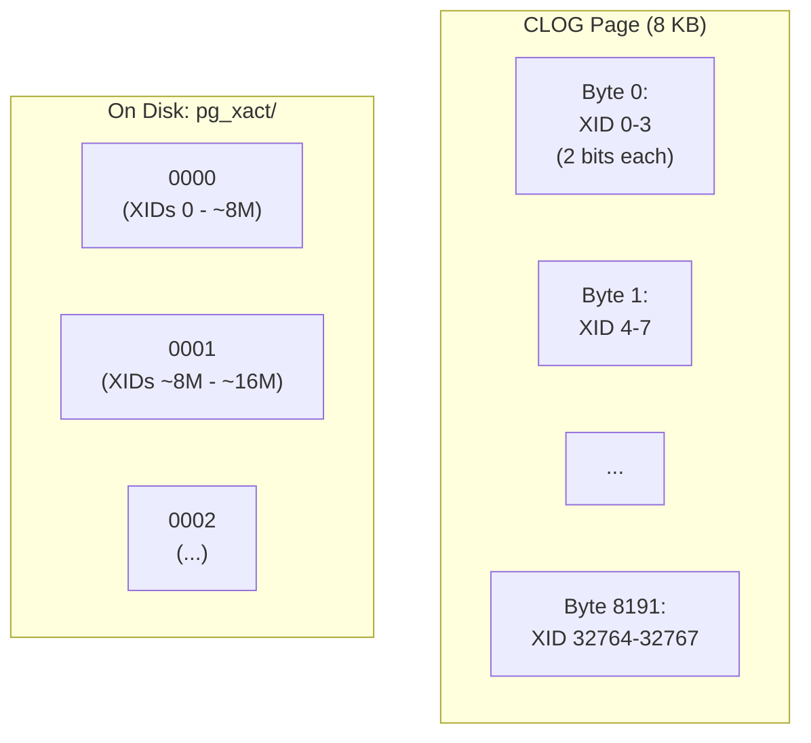
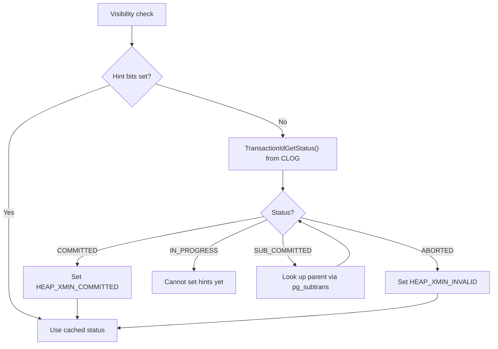
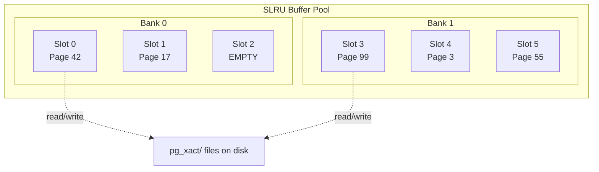

# CLOG and Subtransactions

The Commit Log (CLOG, stored in `pg_xact/`) records the final status of every transaction: in-progress, committed, aborted, or sub-committed. The subtransaction log (`pg_subtrans/`) maps each subtransaction to its parent. Both are implemented using the SLRU (Simple LRU) buffered access mechanism.

## Key Source Files

| File | Purpose |
|------|---------|
| `src/backend/access/transam/clog.c` | CLOG read/write implementation |
| `src/include/access/clog.h` | Transaction status constants, API |
| `src/backend/access/transam/subtrans.c` | Subtransaction parent mapping |
| `src/include/access/subtrans.h` | SubTransSetParent(), SubTransGetTopmostTransaction() |
| `src/backend/access/transam/slru.c` | SLRU buffer management framework |
| `src/include/access/slru.h` | SlruSharedData, page status enum |

## CLOG: The Commit Log

### Transaction Status Values

Each transaction gets a 2-bit status in the CLOG:

```c
#define TRANSACTION_STATUS_IN_PROGRESS      0x00
#define TRANSACTION_STATUS_COMMITTED        0x01
#define TRANSACTION_STATUS_ABORTED          0x02
#define TRANSACTION_STATUS_SUB_COMMITTED    0x03
```

The `SUB_COMMITTED` status is special: it means a subtransaction has committed locally, but its parent transaction has not yet committed. The subtransaction's effects only become visible when the top-level transaction commits.

### Physical Layout

With 2 bits per transaction, each 8 KB CLOG page holds status for **32,768 transactions** (8192 bytes x 4 statuses per byte). Pages are stored as files in `pg_xact/` (historically `pg_clog/`), named as zero-padded hex segment numbers (e.g., `0000`, `0001`).



### CLOG Operations

**Writing**: When a transaction commits, `TransactionIdSetTreeStatus()` sets the status for the top-level XID and all its subtransaction XIDs atomically (from CLOG's perspective). Subtransactions are set to `COMMITTED`, and the top-level transaction is set last. The order matters for crash safety -- if the system crashes after setting subtransactions but before setting the parent, the parent defaults to `IN_PROGRESS` (initial zero state), and recovery treats everything as aborted.

**Reading**: `TransactionIdGetStatus()` reads the 2-bit status for a given XID. This is called during visibility checks when hint bits are not yet set on the tuple.

### Interaction with Hint Bits

The first time a visibility check encounters a tuple without hint bits, it calls `TransactionIdDidCommit()` which reads from CLOG. Once the status is known, hint bits are set on the tuple header, avoiding future CLOG lookups for that tuple:



## Subtransaction Log (pg_subtrans)

### Purpose

The subtransaction log maps each subtransaction XID to its **immediate parent** XID. This allows PostgreSQL to walk up the parent chain to find the top-level transaction for any given XID.

```c
void SubTransSetParent(TransactionId xid, TransactionId parent);
TransactionId SubTransGetParent(TransactionId xid);
TransactionId SubTransGetTopmostTransaction(TransactionId xid);
```

### Physical Layout

Each entry is a 4-byte `TransactionId` (the parent XID). With 8 KB pages, each page holds **2048 entries**. Files are stored in `pg_subtrans/`.

### When It Is Used

Subtransaction parent lookups are needed when:

1. A snapshot's `subxip[]` array has overflowed (`suboverflowed = true`) and a visibility check encounters an XID not in the main `xip[]` array. The check must determine whether the XID is a subtransaction of a known in-progress transaction.

2. The CLOG status is `SUB_COMMITTED` and the system needs to find the top-level transaction to check its commit status.

### PGPROC Subxid Cache

Each backend caches up to `PGPROC_MAX_CACHED_SUBXIDS` (64) subtransaction XIDs in its PGPROC struct:

```c
#define PGPROC_MAX_CACHED_SUBXIDS 64

struct XidCache
{
    TransactionId xids[PGPROC_MAX_CACHED_SUBXIDS];
};
```

When a snapshot is taken, these cached XIDs are copied into the snapshot's `subxip[]` array. If any backend has more than 64 active subtransactions, `suboverflowed` is set, and all backends that take snapshots after that point must be prepared to fall back to `pg_subtrans` lookups.

## SLRU: Simple LRU Buffer

Both CLOG and subtrans are built on the SLRU framework, which provides a simple LRU buffer pool for page-structured data stored on disk.

### SlruSharedData

```c
typedef struct SlruSharedData
{
    int          num_slots;        /* number of buffer slots */
    char       **page_buffer;      /* page data arrays */
    SlruPageStatus *page_status;   /* EMPTY, READ_IN_PROGRESS, VALID, WRITE_IN_PROGRESS */
    bool        *page_dirty;
    int64       *page_number;
    int         *page_lru_count;

    LWLockPadded *buffer_locks;    /* per-buffer I/O locks */
    LWLockPadded *bank_locks;      /* bank-level access locks */

    pg_atomic_uint64 latest_page_number;
} SlruSharedData;
```

### SLRU Page States

| State | Meaning |
|-------|---------|
| `SLRU_PAGE_EMPTY` | Slot not in use |
| `SLRU_PAGE_READ_IN_PROGRESS` | I/O in progress reading page from disk |
| `SLRU_PAGE_VALID` | Page loaded and available |
| `SLRU_PAGE_WRITE_IN_PROGRESS` | Being written to disk |

### Bank-Based LRU

Modern PostgreSQL partitions SLRU slots into banks, each with its own LWLock. This reduces contention compared to the original single-lock design. Victim selection happens within a bank, using per-bank LRU counters.



### SLRU Users in PostgreSQL

| SLRU Instance | Directory | Entry Size | Purpose |
|--------------|-----------|------------|---------|
| CLOG | `pg_xact/` | 2 bits | Transaction commit status |
| Subtrans | `pg_subtrans/` | 4 bytes | Parent XID mapping |
| MultiXact Offsets | `pg_multixact/offsets/` | 4 bytes | MultiXactId to offset |
| MultiXact Members | `pg_multixact/members/` | variable | Members of a MultiXact |
| Commit Timestamp | `pg_commit_ts/` | 12 bytes | Commit timestamps |

## Truncation

CLOG and subtrans pages for XIDs older than the global xmin horizon are no longer needed. PostgreSQL truncates them during VACUUM:

1. `TruncateCLOG(oldestXact)` removes pages for transactions older than `oldestXact`
2. `TruncateSUBTRANS(oldestXact)` does the same for the subtransaction log
3. Truncation is WAL-logged for crash recovery

## WAL Logging

CLOG page creation and truncation are WAL-logged:

```c
#define CLOG_ZEROPAGE  0x00   /* new page initialized to zeros */
#define CLOG_TRUNCATE  0x10   /* old pages removed */
```

However, individual status changes (marking a transaction committed) within an existing page are **not** separately WAL-logged. The commit status is recoverable from the transaction's commit WAL record -- during recovery, PostgreSQL replays commit records and sets the CLOG status accordingly.

## Key Data Structures Summary

| Structure | Location | Role |
|-----------|----------|------|
| `XidStatus` | `clog.h` | 2-bit transaction status (int typedef) |
| `xl_clog_truncate` | `clog.h` | WAL record for CLOG truncation |
| `SlruSharedData` | `slru.h` | Shared-memory SLRU buffer pool |
| `XidCacheStatus` | `proc.h` | Per-backend: count + overflow flag for subxids |
| `XidCache` | `proc.h` | Per-backend: cached subtransaction XIDs |

## Connections

- **MVCC Visibility**: Hint bits are set by reading CLOG, then cached on the tuple to avoid repeated lookups. See [MVCC](mvcc.html).
- **Snapshots**: When `suboverflowed` is true, visibility falls back to `pg_subtrans` lookups. See [Snapshots](snapshots.html).
- **VACUUM**: Truncates old CLOG and subtrans pages. Freezing tuples (setting HEAP_XMIN_FROZEN) eliminates the need for their CLOG entries.
- **WAL**: Transaction commit records drive CLOG state during recovery. See Chapter 5 (WAL).
