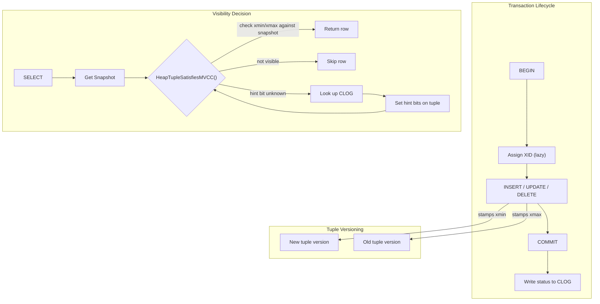

# Chapter 3: Transactions & MVCC

PostgreSQL implements concurrency control through Multi-Version Concurrency Control (MVCC), a design where readers never block writers and writers never block readers. Rather than locking rows in place, PostgreSQL keeps multiple physical versions of each row and uses visibility rules to determine which version a given transaction can see.

This chapter walks through the full machinery that makes this possible -- from the transaction ID stamped on every tuple, through the snapshot mechanism that decides visibility, to the commit log that records final outcomes.

## Why MVCC Matters

Traditional lock-based concurrency (Strict Two-Phase Locking) forces readers to wait for writers and vice versa. MVCC eliminates this contention at the cost of storing old row versions and periodically cleaning them up (VACUUM). The tradeoff is overwhelmingly positive for read-heavy workloads, which describes most OLTP systems.

## Chapter Overview

| Section | What It Covers |
|---------|---------------|
| [MVCC and Tuple Versioning](mvcc.html) | HeapTupleHeaderData, xmin/xmax, t_infomask hint bits, visibility rules |
| [Snapshots](snapshots.html) | SnapshotData, ProcArray, GetSnapshotData(), xmin horizon |
| [Isolation Levels](isolation-levels.html) | Read Committed vs Repeatable Read vs Serializable behavior |
| [Serializable Snapshot Isolation](ssi.html) | Cahill/Fekete algorithm, predicate locks, rw-conflict detection |
| [CLOG and Subtransactions](clog-and-subtrans.html) | Commit log (pg_xact), subtransaction tracking (pg_subtrans), SLRU buffer |
| [Two-Phase Commit](two-phase-commit.html) | PREPARE TRANSACTION, GlobalTransactionData, crash recovery |

## Key Source Files at a Glance

| File | Purpose |
|------|---------|
| `src/include/access/htup_details.h` | HeapTupleHeaderData, infomask flags |
| `src/include/utils/snapshot.h` | SnapshotData, SnapshotType enum |
| `src/include/storage/proc.h` | PGPROC shared-memory struct |
| `src/include/storage/procarray.h` | GetSnapshotData(), TransactionIdIsInProgress() |
| `src/backend/access/transam/xact.c` | Top-level transaction lifecycle |
| `src/backend/access/transam/clog.c` | Commit log read/write |
| `src/backend/access/transam/subtrans.c` | Subtransaction parent mapping |
| `src/backend/access/transam/twophase.c` | Two-phase commit |
| `src/backend/storage/lmgr/predicate.c` | SSI predicate lock manager |
| `src/backend/access/heap/heapam_visibility.c` | HeapTupleSatisfiesMVCC() and friends |

## How the Pieces Fit Together



## The Transaction ID Space

PostgreSQL uses 32-bit transaction IDs that wrap around. The `FullTransactionId` (64-bit, epoch + xid) prevents ambiguity. All XID comparisons use modular arithmetic defined in `src/include/access/transam.h`:

```c
/* TransactionIdPrecedes -- is id1 logically before id2? */
#define TransactionIdPrecedes(id1, id2) \
    ((int32) ((id1) - (id2)) < 0)
```

This means roughly 2 billion transactions can exist between the oldest active transaction and the newest before wraparound becomes dangerous -- the reason `autovacuum` exists and why `xid wraparound` is a production concern.

## Connections to Other Chapters

- **Chapter 2 (Shared Memory and Process Model)**: The ProcArray lives in shared memory; every backend has a PGPROC slot.
- **Chapter 4 (Buffer Manager)**: Hint bits are written back through the buffer manager, which can cause dirty pages.
- **Chapter 5 (WAL)**: COMMIT is durable only after the WAL record is flushed. CLOG pages are also WAL-logged.
- **Chapter 8 (VACUUM)**: Dead tuple versions (xmax committed, no snapshot can see them) are reclaimed by VACUUM.
