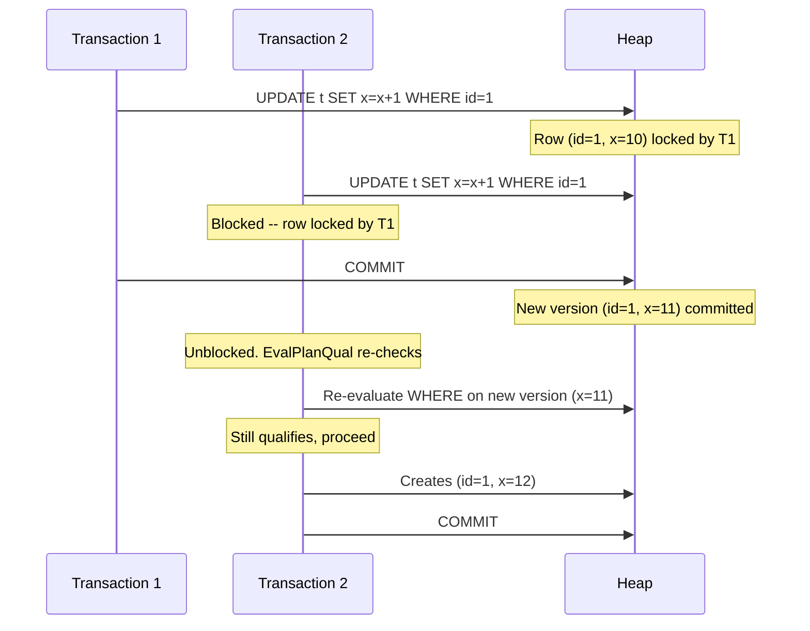
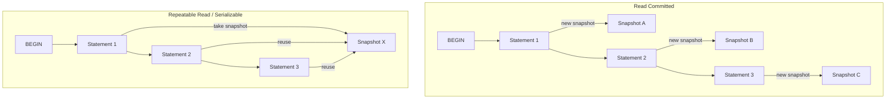

# Isolation Levels

PostgreSQL supports three isolation levels: Read Committed, Repeatable Read, and Serializable. The SQL standard defines a fourth (Read Uncommitted), but PostgreSQL treats it identically to Read Committed -- dirty reads are never allowed under MVCC.

The fundamental difference between the levels is **when snapshots are taken** and **what additional conflict detection** is performed.

## Key Source Files

| File | Purpose |
|------|---------|
| `src/backend/access/transam/xact.c` | `DefaultXactIsoLevel`, `XactIsoLevel` GUC handling |
| `src/backend/utils/time/snapmgr.c` | Snapshot acquisition per isolation level |
| `src/backend/access/heap/heapam_visibility.c` | Visibility checks |
| `src/backend/access/heap/heapam.c` | EvalPlanQual for Read Committed |
| `src/backend/storage/lmgr/predicate.c` | SSI for Serializable |

## Summary of Behavior

| Phenomenon | Read Committed | Repeatable Read | Serializable |
|-----------|---------------|-----------------|--------------|
| Dirty read | Not possible | Not possible | Not possible |
| Non-repeatable read | Possible | Not possible | Not possible |
| Phantom read | Possible | Not possible | Not possible |
| Serialization anomaly | Possible | Possible | Not possible |

## Read Committed (Default)

### Snapshot Strategy

A new snapshot is acquired at the **start of each SQL statement**. This means:

- Two consecutive SELECT statements in the same transaction can return different results if another transaction committed between them.
- The transaction always sees the latest committed state at statement start.

### The EvalPlanQual Mechanism

Read Committed has a special behavior for UPDATE and DELETE: if the target row was modified by a concurrent transaction that committed after the current statement's snapshot was taken, PostgreSQL does not simply skip the row. Instead, it:

1. Waits for the concurrent transaction to commit or abort
2. If it committed, re-evaluates the WHERE clause against the **new version** of the row
3. If the row still qualifies, the operation proceeds on the new version

This is called **EvalPlanQual** (EPQ) and is implemented in `src/backend/executor/execMain.c`. Without it, Read Committed would silently lose updates.



### Read Committed Anomalies

Because each statement sees a fresh snapshot, the following anomalies are possible:

- **Non-repeatable read**: Reading the same row twice in the same transaction can yield different values.
- **Phantom read**: A repeated query can return additional rows that were inserted and committed by another transaction.
- **Write skew**: Two transactions each read a value, make a decision based on it, and write -- but neither sees the other's write.

## Repeatable Read

### Snapshot Strategy

A single snapshot is taken at the **start of the first SQL statement** in the transaction. All subsequent statements reuse this same snapshot. This guarantees a consistent view of the database throughout the transaction.

### Error on Conflict

Unlike Read Committed, Repeatable Read does not use EvalPlanQual to re-evaluate rows. If an UPDATE or DELETE targets a row that was modified by a concurrent committed transaction:

```
ERROR:  could not serialize access due to concurrent update
```

The application must catch this error and retry the transaction. This is the `SQLSTATE 40001` serialization failure.

### What Repeatable Read Prevents

- **Non-repeatable reads**: Impossible because the snapshot never changes.
- **Phantom reads**: Impossible because newly committed rows are invisible to the frozen snapshot.

### What Repeatable Read Does NOT Prevent

- **Serialization anomalies (write skew)**: Two concurrent Repeatable Read transactions can still produce results inconsistent with any serial ordering. The classic example:

```sql
-- Table: doctors(name, on_call boolean)
-- Constraint: at least one doctor must be on call

-- T1 (snapshot sees both Alice and Bob on call):
UPDATE doctors SET on_call = false WHERE name = 'Alice';

-- T2 (snapshot also sees both on call):
UPDATE doctors SET on_call = false WHERE name = 'Bob';

-- Both commit. Nobody is on call. Constraint violated.
```

This is the gap that Serializable isolation fills.

## Serializable

### Snapshot Strategy

Same as Repeatable Read -- a single snapshot taken at the start of the first statement. The difference is that an additional layer of conflict detection (SSI) monitors for dangerous patterns.

### SSI Conflict Detection

Serializable adds **predicate locks** and **rw-conflict tracking** to detect patterns that could produce serialization anomalies. When a dangerous structure is detected, one of the involved transactions is aborted with:

```
ERROR:  could not serialize access due to read/write dependencies among transactions
```

The full SSI algorithm is covered in [Serializable Snapshot Isolation](ssi.html).

## Implementation: How Isolation Level Affects Snapshot Acquisition



In `snapmgr.c`, the logic is approximately:

```c
if (IsolationUsesXactSnapshot())
{
    /* Repeatable Read or Serializable: reuse first snapshot */
    if (FirstSnapshotSet)
        return CurrentSnapshot;  /* already have one */
}
/* Read Committed: always get a fresh snapshot */
return GetSnapshotData(CurrentSnapshot);
```

## The SET TRANSACTION Command

```sql
SET TRANSACTION ISOLATION LEVEL REPEATABLE READ;
-- or
BEGIN TRANSACTION ISOLATION LEVEL SERIALIZABLE;
-- or
SET default_transaction_isolation = 'serializable';
```

The isolation level is stored in `XactIsoLevel` (an integer taking values `XACT_READ_UNCOMMITTED`, `XACT_READ_COMMITTED`, `XACT_REPEATABLE_READ`, or `XACT_SERIALIZABLE` defined in `xact.h`).

## Practical Guidance

| Use Case | Recommended Level |
|----------|------------------|
| General OLTP | Read Committed (default) |
| Reports needing consistent reads | Repeatable Read |
| Financial / integrity-critical | Serializable |
| Bulk ETL / data loading | Read Committed |

Read Committed is the right choice for most applications because it avoids the retry logic needed at higher levels. Serializable is the safest but requires applications to handle `SQLSTATE 40001` retries.

## Key Data Structures

| Symbol | Location | Role |
|--------|----------|------|
| `XactIsoLevel` | `xact.c` | Current transaction's isolation level |
| `XACT_READ_COMMITTED` | `xact.h` | Value 1 |
| `XACT_REPEATABLE_READ` | `xact.h` | Value 2 |
| `XACT_SERIALIZABLE` | `xact.h` | Value 3 |
| `IsolationUsesXactSnapshot()` | `xact.h` | Macro: true if RR or Serializable |
| `IsolationIsSerializable()` | `xact.h` | Macro: true if Serializable |

## Connections

- **Snapshots**: The snapshot acquisition strategy is the primary mechanism differentiating isolation levels. See [Snapshots](snapshots.html).
- **SSI**: Serializable builds on Repeatable Read by adding predicate lock tracking. See [SSI](ssi.html).
- **MVCC**: All levels use the same underlying tuple visibility rules. See [MVCC](mvcc.html).
