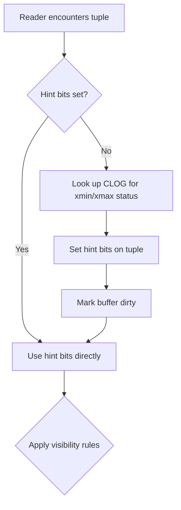
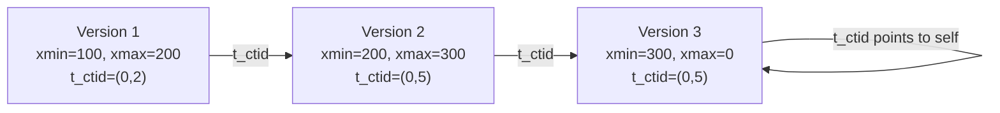
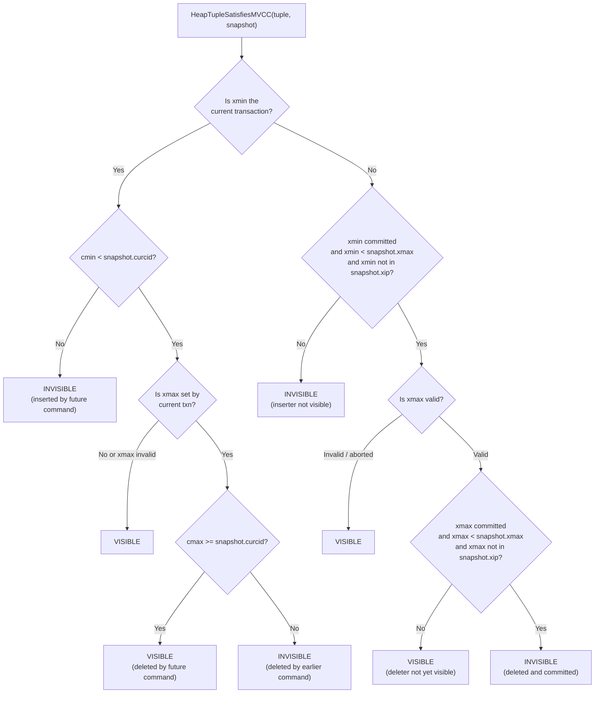

# MVCC and Tuple Versioning

Every heap tuple in PostgreSQL carries its own birth and death certificate. The fields `xmin` and `xmax`, stored directly in the tuple header, record which transaction created the row and which transaction deleted (or updated) it. Combined with a snapshot, these two fields are enough to decide whether a row is visible to any given query.

## Key Source Files

| File | Purpose |
|------|---------|
| `src/include/access/htup_details.h` | HeapTupleHeaderData definition, infomask constants |
| `src/include/access/htup.h` | HeapTupleData wrapper |
| `src/backend/access/heap/heapam_visibility.c` | HeapTupleSatisfiesMVCC() and related functions |
| `src/backend/access/heap/heapam.c` | heap_insert, heap_delete, heap_update |
| `src/include/access/transam.h` | TransactionId comparison macros |

## HeapTupleHeaderData

This is the on-disk header for every heap tuple. At 23 bytes (before the null bitmap), it is intentionally compact:

```c
struct HeapTupleHeaderData
{
    union
    {
        HeapTupleFields t_heap;
        DatumTupleFields t_datum;
    } t_choice;

    ItemPointerData t_ctid;   /* current TID of this or newer tuple */

    uint16 t_infomask2;       /* number of attributes + flags */
    uint16 t_infomask;        /* visibility flag bits */
    uint8  t_hoff;            /* offset to user data */

    bits8  t_bits[];           /* null bitmap (variable length) */
};
```

The `t_heap` union member holds the transaction fields:

```c
typedef struct HeapTupleFields
{
    TransactionId t_xmin;   /* inserting transaction ID */
    TransactionId t_xmax;   /* deleting or locking transaction ID */
    union
    {
        CommandId     t_cid;   /* command ID within the transaction */
        TransactionId t_xvac;  /* used by old-style VACUUM FULL */
    } t_field3;
} HeapTupleFields;
```

### The Five Virtual Fields

PostgreSQL stores five logical fields in three physical ones:

| Logical Field | Physical Storage | Meaning |
|---------------|-----------------|---------|
| `xmin` | `t_xmin` | Transaction that inserted this tuple |
| `xmax` | `t_xmax` | Transaction that deleted/locked this tuple |
| `cmin` | `t_cid` | Command ID of the inserting command |
| `cmax` | `t_cid` | Command ID of the deleting command |
| `xvac` | `t_field3.t_xvac` | Used by pre-9.0 VACUUM FULL |

When a single transaction both inserts and deletes a tuple, `cmin` and `cmax` are different values but share `t_cid`. PostgreSQL resolves this through a "combo CID" mechanism (`src/backend/utils/time/combocid.c`) that maps to both values through a backend-local hash table. The `HEAP_COMBOCID` infomask bit signals this case.

## The t_infomask Hint Bits

The `t_infomask` field carries critical visibility flags. The most important ones for MVCC:

| Constant | Value | Meaning |
|----------|-------|---------|
| `HEAP_XMIN_COMMITTED` | 0x0100 | xmin is known committed |
| `HEAP_XMIN_INVALID` | 0x0200 | xmin is known aborted |
| `HEAP_XMIN_FROZEN` | 0x0300 | xmin is frozen (both bits set) |
| `HEAP_XMAX_COMMITTED` | 0x0400 | xmax is known committed |
| `HEAP_XMAX_INVALID` | 0x0800 | xmax is known invalid/aborted |
| `HEAP_XMAX_IS_MULTI` | 0x1000 | xmax is a MultiXactId |
| `HEAP_XMAX_LOCK_ONLY` | 0x0080 | xmax is a row lock, not a delete |

### Hint Bit Optimization

When a tuple is first written, its hint bits are unset. The first transaction that needs to determine visibility performs a CLOG lookup and then **sets the hint bits directly on the tuple header**. This avoids repeated CLOG lookups for subsequent readers. Setting a hint bit dirties the buffer page, which is an intentional tradeoff -- one extra write to save many future reads.



## The t_ctid Update Chain

When a row is updated, PostgreSQL does not modify the existing tuple. Instead it:

1. Sets `t_xmax` on the old tuple to the updating transaction's XID
2. Creates a new tuple with a new `t_xmin` (the same XID)
3. Sets the old tuple's `t_ctid` to point to the new tuple's location

This creates a forward chain from old to new versions. The newest version has `t_ctid` pointing to itself (when `t_xmax` is invalid) or to a newer version.



## Visibility Rules (HeapTupleSatisfiesMVCC)

The core visibility function applies these rules in order. A tuple is visible if:

1. **xmin must be valid**: The inserting transaction must have committed (or be the current transaction with `cmin < curcid`)
2. **xmax must not hide it**: Either xmax is invalid/aborted, or the deleting transaction has not yet committed from the snapshot's perspective, or the delete happened at a later command in the same transaction

Here is the simplified decision logic:



### Row Locking vs. Deletion

When `HEAP_XMAX_LOCK_ONLY` is set, the `xmax` field represents a row lock (from `SELECT FOR UPDATE/SHARE`), not an actual deletion. The visibility logic treats such tuples as visible -- the lock does not make the row disappear.

## How INSERT, UPDATE, DELETE Stamp Tuples

### INSERT

```
heap_insert():
    tuple->t_xmin = GetCurrentTransactionId()
    tuple->t_xmax = InvalidTransactionId
    tuple->t_cid  = GetCurrentCommandId()
```

### DELETE

```
heap_delete():
    old_tuple->t_xmax = GetCurrentTransactionId()
    old_tuple->t_cid  = GetCurrentCommandId()
    // infomask bits updated, HEAP_XMAX_INVALID cleared
```

### UPDATE

```
heap_update():
    // On the old tuple:
    old_tuple->t_xmax = GetCurrentTransactionId()
    old_tuple->t_ctid = new_tuple_tid

    // On the new tuple:
    new_tuple->t_xmin = GetCurrentTransactionId()
    new_tuple->t_xmax = InvalidTransactionId
```

## Freezing

To prevent transaction ID wraparound, VACUUM eventually "freezes" old tuples by setting `HEAP_XMIN_FROZEN` (both `HEAP_XMIN_COMMITTED` and `HEAP_XMIN_INVALID`). A frozen tuple is visible to all transactions regardless of their snapshot. The `xmin` value itself becomes irrelevant once frozen.

## Key Data Structures Summary

| Structure | Location | Role |
|-----------|----------|------|
| `HeapTupleHeaderData` | `htup_details.h` | 23-byte on-disk tuple header with xmin, xmax, infomask |
| `HeapTupleFields` | `htup_details.h` | Transaction field overlay (xmin, xmax, cid) |
| `HeapTupleData` | `htup.h` | In-memory wrapper adding length, tableOid, pointer to header |
| `ItemPointerData` | `storage/itemptr.h` | (block number, offset) pair used by t_ctid |

## Connections

- **Snapshots**: The visibility rules here consume the `SnapshotData` built by the snapshot machinery. See [Snapshots](snapshots.html).
- **CLOG**: When hint bits are not set, `TransactionIdDidCommit()` reads from the commit log. See [CLOG and Subtransactions](clog-and-subtrans.html).
- **VACUUM**: Dead tuples (xmax committed, invisible to all snapshots) are identified and removed by VACUUM using the same visibility functions.
- **HOT Updates**: When an update changes only non-indexed columns and the new version fits on the same page, PostgreSQL uses Heap-Only Tuples (HOT) to avoid index updates, following the same t_ctid chain.
