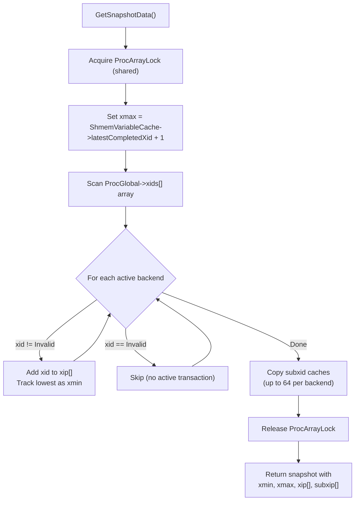
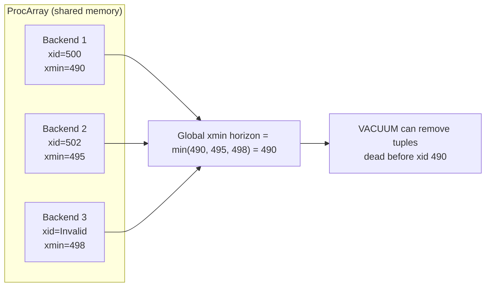

# Snapshots

A snapshot is a frozen-in-time view of which transactions are committed and which are still in progress. Every MVCC visibility decision depends on a snapshot. PostgreSQL builds snapshots by scanning the ProcArray -- the shared-memory array of all active backend processes -- and recording which transaction IDs are currently running.

## Key Source Files

| File | Purpose |
|------|---------|
| `src/include/utils/snapshot.h` | SnapshotData struct, SnapshotType enum |
| `src/backend/storage/ipc/procarray.c` | GetSnapshotData(), TransactionIdIsInProgress() |
| `src/include/storage/proc.h` | PGPROC struct (per-backend shared memory) |
| `src/include/storage/procarray.h` | ProcArray API |
| `src/backend/utils/time/snapmgr.c` | Snapshot lifecycle management |

## SnapshotData Structure

```c
typedef struct SnapshotData
{
    SnapshotType snapshot_type;

    TransactionId xmin;     /* all XIDs < xmin are visible (committed) */
    TransactionId xmax;     /* all XIDs >= xmax are invisible (not yet started) */

    TransactionId *xip;     /* array of in-progress XIDs in [xmin, xmax) */
    uint32         xcnt;    /* count of entries in xip[] */

    TransactionId *subxip;  /* in-progress subtransaction XIDs */
    int32          subxcnt;
    bool           suboverflowed;  /* true if subxip array overflowed */

    bool           takenDuringRecovery;
    bool           copied;

    CommandId      curcid;  /* commands with CID < curcid are visible */

    uint32         speculativeToken;
    struct GlobalVisState *vistest;

    /* Bookkeeping */
    uint32         active_count;
    uint32         regd_count;
    pairingheap_node ph_node;
    uint64         snapXactCompletionCount;
} SnapshotData;
```

The three critical fields form the snapshot's "window":

- **xmin**: The lowest XID that was still running. Everything below xmin is definitively committed or aborted.
- **xmax**: One past the latest XID assigned at snapshot time. Everything at or above xmax has not started yet.
- **xip[]**: The set of XIDs in the range `[xmin, xmax)` that were in progress. These are the transactions whose effects the snapshot cannot see.

## Snapshot Types

| Type | Use Case |
|------|----------|
| `SNAPSHOT_MVCC` | Normal queries -- sees committed transactions, not in-progress ones |
| `SNAPSHOT_SELF` | Sees own uncommitted changes (used internally) |
| `SNAPSHOT_ANY` | Sees everything, including uncommitted (used by VACUUM) |
| `SNAPSHOT_TOAST` | TOAST-specific visibility |
| `SNAPSHOT_DIRTY` | Like SELF but also sees uncommitted changes from other transactions |
| `SNAPSHOT_NON_VACUUMABLE` | Determines if a tuple is dead to all (for pruning) |

## How GetSnapshotData() Works

`GetSnapshotData()` in `procarray.c` is the function that builds an MVCC snapshot. It runs under `ProcArrayLock` (shared mode) and scans every active PGPROC:



### Performance Optimization: Dense xid Arrays

Modern PostgreSQL mirrors certain PGPROC fields (like `xid`) into dense arrays in `ProcGlobal` (indexed by `pgxactoff`). This allows `GetSnapshotData()` to scan a compact array rather than chasing pointers through the full PGPROC structs, significantly improving cache locality.

### The snapXactCompletionCount Optimization

PostgreSQL tracks a global counter (`ShmemVariableCache->xactCompletionCount`) that increments whenever a transaction commits or aborts. If this counter has not changed since the last snapshot, the old snapshot can be reused without scanning ProcArray again. This is a major optimization for Read Committed isolation, where a new snapshot is needed for every statement.

## PGPROC and ProcArray

Every backend has a `PGPROC` slot in shared memory. The fields relevant to snapshots:

```c
struct PGPROC
{
    TransactionId xid;    /* current top-level XID, or InvalidTransactionId */
    TransactionId xmin;   /* this backend's xmin (oldest snapshot) */
    int           pid;
    int           pgxactoff;  /* index into ProcGlobal dense arrays */
    /* ... */
};
```

The `xmin` field in PGPROC is critical: it records the oldest XID that this backend's oldest active snapshot needs to see. VACUUM uses the **global xmin horizon** -- the minimum of all backends' `xmin` values -- to determine which dead tuples can safely be removed.



## Snapshot Lifecycle

### Read Committed

A **new snapshot** is taken at the start of every SQL statement. This means each statement sees a fresh view of committed data, including commits that happened after the transaction started.

### Repeatable Read / Serializable

A **single snapshot** is taken at the start of the first statement in the transaction and reused for all subsequent statements. This guarantees that all reads within the transaction see the same consistent point in time.

### Active Snapshot Stack

PostgreSQL maintains a stack of active snapshots (`ActiveSnapshotElt` linked list). The top of the stack is the "current" snapshot used by visibility checks. Functions like `PushActiveSnapshot()` and `PopActiveSnapshot()` manage this stack.

### Registered Snapshots

Snapshots that must survive beyond a single statement (for cursors, for example) are "registered" and tracked in a pairing heap ordered by xmin. The registered snapshot with the oldest xmin determines how far back VACUUM must preserve tuples.

## The xmin Horizon Problem

A long-running transaction (or an abandoned replication slot) pins the xmin horizon at an old value. This prevents VACUUM from cleaning up dead tuples, causing table bloat. The chain of causation:

1. Backend B starts a transaction and takes a snapshot with `xmin = 1000`
2. B's `PGPROC.xmin` is set to `1000`
3. Thousands of other transactions commit, creating dead tuple versions
4. `GetOldestNonRemovableTransactionId()` returns `1000` because B is still active
5. VACUUM cannot remove any dead tuples with `xmax > 1000`

This is one of the most common operational issues in PostgreSQL production environments.

## Subtransaction XIDs and Overflow

Each PGPROC caches up to `PGPROC_MAX_CACHED_SUBXIDS` (64) subtransaction XIDs. When a snapshot is taken, these are copied into `subxip[]`. If a backend has more than 64 active subtransactions, the cache overflows and `suboverflowed` is set to `true` in the snapshot.

When `suboverflowed` is true, visibility checks cannot definitively determine whether an XID in the `[xmin, xmax)` range is a running subtransaction just by checking `subxip[]`. Instead, they must fall back to `pg_subtrans` lookups to find the parent transaction, then check if the parent is in `xip[]`.

## Key Data Structures Summary

| Structure | Location | Role |
|-----------|----------|------|
| `SnapshotData` | `snapshot.h` | Snapshot state: xmin, xmax, xip[], curcid |
| `PGPROC` | `proc.h` | Per-backend: current xid, xmin, subxid cache |
| `ProcArrayStruct` | `procarray.c` | Shared array tracking all backend PGPROC slots |
| `GlobalVisState` | `procarray.c` | Per-relation visibility horizon for pruning |
| `ActiveSnapshotElt` | `snapmgr.c` | Stack node for active snapshot management |

## Connections

- **MVCC Visibility**: Snapshots are consumed by `HeapTupleSatisfiesMVCC()` to decide tuple visibility. See [MVCC and Tuple Versioning](mvcc.html).
- **Isolation Levels**: The snapshot acquisition strategy (per-statement vs per-transaction) defines isolation level behavior. See [Isolation Levels](isolation-levels.html).
- **VACUUM**: The xmin horizon computed from ProcArray determines what VACUUM can clean up.
- **Replication Slots**: Logical replication slots also hold back the xmin horizon through `ProcArraySetReplicationSlotXmin()`.
