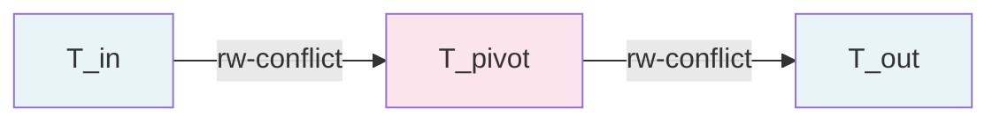
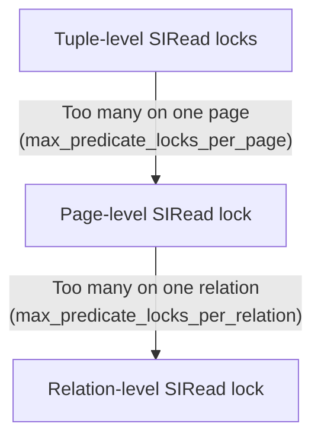
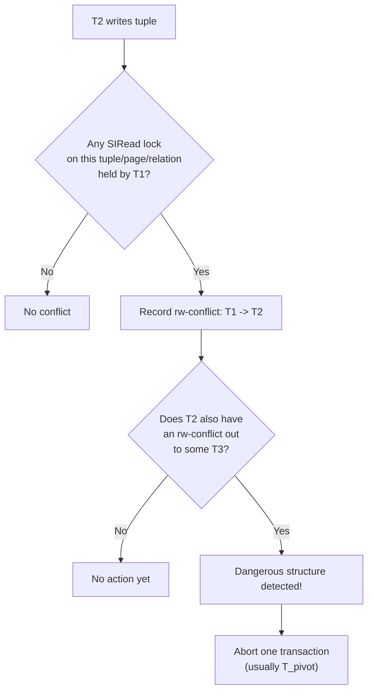

# Serializable Snapshot Isolation (SSI)

PostgreSQL implements true serializable isolation using the SSI algorithm, based on the research of Michael Cahill, Uwe Rohm, and Alan Fekete (SIGMOD 2008). SSI runs snapshot isolation as the base mechanism but monitors for rw-conflict patterns that could cause serialization anomalies, aborting transactions when necessary.

The key insight: snapshot isolation anomalies always involve a cycle in the transaction dependency graph, and every such cycle contains a **dangerous structure** -- two adjacent rw-conflict edges.

## Key Source Files

| File | Purpose |
|------|---------|
| `src/backend/storage/lmgr/predicate.c` | SSI implementation (~6000 lines) |
| `src/include/storage/predicate.h` | Public API |
| `src/include/storage/predicate_internals.h` | SERIALIZABLEXACT, predicate lock structs |
| `src/backend/storage/lmgr/README-SSI` | Detailed design document |

## Background: Why Snapshot Isolation Is Not Enough

Snapshot isolation prevents dirty reads, non-repeatable reads, and phantoms. But it permits **write skew** -- an anomaly where two concurrent transactions each read overlapping data, make decisions based on it, and write non-overlapping data, producing a result impossible under any serial execution.

Classic example:

```
T1: reads A=10, B=10 (sum=20, constraint: sum >= 20)
T1: sets A = A - 15 = -5
T2: reads A=10, B=10 (same snapshot, sum=20)
T2: sets B = B - 15 = -5
Both commit. A + B = -10. Constraint violated.
```

Under serial execution, the second transaction would see the first's write and refuse.

## The Dangerous Structure

Cahill et al. proved that every serialization anomaly under snapshot isolation involves a cycle containing two **adjacent rw-conflict edges** (also called anti-dependencies):



An **rw-conflict** (anti-dependency) from T1 to T2 means: T1 read something, and T2 wrote a newer version of it that T1 could not see (because T2 was concurrent).

SSI does not need to track wr-dependencies or ww-dependencies. It only tracks rw-conflicts between concurrent transactions and watches for the dangerous pattern of two adjacent ones.

## PostgreSQL's SSI Implementation

### SERIALIZABLEXACT

Each serializable transaction gets a `SERIALIZABLEXACT` struct in shared memory:

```c
typedef struct SERIALIZABLEXACT
{
    VirtualTransactionId vxid;

    SerCommitSeqNo prepareSeqNo;
    SerCommitSeqNo commitSeqNo;

    union
    {
        SerCommitSeqNo earliestOutConflictCommit;
        SerCommitSeqNo lastCommitBeforeSnapshot;
    } SeqNo;

    dlist_head outConflicts;     /* rw-conflicts where we are the reader */
    dlist_head inConflicts;      /* rw-conflicts where we are the writer */
    dlist_head predicateLocks;   /* our predicate locks */
    dlist_head possibleUnsafeConflicts;

    TransactionId topXid;
    TransactionId finishedBefore;
    TransactionId xmin;
    uint32 flags;
    int pid;
} SERIALIZABLEXACT;
```

The `outConflicts` list tracks "I read something that another transaction wrote" (T_in edges). The `inConflicts` list tracks "another transaction read something I wrote" (T_out edges).

### Predicate Locks

SSI uses **predicate locks** (SIRead locks) to track what each serializable transaction has read. These are not blocking locks -- they are bookkeeping markers. The granularity levels:

| Level | Meaning |
|-------|---------|
| Tuple | Specific row was read |
| Page | Entire page was read |
| Relation | Entire table was read (e.g., sequential scan) |

Lock promotion (escalation) happens automatically:



This is controlled by the GUCs:
- `max_predicate_locks_per_xact` (default 64)
- `max_predicate_locks_per_relation` (default -2, meaning pages/16)
- `max_predicate_locks_per_page` (default 2)

### Conflict Detection Flow

When a serializable transaction **writes** a tuple, PostgreSQL checks for predicate locks held by other transactions on that tuple (or its page/relation). If found, an rw-conflict edge is recorded:



Similarly, when a serializable transaction **reads** a tuple, it checks if the tuple was written by a concurrent transaction and records the conflict.

### The Two Optimizations

PostgreSQL applies two optimizations from the literature to reduce false positives:

1. **T_out must commit first**: An anomaly can only occur if T_out committed before the other transactions in the cycle. So PostgreSQL only acts on the dangerous structure if T_out has already committed.

2. **Read-only optimization**: If T_in is read-only, an anomaly is only possible if T_out committed **before T_in took its snapshot**. This allows many read-only transactions to avoid serialization failures entirely.

### The Read-Only Safe Optimization

A read-only transaction running at SERIALIZABLE can be marked "safe" early if all concurrent read-write transactions that it might conflict with have finished. Once safe, it can release its predicate locks and SERIALIZABLEXACT resources, reducing memory pressure.

## Commit-Time Check

The final check happens at commit time in `PreCommit_CheckForSerializationFailure()`. This function examines whether the committing transaction is the pivot in a dangerous structure:

```c
/*
 * Check whether the current transaction has both an inConflict
 * and an outConflict with committed transactions, forming a
 * dangerous structure.
 */
```

If so, the transaction is aborted with `ERRCODE_T_R_SERIALIZATION_FAILURE`.

## Memory Management

SSI structures can consume significant shared memory. The key limits:

- `max_pred_locks_per_transaction` controls the shared memory pool for predicate locks
- `SERIALIZABLEXACT` entries are allocated from a fixed pool sized by `max_connections + max_prepared_transactions`
- Completed transactions' SERIALIZABLEXACT entries are kept until no concurrent serializable transaction remains that could form a dangerous structure with them
- The `FinishedSerializableTransactions` list is cleaned up based on `SxactGlobalXmin`

## Practical Implications

### Retry Logic Required

Applications using SERIALIZABLE must handle serialization failures:

```sql
-- Application pseudocode:
LOOP
    BEGIN TRANSACTION ISOLATION LEVEL SERIALIZABLE;
    -- do work
    COMMIT;
    EXIT LOOP;  -- success
EXCEPTION WHEN serialization_failure THEN
    -- retry
END LOOP;
```

### Performance Characteristics

- **Reads do not block writes** (same as snapshot isolation)
- **Writes do not block reads** (same as snapshot isolation)
- **Additional overhead**: Predicate lock bookkeeping on every read, conflict checks on every write
- **False positives**: Some transactions are aborted unnecessarily (the dangerous structure exists but is not part of an actual cycle)
- **Sequential scans**: Acquire a relation-level predicate lock, which increases false positive rate. Index scans produce finer-grained locks.

## Key Data Structures Summary

| Structure | Location | Role |
|-----------|----------|------|
| `SERIALIZABLEXACT` | `predicate_internals.h` | Per-transaction SSI state, conflict lists |
| `PREDICATELOCK` | `predicate_internals.h` | Links a SERIALIZABLEXACT to a lock target |
| `PREDICATELOCKTARGET` | `predicate_internals.h` | Represents a locked tuple/page/relation |
| `RWConflict` | `predicate_internals.h` | An rw-conflict edge between two transactions |
| `SerCommitSeqNo` | `predicate_internals.h` | Monotonic counter for ordering commits |

## Connections

- **Isolation Levels**: SSI is the mechanism that distinguishes Serializable from Repeatable Read. See [Isolation Levels](isolation-levels.html).
- **Snapshots**: SSI runs on top of the same snapshot infrastructure. See [Snapshots](snapshots.html).
- **Two-Phase Commit**: Prepared transactions keep their SERIALIZABLEXACT and predicate locks until final commit/abort. See [Two-Phase Commit](two-phase-commit.html).
- **Index Access Methods**: Each index AM calls `PredicateLockPage()` or `PredicateLockTID()` during scans to register SIRead locks, making index choice (sequential vs. index scan) affect SSI false positive rates.
