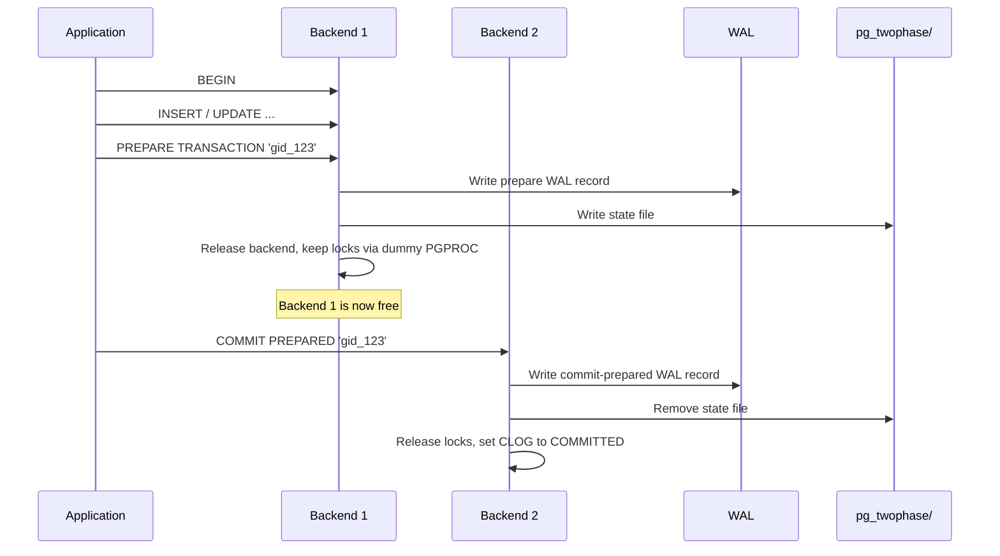

# Two-Phase Commit

PostgreSQL supports the SQL-standard two-phase commit protocol through `PREPARE TRANSACTION` and `COMMIT PREPARED` / `ROLLBACK PREPARED`. This allows a transaction to be durably prepared (surviving crashes) and then committed or rolled back in a separate session -- a building block for distributed transactions coordinated by an external transaction manager.

## Key Source Files

| File | Purpose |
|------|---------|
| `src/backend/access/transam/twophase.c` | Core two-phase commit implementation |
| `src/include/access/twophase.h` | GlobalTransaction, API |
| `src/include/access/twophase_rmgr.h` | Callbacks for resource managers |
| `src/backend/access/transam/xact.c` | PrepareTransaction(), integration with xact lifecycle |

## Overview

Normal transactions have a simple lifecycle: BEGIN, do work, COMMIT (flush WAL, set CLOG). Two-phase commit splits this into two durable steps:

1. **PREPARE**: All work is complete. Locks are held. The transaction state is serialized to a WAL record and a state file on disk. The originating backend disconnects from the transaction.

2. **COMMIT PREPARED** (or ROLLBACK PREPARED): A different session (or the same one after reconnecting) finalizes the transaction.

Between PREPARE and COMMIT PREPARED, the transaction holds all its locks, is visible in `pg_prepared_xacts`, and survives server crashes. This is fundamentally different from a normal uncommitted transaction, which is rolled back on crash.



## GlobalTransactionData

Each prepared transaction is represented by a `GlobalTransactionData` struct (opaque outside `twophase.c`):

```c
typedef struct GlobalTransactionData
{
    GlobalTransaction next;        /* list link */
    int         pgprocno;          /* dummy PGPROC index */
    TimestampTz prepared_at;       /* time of PREPARE */
    XLogRecPtr  prepare_start_lsn; /* WAL position of prepare record */
    XLogRecPtr  prepare_end_lsn;
    Oid         owner;             /* user who prepared */
    Oid         databaseId;
    FullTransactionId fxid;
    char        gid[GIDSIZE];      /* the global transaction identifier */
} GlobalTransactionData;
```

## The Dummy PGPROC

When a transaction is prepared, it releases its backend's PGPROC but acquires a **dummy PGPROC** from a reserved pool. This dummy PGPROC:

- Has `pid = 0` (distinguishing it from real backends)
- Appears in ProcArray, so the prepared transaction's XID is visible to snapshots
- Holds all the transaction's locks
- Has `xid` set to the prepared transaction's XID, so `TransactionIdIsInProgress()` returns true

The reserved pool is sized by `max_prepared_transactions` (default 0, meaning prepared transactions are disabled).

## PREPARE TRANSACTION Internals

`PrepareTransaction()` in `xact.c` performs these steps:

1. **Validate**: Transaction must have an XID, must not be in a subtransaction, must not hold temporary objects
2. **Serialize state**: Collect all resource manager state (locks, relation refs, predicate locks) into a buffer
3. **Write WAL**: The prepare record contains the full serialized state
4. **Write state file**: Redundant copy in `pg_twophase/` for faster access during recovery (the file is named by the XID in hex)
5. **Transfer to dummy PGPROC**: Move locks and ProcArray entry from the real backend to the dummy
6. **Release backend**: The backend's PGPROC is freed, and the connection can run new transactions

## COMMIT PREPARED / ROLLBACK PREPARED

`FinishPreparedTransaction(gid, isCommit)` handles both cases:

1. **Find the prepared transaction** by scanning the GlobalTransaction list for the matching GID
2. **Write WAL**: A commit-prepared or abort-prepared WAL record
3. **Set CLOG status**: COMMITTED or ABORTED for the XID and all its subtransaction XIDs
4. **Release locks**: Remove all locks held by the dummy PGPROC
5. **Clean up SSI**: Release predicate locks if serializable
6. **Remove from ProcArray**: The dummy PGPROC is returned to the free pool
7. **Delete state file**: Remove the `pg_twophase/` file

## Crash Recovery

Prepared transactions survive crashes. During recovery:

1. `PrescanPreparedTransactions()`: Scans `pg_twophase/` state files and the WAL for prepare records. Returns the oldest XID among prepared transactions.
2. `StandbyRecoverPreparedTransactions()`: Restores dummy PGPROCs in standby mode.
3. `RecoverPreparedTransactions()`: Fully restores prepared transactions including locks and resource manager state. Called after WAL replay is complete.

After recovery, the prepared transactions appear in `pg_prepared_xacts` exactly as they did before the crash, and an administrator or application can `COMMIT PREPARED` or `ROLLBACK PREPARED` them.

## Monitoring

```sql
SELECT * FROM pg_prepared_xacts;
```

Returns:

| Column | Type | Description |
|--------|------|-------------|
| `transaction` | xid | Transaction ID |
| `gid` | text | Global transaction identifier |
| `prepared` | timestamptz | When PREPARE was executed |
| `owner` | name | User who prepared |
| `database` | name | Database |

## Limitations and Operational Concerns

- **max_prepared_transactions** must be set > 0 (default is 0)
- Prepared transactions **hold locks** indefinitely until finalized
- Prepared transactions **pin the xmin horizon** through their dummy PGPROC, preventing VACUUM cleanup
- An orphaned prepared transaction (one that is never committed or rolled back) can cause table bloat and lock contention
- Two-phase commit cannot be used with temporary tables or cursors

## GID (Global Identifier)

The GID is a string (up to `GIDSIZE` = 200 bytes) that uniquely identifies the prepared transaction across the cluster. It is chosen by the application or transaction manager:

```sql
PREPARE TRANSACTION 'order_12345_payment';
-- later, possibly from a different session:
COMMIT PREPARED 'order_12345_payment';
```

For logical replication, PostgreSQL generates GIDs automatically using the subscription OID and transaction ID.

## Integration with Logical Replication

Logical replication uses two-phase commit to apply transactions atomically on the subscriber. The `TwoPhaseTransactionGid()` function generates deterministic GIDs for this purpose, and `LookupGXactBySubid()` checks whether a subscription's prepared transaction already exists.

## Key Data Structures Summary

| Structure | Location | Role |
|-----------|----------|------|
| `GlobalTransactionData` | `twophase.c` | State for each prepared transaction |
| `TwoPhaseFileHeader` | `twophase.c` | Header of the serialized state file |
| `PGPROC` (dummy) | `proc.h` | Holds locks and ProcArray slot for prepared xact |
| `TwoPhaseRmgrId` | `twophase_rmgr.h` | Resource manager callbacks for state serialization |

## Connections

- **CLOG**: Prepared transactions stay `IN_PROGRESS` in CLOG until `COMMIT PREPARED` sets them to `COMMITTED`. See [CLOG and Subtransactions](clog-and-subtrans.html).
- **SSI**: Serializable prepared transactions retain their SERIALIZABLEXACT and predicate locks. See [SSI](ssi.html).
- **Snapshots**: Dummy PGPROCs appear in ProcArray scans, so prepared transactions are correctly treated as in-progress by all snapshots. See [Snapshots](snapshots.html).
- **WAL**: Prepare and commit-prepared records are critical for crash recovery. See Chapter 5 (WAL).
- **Locks**: The dummy PGPROC holds all lock types (heavyweight, predicate) until the prepared transaction is finalized.
