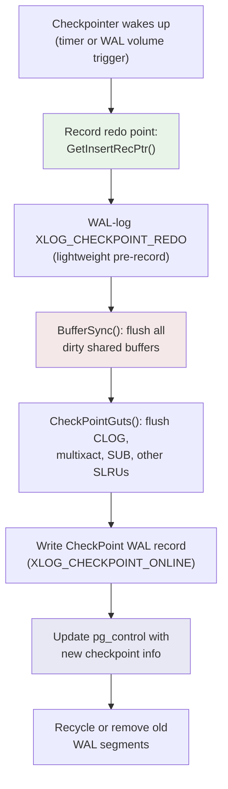
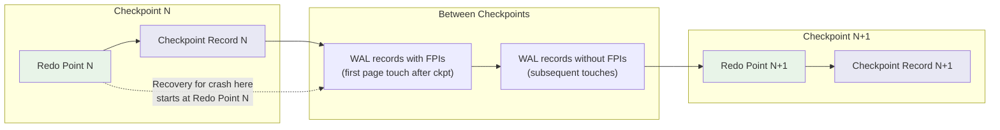

# Checkpoints: Bounding Recovery Time

## Summary

A checkpoint is a periodic operation that flushes all dirty buffers to disk and
writes a checkpoint record into the WAL. The checkpoint's **redo point** marks
the position in WAL from which recovery must begin after a crash. Without
checkpoints, recovery would have to replay the entire WAL history from the
beginning of time. Checkpoints bound recovery time at the cost of write
amplification.

## Overview

The checkpoint process performs three things:

1. **Establishes a redo point** -- records the current WAL insert position
   *before* starting to flush. This is the LSN from which crash recovery will
   start replaying.

2. **Flushes all dirty shared buffers** -- writes every dirty page to its
   permanent location on disk. After this, all pages on disk reflect WAL up
   to at least the redo point.

3. **Writes a checkpoint WAL record** -- records the redo point, transaction
   counters, and other state into a `CheckPoint` struct that is both written
   to WAL and stored in `pg_control`.

After a checkpoint completes, WAL segments before the redo point are no longer
needed for crash recovery and can be recycled or archived.

## Key Source Files

| File | Purpose |
|------|---------|
| `src/backend/access/transam/xlog.c` | `CreateCheckPoint()`, `CreateRestartPoint()` |
| `src/backend/postmaster/checkpointer.c` | Checkpointer process main loop |
| `src/include/catalog/pg_control.h` | `CheckPoint` struct, `DBState`, checkpoint XLOG info values |
| `src/include/access/xlog.h` | Checkpoint request flags (`CHECKPOINT_IS_SHUTDOWN`, etc.) |
| `src/backend/storage/buffer/bufmgr.c` | `BufferSync()` -- flushes dirty buffers during checkpoint |

## How It Works

### The Checkpoint Sequence



#### Step-by-step inside `CreateCheckPoint()`:

1. **Lock out concurrent checkpoints** -- only one checkpoint runs at a time.

2. **Determine the redo point** -- call `GetInsertRecPtr()` to capture the
   current WAL insert position. This LSN becomes `CheckPoint.redo`. Any WAL
   record at or after this point might describe a change to a page that has
   not yet been flushed to disk.

3. **Enable full-page writes from the redo point** -- update
   `XLogCtlInsert.RedoRecPtr` so that subsequent page modifications will
   include FPIs until the next checkpoint.

4. **Flush all dirty buffers** -- `BufferSync()` iterates through the buffer
   pool, writing every dirty page whose oldest modification LSN is before the
   checkpoint start. This is spread over time using `checkpoint_completion_target`
   to avoid I/O spikes.

5. **Flush SLRU buffers** -- CLOG, multixact, commit timestamp, and other
   SLRU-managed data are also flushed.

6. **Write the checkpoint record** -- a WAL record of type
   `XLOG_CHECKPOINT_ONLINE` (or `XLOG_CHECKPOINT_SHUTDOWN` during shutdown)
   containing the `CheckPoint` struct.

7. **Update `pg_control`** -- the `ControlFileData` is updated with the new
   checkpoint information and fsynced. This file is the first thing checked
   during startup.

8. **Recycle old WAL** -- segments before the redo point (minus any retention
   for replication slots, `wal_keep_size`, or archiving) are recycled or deleted.

### The Redo Point

The redo point is the most important concept in the checkpoint. It is the answer
to "where does recovery start?"

```
 WAL timeline:  ... [redo point] ... [dirty pages flushed] ... [checkpoint record]
                     ^                                          ^
                     |                                          |
          Recovery starts here                       pg_control points here
```

Note that the redo point is captured *before* dirty pages are flushed. This is
critical: any page modification that happens *during* the flush must also be
recoverable. Since those modifications generate WAL records after the redo point,
replaying from the redo point will reconstruct them.

### Checkpoint Triggers

Checkpoints are triggered by:

1. **WAL volume** -- when `max_wal_size` worth of WAL has been generated since
   the last checkpoint, the checkpointer is signaled with `CHECKPOINT_CAUSE_XLOG`.

2. **Time** -- every `checkpoint_timeout` seconds (default 5 minutes), the
   checkpointer wakes up with `CHECKPOINT_CAUSE_TIME`.

3. **Manual** -- `CHECKPOINT` SQL command sets `CHECKPOINT_FORCE | CHECKPOINT_WAIT`.

4. **Shutdown** -- `CHECKPOINT_IS_SHUTDOWN` is set, ensuring all data is on disk.

The request flags are OR-able bitmasks:

```c
/* src/include/access/xlog.h:149 */
#define CHECKPOINT_IS_SHUTDOWN         0x0001
#define CHECKPOINT_END_OF_RECOVERY     0x0002
#define CHECKPOINT_FAST                0x0004
#define CHECKPOINT_FORCE               0x0008
#define CHECKPOINT_FLUSH_UNLOGGED      0x0010
#define CHECKPOINT_WAIT                0x0020
#define CHECKPOINT_REQUESTED           0x0040
#define CHECKPOINT_CAUSE_XLOG          0x0080
#define CHECKPOINT_CAUSE_TIME          0x0100
```

### Spread Checkpoints

Flushing all dirty buffers at once would cause a massive I/O spike. The
`checkpoint_completion_target` GUC (default 0.9) tells the checkpointer to
spread the writes over 90% of the expected time until the next checkpoint.
`BufferSync()` uses this to pace its writes, sleeping between batches.

### pg_control: The Recovery Anchor

`pg_control` is a single file (`global/pg_control`) that stores the last
completed checkpoint location, the database state, and system parameters. It
is the first file read during startup.

```c
/* Key fields from ControlFileData (src/include/catalog/pg_control.h) */
typedef enum DBState
{
    DB_STARTUP = 0,
    DB_SHUTDOWNED,                /* clean shutdown completed */
    DB_SHUTDOWNED_IN_RECOVERY,    /* clean shutdown during recovery */
    DB_SHUTDOWNING,               /* shutdown in progress */
    DB_IN_CRASH_RECOVERY,         /* crash recovery in progress */
    DB_IN_ARCHIVE_RECOVERY,       /* archive recovery in progress */
    DB_IN_PRODUCTION,             /* normal operation */
} DBState;
```

During startup:

- If `state == DB_SHUTDOWNED`, no recovery is needed.
- If `state == DB_IN_PRODUCTION` or `DB_IN_CRASH_RECOVERY`, the system crashed
  and recovery must start from the checkpoint's redo point.

### Restartpoints (Standby Checkpoints)

A standby server cannot create real checkpoints because it is not generating
new WAL. Instead, it creates **restartpoints** via `CreateRestartPoint()`. A
restartpoint flushes dirty buffers and updates `pg_control` to reflect the
latest checkpoint record received from the primary. This bounds how far back
recovery must go if the standby crashes.

Restartpoints are triggered when a checkpoint record is replayed and enough
WAL has been processed since the last restartpoint.

## Key Data Structures

### CheckPoint

```c
/* src/include/catalog/pg_control.h:35 */
typedef struct CheckPoint
{
    XLogRecPtr      redo;              /* REDO start point */
    TimeLineID      ThisTimeLineID;    /* current TLI */
    TimeLineID      PrevTimeLineID;    /* previous TLI (fork point) */
    bool            fullPageWrites;    /* current full_page_writes */
    int             wal_level;         /* current wal_level */
    FullTransactionId nextXid;         /* next free XID */
    Oid             nextOid;           /* next free OID */
    MultiXactId     nextMulti;         /* next free MultiXactId */
    MultiXactOffset nextMultiOffset;   /* next free MultiXact offset */
    TransactionId   oldestXid;         /* cluster-wide minimum datfrozenxid */
    Oid             oldestXidDB;       /* database with minimum datfrozenxid */
    MultiXactId     oldestMulti;       /* cluster-wide minimum datminmxid */
    Oid             oldestMultiDB;     /* database with minimum datminmxid */
    pg_time_t       time;              /* timestamp of checkpoint */
    TransactionId   oldestCommitTsXid;
    TransactionId   newestCommitTsXid;
    TransactionId   oldestActiveXid;   /* oldest running XID (for hot standby) */
} CheckPoint;
```

This struct is written both as a WAL record payload and stored in `pg_control`.
The `redo` field is the most critical -- it is the LSN where crash recovery begins.

### CheckpointStatsData

```c
/* src/include/access/xlog.h:171 */
typedef struct CheckpointStatsData
{
    TimestampTz ckpt_start_t;      /* start of checkpoint */
    TimestampTz ckpt_write_t;      /* start of flushing buffers */
    TimestampTz ckpt_sync_t;       /* start of fsyncs */
    TimestampTz ckpt_sync_end_t;   /* end of fsyncs */
    TimestampTz ckpt_end_t;        /* end of checkpoint */
    int         ckpt_bufs_written; /* # of buffers written */
    int         ckpt_slru_written; /* # of SLRU buffers written */
    int         ckpt_segs_added;   /* # of new WAL segments created */
    int         ckpt_segs_removed; /* # of WAL segments deleted */
    int         ckpt_segs_recycled;/* # of WAL segments recycled */
    int         ckpt_sync_rels;    /* # of relations synced */
    uint64      ckpt_longest_sync; /* longest sync for one relation */
    uint64      ckpt_agg_sync_time;/* sum of all sync times */
} CheckpointStatsData;
```

When `log_checkpoints = on`, these stats are logged at checkpoint completion,
providing visibility into checkpoint duration and I/O behavior.

### Checkpoint Timeline Diagram



## Connections

- **[WAL Internals](wal-internals)** -- checkpoints set `RedoRecPtr` which
  controls full-page write decisions during WAL insertion.

- **[Recovery](recovery)** -- the checkpoint's redo point is where crash
  recovery begins. `pg_control` tells the startup process which checkpoint
  to use.

- **[Storage Engine (Ch. 1)](../01-storage/)** -- `BufferSync()` is the
  checkpoint's main I/O work, flushing dirty pages from the buffer pool.

- **[Replication (Ch. 12)](../12-replication/)** -- `pg_basebackup` uses
  `do_pg_backup_start()`/`do_pg_backup_stop()` to bracket a backup, forcing
  a checkpoint at the start. Replication slots prevent WAL recycling.
