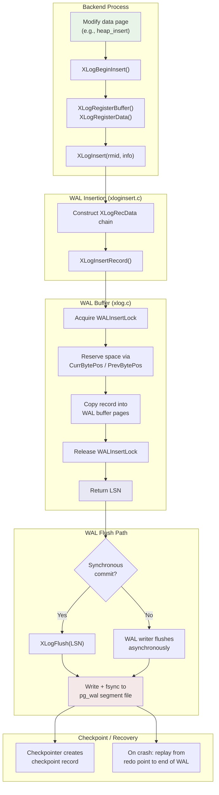
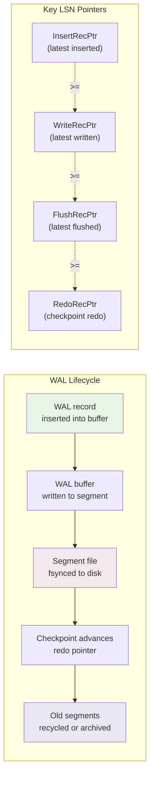

# Chapter 4: Write-Ahead Logging (WAL)

> *"No data is committed until its log record is on stable storage."*
> -- The WAL protocol, the single most important invariant in PostgreSQL's durability story.

## Summary

Write-Ahead Logging is PostgreSQL's mechanism for ensuring crash safety and enabling
point-in-time recovery. Every modification to a data page is first recorded as a WAL
record in a sequential log. The WAL record *must* reach stable storage before the
modified data page is written to disk. This simple invariant -- "log before data" --
allows PostgreSQL to recover from crashes by replaying the log, reconstruct any
consistent state within the retention window, and stream changes to replicas.

This chapter covers the WAL record format, the insertion machinery, the checkpoint
process that bounds recovery time, crash recovery and PITR, and the extension points
that allow custom WAL record types.

## Chapter Map

| Page | What You'll Learn |
|------|-------------------|
| [WAL Internals](wal-internals) | WAL buffers, LSN addressing, record format, insertion locks, flush pipeline |
| [Checkpoints](checkpoints) | Checkpoint process, redo points, `pg_control`, restartpoints |
| [Recovery](recovery) | Crash recovery, archive recovery, PITR, timelines |
| [WAL for Extensions](wal-for-extensions) | Generic WAL API, custom resource managers |

## Overview

### Why WAL Exists

Without WAL, PostgreSQL would need to flush every dirty page to disk before
confirming a commit. That would serialize all writes through random I/O to the
data directory. WAL converts this into sequential I/O to a log file, which is
orders of magnitude faster on both spinning disks and SSDs.

WAL serves three purposes:

1. **Crash recovery** -- after an unclean shutdown, replay WAL from the last
   checkpoint to bring the database back to a consistent state.
2. **Point-in-time recovery (PITR)** -- replay WAL to an arbitrary point,
   restoring the database to any moment within the archive window.
3. **Replication** -- stream WAL to standbys for physical or logical replication.

### The WAL Protocol in One Paragraph

When a backend modifies a page (e.g., inserts a tuple into a heap page), it
constructs an `XLogRecord` describing the change, reserves space in the WAL
buffer via the insertion locks, copies the record into the buffer, and returns
the LSN (Log Sequence Number) at which the record was written. Before that dirty
page can be flushed to disk by the background writer or checkpointer, the WAL
must be flushed up to at least the page's LSN. The `XLogFlush()` call ensures
this ordering.

### Key Concepts

- **LSN (Log Sequence Number)** -- a 64-bit byte offset into the WAL stream.
  Every WAL record, and every data page, carries an LSN. Defined as `typedef uint64 XLogRecPtr`
  in `src/include/access/xlogdefs.h:22`.

- **WAL Segment** -- the WAL stream is divided into segment files, each
  `wal_segment_size` bytes (default 16 MB). Files live in `pg_wal/` and are named
  by timeline and segment number (e.g., `000000010000000000000001`).

- **WAL Buffer** -- a shared-memory ring buffer (`wal_buffers` pages, default
  auto-tuned) where WAL records are assembled before being written to disk.

- **Full-Page Write (FPW)** -- the first modification of a page after a
  checkpoint records the entire page image in WAL, protecting against torn pages.

- **Resource Manager (rmgr)** -- a subsystem that knows how to generate and
  replay WAL for its record types. Each rmgr has a unique `RmgrId` and a set of
  callbacks (`RmgrData` struct in `src/include/access/xlog_internal.h:339`).

## Key Source Files

| File | Purpose |
|------|---------|
| `src/include/access/xlogrecord.h` | `XLogRecord` struct, block header format |
| `src/include/access/xlog.h` | WAL manager public API, GUCs, checkpoint flags |
| `src/include/access/xloginsert.h` | WAL insertion API (`XLogBeginInsert`, `XLogInsert`, etc.) |
| `src/include/access/xlog_internal.h` | Page headers, segment math, `RmgrData`, `XLogRecData` |
| `src/include/access/xlogdefs.h` | `XLogRecPtr`, `TimeLineID`, `XLogSegNo` typedefs |
| `src/include/catalog/pg_control.h` | `CheckPoint` struct, `DBState` enum, XLOG info values |
| `src/backend/access/transam/xlog.c` | Core WAL engine: insertion, flush, checkpoint, startup |
| `src/backend/access/transam/xloginsert.c` | Record construction and reservation |
| `src/backend/access/transam/xlogrecovery.c` | Recovery loop, timeline management |
| `src/backend/access/transam/generic_xlog.c` | Generic WAL for extensions |
| `src/include/access/generic_xlog.h` | Generic WAL public API |

## How It Works: The Big Picture



## Key Data Structures at a Glance

### XLogRecord (the on-disk record header)

```c
/* src/include/access/xlogrecord.h:41 */
typedef struct XLogRecord
{
    uint32      xl_tot_len;   /* total len of entire record */
    TransactionId xl_xid;     /* xact id */
    XLogRecPtr  xl_prev;      /* ptr to previous record in log */
    uint8       xl_info;      /* flag bits, see below */
    RmgrId      xl_rmid;      /* resource manager for this record */
    /* 2 bytes of padding here, initialize to zero */
    pg_crc32c   xl_crc;       /* CRC for this record */
} XLogRecord;
```

### CheckPoint (written at every checkpoint)

```c
/* src/include/catalog/pg_control.h:35 */
typedef struct CheckPoint
{
    XLogRecPtr  redo;              /* REDO start point */
    TimeLineID  ThisTimeLineID;    /* current TLI */
    TimeLineID  PrevTimeLineID;    /* previous TLI (fork point) */
    bool        fullPageWrites;    /* current full_page_writes */
    FullTransactionId nextXid;     /* next free XID */
    Oid         nextOid;           /* next free OID */
    /* ... transaction and multixact counters ... */
    pg_time_t   time;              /* timestamp of checkpoint */
} CheckPoint;
```

### WAL Lifecycle Diagram



## Connections

- **[Storage Engine (Ch. 1)](../01-storage/)** -- the buffer manager calls
  `XLogFlush(page_lsn)` before writing a dirty page. The `pd_lsn` field in every
  page header records the LSN of the last WAL record that modified the page.

- **[Transactions & MVCC (Ch. 3)](../03-transactions/)** -- commit and abort
  records are WAL records. The CLOG is also WAL-logged. Synchronous commit
  guarantees depend on `XLogFlush()` completing before the commit response.

- **[Locking (Ch. 5)](../05-locking/)** -- WAL insertion uses a fixed set of
  `WALInsertLock` lightweight locks to allow concurrent insertion. `WALWriteLock`
  serializes actual writes to disk.

- **[Replication (Ch. 12)](../12-replication/)** -- physical replication streams
  WAL bytes directly. Logical replication decodes WAL records into logical change
  events via the resource manager callbacks.

- **[Platform Layer (Ch. 14)](../14-platform/)** -- WAL flush uses platform-specific
  sync methods (`fsync`, `fdatasync`, `O_DSYNC`), selected by `wal_sync_method`.
