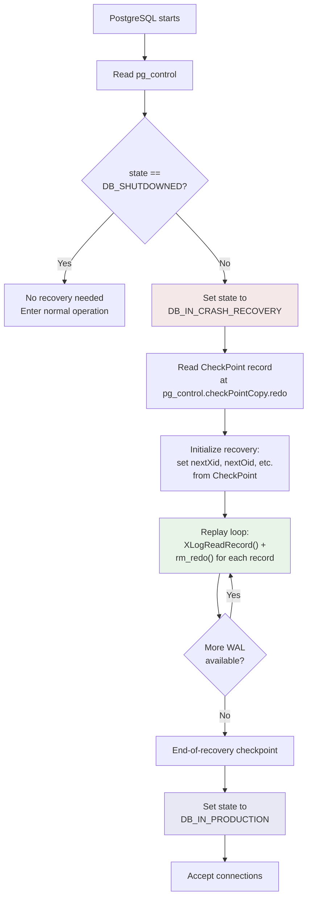
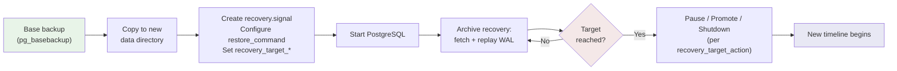
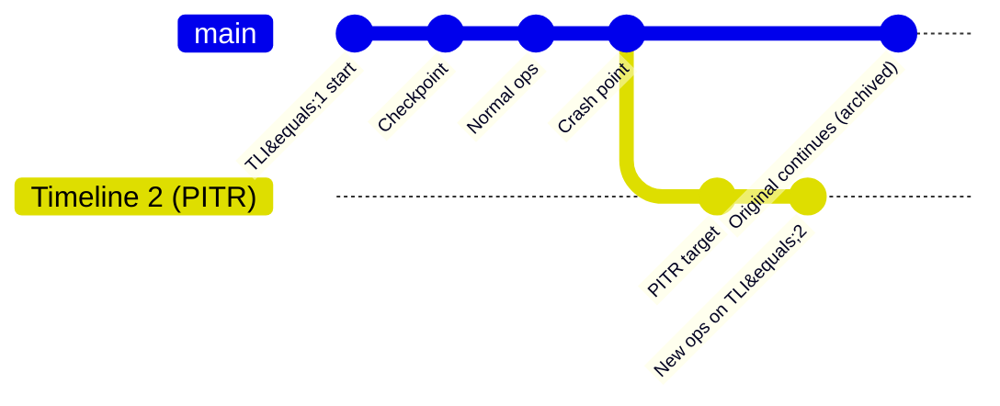

# Recovery: Crash Recovery, PITR, and Timelines

## Summary

Recovery is the process of replaying WAL records to bring the database to a
consistent state after a crash, or to a specific point in time for disaster
recovery. PostgreSQL supports three recovery modes: crash recovery (automatic
after unclean shutdown), archive recovery (replaying from archived WAL), and
standby mode (continuous recovery for hot standby). Timelines prevent WAL
conflicts when multiple recovery histories diverge.

## Overview

When PostgreSQL starts, it reads `pg_control` to determine the database state.
If the state is not `DB_SHUTDOWNED`, recovery is needed. The startup process
reads the `CheckPoint` record referenced by `pg_control`, then replays all WAL
from the checkpoint's redo point forward, calling each record's resource
manager `rm_redo()` callback.

Recovery modes:

- **Crash recovery** -- replay from the last checkpoint to the end of available
  WAL in `pg_wal/`. No user configuration needed.
- **Archive recovery** -- replay from a base backup, fetching WAL segments via
  `restore_command`. Optionally stop at a target (PITR). Triggered by the
  presence of `recovery.signal`.
- **Standby mode** -- like archive recovery, but never finishes. Continuously
  receives WAL from a primary via streaming replication or `restore_command`.
  Triggered by `standby.signal`.

## Key Source Files

| File | Purpose |
|------|---------|
| `src/backend/access/transam/xlogrecovery.c` | Main recovery loop, PITR targeting, timeline switching |
| `src/backend/access/transam/xlog.c` | `StartupXLOG()` -- entry point, reads `pg_control`, initiates recovery |
| `src/backend/access/transam/xlogreader.c` | `XLogReadRecord()` -- reads and validates WAL records |
| `src/backend/access/transam/xlogprefetcher.c` | Prefetches blocks referenced by upcoming WAL records |
| `src/include/access/xlogrecovery.h` | Recovery state, target types, public API |
| `src/include/access/xlog_internal.h` | Timeline history file format, signal file names |
| `src/include/catalog/pg_control.h` | `DBState` enum, `CheckPoint` struct |

## How It Works

### Crash Recovery Sequence



### The Replay Loop

The core of recovery is a loop in `xlogrecovery.c` that reads WAL records
sequentially and dispatches them to resource managers:

```
while (record = XLogReadRecord(...))
{
    RmgrData rmgr = GetRmgr(record->xl_rmid);
    rmgr.rm_redo(record);
}
```

Each resource manager's `rm_redo()` callback knows how to apply its record type.
For example, `heap_redo()` handles heap inserts, updates, and deletes;
`btree_redo()` handles B-tree splits and deletions.

#### FPI Replay

When a record includes a full-page image (FPI), the replay is simple: overwrite
the page with the stored image, ignoring any incremental changes. This makes
recovery idempotent -- replaying the same record twice produces the same result.

Without an FPI, the `rm_redo()` function applies the change incrementally.
Before applying, it checks if the page's LSN is already >= the record's LSN.
If so, the change was already applied (the page was flushed to disk before the
crash), and the record is skipped.

### Point-in-Time Recovery (PITR)

PITR allows recovery to stop at a specific point rather than replaying all
available WAL. This is configured via `recovery_target_*` parameters:

| Parameter | Description |
|-----------|-------------|
| `recovery_target_time` | Stop at a specific timestamp |
| `recovery_target_xid` | Stop after a specific transaction commits |
| `recovery_target_lsn` | Stop at a specific WAL position |
| `recovery_target_name` | Stop at a named restore point (from `pg_create_restore_point()`) |
| `recovery_target` | `'immediate'` -- stop as soon as consistency is reached |

The `recovery_target_action` parameter controls what happens when the target
is reached: `pause` (wait for manual promotion), `promote` (become primary),
or `shutdown`.

#### PITR Workflow



### Timelines

A **timeline** is an integer identifier (`TimeLineID`) that distinguishes
different WAL histories. Every WAL segment file name includes the timeline
(the first 8 hex digits, e.g., `00000001` in `000000010000000000000001`).

```c
/* src/include/access/xlogdefs.h:63 */
typedef uint32 TimeLineID;
```

Timelines are created when:

1. **PITR completes** -- after recovering to a target point and promoting, a new
   timeline starts. This prevents the new WAL from overwriting archived WAL
   that might be needed for a different recovery.

2. **Standby promotion** -- when a standby is promoted to primary, it begins a
   new timeline.

#### Timeline History Files

When a new timeline is created, PostgreSQL writes a **timeline history file**
(e.g., `00000002.history`) that records where the fork happened:

```
1   0/50000A0   no recovery target configured
```

This says: "Timeline 2 forked from timeline 1 at LSN `0/50000A0`." Recovery
can use these files to determine which WAL segments to read when following
a specific timeline.



### WAL Prefetching

During recovery, the startup process can predict which data blocks will be
needed by upcoming WAL records (since block references are encoded in the
record headers). The **WAL prefetcher** (`xlogprefetcher.c`) reads ahead in
the WAL stream and issues prefetch requests for those blocks, overlapping
I/O with replay CPU work.

This significantly speeds up recovery on systems with high-latency storage.
Controlled by `recovery_prefetch` (default `try`).

### Recovery Consistency Point

During archive recovery, the database is not immediately consistent. It becomes
consistent at the **consistency point** -- the LSN at which all pages modified
since the base backup have been replayed. After this point, hot standby queries
can begin. The consistency point is determined from the backup label file
(`backup_label`), which records the start LSN of the backup.

### Signal Files

Recovery mode is controlled by signal files in `$PGDATA`:

```c
/* src/include/access/xlog.h:318 */
#define RECOVERY_SIGNAL_FILE    "recovery.signal"    /* archive recovery */
#define STANDBY_SIGNAL_FILE     "standby.signal"     /* standby mode */
#define PROMOTE_SIGNAL_FILE     "promote"             /* trigger promotion */
```

- `recovery.signal` -- start archive recovery, promote when done (or at target).
- `standby.signal` -- start standby mode, continuously replay WAL.
- `promote` -- signal a standby to promote to primary (created by `pg_ctl promote`
  or `pg_promote()` function).

### End-of-Recovery Processing

When recovery completes (either crash recovery reaching end of WAL, or archive
recovery reaching its target):

1. Write an end-of-recovery checkpoint or `XLOG_END_OF_RECOVERY` record.
2. If a new timeline is needed, create the timeline history file.
3. Set `pg_control.state = DB_IN_PRODUCTION`.
4. Remove signal files (`recovery.signal`, `backup_label`).
5. Start accepting connections.

## Key Data Structures

### DBState (system state indicator)

```c
/* src/include/catalog/pg_control.h:91 */
typedef enum DBState
{
    DB_STARTUP = 0,
    DB_SHUTDOWNED,                /* clean shutdown completed */
    DB_SHUTDOWNED_IN_RECOVERY,    /* clean shutdown during recovery */
    DB_SHUTDOWNING,               /* shutdown in progress */
    DB_IN_CRASH_RECOVERY,         /* crash recovery in progress */
    DB_IN_ARCHIVE_RECOVERY,       /* archive recovery in progress */
    DB_IN_PRODUCTION,             /* normal operation */
} DBState;
```

### xl_end_of_recovery

```c
/* src/include/access/xlog_internal.h:300 */
typedef struct xl_end_of_recovery
{
    TimestampTz end_time;
    TimeLineID  ThisTimeLineID;    /* new TLI */
    TimeLineID  PrevTimeLineID;    /* previous TLI we forked from */
    int         wal_level;
} xl_end_of_recovery;
```

### Recovery State in XLogCtlData

```c
/* Inside XLogCtlData (src/backend/access/transam/xlog.c:453) */
RecoveryState SharedRecoveryState;      /* CRASH, ARCHIVE, or DONE */
TimeLineID    InsertTimeLineID;         /* TLI for new WAL */
TimeLineID    PrevTimeLineID;           /* TLI we forked from */
XLogRecPtr    lastCheckPointRecPtr;     /* latest checkpoint start */
XLogRecPtr    lastCheckPointEndPtr;     /* latest checkpoint end */
CheckPoint    lastCheckPoint;           /* latest checkpoint data */
```

## Connections

- **[WAL Internals](wal-internals)** -- recovery reads the WAL records that
  the insertion machinery wrote. The record format determines how replay works.

- **[Checkpoints](checkpoints)** -- the checkpoint's redo point is where
  recovery begins. More frequent checkpoints mean shorter recovery times but
  more I/O during normal operation.

- **[Transactions & MVCC (Ch. 3)](../03-transactions/)** -- during recovery,
  transaction state (CLOG, running XIDs) is reconstructed from WAL. Hot standby
  needs this to serve consistent read queries.

- **[Replication (Ch. 12)](../12-replication/)** -- standby mode is continuous
  recovery. Streaming replication feeds WAL to the standby's recovery loop.
  Replication conflicts arise when recovery needs to remove data that standby
  queries are reading.

- **[Storage Engine (Ch. 1)](../01-storage/)** -- during replay, pages are
  fetched into the buffer pool, modified according to the WAL record, and
  eventually flushed to disk by the checkpointer.
