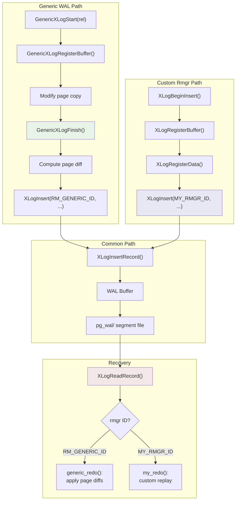

# WAL for Extensions: Generic WAL and Custom Resource Managers

## Summary

Extensions that modify data pages need crash safety, but implementing a full
resource manager is complex. PostgreSQL provides two mechanisms for extensions:
the **Generic WAL API** (simple, page-diff-based, no custom replay logic) and
**Custom Resource Managers** (full control, custom record types and replay).
This page covers both approaches, their trade-offs, and how to use them.

## Overview

The core problem: an extension creates a new index access method or data
structure stored in PostgreSQL pages. If those pages are modified without WAL
logging, a crash will leave them inconsistent. The extension needs to either:

1. **Use Generic WAL** -- let PostgreSQL compute page diffs automatically and
   replay them generically. No custom `rm_redo()` needed. Available since
   PostgreSQL 9.6.

2. **Register a Custom Resource Manager** -- define a new `RmgrId`, implement
   `rm_redo()` and other callbacks, and use the standard `XLogInsert()` API.
   Available since PostgreSQL 16.

## Key Source Files

| File | Purpose |
|------|---------|
| `src/include/access/generic_xlog.h` | Generic WAL API: `GenericXLogStart`, `GenericXLogRegisterBuffer`, etc. |
| `src/backend/access/transam/generic_xlog.c` | Generic WAL implementation: page diffing, redo |
| `src/include/access/xlog_internal.h` | `RmgrData` struct, `RegisterCustomRmgr()` |
| `src/include/access/xloginsert.h` | Standard WAL insertion API used by custom rmgrs |
| `src/include/access/rmgr.h` | Resource manager ID definitions |

## How It Works

### Generic WAL API

Generic WAL is designed for simplicity. The extension does not define any WAL
record format or replay logic. Instead, it:

1. Calls `GenericXLogStart()` to begin a WAL-logged operation.
2. Registers up to `MAX_GENERIC_XLOG_PAGES` (4) buffers with
   `GenericXLogRegisterBuffer()`, receiving a copy of each page to modify.
3. Modifies the page copies in-place.
4. Calls `GenericXLogFinish()` to compute diffs, write the WAL record, and
   apply changes to the real buffers atomically.

If something goes wrong, `GenericXLogAbort()` discards all changes.

```c
/* src/include/access/generic_xlog.h */
#define MAX_GENERIC_XLOG_PAGES  XLR_NORMAL_MAX_BLOCK_ID  /* 4 */
#define GENERIC_XLOG_FULL_IMAGE 0x0001

GenericXLogState *GenericXLogStart(Relation relation);
Page GenericXLogRegisterBuffer(GenericXLogState *state, Buffer buffer, int flags);
XLogRecPtr GenericXLogFinish(GenericXLogState *state);
void GenericXLogAbort(GenericXLogState *state);
```

#### Usage Example

```c
GenericXLogState *state;
Page              page;

state = GenericXLogStart(rel);

/* Register a buffer -- get a page copy to modify */
page = GenericXLogRegisterBuffer(state, buffer, 0);

/* Modify the page copy (not the real buffer page) */
memcpy(PageGetContents(page) + offset, data, len);

/* Finish: computes diff, writes WAL record, applies to real page */
GenericXLogFinish(state);
```

#### How Diffs Work

`GenericXLogFinish()` compares the original page with the modified copy and
stores the differences. During replay, `generic_redo()` fetches the page and
applies the same diffs. If a full-page image is included (because this is the
first modification after a checkpoint), the diff is not needed -- the FPI
is used directly.

The `GENERIC_XLOG_FULL_IMAGE` flag forces a full-page image regardless of
the FPI policy. This is useful when the extension completely rewrites a page.

#### Generic WAL Replay

The resource manager callbacks for generic WAL are built into PostgreSQL:

```c
/* src/backend/access/transam/generic_xlog.c */
void generic_redo(XLogReaderState *record);        /* apply page diffs */
const char *generic_identify(uint8 info);           /* "GENERIC" */
void generic_desc(StringInfo buf, XLogReaderState *record);
void generic_mask(char *page, BlockNumber blkno);   /* mask for consistency */
```

#### Limitations of Generic WAL

- Maximum 4 pages per WAL record (`MAX_GENERIC_XLOG_PAGES`).
- No custom replay logic -- you cannot do anything smarter than page diffs.
- No logical decoding support -- generic WAL records are opaque to logical
  replication.
- The diff-based approach may be less space-efficient than a purpose-built
  record format for certain operations.

### Custom Resource Managers

For extensions that need more control -- custom record formats, efficient
replay, logical decoding support, or more than 4 pages per record -- PostgreSQL
provides the custom resource manager API.

#### Registration

```c
/* src/include/access/xlog_internal.h:356 */
extern void RegisterCustomRmgr(RmgrId rmid, const RmgrData *rmgr);
```

The extension calls `RegisterCustomRmgr()` during `_PG_init()`, providing a
unique `RmgrId` in the range `RM_EXPERIMENTAL_ID` to `RM_MAX_CUSTOM_ID` and
a filled-in `RmgrData` struct:

```c
/* src/include/access/xlog_internal.h:339 */
typedef struct RmgrData
{
    const char *rm_name;
    void (*rm_redo)(XLogReaderState *record);      /* REQUIRED: replay */
    void (*rm_desc)(StringInfo buf, XLogReaderState *record);  /* describe */
    const char *(*rm_identify)(uint8 info);        /* name an op */
    void (*rm_startup)(void);                      /* startup hook */
    void (*rm_cleanup)(void);                      /* cleanup hook */
    void (*rm_mask)(char *pagedata, BlockNumber blkno);  /* consistency mask */
    void (*rm_decode)(...);                        /* logical decoding */
} RmgrData;
```

#### Writing Custom WAL Records

Custom resource managers use the standard WAL insertion API:

```c
XLogBeginInsert();
XLogRegisterData(&my_record_data, sizeof(my_record_data));
XLogRegisterBuffer(0, buffer, REGBUF_STANDARD);
XLogRegisterBufData(0, extra_data, extra_len);
XLogRecPtr lsn = XLogInsert(MY_RMGR_ID, MY_OPERATION_TYPE);
```

The `xl_info` high 4 bits encode the operation type, giving each resource
manager up to 16 distinct operation types.

#### Implementing rm_redo

The `rm_redo()` callback must be **idempotent** -- applying it twice must
produce the same result. The standard pattern:

```c
static void
my_redo(XLogReaderState *record)
{
    uint8       info = XLogRecGetInfo(record) & ~XLR_INFO_MASK;
    Buffer      buffer;
    Page        page;

    if (XLogRecGetBlockTagExtended(record, 0, ...))
    {
        /* If we have a full-page image, just restore it */
        if (XLogRecBlockImageApply(record, 0))
            return;

        /* Otherwise, apply incremental change */
        buffer = XLogInitBufferForRedo(record, 0);
        page = BufferGetPage(buffer);

        /* Check LSN to ensure idempotency */
        if (PageGetLSN(page) >= record->EndRecPtr)
        {
            UnlockReleaseBuffer(buffer);
            return;
        }

        /* Apply the change */
        my_apply_change(page, XLogRecGetData(record));

        PageSetLSN(page, record->EndRecPtr);
        MarkBufferDirty(buffer);
        UnlockReleaseBuffer(buffer);
    }
}
```

### Choosing Between Generic WAL and Custom Resource Managers

| Criterion | Generic WAL | Custom Resource Manager |
|-----------|-------------|------------------------|
| Complexity | Low -- no replay code needed | High -- must implement rm_redo |
| Pages per record | Up to 4 | Up to 32 (XLR_MAX_BLOCK_ID) |
| WAL efficiency | Page diffs (can be large) | Custom format (can be compact) |
| Logical decoding | Not supported | Supported via rm_decode |
| Replay performance | Generic diff application | Custom optimized replay |
| Availability | PostgreSQL 9.6+ | PostgreSQL 16+ |

### WAL Record Flow for Extensions



## Key Data Structures

### GenericXLogState (opaque to callers)

Internally, `GenericXLogState` tracks up to 4 buffer/page pairs. For each
registered buffer, it stores the original page content and the modified copy.
`GenericXLogFinish()` compares these to produce a delta. The struct is defined
in `generic_xlog.c` and is not exposed in the header.

### RmgrData (resource manager table entry)

The global `RmgrTable[]` array is indexed by `RmgrId`. Built-in resource
managers occupy IDs 0 through approximately 16. Custom resource managers use
IDs 128-255 (`RM_EXPERIMENTAL_ID` through `RM_MAX_CUSTOM_ID`). If a WAL
record references an unregistered rmgr ID during recovery, PostgreSQL calls
`RmgrNotFound()` and halts recovery with an error.

{: .warning }
If a standby or recovery target does not have the extension loaded (and thus
the custom rmgr is not registered), recovery will fail when it encounters the
custom WAL record. Extensions using custom resource managers must be installed
on all standbys and backup restore targets.

## Connections

- **[WAL Internals](wal-internals)** -- both Generic WAL and custom resource
  managers ultimately use `XLogInsertRecord()` to write WAL records. The record
  format, buffer registration, and FPI logic are shared.

- **[Recovery](recovery)** -- custom `rm_redo()` callbacks are invoked during
  the recovery replay loop. The idempotency and LSN-checking requirements apply
  equally to built-in and custom resource managers.

- **[Access Methods (Ch. 2)](../02-access-methods/)** -- custom index access
  methods (Table AM / Index AM) are the primary consumers of these APIs.
  Built-in AMs like B-tree and GIN each have their own resource manager.

- **[Extensions (Ch. 15)](../15-extensions/)** -- the custom resource manager
  API is part of the broader extension infrastructure. Background workers and
  custom access methods often need WAL support.

- **[Replication (Ch. 12)](../12-replication/)** -- custom resource managers can
  implement `rm_decode()` to support logical decoding of their WAL records,
  enabling logical replication of extension-managed data.
