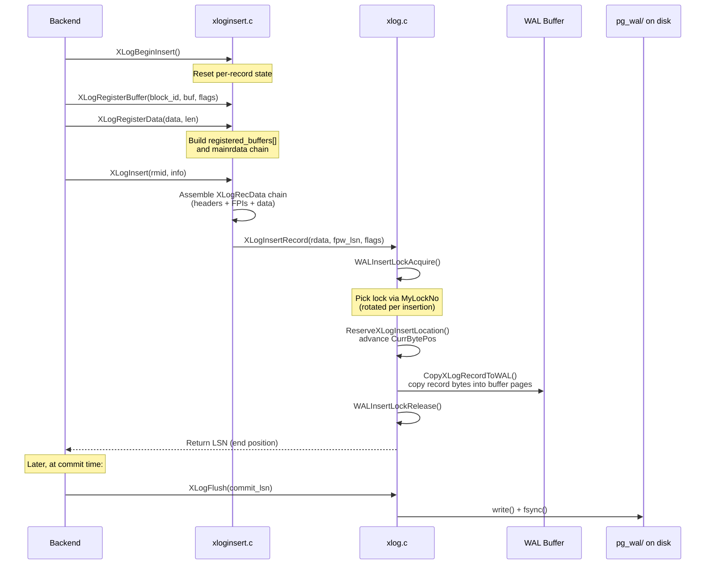

# WAL Internals: Buffers, LSNs, Records, and Insertion

## Summary

This page covers the internal machinery of WAL: how LSNs address the infinite
byte stream, how WAL records are structured on disk, how the WAL buffer ring
works, and how concurrent backends insert records with minimal contention. The
critical path -- from `XLogBeginInsert()` to the returned LSN -- touches
surprisingly few locks thanks to a design that separates reservation from
copying.

## Overview

The WAL subsystem can be understood as three layers:

1. **Record construction** (`xloginsert.c`) -- backends build a description of
   what changed using `XLogRegisterBuffer()` and `XLogRegisterData()`, then call
   `XLogInsert()` to assemble the final record.

2. **Space reservation and copying** (`xlog.c`) -- `XLogInsertRecord()` acquires
   one of `NUM_XLOGINSERT_LOCKS` (default 8) insertion locks, atomically reserves
   space in the WAL buffer by advancing `CurrBytePos`, copies the record, and
   releases the lock.

3. **Flush to disk** (`xlog.c`) -- `XLogFlush()` ensures all WAL up to a given
   LSN is on stable storage. This involves `write()` and `fsync()` (or equivalent)
   on the WAL segment files.

## Key Source Files

| File | Purpose |
|------|---------|
| `src/include/access/xlogrecord.h` | On-disk record format: `XLogRecord`, block headers, data headers |
| `src/include/access/xloginsert.h` | Insertion API: `XLogBeginInsert`, `XLogInsert`, `XLogRegisterBuffer` |
| `src/include/access/xlog_internal.h` | Page headers (`XLogPageHeaderData`), segment math, `XLogRecData` chain |
| `src/include/access/xlogdefs.h` | `XLogRecPtr` (LSN), `TimeLineID`, `XLogSegNo` |
| `src/backend/access/transam/xloginsert.c` | Record construction: assembles block headers, FPIs, main data |
| `src/backend/access/transam/xlog.c` | WAL buffer management, insertion locks, write/flush, segment files |

## How It Works

### LSN: Addressing the WAL Stream

An **LSN** (Log Sequence Number) is a 64-bit byte offset into the conceptual WAL
stream. It is defined as:

```c
/* src/include/access/xlogdefs.h:22 */
typedef uint64 XLogRecPtr;
```

LSNs are displayed in `X/YYYYYYYY` format, where `X` is the upper 32 bits and
`YYYYYYYY` is the lower 32 bits. For example, `0/1A3B5C00` means byte offset
`0x1A3B5C00` in the WAL.

The WAL stream is divided into **segment files** of `wal_segment_size` bytes
(default 16 MB). Segment files live in `$PGDATA/pg_wal/` with names like
`000000010000000000000001` (timeline 1, segment 1). The mapping from LSN to
segment and offset is:

```c
/* src/include/access/xlog_internal.h:117 */
#define XLByteToSeg(xlrp, logSegNo, wal_segsz_bytes) \
    logSegNo = (xlrp) / (wal_segsz_bytes)

#define XLogSegmentOffset(xlogptr, wal_segsz_bytes) \
    ((xlogptr) & ((wal_segsz_bytes) - 1))
```

### WAL Page Layout

Each WAL segment is divided into pages of `XLOG_BLCKSZ` (default 8 KB). Every
page starts with a header:

```c
/* src/include/access/xlog_internal.h:36 */
typedef struct XLogPageHeaderData
{
    uint16      xlp_magic;      /* magic value for correctness checks */
    uint16      xlp_info;       /* flag bits (XLP_LONG_HEADER, etc.) */
    TimeLineID  xlp_tli;        /* TimeLineID of first record on page */
    XLogRecPtr  xlp_pageaddr;   /* XLOG address of this page */
    uint32      xlp_rem_len;    /* remaining bytes from previous page's record */
} XLogPageHeaderData;
```

The first page of each segment file uses a **long page header** that adds the
system identifier, segment size, and block size for cross-checking:

```c
/* src/include/access/xlog_internal.h:61 */
typedef struct XLogLongPageHeaderData
{
    XLogPageHeaderData std;       /* standard header fields */
    uint64      xlp_sysid;        /* system identifier from pg_control */
    uint32      xlp_seg_size;     /* segment size cross-check */
    uint32      xlp_xlog_blcksz;  /* block size cross-check */
} XLogLongPageHeaderData;
```

When a record crosses a page boundary, the continuation page sets
`XLP_FIRST_IS_CONTRECORD` in `xlp_info` and stores the remaining byte count in
`xlp_rem_len`.

### WAL Record Format

Every WAL record starts with a fixed-size `XLogRecord` header, followed by zero
or more block reference headers, an optional data header, block data (including
possible full-page images), and main data:

```
 +------------------+
 | XLogRecord       |  24 bytes (fixed header)
 +------------------+
 | BlockHeader #0   |  variable (block ref + optional FPI header)
 | BlockHeader #1   |  ...
 | ...              |
 +------------------+
 | DataHeader       |  1-5 bytes (short or long form)
 +------------------+
 | Block #0 data    |  FPI and/or rmgr-specific per-block data
 | Block #1 data    |  ...
 +------------------+
 | Main data        |  rmgr-specific payload not tied to a block
 +------------------+
```

```c
/* src/include/access/xlogrecord.h:41 */
typedef struct XLogRecord
{
    uint32      xl_tot_len;   /* total len of entire record */
    TransactionId xl_xid;     /* xact id */
    XLogRecPtr  xl_prev;      /* ptr to previous record in log */
    uint8       xl_info;      /* flag bits: low 4 for WAL, high 4 for rmgr */
    RmgrId      xl_rmid;      /* resource manager for this record */
    /* 2 bytes of padding */
    pg_crc32c   xl_crc;       /* CRC for this record */
} XLogRecord;
```

The `xl_info` field packs two things: the low 4 bits (`XLR_INFO_MASK = 0x0F`)
carry WAL-level flags like `XLR_SPECIAL_REL_UPDATE`; the high 4 bits
(`XLR_RMGR_INFO_MASK = 0xF0`) are free for the resource manager to encode the
operation type (e.g., `XLOG_HEAP_INSERT`, `XLOG_BTREE_VACUUM`).

#### Block Reference Headers

Each block reference describes a page that was modified:

```c
/* src/include/access/xlogrecord.h:103 */
typedef struct XLogRecordBlockHeader
{
    uint8       id;             /* block reference ID (0..XLR_MAX_BLOCK_ID) */
    uint8       fork_flags;     /* fork + flags (HAS_IMAGE, HAS_DATA, etc.) */
    uint16      data_length;    /* rmgr payload bytes for this block */
    /* Optional: XLogRecordBlockImageHeader (if BKPBLOCK_HAS_IMAGE) */
    /* Optional: RelFileLocator (unless BKPBLOCK_SAME_REL) */
    /* Always: BlockNumber */
} XLogRecordBlockHeader;
```

When `BKPBLOCK_HAS_IMAGE` is set, a **full-page image (FPI)** follows. The image
can be compressed (pglz, LZ4, or zstd) and the "hole" of zeros in the middle of
standard pages is removed to save space:

```c
/* src/include/access/xlogrecord.h:141 */
typedef struct XLogRecordBlockImageHeader
{
    uint16      length;         /* page image bytes (after hole removal) */
    uint16      hole_offset;    /* bytes before the "hole" */
    uint8       bimg_info;      /* BKPIMAGE_HAS_HOLE, compression flags */
} XLogRecordBlockImageHeader;
```

### WAL Buffer: The Ring Buffer

WAL records are not written directly to disk. They are first assembled in a
**ring buffer** of shared memory pages. The size is controlled by `wal_buffers`
(auto-tuned to 1/32 of `shared_buffers`, clamped between 64 KB and the WAL
segment size).

The ring buffer state lives in `XLogCtlData` (defined in `src/backend/access/transam/xlog.c:453`):

```c
typedef struct XLogCtlData
{
    XLogCtlInsert Insert;            /* insertion state */

    XLogwrtRqst   LogwrtRqst;        /* write/flush request pointers */
    XLogRecPtr    RedoRecPtr;        /* cached redo pointer */

    /* Atomic progress counters -- no lock needed to read */
    pg_atomic_uint64 logInsertResult; /* last byte + 1 inserted */
    pg_atomic_uint64 logWriteResult;  /* last byte + 1 written to kernel */
    pg_atomic_uint64 logFlushResult;  /* last byte + 1 fsynced */

    XLogRecPtr    InitializedUpTo;   /* latest initialized buffer page */
    char         *pages;             /* buffer pages array */
    pg_atomic_uint64 *xlblocks;      /* end-LSN of each buffer page */
    int           XLogCacheBlck;     /* highest buffer index */
    /* ... timeline, recovery state, checkpoint info ... */
} XLogCtlData;
```

The three atomic counters -- `logInsertResult`, `logWriteResult`, `logFlushResult` --
track how far the WAL has progressed through each stage. The invariant is:

```
FlushResult <= WriteResult <= InsertResult
```

### Insertion: Reserving Space and Copying

The insertion path is optimized for high concurrency. Here is the sequence:



#### WAL Insertion Locks

PostgreSQL uses `NUM_XLOGINSERT_LOCKS` (8) lightweight locks to allow concurrent
WAL insertion. Each lock tracks how far its holder has progressed:

```c
/* src/backend/access/transam/xlog.c:370 */
typedef struct
{
    LWLock      lock;
    pg_atomic_uint64 insertingAt;     /* LSN being inserted at */
    XLogRecPtr  lastImportantAt;      /* LSN of last important record */
} WALInsertLock;
```

A backend acquires *one* lock to insert. To flush WAL, the flusher must wait
for all insertion locks whose `insertingAt` falls within the flush range --
but it does *not* need to acquire them. This avoids deadlocks between
concurrent inserters that need to evict old WAL buffer pages.

The lock assignment rotates across calls to distribute contention:

```c
/* src/backend/access/transam/xlog.c (WALInsertLockAcquire) */
MyLockNo++;
if (MyLockNo >= NUM_XLOGINSERT_LOCKS)
    MyLockNo = 0;
```

#### Space Reservation

The actual reservation is a spinlock-protected update of two 64-bit values:

```c
/* src/backend/access/transam/xlog.c (XLogCtlInsert) */
typedef struct XLogCtlInsert
{
    slock_t     insertpos_lck;   /* protects CurrBytePos and PrevBytePos */
    uint64      CurrBytePos;     /* end of reserved WAL (usable byte pos) */
    uint64      PrevBytePos;     /* start of previous record */
    /* ... */
} XLogCtlInsert;
```

These are "usable byte positions" that exclude page headers. The function
`XLogBytePosToRecPtr()` converts them to real LSNs by adding back the page
header space. This makes the reservation arithmetic simpler -- it is just a
plain addition of the record length.

### Full-Page Writes (FPW)

The first time a page is modified after a checkpoint, the entire page image is
included in the WAL record. This protects against **torn pages** -- partial
writes where only some of the 8 KB page makes it to disk during a crash.

The decision is made during `XLogInsert()`:

1. Check if the page's LSN is older than `RedoRecPtr` (the current checkpoint's
   redo point, cached in `XLogCtlInsert.RedoRecPtr`).
2. If yes, and `fullPageWrites` is enabled, set `BKPBLOCK_HAS_IMAGE` and include
   the page image.

The `REGBUF_STANDARD` flag tells the insertion code that the page follows the
standard layout (`pd_lower`/`pd_upper`), so the "hole" between them can be
skipped to save space. With `wal_compression` enabled, the image is further
compressed using pglz, LZ4, or zstd.

### WAL Levels

The `wal_level` GUC controls how much information is written:

```c
/* src/include/access/xlog.h:73 */
typedef enum WalLevel
{
    WAL_LEVEL_MINIMAL = 0,    /* crash recovery only */
    WAL_LEVEL_REPLICA,        /* + standby support (hot standby, streaming) */
    WAL_LEVEL_LOGICAL,        /* + logical decoding info */
} WalLevel;
```

At `minimal`, some bulk operations (e.g., `CREATE TABLE AS`, `COPY` into a
just-created table) skip WAL entirely and just fsync the data files. At
`replica` and above, all changes are logged to support replication.

### WAL Write and Flush

Writing WAL to disk is a two-step process:

1. **Write** -- `write()` system call copies WAL from shared memory to the
   kernel page cache. Updates `logWriteResult`.
2. **Flush** -- `fsync()` (or equivalent per `wal_sync_method`) forces the
   kernel to push data to stable storage. Updates `logFlushResult`.

The `wal_sync_method` GUC selects the flush method:

```c
/* src/include/access/xlog.h:24 */
enum WalSyncMethod
{
    WAL_SYNC_METHOD_FSYNC = 0,
    WAL_SYNC_METHOD_FDATASYNC,
    WAL_SYNC_METHOD_OPEN,            /* O_SYNC */
    WAL_SYNC_METHOD_FSYNC_WRITETHROUGH,
    WAL_SYNC_METHOD_OPEN_DSYNC       /* O_DSYNC */
};
```

With `open_datasync`, the file is opened with `O_DSYNC` so every `write()` is
implicitly synced, eliminating the separate fsync call.

### Group Commit and CommitDelay

When `synchronous_commit = on` (the default), each committing backend calls
`XLogFlush()`. If multiple backends commit concurrently, they naturally
**group commit** -- the first one to call `XLogFlush()` will flush WAL that
covers all of them.

The `CommitDelay` and `CommitSiblings` GUCs add an intentional delay before
flushing, to increase the batch size when there are enough concurrent
committers.

## Key Data Structures

### XLogRecData (in-memory record chain)

```c
/* src/include/access/xlog_internal.h:312 */
typedef struct XLogRecData
{
    struct XLogRecData *next;   /* next chunk in chain, or NULL */
    const void *data;           /* pointer to data */
    uint32      len;            /* length of data */
} XLogRecData;
```

This linked list is built by `xloginsert.c` during record construction. The
chain includes the `XLogRecord` header, block headers, FPI data, per-block
data, and main data, in order. `XLogInsertRecord()` walks this chain to copy
bytes into the WAL buffer.

### RmgrData (resource manager callbacks)

```c
/* src/include/access/xlog_internal.h:339 */
typedef struct RmgrData
{
    const char *rm_name;
    void (*rm_redo)(XLogReaderState *record);     /* replay a record */
    void (*rm_desc)(StringInfo buf, XLogReaderState *record); /* describe */
    const char *(*rm_identify)(uint8 info);       /* name an operation */
    void (*rm_startup)(void);                     /* startup hook */
    void (*rm_cleanup)(void);                     /* cleanup hook */
    void (*rm_mask)(char *pagedata, BlockNumber blkno); /* mask for checking */
    void (*rm_decode)(...);                       /* logical decoding */
} RmgrData;
```

Each resource manager (heap, btree, gin, etc.) registers these callbacks.
During recovery, the main loop calls `rm_redo()` for each record.

## Connections

- **[Checkpoints](checkpoints)** -- checkpoints advance the `RedoRecPtr`, which
  controls when full-page writes are needed and which WAL can be recycled.

- **[Recovery](recovery)** -- the recovery loop reads records from the WAL using
  `XLogReadRecord()` and dispatches them to resource managers via `rm_redo()`.

- **[Storage Engine (Ch. 1)](../01-storage/)** -- every buffer page carries
  `pd_lsn` (the LSN of the last WAL record that modified it). The buffer manager
  ensures WAL is flushed to this LSN before writing the page to disk.

- **[Locking (Ch. 5)](../05-locking/)** -- the WAL insertion locks are
  lightweight locks. `WALWriteLock` serializes writes to disk.

- **[Replication (Ch. 12)](../12-replication/)** -- the WAL sender reads from
  WAL segment files (or directly from WAL buffers via `WALReadFromBuffers()`)
  and streams records to standbys.
