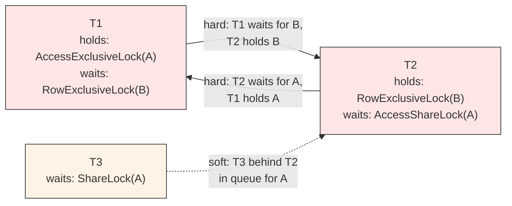

# Deadlock Detection

PostgreSQL uses an optimistic approach to deadlocks: a backend sleeps
immediately when it cannot acquire a lock, then runs deadlock detection only
if the wait exceeds `DeadlockTimeout` (default: 1 second). The detector
builds a waits-for graph, searches for cycles, and attempts to resolve them
by rearranging wait queues before resorting to transaction abort.

## Overview

Because users can request locks in any order, deadlocks are possible with
heavyweight locks. Rather than preventing them (which would require
restricting lock ordering), PostgreSQL detects and breaks them after the
fact. The algorithm distinguishes between "hard" edges (blocked by a held
lock) and "soft" edges (blocked by queue ordering), and can sometimes resolve
deadlocks by reordering a wait queue instead of aborting a transaction.

## Key Source Files

| File | Purpose |
|------|---------|
| `src/backend/storage/lmgr/deadlock.c` | `DeadLockCheck`, `FindLockCycle`, `TopoSort` |
| `src/backend/storage/lmgr/proc.c` | `ProcSleep` -- sets the deadlock timer, handles wakeup |
| `src/backend/storage/lmgr/lock.c` | `ProcLockWakeup` -- wakes waiters after lock release or reorder |
| `src/include/storage/lock.h` | `DeadLockState` enum, function prototypes |

## How It Works

### Triggering the Check

```
ProcSleep(lockMethodTable, lockmode, lock, proclock)
  |
  +-- Insert self into lock->waitProcs queue
  +-- Release partition LWLock
  +-- Set timer: DeadlockTimeout (default 1000 ms)
  +-- PGSemaphoreLock(MyProc->sem)  -- sleep
  |
  +-- [If timer fires before lock is granted:]
        DeadLockCheck(MyProc)
          |
          +-- Acquire ALL 16 lock-manager partition LWLocks
          |     (in partition-number order to prevent LWLock deadlock)
          |
          +-- Run the detection algorithm (see below)
          |
          +-- Release all partition LWLocks
          |
          +-- Return DeadLockState:
                DS_NO_DEADLOCK        -- go back to sleep
                DS_SOFT_DEADLOCK      -- resolved by queue reorder
                DS_HARD_DEADLOCK      -- must abort this transaction
                DS_BLOCKED_BY_AUTOVACUUM -- send cancel to autovacuum
```

### The Waits-For Graph (WFG)

The detector constructs a directed graph where:

- **Nodes** are processes (or more precisely, lock group leaders).
- **Hard edges**: Process A waits for process B because B **holds** a lock
  that conflicts with A's request.
- **Soft edges**: Process A waits for process B because B is **ahead of A in
  a wait queue** and B's request conflicts with A's request.



```
Hard edge:  A is waiting, B holds a conflicting lock

  A ---hard---> B

Soft edge:  A is behind B in the same wait queue, their requests conflict

  A ---soft---> B

A cycle involving only hard edges = HARD DEADLOCK (must abort).
A cycle involving at least one soft edge = SOFT DEADLOCK (may resolve
by reordering the wait queue to reverse a soft edge).
```

### The Detection Algorithm

```
DeadLockCheck(startProc)
  |
  +-- DeadLockCheckRecurse(startProc):
  |     |
  |     +-- FindLockCycle(startProc, softEdges, &nSoftEdges)
  |     |     |
  |     |     +-- For each lock the startProc is waiting on:
  |     |     |     For each PROCLOCK holding a conflicting lock:
  |     |     |       Add hard edge: startProc -> holder
  |     |     |       Recurse: FindLockCycle(holder, ...)
  |     |     |
  |     |     +-- For each proc ahead of startProc in the wait queue
  |     |     |   whose request conflicts with startProc's request:
  |     |     |     Add soft edge: startProc -> that proc
  |     |     |     Recurse: FindLockCycle(that proc, ...)
  |     |     |
  |     |     +-- If recursion returns to startProc: CYCLE FOUND
  |     |           Collect all soft edges in the cycle
  |     |           Return true
  |     |
  |     +-- If no cycle found: return DS_NO_DEADLOCK
  |     |
  |     +-- If cycle found with no soft edges: return DS_HARD_DEADLOCK
  |     |
  |     +-- If cycle has soft edges:
  |           Try reversing each soft edge (one at a time):
  |             1. Add constraint "move A before B" in B's wait queue
  |             2. ExpandConstraints: run topological sort on the queue
  |                If topo sort fails: conflicting constraints, skip
  |             3. TestConfiguration: re-run FindLockCycle on the
  |                proposed arrangement for startProc AND both A and B
  |             4. If no cycle found: ACCEPT this rearrangement
  |                Apply the new queue order via ProcLockWakeup
  |                Return DS_SOFT_DEADLOCK
  |             5. If cycle still found: recurse with additional
  |                constraints from the new cycle's soft edges
  |
  +-- If no rearrangement eliminates all cycles: DS_HARD_DEADLOCK
```

### Soft Edge Resolution Example

```
Initial state:          Lock L wait queue: [B, A, C]
                        B requests ShareLock
                        A requests ExclusiveLock (conflicts with B)
                        C requests ShareLock

Soft edge: A --soft--> B  (A is behind B, their requests conflict)

If a cycle exists through this soft edge, the detector can try
reversing it by moving A ahead of B:

Proposed queue:         [A, B, C]

Now B --soft--> A (reversed). If this eliminates the cycle and
creates no new cycles, apply the reordering.
```

### Topological Sort

When multiple soft edges need reversal, the constraints may conflict. The
detector uses a topological sort to compute a valid queue ordering:

```
TopoSort(lock, constraints, nConstraints, ordering)
  |
  +-- Build partial order from constraints:
  |     Each constraint "A before B" adds an edge A -> B
  |
  +-- Emit processes in order, preferring original queue position:
  |     At each step, emit the earliest-in-original-queue process
  |     that has no unsatisfied predecessors
  |
  +-- If unable to emit all processes: constraints are contradictory
        Return false (caller tries a different combination)
```

## Key Data Structures

```c
/* One edge in the waits-for graph */
typedef struct EDGE
{
    PGPROC  *waiter;    /* leader of the waiting lock group */
    PGPROC  *blocker;   /* leader of the blocking group */
    LOCK    *lock;      /* the lock being waited for */
    int      pred;      /* workspace for TopoSort */
    int      link;      /* workspace for TopoSort */
} EDGE;

/* A proposed reordering of a wait queue */
typedef struct WAIT_ORDER
{
    LOCK    *lock;      /* the lock whose queue is reordered */
    PGPROC **procs;     /* array of PGPROCs in new order */
    int      nProcs;
} WAIT_ORDER;

/* Information about each edge in a detected cycle (for error reporting) */
typedef struct DEADLOCK_INFO
{
    LOCKTAG   locktag;
    LOCKMODE  lockmode;
    int       pid;
} DEADLOCK_INFO;

/* Possible outcomes */
typedef enum DeadLockState
{
    DS_NOT_YET_CHECKED,
    DS_NO_DEADLOCK,
    DS_SOFT_DEADLOCK,       /* resolved by queue rearrangement */
    DS_HARD_DEADLOCK,       /* must abort */
    DS_BLOCKED_BY_AUTOVACUUM
} DeadLockState;
```

All working memory for the detector is pre-allocated at backend startup
(sized proportional to `MaxBackends`) to ensure the detector never runs out
of memory.

## Diagram: Deadlock Cycle Detection

```
Transaction T1: holds AccessExclusiveLock on Table A,
                waits for RowExclusiveLock on Table B

Transaction T2: holds RowExclusiveLock on Table B,
                waits for AccessShareLock on Table A

Waits-for graph:

    T1 ---hard---> T2  (T1 waits for B, T2 holds B)
     ^              |
     |              |
     +-hard---------+  (T2 waits for A, T1 holds A)

Cycle found: T1 -> T2 -> T1
No soft edges -> HARD DEADLOCK
The detecting process (whichever ran DeadLockCheck) aborts.
```

## Autovacuum Cancellation

The deadlock detector is also used to implement autovacuum's low locking
priority. When a cycle (or blocking chain) involves an autovacuum worker,
the detector returns `DS_BLOCKED_BY_AUTOVACUUM` instead of
`DS_HARD_DEADLOCK`. The caller then sends a cancel signal to the autovacuum
worker, allowing the user's DDL to proceed without aborting a user
transaction.

## Correctness Guarantees

1. **No missed deadlocks.** The last process to form a cycle will always
   detect it when its `DeadlockTimeout` fires.

2. **No unnecessary aborts.** If a soft-edge rearrangement can break the
   cycle, the detector will find it before resorting to abort.

3. **No new deadlocks from rearrangement.** The detector verifies the
   proposed queue order by re-running `FindLockCycle` from the start process
   and from both endpoints of every reversed edge.

4. **Victim selection is arbitrary.** The process that happens to run
   `DeadLockCheck` first becomes the victim. This is typically the process
   that has been waiting longest (its timer fires first), but it is not
   guaranteed to be the "cheapest" transaction to abort.

## Connections

- **Heavyweight Locks**: The deadlock detector operates on LOCK and PROCLOCK
  structures, accessing them under all 16 partition LWLocks.
- **ProcSleep / ProcWakeup**: `ProcSleep` sets the deadlock timer and calls
  `DeadLockCheck`. `ProcLockWakeup` is called after queue rearrangement to
  wake any waiters that are now grantable.
- **Group Locking**: The detector considers lock group leaders as
  representatives. An edge from A to B means A's group is blocked by B's
  group.
- **log_lock_waits GUC**: When enabled, a log message is emitted after
  `DeadlockTimeout` if the process is still waiting (even if no deadlock is
  found). This is useful for diagnosing lock contention.
- **pg_stat_activity**: The `wait_event_type = 'Lock'` and `wait_event`
  columns show which heavyweight lock a backend is waiting for.
