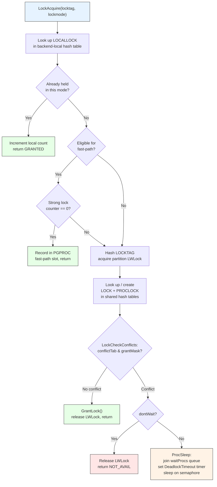

# Heavyweight Locks

Heavyweight locks (also called "regular locks") are the primary mechanism for
coordinating user-visible operations -- DDL, DML, explicit `LOCK TABLE`, and
advisory locks. They support eight lock modes with a table-driven conflict
matrix, full deadlock detection, and automatic release at transaction end.

## Overview

Every SQL statement acquires at least one heavyweight lock. A `SELECT`
acquires `AccessShareLock` on the target relation; an `ALTER TABLE` acquires
`AccessExclusiveLock`. The lock manager records these in shared-memory hash
tables (LOCK and PROCLOCK), checks for conflicts using a bitmask-based
conflict matrix, and queues waiters in FIFO order when conflicts exist.

Because the shared hash tables can become a contention bottleneck, PostgreSQL
provides a **fast-path** mechanism that lets backends record certain common,
non-conflicting locks in a per-backend array, bypassing the shared tables
entirely.

## Key Source Files

| File | Purpose |
|------|---------|
| `src/backend/storage/lmgr/lock.c` | Core lock manager: hash tables, conflict checking, fast-path |
| `src/include/storage/lock.h` | LOCK, PROCLOCK, LOCALLOCK structs; LOCKTAG; function prototypes |
| `src/include/storage/lockdefs.h` | Lock mode constants and LOCKMASK type |
| `src/backend/storage/lmgr/lmgr.c` | High-level wrappers: `LockRelation`, `UnlockRelation`, etc. |
| `src/backend/storage/lmgr/proc.c` | `ProcSleep` / `ProcWakeup` -- backend sleep/wake on lock waits |
| `src/backend/storage/lmgr/README` | Authoritative design document |

## Lock Modes and the Conflict Matrix

PostgreSQL defines eight lock modes, numbered 1-8:

| # | Lock Mode | Typical SQL | Conflicts With |
|---|-----------|-------------|----------------|
| 1 | `AccessShareLock` | `SELECT` | 8 |
| 2 | `RowShareLock` | `SELECT FOR UPDATE/SHARE` | 7, 8 |
| 3 | `RowExclusiveLock` | `INSERT`, `UPDATE`, `DELETE` | 5, 6, 7, 8 |
| 4 | `ShareUpdateExclusiveLock` | `VACUUM`, `ANALYZE`, `CREATE INDEX CONCURRENTLY` | 4, 5, 6, 7, 8 |
| 5 | `ShareLock` | `CREATE INDEX` | 3, 4, 6, 7, 8 |
| 6 | `ShareRowExclusiveLock` | `CREATE TRIGGER`, some `ALTER TABLE` | 3, 4, 5, 6, 7, 8 |
| 7 | `ExclusiveLock` | Blocks `ROW SHARE` | 2, 3, 4, 5, 6, 7, 8 |
| 8 | `AccessExclusiveLock` | `ALTER TABLE`, `DROP`, `VACUUM FULL`, `LOCK TABLE` | 1, 2, 3, 4, 5, 6, 7, 8 |

### Full Conflict Matrix

A cell marked `X` means the two modes conflict (cannot be held simultaneously
on the same object by different transactions):

```
                  Requested Lock Mode
              1    2    3    4    5    6    7    8
Held    1          .    .    .    .    .    .    X
        2          .    .    .    .    .    X    X
        3          .    .    .    X    X    X    X
        4          .    .    .    X    X    X    X
        5          .    .    X    X    .    X    X
        6          .    .    X    X    X    X    X
        7          .    X    X    X    X    X    X
        8          X    X    X    X    X    X    X

Key: 1=AccessShare 2=RowShare 3=RowExclusive 4=ShareUpdateExclusive
     5=Share 6=ShareRowExclusive 7=Exclusive 8=AccessExclusive
```

The conflict table is implemented as a C array of bitmasks:

```c
static const LOCKMASK LockConflicts[] = {
    0,
    /* AccessShareLock */      LOCKBIT_ON(AccessExclusiveLock),
    /* RowShareLock */         LOCKBIT_ON(ExclusiveLock) |
                               LOCKBIT_ON(AccessExclusiveLock),
    /* RowExclusiveLock */     LOCKBIT_ON(ShareLock) |
                               LOCKBIT_ON(ShareRowExclusiveLock) |
                               LOCKBIT_ON(ExclusiveLock) |
                               LOCKBIT_ON(AccessExclusiveLock),
    /* ... and so on for each mode ... */
};
```

Conflict checking is a single bitwise AND:

```c
if (lockMethodTable->conflictTab[lockmode] & lock->grantMask)
    /* conflict exists */
```

## How It Works

### Lock Acquisition Flow



```
LockAcquire(locktag, lockmode, sessionLock, dontWait)
  |
  +-- Look up / create LOCALLOCK in backend-local hash table
  |     If already held in this mode: increment local count, return
  |
  +-- Attempt fast-path? (see "Fast-Path Locking" below)
  |     If eligible and no strong lock conflicts: record in PGPROC, return
  |
  +-- Compute hash of LOCKTAG -> determine partition
  |
  +-- Acquire partition LWLock (exclusive)
  |
  +-- Look up / create LOCK in shared hash table
  |     Look up / create PROCLOCK in shared hash table
  |
  +-- LockCheckConflicts():
  |     conflictMask = conflictTab[lockmode] & lock->grantMask
  |     Exclude locks held by our own lock group (parallel queries)
  |     If no conflict: GrantLock(), release LWLock, return
  |
  +-- If dontWait: release LWLock, return LOCKACQUIRE_NOT_AVAIL
  |
  +-- ProcSleep():
        Insert into lock->waitProcs queue (usually at tail)
        Exception: if we already hold locks that conflict with
          an earlier waiter, insert just ahead of that waiter
        Release partition LWLock
        Set a timer for DeadlockTimeout (default 1s)
        Sleep on semaphore
        If timer fires: run DeadLockCheck() (see deadlock-detection chapter)
        When woken: lock has been granted by ProcLockWakeup
```

### Lock Release Flow

```
LockRelease(locktag, lockmode, sessionLock)
  |
  +-- Find LOCALLOCK
  |     Decrement local count
  |     If count > 0: return (still held by other request in same backend)
  |
  +-- If fast-path lock: clear the PGPROC slot, return
  |
  +-- Acquire partition LWLock
  |     Decrement LOCK.granted[lockmode] and LOCK.nGranted
  |     Update PROCLOCK.holdMask and LOCK.grantMask
  |
  +-- ProcLockWakeup(lock):
  |     Scan waitProcs queue front-to-back
  |     Wake each waiter whose request does not conflict with:
  |       (a) currently granted locks, OR
  |       (b) requests of earlier un-woken waiters
  |
  +-- Release partition LWLock
```

## Key Data Structures

### LOCKTAG -- Identifying the Locked Object

```c
typedef struct LOCKTAG
{
    uint32  locktag_field1;     /* e.g., database OID */
    uint32  locktag_field2;     /* e.g., relation OID */
    uint32  locktag_field3;     /* e.g., block number */
    uint16  locktag_field4;     /* e.g., offset number */
    uint8   locktag_type;       /* LockTagType enum */
    uint8   locktag_lockmethodid; /* DEFAULT_LOCKMETHOD or USER_LOCKMETHOD */
} LOCKTAG;   /* exactly 16 bytes, no padding */
```

Lock tag types include: `LOCKTAG_RELATION`, `LOCKTAG_TUPLE`,
`LOCKTAG_TRANSACTION`, `LOCKTAG_VIRTUALTRANSACTION`, `LOCKTAG_ADVISORY`,
and several others.

### LOCK -- Per-Object State in Shared Memory

```c
typedef struct LOCK
{
    LOCKTAG     tag;                        /* unique identifier */
    LOCKMASK    grantMask;                  /* bitmask of granted lock types */
    LOCKMASK    waitMask;                   /* bitmask of awaited lock types */
    dlist_head  procLocks;                  /* list of PROCLOCKs for this lock */
    dclist_head waitProcs;                  /* queue of waiting PGPROCs */
    int         requested[MAX_LOCKMODES];   /* requested count per mode */
    int         nRequested;                 /* total requested */
    int         granted[MAX_LOCKMODES];     /* granted count per mode */
    int         nGranted;                   /* total granted */
} LOCK;
```

### PROCLOCK -- Per-Backend-Per-Object State

```c
typedef struct PROCLOCK
{
    PROCLOCKTAG tag;            /* (LOCK*, PGPROC*) pair */
    PGPROC     *groupLeader;   /* lock group leader (for parallel query) */
    LOCKMASK    holdMask;       /* bitmask of modes held by this backend */
    LOCKMASK    releaseMask;    /* workspace for LockReleaseAll */
    dlist_node  lockLink;       /* link in LOCK's procLocks list */
    dlist_node  procLink;       /* link in PGPROC's procLocks list */
} PROCLOCK;
```

### LOCALLOCK -- Per-Backend Local Cache

```c
typedef struct LOCALLOCK
{
    LOCALLOCKTAG tag;           /* (LOCKTAG, LOCKMODE) */
    uint32       hashcode;      /* cached hash for partition lookup */
    LOCK        *lock;          /* pointer to shared LOCK (NULL if fast-path) */
    PROCLOCK    *proclock;      /* pointer to shared PROCLOCK (NULL if fast-path) */
    int64        nLocks;        /* total hold count in this backend */
    int          numLockOwners;
    int          maxLockOwners;
    LOCALLOCKOWNER *lockOwners; /* per-ResourceOwner hold counts */
    bool         holdsStrongLockCount;
    bool         lockCleared;
} LOCALLOCK;
```

### Relationship Diagram

```
  Backend-local                  Shared Memory
  +-----------+
  | LOCALLOCK |--+
  | (tag,     |  |    +--------+          +----------+
  |  nLocks,  |  +--->| LOCK   |<-------->| PROCLOCK |
  |  lock*,   |       | tag    |  procLocks| holdMask |
  |  proclock*|       | grant  |          | myLock*  |
  +-----------+       | Mask   |          | myProc*  |
                      | wait   |          +----------+
                      | Procs  |               |
                      +--------+               v
                                          +--------+
                                          | PGPROC |
                                          | (per-  |
                                          | backend|
                                          | struct)|
                                          +--------+
```

## Fast-Path Locking

The fast-path mechanism avoids the shared hash tables for the most common
lock acquisitions. It is eligible when all of the following are true:

1. The lock uses `DEFAULT_LOCKMETHOD`.
2. The target is an unshared relation (not a shared catalog).
3. The requested mode is "weak": `AccessShareLock`, `RowShareLock`, or
   `RowExclusiveLock`.
4. No conflicting "strong" locks exist for this relation's hash partition.

### How Fast-Path Works

Each PGPROC has an array of `FP_LOCK_SLOTS_PER_BACKEND` (typically 16) slots:

```c
/* In PGPROC: */
Oid         fpRelId[FP_LOCK_SLOTS_PER_BACKEND];    /* relation OIDs */
LOCKMASK    fpLockBits[FP_LOCK_SLOTS_PER_BACKEND];  /* held lock modes */
```

A global array `FastPathStrongRelationLocks` contains 1024 counters. Each
counter tracks how many "strong" locks (modes 4-8) are held on relations
whose hash falls in that partition:

```
Acquisition:
  1. Lock the per-backend LWLock
  2. Hash the relation OID into the 1024-way partition
  3. Check FastPathStrongRelationLocks[partition]
     If zero: record lock in fpRelId/fpLockBits, done
     If nonzero: fall through to the main lock manager

Strong lock acquisition:
  1. Increment FastPathStrongRelationLocks[partition]
  2. Scan ALL backends' fast-path arrays for matching weak locks
  3. Transfer any found locks to the main lock table
  4. Proceed with normal lock acquisition
```

This design ensures that the common case (many `SELECT`s on the same table)
never touches the shared lock hash table or its partition LWLock.

## Partitioning

The lock manager's shared hash tables are divided into 16 partitions
(`NUM_LOCK_PARTITIONS = 16`), each protected by its own LWLock:

```c
#define LockHashPartition(hashcode)  ((hashcode) % NUM_LOCK_PARTITIONS)
#define LockHashPartitionLock(hashcode) \
    (&MainLWLockArray[LOCK_MANAGER_LWLOCK_OFFSET + \
        LockHashPartition(hashcode)].lock)
```

Normal lock acquisition and release only touch one partition. Deadlock
detection acquires all 16 partition locks in order (to avoid LWLock deadlock).

## Group Locking (Parallel Query)

In parallel query, the leader and workers share a lock group. Locks held by
any member of the group are considered non-conflicting with requests from
other members (except for relation extension locks). This prevents
self-deadlock scenarios where a worker tries to lock a relation the leader
already holds exclusively.

Group membership is tracked through `PGPROC.lockGroupLeader` and
`PGPROC.lockGroupMembers`, protected by a lock-manager partition LWLock
determined by the leader's `pgprocno`.

## Advisory Locks

Advisory locks use `USER_LOCKMETHOD` and `LOCKTAG_ADVISORY`. They share the
same conflict matrix as regular locks but are entirely application-driven.
They can be held at session level (surviving transaction boundaries) or at
transaction level (released at commit/abort).

## Connections

- **LWLocks**: Each lock manager partition is protected by an LWLock. The
  fast-path per-backend arrays are also protected by per-backend LWLocks.
- **Deadlock Detection**: Described in the next chapter. Triggered by a timer
  after `DeadlockTimeout` milliseconds of waiting.
- **MVCC / Transactions**: Heavyweight locks are released by
  `LockReleaseAll()` at transaction commit or abort. The `ResourceOwner`
  mechanism tracks which locks belong to which transaction or subtransaction.
- **Hot Standby**: During recovery, the startup process acquires
  `AccessExclusiveLock` on behalf of the primary. Regular backends on the
  standby can only acquire locks up to `RowExclusiveLock`, ensuring they
  never conflict with each other.
- **pg_locks View**: The `pg_locks` system view queries `GetLockStatusData()`
  to display all currently held and awaited locks, including fast-path locks.
