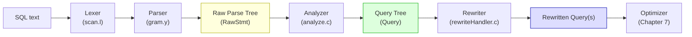
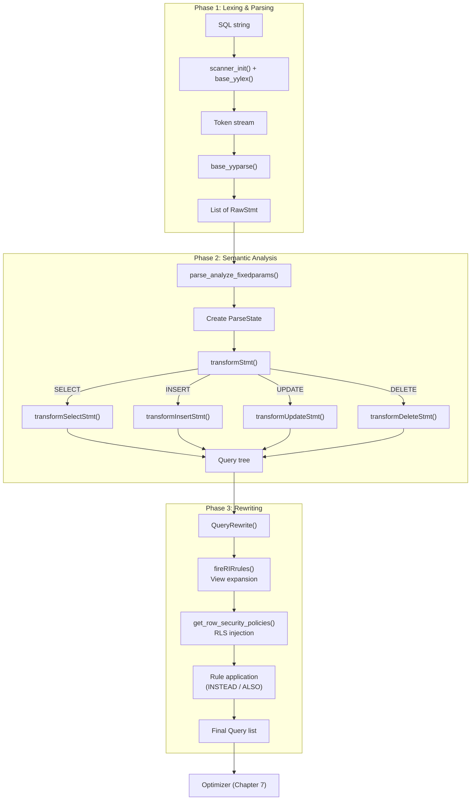

# Chapter 6: Parsing & Rewriting

**Summary.** Every SQL statement enters PostgreSQL as a plain text string and must be transformed into an executable internal representation before any real work can happen. This chapter traces that transformation through three distinct phases: lexing/parsing (text to raw parse tree), semantic analysis (raw parse tree to Query tree), and rewriting (Query tree expansion via rules and row-level security). Together these phases form the "front end" of the query pipeline, and they run entirely before the optimizer ever sees the statement.

---

## Overview

When a client sends `SELECT name FROM employees WHERE id = 42;`, the backend must answer three questions in sequence:

1. **Is the SQL syntactically valid?** The lexer (`scan.l`) tokenizes the string and the parser (`gram.y`) checks it against the SQL grammar, producing a **raw parse tree** -- a tree of unresolved node structs that mirrors the syntactic structure. No catalog access happens here; the parser does not know whether `employees` is a real table.

2. **Is the SQL semantically valid?** The analyzer (`analyze.c` and its helpers) resolves names against the system catalog, checks types, inserts implicit coercions, and produces a **Query tree** with fully resolved OIDs, type information, and a populated range table.

3. **Should the query be rewritten?** The rewrite system (`rewriteHandler.c`) expands views into their defining queries, applies `CREATE RULE` rules, and injects row-level security (RLS) qualifiers. A single input Query can produce zero, one, or many output Queries.

The optimizer (Chapter 7) only ever sees the final, rewritten Query trees.

## Key Source Files

| File | Purpose |
|------|---------|
| `src/backend/parser/scan.l` | Flex lexer -- tokenizes SQL text |
| `src/backend/parser/gram.y` | Bison grammar -- builds raw parse tree |
| `src/backend/parser/parser.c` | Entry point: `raw_parser()` |
| `src/backend/parser/analyze.c` | Top-level semantic analysis: `parse_analyze_fixedparams()` |
| `src/backend/parser/parse_coerce.c` | Type coercion and resolution |
| `src/backend/parser/parse_expr.c` | Expression transformation |
| `src/backend/parser/parse_clause.c` | FROM, WHERE, ORDER BY, GROUP BY |
| `src/backend/parser/parse_relation.c` | Range table construction |
| `src/backend/parser/parse_target.c` | Target list (SELECT columns) |
| `src/backend/parser/parse_func.c` | Function call resolution |
| `src/backend/parser/parse_oper.c` | Operator resolution |
| `src/backend/parser/parse_agg.c` | Aggregate validation |
| `src/backend/rewrite/rewriteHandler.c` | Rule application and view expansion |
| `src/backend/rewrite/rowsecurity.c` | Row-level security policy injection |
| `src/backend/rewrite/rewriteManip.c` | Tree manipulation helpers for rewriting |
| `src/include/nodes/parsenodes.h` | All parse-tree and Query-tree node definitions |

## How It Works

The entire front-end pipeline is driven from `exec_simple_query()` in `src/backend/tcop/postgres.c`. The call sequence is:

```
exec_simple_query(query_string)
  |
  +-- raw_parser(query_string)           --> List of RawStmt
  |
  +-- parse_analyze_fixedparams(rawstmt) --> Query
  |
  +-- QueryRewrite(query)                --> List of Query
  |
  +-- pg_plan_queries(querytree_list)    --> (Chapter 7)
```

For prepared statements, parsing and analysis happen at `PREPARE` time, while rewriting and planning happen at `EXECUTE` time.



## Key Data Structures

### RawStmt

The outermost wrapper around any raw parse tree node. Produced by `raw_parser()`.

```c
/* src/include/nodes/parsenodes.h */
typedef struct RawStmt
{
    NodeTag     type;
    Node       *stmt;           /* raw parse tree (e.g. SelectStmt) */
    ParseLoc    stmt_location;  /* byte offset in source text */
    ParseLoc    stmt_len;       /* length in bytes; 0 = rest of string */
} RawStmt;
```

The `stmt` field points to statement-specific nodes like `SelectStmt`, `InsertStmt`, `UpdateStmt`, etc. These are purely syntactic -- they store string names, not OIDs.

### Query

The central structure for a semantically analyzed statement. This is what the optimizer and executor ultimately consume.

```c
/* src/include/nodes/parsenodes.h (abbreviated) */
typedef struct Query
{
    NodeTag     type;
    CmdType     commandType;    /* CMD_SELECT, CMD_INSERT, ... */
    QuerySource querySource;    /* QSRC_ORIGINAL, QSRC_INSTEAD_RULE, ... */
    int64       queryId;        /* set by query jumbling */
    bool        canSetTag;
    Node       *utilityStmt;    /* non-null for CMD_UTILITY */
    int         resultRelation; /* rtable index of INSERT/UPDATE/DELETE target */

    /* Capability flags */
    bool        hasAggs;
    bool        hasWindowFuncs;
    bool        hasSubLinks;
    bool        hasRowSecurity; /* RLS policies were applied */
    /* ... */

    List       *cteList;        /* WITH clauses */
    List       *rtable;         /* range table: list of RangeTblEntry */
    FromExpr   *jointree;       /* FROM + WHERE */
    List       *targetList;     /* list of TargetEntry */
    List       *sortClause;
    List       *groupClause;
    Node       *havingQual;
    List       *windowClause;
    Node       *limitOffset;
    Node       *limitCount;
    /* ... */
} Query;
```

### RangeTblEntry (RTE)

Each entry in `Query.rtable` describes one "range" the query references -- a table, subquery, join, function, VALUES list, or CTE.

```c
typedef struct RangeTblEntry
{
    NodeTag     type;
    Alias      *alias;          /* user-written alias */
    Alias      *eref;           /* expanded column names */
    RTEKind     rtekind;        /* RTE_RELATION, RTE_SUBQUERY, RTE_JOIN, ... */

    /* For RTE_RELATION: */
    Oid         relid;          /* pg_class OID */
    bool        inh;            /* include inheritance children? */
    char        relkind;        /* 'r', 'v', 'm', ... */
    int         rellockmode;

    /* For RTE_SUBQUERY: */
    Query      *subquery;
    bool        security_barrier; /* from security_barrier view? */
    /* ... many more fields for joins, functions, CTEs, etc. */
} RangeTblEntry;
```

### ParseState

The mutable context threaded through all of semantic analysis. It tracks the range table being built, namespace for name resolution, current expression kind, and more.

```c
/* src/include/parser/parse_node.h */
typedef struct ParseState
{
    struct ParseState *parentParseState;  /* for subqueries */
    const char       *p_sourcetext;
    List             *p_rtable;          /* range table being built */
    List             *p_namespace;       /* name lookup scopes */
    int               p_next_resno;      /* next target list resno */
    /* ... many more fields */
} ParseState;
```

## Pipeline Diagram -- Full Detail



## Connections

| Related Subsystem | Relationship |
|---|---|
| [Query Optimizer (Ch. 7)](../07-query-optimizer/) | Consumes the rewritten Query tree list |
| [Executor (Ch. 8)](../08-executor/) | Executes utility statements that skip the optimizer |
| [Caches (Ch. 9)](../09-caches/) | Semantic analysis reads catalog caches heavily; plan cache stores Query trees |
| [Locking (Ch. 5)](../05-locking/) | `analyze.c` acquires `AccessShareLock` on referenced relations |
| [Transactions (Ch. 3)](../03-transactions/) | Parser runs inside the current transaction snapshot |

## Chapter Sections

| Section | Topic |
|---------|-------|
| [Lexer & Parser](lexer-parser) | `scan.l`, `gram.y`, raw parse tree construction |
| [Semantic Analysis](semantic-analysis) | `analyze.c`, type resolution, coercion |
| [Rewrite Rules](rewrite-rules) | View expansion, rule application, RLS injection |
