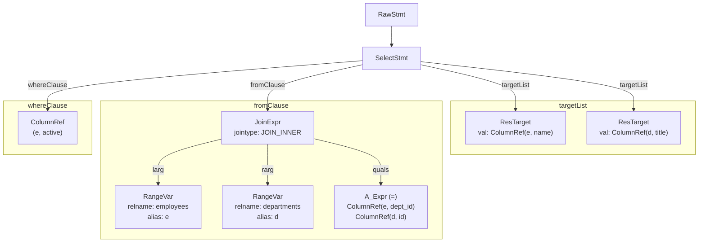

# Lexer & Parser

**Summary.** The first phase of query processing converts a raw SQL string into a **raw parse tree** -- a tree of C structs that faithfully represents the syntactic structure of the statement without any knowledge of the database catalog. This phase is split into two cooperating tools: a Flex-generated lexer (`scan.l`) that breaks text into tokens, and a Bison-generated parser (`gram.y`) that assembles tokens into tree nodes according to the SQL grammar. Because no catalog lookups occur, parsing can run even inside an aborted transaction.

---

## Overview

PostgreSQL's parser is a classic two-stage compiler front end:

1. **Lexical analysis (scanning):** The lexer reads characters from the SQL string and groups them into tokens -- keywords, identifiers, numeric literals, operators, string constants, and punctuation. It handles all the messy details: C-style comments, dollar-quoted strings, Unicode escapes, and keyword classification.

2. **Syntactic analysis (parsing):** The parser consumes the token stream and matches it against grammar rules. Each grammar rule has an associated action that constructs a parse-tree node. The final result is a `List` of `RawStmt` nodes, one per semicolon-separated statement in the input.

The entry point is `raw_parser()` in `src/backend/parser/parser.c`.

## Key Source Files

| File | Purpose |
|------|---------|
| `src/backend/parser/scan.l` | Flex specification -- lexer rules and token definitions |
| `src/backend/parser/gram.y` | Bison specification -- SQL grammar and parse-tree construction |
| `src/backend/parser/parser.c` | `raw_parser()` entry point; coordinates scanner and parser |
| `src/backend/parser/scansup.c` | Helper functions for string escaping during scanning |
| `src/backend/parser/gramparse.h` | Shared declarations between scanner and parser |
| `src/common/keywords.c` | Keyword table and lookup function (shared with frontend tools) |
| `src/include/parser/kwlist.h` | Master keyword list (included by `keywords.c`) |
| `src/include/nodes/parsenodes.h` | All raw parse tree node definitions |

## How It Works

### The Lexer: scan.l

`scan.l` is a Flex input file that compiles into `scan.c`. It defines patterns for every token PostgreSQL recognizes.

**Key responsibilities:**

- **Keyword recognition.** The lexer looks up each identifier in the keyword table. PostgreSQL classifies keywords into categories: `RESERVED_KEYWORD`, `UNRESERVED_KEYWORD`, `COL_NAME_KEYWORD`, and `TYPE_FUNC_NAME_KEYWORD`. Only reserved keywords cannot be used as identifiers; the other categories allow context-dependent use.

- **String literals.** Standard single-quoted strings, escape strings (`E'...'`), dollar-quoted strings (`$$...$$` or `$tag$...$tag$`), and Unicode escape strings (`U&'...'`).

- **Numeric literals.** Integers, floats, and numeric constants with optional exponents.

- **Operators.** Multi-character operators like `!=`, `>=`, `::`, and user-defined operator sequences.

- **Comments.** Single-line (`-- ...`) and block (`/* ... */`) comments, including nested block comments.

- **Start conditions.** The lexer uses Flex start conditions (like `<xc>` for comments, `<xq>` for quoted strings, `<xdolq>` for dollar-quoted strings) to handle multi-line constructs correctly.

**Token flow:**

```c
/* src/backend/parser/parser.c */
List *
raw_parser(const char *str, RawParseMode mode)
{
    core_yyscan_t yyscanner;
    base_yy_extra_type yyextra;

    /* Initialize flex scanner */
    yyscanner = scanner_init(str, &yyextra.core_yy_extra,
                             &ScanKeywords, ScanKeywordTokens);

    /* Initialize bison parser */
    parser_init(&yyextra);

    /* Parse -- bison calls yylex() as needed */
    base_yyparse(yyscanner);

    scanner_finish(yyscanner);
    return yyextra.parsetree;
}
```

The parser calls `base_yylex()` (a wrapper around the Flex-generated `core_yylex()`) each time it needs the next token. The wrapper handles lookahead injection for special parse modes (e.g., PL/pgSQL expression parsing).

### The Parser: gram.y

`gram.y` is one of the largest Bison grammars in any open-source project -- over 18,000 lines. It defines the complete SQL syntax PostgreSQL supports.

**Grammar structure:**

```
%union { ... }          -- Token/node value types (YYSTYPE)
%token ABORT_P ...      -- Terminal symbols (tokens from lexer)
%type <node> stmt ...   -- Non-terminal type declarations

%%
stmtblock:  stmtmulti { parsetree = $1; }
    ;

stmtmulti:  stmtmulti ';' toplevel_stmt
            { ... append RawStmt to list ... }
        |   toplevel_stmt
            { ... create initial list with RawStmt ... }
    ;

toplevel_stmt:  stmt    { ... wrap in RawStmt ... }
        |       /* EMPTY */
    ;

stmt:   SelectStmt
        | InsertStmt
        | UpdateStmt
        | DeleteStmt
        | CreateStmt
        | ...           /* ~200 statement types */
    ;
```

**Key grammar patterns:**

- **SelectStmt** covers `SELECT`, `VALUES`, and set operations (`UNION`, `INTERSECT`, `EXCEPT`). A `SELECT ... UNION SELECT` becomes a `SelectStmt` with `op = SETOP_UNION` and left/right children.

- **Expression rules** are layered to encode operator precedence: `a_expr` (general expressions), `b_expr` (no-operator-ambiguity subset), `c_expr` (atomic expressions like columns, constants, function calls).

- **Conflict resolution.** The grammar has a small number of known shift/reduce conflicts, handled by Bison's default shift preference and explicit `%prec` directives.

### Raw Parse Tree Nodes

Each grammar rule action calls `makeNode()` or a helper function to create a node struct. These are "raw" because they contain string names, not OIDs:

```c
/* Example: SelectStmt for "SELECT name FROM employees WHERE id = 42" */
typedef struct SelectStmt
{
    NodeTag     type;
    List       *targetList;     /* [ResTarget: name="name"] */
    List       *fromClause;     /* [RangeVar: relname="employees"] */
    Node       *whereClause;    /* A_Expr: lexpr=ColumnRef("id"),
                                          rexpr=A_Const(42),
                                          kind=AEXPR_OP, name="=" */
    /* ... groupClause, havingClause, sortClause, etc. */
} SelectStmt;
```

**Important raw-tree node types:**

| Node | Purpose |
|------|---------|
| `RawStmt` | Wrapper with source location; contains the actual statement node |
| `SelectStmt` | SELECT, VALUES, and set operations |
| `InsertStmt` | INSERT with optional ON CONFLICT |
| `UpdateStmt` | UPDATE with target list and WHERE |
| `DeleteStmt` | DELETE with USING and WHERE |
| `RangeVar` | A table reference by name (schema + relname) |
| `ColumnRef` | A column reference by name (possibly qualified) |
| `A_Expr` | An operator expression (arithmetic, comparison, etc.) |
| `A_Const` | A literal constant (integer, float, string, boolean, NULL) |
| `FuncCall` | A function invocation by name |
| `ResTarget` | A target-list item (SELECT column or assignment target) |
| `TypeCast` | An explicit `CAST(x AS type)` or `x::type` |
| `SortBy` | ORDER BY item with direction and nulls position |
| `JoinExpr` | An explicit JOIN in the FROM clause |
| `SubLink` | A subquery appearing in an expression (EXISTS, IN, etc.) |

### Parse Tree Example

For the query `SELECT e.name, d.title FROM employees e JOIN departments d ON e.dept_id = d.id WHERE e.active`:



## Key Data Structures

### RawParseMode

Controls the parser's initial mode. The default mode (`RAW_PARSE_DEFAULT`) handles normal SQL. Other modes let PL/pgSQL inject a synthetic first token to steer the grammar:

```c
typedef enum RawParseMode
{
    RAW_PARSE_DEFAULT = 0,
    RAW_PARSE_TYPE_NAME,
    RAW_PARSE_PLPGSQL_EXPR,
    RAW_PARSE_PLPGSQL_ASSIGN1,
    RAW_PARSE_PLPGSQL_ASSIGN2,
    RAW_PARSE_PLPGSQL_ASSIGN3,
} RawParseMode;
```

### Keyword Categories

The keyword table assigns each keyword a category that determines where it can appear as an identifier:

| Category | Can be column name? | Can be type/function name? | Example keywords |
|----------|--------------------|-|---|
| `RESERVED_KEYWORD` | No | No | `SELECT`, `FROM`, `WHERE` |
| `COL_NAME_KEYWORD` | Yes | No | `BETWEEN`, `LIKE` |
| `TYPE_FUNC_NAME_KEYWORD` | Yes | Yes | `INT`, `TEXT`, `SETOF` |
| `UNRESERVED_KEYWORD` | Yes | Yes | `ABORT`, `BEGIN`, `EXPLAIN` |

This classification keeps the grammar unambiguous while allowing most keywords to double as identifiers in appropriate contexts.

### YYSTYPE Union

The Bison `%union` holds all possible semantic values a grammar symbol can carry:

```c
%union
{
    core_YYSTYPE core_yystype;
    int          ival;
    char        *str;
    const char  *keyword;
    bool         boolean;
    Node        *node;
    List        *list;
    /* ... other fields for specific constructs */
}
```

## Performance Considerations

- **Grammar size.** The generated parser tables are large but the LALR(1) parse algorithm is O(n) in input length. Parsing is rarely a bottleneck.

- **Memory allocation.** All parse-tree nodes are allocated in the current memory context. After analysis, the raw parse tree is typically freed when its context is destroyed.

- **Multi-statement strings.** `raw_parser()` handles semicolon-separated statements in a single call, returning a list of `RawStmt` nodes. Each has `stmt_location` and `stmt_len` for error reporting and `pg_stat_statements` query normalization.

## Common Pitfalls

{: .warning }
> **Ambiguous grammar constructs.** Adding new syntax to `gram.y` requires careful attention to shift/reduce conflicts. PostgreSQL documents the expected number of conflicts in the Makefile; any new conflict must be analyzed and justified.

{: .warning }
> **No catalog access.** The raw parser must never access the catalog. If you see a table OID or type OID in a parse-tree node, you are looking at the analyzed tree (a `Query`), not the raw tree.

## Connections

| Related Section | Relationship |
|---|---|
| [Semantic Analysis](semantic-analysis) | Consumes the raw parse tree and resolves all names/types |
| [Rewrite Rules](rewrite-rules) | Operates on the analyzed Query, not the raw tree |
| [Caches (Ch. 9)](../09-caches/) | Plan cache stores raw parse trees for re-analysis on invalidation |
| [Extensions (Ch. 15)](../15-extensions/) | `parser_hook` allows extensions to inject custom parsing |
