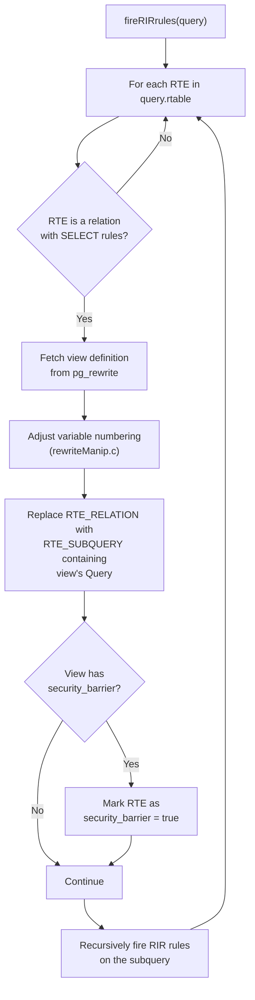
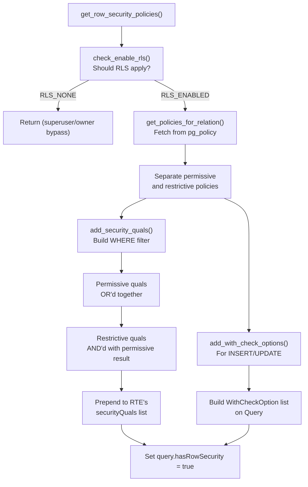
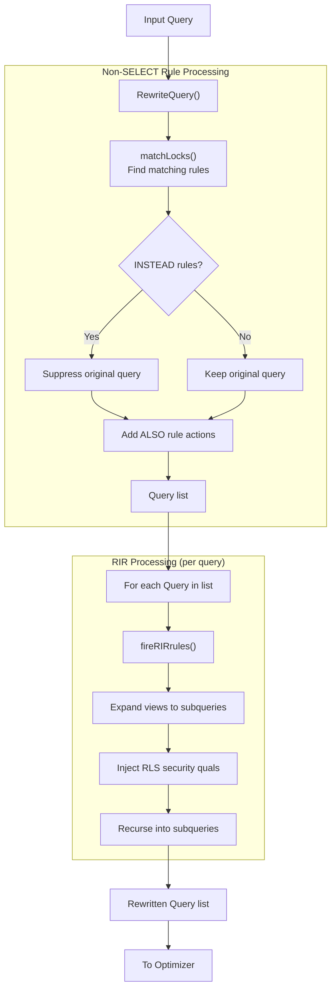

# Rewrite Rules

**Summary.** After semantic analysis produces a Query tree, the **rewrite system** transforms it further by expanding views into their underlying queries, applying user-defined rules (`CREATE RULE`), and injecting row-level security (RLS) policy qualifiers. A single input Query can become zero, one, or many output Queries. The rewriter is the last transformation before the optimizer, and it operates entirely on Query trees -- it never looks at raw parse trees or plan trees.

---

## Overview

PostgreSQL's rewrite system has its roots in the original POSTGRES project's rule system -- a mechanism for defining derived data and automatic actions. Today it serves three primary purposes:

1. **View expansion.** Views are implemented as `ON SELECT DO INSTEAD` rules. When a query references a view, the rewriter replaces the view's range table entry with the view's defining subquery.

2. **User-defined rules.** `CREATE RULE` attaches actions to INSERT, UPDATE, DELETE, or SELECT on a table. Rules can be `INSTEAD` (replacing the original action) or `ALSO` (adding actions alongside).

3. **Row-level security (RLS).** When RLS is enabled on a table, the rewriter injects policy-defined security qualifiers as additional WHERE conditions and WITH CHECK constraints.

The entry point is `QueryRewrite()` in `src/backend/rewrite/rewriteHandler.c`.

## Key Source Files

| File | Purpose |
|------|---------|
| `src/backend/rewrite/rewriteHandler.c` | Main rewrite logic: `QueryRewrite()`, `fireRIRrules()`, rule matching |
| `src/backend/rewrite/rewriteManip.c` | Tree manipulation: variable renumbering, subquery adjustments |
| `src/backend/rewrite/rewriteDefine.c` | `CREATE RULE` / `DROP RULE` implementation |
| `src/backend/rewrite/rewriteSupport.c` | Catalog lookups for rules |
| `src/backend/rewrite/rewriteSearchCycle.c` | SEARCH/CYCLE clause handling for recursive CTEs |
| `src/backend/rewrite/rowsecurity.c` | RLS policy retrieval and injection |
| `src/backend/rewrite/rewriteRemove.c` | Rule removal |
| `src/include/rewrite/rewriteHandler.h` | Public API |
| `src/include/rewrite/rowsecurity.h` | RLS enums and function declarations |

## How It Works

### QueryRewrite() -- The Main Entry Point

```c
/* src/backend/rewrite/rewriteHandler.c */
List *
QueryRewrite(Query *parsetree)
{
    List *querylist;
    List *results = NIL;

    /* Step 1: Apply non-SELECT rules (INSERT/UPDATE/DELETE) */
    querylist = RewriteQuery(parsetree, NIL, 0);

    foreach(lc, querylist)
    {
        Query *query = (Query *) lfirst(lc);

        /* Step 2: Apply RIR (Retrieve-Instead-Retrieve) rules */
        /* This is where views get expanded */
        query = fireRIRrules(query, NIL);

        results = lappend(results, query);
    }

    return results;
}
```

The two-step structure is important: non-SELECT rules are fired first (potentially creating new queries), then view expansion runs on each resulting query.

### View Expansion

Views are stored as `ON SELECT DO INSTEAD` rules in `pg_rewrite`. When `fireRIRrules()` encounters an `RTE_RELATION` in the range table, it checks for rules:



**What actually happens during expansion:**

1. The view's stored Query tree is copied.
2. All `Var` references in the view's query are adjusted to account for merging into the outer query's range table.
3. The original RTE for the view is converted from `RTE_RELATION` to `RTE_SUBQUERY`, with the `subquery` field set to the view's defining query.
4. The original `relid`, `relkind`, `rellockmode`, and `perminfoindex` are preserved on the RTE so that runtime permission checks still apply to the view.
5. If the view was created with `security_barrier`, the RTE is flagged accordingly, which prevents the optimizer from pushing external WHERE conditions below the view boundary.

**Recursive expansion.** Views can reference other views. `fireRIRrules()` tracks active expansions to detect circular view definitions and raises an error if recursion is found.

### User-Defined Rules

Beyond views, PostgreSQL supports general-purpose rules via `CREATE RULE`:

```sql
CREATE RULE notify_insert AS ON INSERT TO orders
    DO ALSO NOTIFY order_channel;

CREATE RULE redirect_delete AS ON DELETE TO archived_orders
    DO INSTEAD
    UPDATE archived_orders SET deleted_at = now()
    WHERE archived_orders.id = OLD.id;
```

**Rule types:**

| Rule Kind | Behavior |
|-----------|----------|
| `INSTEAD` | Replaces the original command entirely |
| `ALSO` | Adds actions in addition to the original command |
| `INSTEAD NOTHING` | Suppresses the original command with no replacement |

**Rule application in RewriteQuery():**

1. For the target relation of the query, fetch all matching rules from `pg_rewrite`.
2. Separate rules into `INSTEAD` and `ALSO` categories.
3. If any unconditional `INSTEAD` rule exists, suppress the original query.
4. For each rule action, substitute `OLD` and `NEW` references with the appropriate values from the original query.
5. The result is a list of Query trees: the original (if not suppressed) plus all ALSO actions.

**Rule actions** are stored as Query trees in `pg_rewrite.ev_action`. They use special variables `OLD` (reference to the row before modification) and `NEW` (reference to the row after modification), which the rewriter substitutes with appropriate expressions during expansion.

### Updatable Views

When a view is "simple enough" (single table, no aggregates, no set operations, no DISTINCT, etc.), PostgreSQL makes it automatically updatable. INSERT/UPDATE/DELETE on such a view are rewritten to operate on the underlying table:

1. The rewriter recognizes the view-expansion rule.
2. It "pulls up" the view's target table as the actual target of the DML.
3. WHERE conditions from the view definition are added to the DML's WHERE clause.
4. If `WITH CHECK OPTION` is defined, a `WithCheckOption` node is added to ensure modified rows still satisfy the view's WHERE condition.

### Row-Level Security (RLS)

RLS policies are applied during rewriting by `get_row_security_policies()` in `rowsecurity.c`. This function is called from within `fireRIRrules()` for each RTE that has RLS enabled.

**Policy structure:**

```sql
CREATE POLICY employee_isolation ON employees
    USING (department_id = current_setting('app.department_id')::int)
    WITH CHECK (department_id = current_setting('app.department_id')::int);
```

- **USING clause:** Filters which existing rows are visible (for SELECT, UPDATE, DELETE).
- **WITH CHECK clause:** Validates new/modified rows (for INSERT, UPDATE).

**Policy types:**

| Type | Behavior |
|------|----------|
| Permissive | Combined with OR -- any permissive policy can grant access |
| Restrictive | Combined with AND -- all restrictive policies must be satisfied |

**Injection process:**



The security quals are added to `RangeTblEntry.securityQuals`, which the optimizer treats as mandatory filter conditions that must be evaluated before any user-supplied conditions (to prevent information leakage through side-channel attacks like error messages from user functions).

**RLS bypass rules:**

- Table owners bypass RLS by default (configurable with `ALTER TABLE ... FORCE ROW LEVEL SECURITY`).
- Superusers bypass RLS.
- The `row_security` GUC can be set to `off` to raise an error if any RLS policy would apply (useful for ensuring applications do not accidentally rely on RLS).

## Key Data Structures

### RewriteRule (stored in relcache)

```c
typedef struct RewriteRule
{
    Oid         ruleId;
    CmdType     event;          /* SELECT, INSERT, UPDATE, DELETE */
    Node       *qual;           /* rule condition, or NULL */
    List       *actions;        /* list of Query trees */
    char        enabled;        /* rule firing control */
    bool        isInstead;      /* INSTEAD or ALSO */
} RewriteRule;
```

### QuerySource

After rewriting, each Query carries a `querySource` tag indicating its origin:

```c
typedef enum QuerySource
{
    QSRC_ORIGINAL,              /* the original user query */
    QSRC_PARSER,                /* added by parse analysis (unused) */
    QSRC_INSTEAD_RULE,          /* from an unconditional INSTEAD rule */
    QSRC_QUAL_INSTEAD_RULE,     /* from a conditional INSTEAD rule */
    QSRC_NON_INSTEAD_RULE,      /* from an ALSO rule */
} QuerySource;
```

### WithCheckOption

For CHECK OPTION on views and RLS WITH CHECK clauses:

```c
typedef struct WithCheckOption
{
    NodeTag     type;
    WCOKind     kind;           /* WCO_VIEW_CHECK, WCO_RLS_INSERT_CHECK, etc. */
    char       *relname;        /* name of relation (for error messages) */
    char       *polname;        /* name of policy (for error messages) */
    Node       *qual;           /* the check expression */
    bool        cascaded;       /* cascaded CHECK OPTION? */
} WithCheckOption;
```

### Security Quals on RTEs

The `securityQuals` field on `RangeTblEntry` holds a list of security-barrier conditions. The executor evaluates these in a separate, inner qual context to prevent predicate pushdown from bypassing them:

```c
/* Within RangeTblEntry */
List       *securityQuals;  /* security barrier quals for this RTE */
```

## Rewrite Pipeline -- Complete Flow



## Security Considerations

{: .warning }
> **Security barrier views.** A view created with `WITH (security_barrier)` prevents the optimizer from pushing user-supplied WHERE conditions below the view boundary. Without this, a user-defined function in a WHERE clause could be evaluated on rows that the view is supposed to hide, leaking information through side effects. RLS-generated subqueries are always marked as security barriers.

{: .warning }
> **Rule ordering.** When multiple rules match, they fire in alphabetical order by rule name. The `_RETURN` rule (the view definition) is always the only SELECT rule allowed on a relation.

{: .warning }
> **Rules vs. triggers.** Rules rewrite the query at parse time; triggers fire at execution time. For most DML side-effects, triggers are preferred because they handle row-level operations correctly (rules operate on the query level and can produce surprising results with volatile functions or RETURNING clauses).

## Connections

| Related Section | Relationship |
|---|---|
| [Semantic Analysis](semantic-analysis) | Produces the Query tree that the rewriter consumes |
| [Lexer & Parser](lexer-parser) | Rule actions are stored as serialized raw parse trees, re-analyzed when loaded |
| [Query Optimizer (Ch. 7)](../07-query-optimizer/) | Consumes the rewritten Query list; must respect security_barrier markings |
| [Executor (Ch. 8)](../08-executor/) | Evaluates WithCheckOption quals at runtime |
| [Locking (Ch. 5)](../05-locking/) | `AcquireRewriteLocks()` ensures schema stability during rewriting |
| [Caches (Ch. 9)](../09-caches/) | Relcache stores pre-parsed rule actions; invalidation forces re-expansion |
