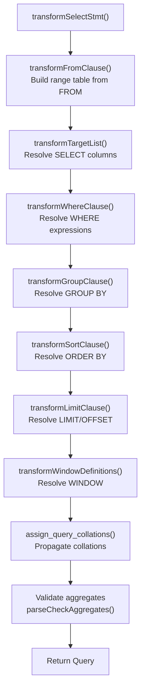
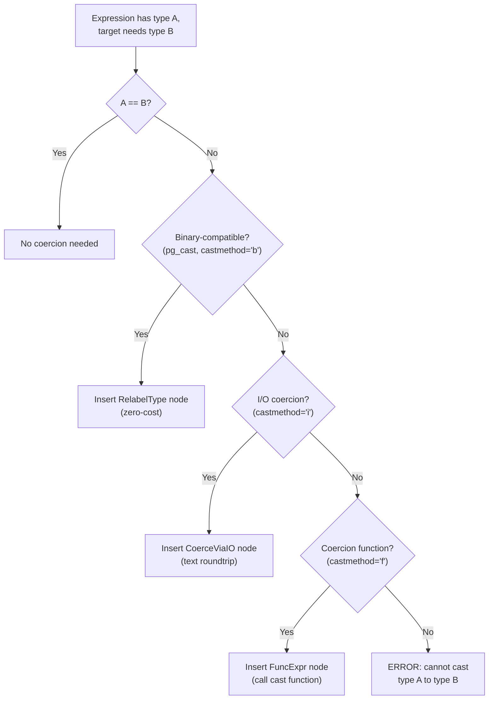

# Semantic Analysis

**Summary.** Semantic analysis (also called parse analysis or transformation) takes the raw parse tree produced by the parser and converts it into a **Query tree** -- a fully resolved internal representation where every table name has become an OID, every column reference points to a specific range table entry, every expression carries its output data type, and implicit type coercions have been inserted. This is the phase where PostgreSQL first opens the catalog and validates that the SQL actually makes sense against the current database schema.

---

## Overview

The raw parse tree uses string names everywhere: `"employees"` for a table, `"name"` for a column, `"="` for an operator. Semantic analysis resolves all of these against the system catalog:

- **Table names** become `RangeTblEntry` nodes with `relid` (the `pg_class` OID).
- **Column references** become `Var` nodes with `varno` (index into the range table) and `varattno` (column number).
- **Operators** become calls to specific `pg_operator` entries with known input and output types.
- **Functions** resolve to `pg_proc` OIDs via function lookup rules (name, argument types, variadic handling).
- **Type mismatches** are resolved by inserting implicit coercion nodes (e.g., `int4` to `int8`).

If any resolution fails, the user gets an error with a position pointer into the original SQL text (using the `location` fields from the raw parse tree).

## Key Source Files

| File | Purpose |
|------|---------|
| `src/backend/parser/analyze.c` | Top-level entry: `parse_analyze_fixedparams()`, `transformStmt()` |
| `src/backend/parser/parse_clause.c` | FROM, WHERE, GROUP BY, ORDER BY, HAVING, LIMIT |
| `src/backend/parser/parse_expr.c` | General expression transformation |
| `src/backend/parser/parse_relation.c` | Range table construction and column lookup |
| `src/backend/parser/parse_target.c` | SELECT target list and INSERT/UPDATE assignments |
| `src/backend/parser/parse_func.c` | Function call resolution |
| `src/backend/parser/parse_oper.c` | Operator resolution |
| `src/backend/parser/parse_coerce.c` | Type coercion logic |
| `src/backend/parser/parse_collate.c` | Collation assignment |
| `src/backend/parser/parse_agg.c` | Aggregate and grouping validation |
| `src/backend/parser/parse_cte.c` | Common table expression (WITH) handling |
| `src/backend/parser/parse_type.c` | Type name resolution |
| `src/backend/parser/parse_node.c` | Utility functions for building analyzed nodes |
| `src/include/parser/parse_node.h` | `ParseState` definition |

## How It Works

### Entry Point

```c
/* src/backend/parser/analyze.c */
Query *
parse_analyze_fixedparams(RawStmt *parseTree, const char *sourceText,
                          const Oid *paramTypes, int numParams,
                          QueryEnvironment *queryEnv)
{
    ParseState *pstate = make_parsestate(NULL);
    pstate->p_sourcetext = sourceText;
    /* ... set up parameter types ... */

    Query *query = transformTopLevelStmt(pstate, parseTree);
    free_parsestate(pstate);
    return query;
}
```

`transformTopLevelStmt()` delegates to `transformStmt()`, which dispatches based on the node type of the raw statement:

```c
static Query *
transformStmt(ParseState *pstate, Node *parseTree)
{
    switch (nodeTag(parseTree))
    {
        case T_SelectStmt:
            return transformSelectStmt(pstate, (SelectStmt *) parseTree, NULL);
        case T_InsertStmt:
            return transformInsertStmt(pstate, (InsertStmt *) parseTree);
        case T_UpdateStmt:
            return transformUpdateStmt(pstate, (UpdateStmt *) parseTree);
        case T_DeleteStmt:
            return transformDeleteStmt(pstate, (DeleteStmt *) parseTree);
        /* ... MERGE, utility statements, etc. */
    }
}
```

### SELECT Transformation in Detail

`transformSelectStmt()` processes clauses in a specific order dictated by SQL semantics:



**Order matters.** The FROM clause must be processed first because it populates the range table, which is needed to resolve column references in all other clauses. The target list comes before WHERE because `SELECT *` expansion depends on the range table, and ORDER BY may reference output column names or numbers from the target list.

### Range Table Construction

When `transformFromClause()` encounters a `RangeVar` (raw table reference), it calls `addRangeTableEntry()`:

1. Open the relation by name using `parserOpenTable()`, which acquires `AccessShareLock`.
2. Create a `RangeTblEntry` with the resolved `relid`, `relkind`, and lock mode.
3. Build the `eref` alias with all column names from the relation's tuple descriptor.
4. Add the RTE to `pstate->p_rtable` and return its index.

For subqueries, joins, functions, and CTEs, there are corresponding `addRangeTableEntryFor*()` functions.

### Column Resolution

When the analyzer encounters a `ColumnRef` like `e.name`, it calls `colNameToVar()`:

1. Search the current `p_namespace` (the list of RTEs visible for column lookup).
2. For each qualifying RTE, check whether the column name exists.
3. If found in exactly one RTE, create a `Var` node. If found in multiple, raise an ambiguity error. If not found, raise "column does not exist."

A `Var` node encodes the resolution result:

```c
typedef struct Var
{
    NodeTag     type;
    int         varno;          /* index into Query.rtable */
    AttrNumber  varattno;       /* column number (1-based) */
    Oid         vartype;        /* OID of column's data type */
    int32       vartypmod;      /* type modifier (e.g., varchar length) */
    Oid         varcollid;      /* collation OID */
    /* ... */
} Var;
```

### Type Resolution and Coercion

Type handling is one of the most intricate parts of semantic analysis. It is governed by `src/backend/parser/parse_coerce.c`.

**When coercion is needed:**

- An operator's arguments do not match the operator's declared input types.
- An INSERT column's expression does not match the target column type.
- A UNION/INTERSECT requires compatible column types across branches.
- A function argument does not match the function's parameter type.
- An explicit `CAST` or `::` is used.

**Coercion categories:**

| Category | Meaning | Example |
|----------|---------|---------|
| Implicit | Automatic, always safe | `int4` to `int8` |
| Assignment | Allowed in INSERT/UPDATE target columns | `int4` to `numeric` |
| Explicit | Requires a CAST | `text` to `int4` |

**The coercion search path:**



**Operator resolution** (`parse_oper.c`) uses a multi-step process:

1. Look for an exact match on (opname, left_type, right_type).
2. If no exact match, try to find a match by consulting the type hierarchy and applying implicit coercions to arguments.
3. Use the `PREFERRED` type category to break ties (e.g., `float8` is preferred over `float4` in the numeric category).

### Function Resolution

`ParseFuncOrColumn()` in `parse_func.c` handles both function calls and qualified column references (since `foo.bar` could be either):

1. Look up candidate functions by name and argument count.
2. Filter by argument type compatibility.
3. If multiple candidates remain, apply the "best match" algorithm from the SQL standard using type categories and preferred types.
4. Insert coercion nodes for any arguments that need conversion.

### Aggregate and Grouping Validation

After all expressions are resolved, `parseCheckAggregates()` verifies:

- Every column in the target list is either inside an aggregate function or listed in GROUP BY.
- Aggregates do not appear in WHERE clauses (they belong in HAVING).
- Nested aggregates are prohibited.
- Window functions and aggregates interact correctly.

## Key Data Structures

### ParseState

The mutable analysis context, threaded through every transformation function:

```c
typedef struct ParseState
{
    struct ParseState *parentParseState;  /* for subqueries */
    const char       *p_sourcetext;       /* original SQL (for error msgs) */

    List             *p_rtable;           /* range table entries being built */
    List             *p_joinexprs;        /* JoinExpr nodes */
    List             *p_joinlist;         /* join tree so far */
    List             *p_namespace;        /* RTEs visible for column lookup */

    int               p_next_resno;       /* next TargetEntry resno */
    List             *p_ctenamespace;     /* visible CTEs */
    List             *p_future_ctes;      /* CTEs not yet analyzed */

    bool              p_hasAggs;          /* found any aggregates? */
    bool              p_hasWindowFuncs;   /* found any window functions? */
    bool              p_hasSubLinks;      /* found any SubLinks? */

    ParseExprKind     p_expr_kind;        /* what kind of expression we're in */
    /* ... callbacks for parameter handling, etc. */
} ParseState;
```

### TargetEntry

Each item in the SELECT list becomes a `TargetEntry`:

```c
typedef struct TargetEntry
{
    NodeTag     type;
    Expr       *expr;           /* the resolved expression */
    AttrNumber  resno;          /* output column number (1-based) */
    char       *resname;        /* output column name (for display) */
    bool        resjunk;        /* true if not to be output by SELECT */
    /* ... */
} TargetEntry;
```

"Junk" target entries carry values needed internally (like `ctid` for UPDATE/DELETE) but not returned to the client.

### FromExpr

The `Query.jointree` field holds a `FromExpr` that encodes the FROM clause as a list of range-table references and/or `JoinExpr` nodes, plus the WHERE qualification:

```c
typedef struct FromExpr
{
    NodeTag     type;
    List       *fromlist;   /* list of join subtrees */
    Node       *quals;      /* WHERE clause (AND of all conditions) */
} FromExpr;
```

## Worked Example

Input: `SELECT e.name FROM employees e WHERE e.salary > 50000`

After semantic analysis:

```
Query
  commandType: CMD_SELECT
  rtable:
    [1] RangeTblEntry
          rtekind: RTE_RELATION
          relid: 16384 (employees OID)
          alias: "e"
          eref: "e" (name, salary, dept_id, ...)
  targetList:
    [1] TargetEntry
          resno: 1
          resname: "name"
          expr: Var(varno=1, varattno=1, vartype=25)  -- text
  jointree: FromExpr
    fromlist: [RangeTblRef(rtindex=1)]
    quals: OpExpr
             opno: 521 (int4gt)
             args: [Var(varno=1, varattno=2, vartype=23),   -- salary (int4)
                    Const(consttype=23, constvalue=50000)]   -- int4
```

Every name is gone; everything is OIDs and indexes.

## The post_parse_analyze_hook

PostgreSQL provides a hook that fires after analysis completes:

```c
/* src/backend/parser/analyze.c */
post_parse_analyze_hook_type post_parse_analyze_hook = NULL;
```

Extensions like `pg_stat_statements` use this hook to compute the query ID (via query jumbling) and register the query for tracking. The hook receives the `ParseState` and the finished `Query`.

## Connections

| Related Section | Relationship |
|---|---|
| [Lexer & Parser](lexer-parser) | Produces the raw parse tree that analysis consumes |
| [Rewrite Rules](rewrite-rules) | Consumes the Query tree this phase produces |
| [Query Optimizer (Ch. 7)](../07-query-optimizer/) | Operates on rewritten Query trees; depends on correct type resolution |
| [Caches (Ch. 9)](../09-caches/) | Catalog cache is hit heavily during name/type resolution |
| [Statistics (Ch. 13)](../13-statistics/) | `post_parse_analyze_hook` is where `pg_stat_statements` intercepts queries |
