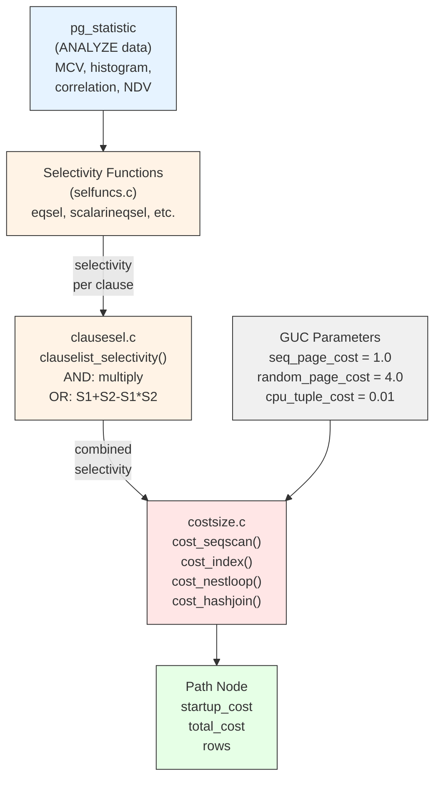

# Cost Model

PostgreSQL's cost model assigns a numeric cost estimate to every Path. The optimizer compares these costs to choose the cheapest execution strategy. The cost model is implemented primarily in `costsize.c` and uses selectivity estimates from `clausesel.c` and the `pg_statistic` catalog. Understanding the cost model is essential for interpreting `EXPLAIN` output and diagnosing plan quality issues.

---

## Summary

Every Path carries two cost numbers:
- **startup_cost** -- cost expended before the first tuple can be returned.
- **total_cost** -- total cost to return all tuples.

Costs are measured in abstract units calibrated by seven GUC parameters: `seq_page_cost`, `random_page_cost`, `cpu_tuple_cost`, `cpu_index_tuple_cost`, `cpu_operator_cost`, `parallel_tuple_cost`, and `parallel_setup_cost`. The cost of a plan is the sum of I/O costs (page fetches) and CPU costs (tuple processing and operator evaluation).



---

## Key Source Files

| File | Purpose |
|------|---------|
| `src/backend/optimizer/path/costsize.c` | All cost functions: `cost_seqscan()`, `cost_index()`, `cost_nestloop()`, etc. |
| `src/backend/optimizer/path/clausesel.c` | `clauselist_selectivity()` -- combine selectivities of multiple clauses |
| `src/backend/utils/adt/selfuncs.c` | Per-operator selectivity functions (`eqsel`, `neqsel`, `scalarineqsel`, etc.) |
| `src/backend/utils/adt/array_selfuncs.c` | Selectivity for array operators |
| `src/backend/optimizer/util/plancat.c` | `get_relation_info()`, `estimate_rel_size()` |
| `src/include/nodes/pathnodes.h` | `QualCost`, `AggClauseCosts` |

---

## How It Works

### The Cost Parameters

```c
/* From costsize.c -- these are the fundamental cost units */
double  seq_page_cost    = DEFAULT_SEQ_PAGE_COST;       /* 1.0 */
double  random_page_cost = DEFAULT_RANDOM_PAGE_COST;     /* 4.0 */
double  cpu_tuple_cost   = DEFAULT_CPU_TUPLE_COST;       /* 0.01 */
double  cpu_index_tuple_cost = DEFAULT_CPU_INDEX_TUPLE_COST; /* 0.005 */
double  cpu_operator_cost = DEFAULT_CPU_OPERATOR_COST;   /* 0.0025 */
double  parallel_tuple_cost = DEFAULT_PARALLEL_TUPLE_COST; /* 0.1 */
double  parallel_setup_cost = DEFAULT_PARALLEL_SETUP_COST; /* 1000.0 */
int     effective_cache_size = DEFAULT_EFFECTIVE_CACHE_SIZE; /* 4GB in pages */
```

The ratio `random_page_cost / seq_page_cost` (default 4:1) is the most critical tuning knob. For fully-cached databases, setting both to 1.0 is appropriate. For spinning disks, the default ratio or higher is correct.

### Cost Formulas

#### Sequential Scan (cost_seqscan)

```
startup_cost = 0
run_cost     = seq_page_cost * pages
             + cpu_tuple_cost * tuples
             + qual_cost.per_tuple * tuples
total_cost   = startup_cost + run_cost
```

Every tuple is fetched and every tuple has the WHERE clause evaluated against it.

#### Index Scan (cost_index)

The index scan cost is more complex because it involves both index page fetches and heap page fetches:

```
-- Index access cost (from amcostestimate callback):
indexStartupCost, indexTotalCost, indexSelectivity, indexCorrelation

-- Heap page fetches:
-- Mackert-Lohman formula estimates the number of heap pages visited
-- based on selectivity and index correlation
pages_fetched = index_pages_fetched(tuples_fetched, pages, index_pages,
                                     root_loop_count)

-- If correlation is high (clustered data), sequential I/O dominates:
-- If correlation is low (random data), random I/O dominates:
min_IO_cost = seq_page_cost * pages_fetched   -- best case
max_IO_cost = random_page_cost * pages_fetched -- worst case

-- Actual cost is interpolated based on correlation^2:
csquared = indexCorrelation * indexCorrelation
IO_cost  = max_IO_cost + csquared * (min_IO_cost - max_IO_cost)

total_cost = indexStartupCost + IO_cost
           + cpu_index_tuple_cost * tuples_fetched
           + cpu_tuple_cost * tuples_fetched
           + qual_cost.per_tuple * tuples_fetched
```

The **index correlation** (from `pg_statistic.stanumbers1` for the `STATISTIC_KIND_CORRELATION` slot) measures how well the physical row order matches the index order. A correlation near +/-1.0 means the index scan produces nearly sequential I/O. A correlation near 0 means random I/O.

#### Bitmap Scan (cost_bitmap_heap_scan)

A bitmap scan first builds a bitmap of all matching TIDs from one or more index scans, sorts them by physical location, then fetches heap pages in order:

```
-- Convert selectivity to expected pages via Mackert-Lohman
pages_fetched = estimate from selectivity
-- Pages are fetched in physical order, so cost is closer to sequential:
cost_per_page = seq_page_cost + (random_page_cost - seq_page_cost)
                * (1.0 - sqrt(pages_fetched / total_pages))
```

Bitmap scans are cheaper than plain index scans when selectivity is moderate (not too selective, not too broad) because they convert random I/O into mostly-sequential I/O.

#### Nested Loop (cost_nestloop)

```
startup_cost = outer.startup_cost + inner.startup_cost
run_cost     = outer.run_cost
             + outer.rows * inner.run_cost      -- rescan inner for each outer row
             + cpu_tuple_cost * output_rows
             + join_qual_cost * (outer.rows * inner.rows)
```

For parameterized inner paths, `inner.run_cost` is the cost per invocation (typically much less than a full scan).

#### Hash Join (cost_hashjoin)

```
startup_cost = inner.total_cost               -- must build entire hash table first
             + hash_table_build_cost
run_cost     = outer.total_cost
             + outer.rows * hash_probe_cost
             + cpu_tuple_cost * output_rows
```

Hash join has high startup cost (hashing all inner rows) but low per-probe cost. If the hash table does not fit in `work_mem`, it spills to batches on disk, adding I/O cost.

#### Merge Join (cost_mergejoin)

```
startup_cost = sort_outer_cost + sort_inner_cost  -- if sorts needed
             + inner.startup_cost
run_cost     = merge_run_cost                     -- single pass over both inputs
             + cpu_tuple_cost * output_rows
```

Merge join is efficient when both inputs are already sorted (e.g., from index scans) -- the sort costs become zero.

### The Disabled-Nodes Mechanism

When a GUC like `enable_seqscan = false` is set, the optimizer does not remove sequential scan paths entirely (that could cause plan failure). Instead, it marks the path with `disabled_nodes = 1`. The `add_path()` comparator treats disabled nodes as the highest-priority cost component: a path with more disabled nodes is always considered worse than one with fewer, regardless of the numeric cost.

---

## Selectivity Estimation

Selectivity is the fraction of rows that pass a given predicate. It ranges from 0.0 (no rows) to 1.0 (all rows). Accurate selectivity estimates are critical because they determine the estimated row counts at every level of the plan tree, which in turn drive join-order and join-method decisions.

### Per-Operator Selectivity Functions

Each operator has a `selectivity estimator function` registered in `pg_operator.oprrest` (for restrictions) and `pg_operator.oprjoin` (for joins):

| Function | Used For | Approach |
|----------|----------|----------|
| `eqsel` | `=` | Use MCV list or NDV (n_distinct) |
| `neqsel` | `<>` | `1.0 - eqsel` |
| `scalarineqsel` | `<`, `>`, `<=`, `>=` | Use histogram boundaries |
| `matchingsel` | `LIKE`, `~` | Use histogram prefix matching |
| `arraycontsel` | `@>`, `<@` | Array-specific estimation |
| `eqjoinsel` | `=` (join) | Use NDV from both sides |
| `neqjoinsel` | `<>` (join) | `1.0 - eqjoinsel` |

### Statistics Used

The selectivity functions read from `pg_statistic` (populated by `ANALYZE`):

| Statistic Kind | Content | Used By |
|---------------|---------|---------|
| `STATISTIC_KIND_MCV` | Most Common Values + their frequencies | `eqsel`, `eqjoinsel` |
| `STATISTIC_KIND_HISTOGRAM` | Equi-depth histogram boundaries | `scalarineqsel` |
| `STATISTIC_KIND_CORRELATION` | Physical-to-logical ordering correlation | `cost_index` |
| `STATISTIC_KIND_NDISTINCT` | Number of distinct values | `eqsel`, `eqjoinsel` |
| `STATISTIC_KIND_MCELEM` | Most Common Elements (for arrays) | `arraycontsel` |

### Combining Selectivities (clausesel.c)

`clauselist_selectivity()` combines the selectivities of multiple clauses:

**AND combination (independence assumption):**
```
sel(A AND B) = sel(A) * sel(B)
```

**OR combination:**
```
sel(A OR B) = sel(A) + sel(B) - sel(A) * sel(B)
```

The independence assumption is known to produce poor estimates for correlated columns. Extended statistics (`CREATE STATISTICS`) with `dependencies` or `mcv` types address this by recording cross-column correlations.

### Row Count Estimation

The estimated output rows for a relation is:

```
rows = baserel_tuples * selectivity_of_all_restrictions
```

For a join:

```
rows = outer_rows * inner_rows * join_selectivity * filter_selectivity
```

The result is clamped to be at least 1 (the optimizer never estimates zero rows for a non-provably-empty relation, to avoid divide-by-zero issues downstream).

---

## Key Data Structures

### QualCost

```c
typedef struct QualCost
{
    Cost    startup;    /* one-time cost */
    Cost    per_tuple;  /* per-evaluation cost */
} QualCost;
```

`cost_qual_eval()` computes the cost of evaluating a list of qual clauses by summing the `cpu_operator_cost` for each operator/function call.

### ParamPathInfo

Tracks the parameterization of a path:

```c
typedef struct ParamPathInfo
{
    Relids  ppi_req_outer;  /* rels supplying parameters */
    double  ppi_rows;       /* estimated rows for this parameterization */
    List   *ppi_clauses;    /* join clauses applied as inner index quals */
} ParamPathInfo;
```

---

## Diagram: Cost Estimation Flow

```
+--------------------------+
|  pg_statistic            |  ANALYZE-collected stats:
|  +-- stanumbers (MCV)    |  frequencies, histograms,
|  +-- stavalues (MCV)     |  correlation, NDV
|  +-- stakind/stanumbers  |
|      (histogram,corr)    |
+----------+---------------+
           |
           v
+--------------------------+
|  Selectivity Functions   |  eqsel(), scalarineqsel(), etc.
|  (selfuncs.c)            |
+----------+---------------+
           |  selectivity per clause
           v
+--------------------------+
|  clausesel.c             |  clauselist_selectivity()
|  Combine with AND/OR     |  Multiply for AND, S1+S2-S1*S2 for OR
+----------+---------------+
           |  combined selectivity
           v
+--------------------------+
|  costsize.c              |  cost_seqscan(), cost_index(),
|  Apply cost formulas     |  cost_nestloop(), cost_hashjoin(), etc.
|  using selectivity +     |
|  GUC parameters          |
+----------+---------------+
           |  startup_cost, total_cost, rows
           v
        Path node
```

---

## Practical Implications

### When the Cost Model Goes Wrong

1. **Stale statistics.** If `ANALYZE` hasn't been run recently, `pg_statistic` data is outdated. The optimizer may drastically underestimate row counts, choosing nested loops when hash joins would be orders of magnitude faster.

2. **Correlated columns.** `WHERE city = 'NYC' AND state = 'NY'` -- the optimizer multiplies the selectivities independently, underestimating the result (most NYC rows have state = NY). Extended statistics help.

3. **Wrong random_page_cost.** On SSDs, `random_page_cost` should be close to `seq_page_cost` (e.g., 1.1). The default of 4.0 biases the optimizer away from index scans that would actually be fast on SSD.

4. **Parameterized path underuse.** If the optimizer underestimates the outer row count, it may choose a hash join when a nested-loop-with-inner-index would be better.

### Reading EXPLAIN Output

```sql
EXPLAIN SELECT * FROM t1 JOIN t2 ON t1.x = t2.y WHERE t1.z > 100;
```

```
Hash Join  (cost=35.50..192.75 rows=450 width=32)
  Hash Cond: (t2.y = t1.x)
  ->  Seq Scan on t2  (cost=0.00..145.00 rows=10000 width=16)
  ->  Hash  (cost=28.50..28.50 rows=450 width=16)
        ->  Seq Scan on t1  (cost=0.00..28.50 rows=450 width=16)
              Filter: (z > 100)
```

- `cost=35.50..192.75` means startup_cost=35.50, total_cost=192.75.
- `rows=450` is the estimated output cardinality.
- The Hash node's cost (28.50..28.50) shows that startup equals total -- all rows must be hashed before any output.

---

## Connections

| Subsystem | Relationship |
|-----------|-------------|
| [Path Generation](path-generation) | Every path creation call invokes a cost function |
| [Join Ordering](join-ordering) | Uses cost comparisons to prune the search space via add_path() |
| [Statistics](../13-statistics/) | pg_statistic provides the raw data for selectivity estimation |
| [Access Methods](../02-access-methods/) | Index AMs provide amcostestimate callbacks for custom cost models |
| [Executor](../08-executor/) | The actual runtime behavior should match cost model assumptions |
| [Caches](../09-caches/) | effective_cache_size affects index scan cost estimates |
