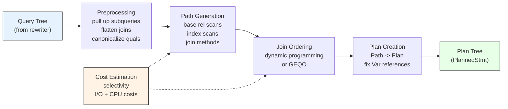

# Chapter 7: Query Optimizer

The PostgreSQL query optimizer transforms a parsed and rewritten `Query` tree into an executable `Plan` tree. It is a **cost-based optimizer**: it enumerates many possible execution strategies, estimates the cost of each, and picks the cheapest one. The optimizer lives entirely in `src/backend/optimizer/` and is one of the largest subsystems in PostgreSQL.

---

## Summary

The optimizer receives a `Query` from the rewriter and returns a `PlannedStmt`. Internally it works in five major phases:

1. **Preprocessing** -- simplify the query tree (pull up subqueries, flatten join trees, canonicalize WHERE clauses).
2. **Path generation** -- for every base relation and every possible combination of joins, enumerate access strategies (sequential scan, index scan, nested loop, hash join, merge join, etc.) as lightweight `Path` nodes.
3. **Cost estimation** -- attach cost estimates to each Path using a parametric cost model.
4. **Join ordering** -- search the space of join orders using dynamic programming (or GEQO for large queries) to find the cheapest Path tree.
5. **Plan creation** -- convert the winning Path tree into a `Plan` tree that the executor can run.



---

## Overview

```
+---------------------------------------------------------------------------+
|                      planner() entry point                                 |
|  src/backend/optimizer/plan/planner.c                                      |
+------------+--------------------------------------------------------------+
             |
             v
+------------------------+
|  subquery_planner()    |  Preprocessing: pull up sublinks/subqueries,
|  prepjointree.c        |  canonicalize quals, simplify expressions
|  prepqual.c            |
|  subselect.c           |
+------------+-----------+
             |
             v
+------------------------+
|  query_planner()       |  Build base RelOptInfos, split quals,
|  planmain.c            |  identify equivalence classes
+------------+-----------+
             |
             v
+------------------------+
|  make_one_rel()        |  Generate Paths for base rels (allpaths.c),
|  allpaths.c            |  then join them (joinrels.c / joinpath.c)
|  indxpath.c            |  using standard_join_search() or GEQO
|  joinpath.c            |
|  costsize.c            |
+------------+-----------+
             |
             v
+------------------------+
|  grouping_planner()    |  Handle GROUP BY, aggregation, window funcs,
|  planner.c             |  ORDER BY, DISTINCT, LIMIT
+------------+-----------+
             |
             v
+------------------------+
|  create_plan()         |  Convert best Path tree into Plan tree
|  createplan.c          |
|  setrefs.c             |  Fix up Var references for the executor
+------------+-----------+
             |
             v
        PlannedStmt
```

---

## Key Source Files

| File | Purpose |
|------|---------|
| `src/backend/optimizer/plan/planner.c` | Top-level entry (`planner()`, `subquery_planner()`, `grouping_planner()`) |
| `src/backend/optimizer/plan/planmain.c` | `query_planner()` -- bridge between preprocessing and path generation |
| `src/backend/optimizer/plan/initsplan.c` | `deconstruct_jointree()` -- distribute quals, build EquivalenceClasses |
| `src/backend/optimizer/prep/prepjointree.c` | Subquery pullup, join-tree flattening |
| `src/backend/optimizer/prep/prepqual.c` | WHERE clause canonicalization (AND/OR flattening) |
| `src/backend/optimizer/path/allpaths.c` | Generate all access paths for base and join rels |
| `src/backend/optimizer/path/indxpath.c` | Index path generation |
| `src/backend/optimizer/path/joinpath.c` | Join path generation (nestloop, mergejoin, hashjoin) |
| `src/backend/optimizer/path/joinrels.c` | Join-order search via dynamic programming |
| `src/backend/optimizer/path/costsize.c` | Cost model for all path types |
| `src/backend/optimizer/path/equivclass.c` | EquivalenceClass management |
| `src/backend/optimizer/path/clausesel.c` | Selectivity estimation for clauses |
| `src/backend/optimizer/path/pathkeys.c` | Sort-order representation and comparison |
| `src/backend/optimizer/geqo/geqo_main.c` | Genetic query optimizer for many-table joins |
| `src/backend/optimizer/plan/createplan.c` | Path-to-Plan conversion |
| `src/backend/optimizer/plan/setrefs.c` | Post-processing: fix Var references |
| `src/backend/optimizer/util/pathnode.c` | Path creation helpers, `add_path()` |
| `src/backend/optimizer/util/relnode.c` | RelOptInfo creation and management |
| `src/backend/optimizer/util/restrictinfo.c` | RestrictInfo creation and manipulation |
| `src/backend/optimizer/util/plancat.c` | Catalog lookups for relation metadata |
| `src/include/nodes/pathnodes.h` | Definitions for PlannerInfo, RelOptInfo, Path, etc. |

---

## Key Data Structures

### PlannerInfo

The per-query planning state. One `PlannerInfo` is created for the main query and one for each sub-`SELECT`. Key fields:

| Field | Purpose |
|-------|---------|
| `parse` | The original `Query` tree |
| `simple_rel_array[]` | Array of `RelOptInfo` pointers indexed by range-table index |
| `join_rel_list` | List of join `RelOptInfo`s built so far |
| `eq_classes` | List of `EquivalenceClass` objects |
| `join_info_list` | `SpecialJoinInfo` nodes for outer/semi/anti joins |
| `query_pathkeys` | Desired output ordering |

### RelOptInfo

Represents a single relation (base table, subquery, or join result). The optimizer builds one for each base relation and one for each considered join combination.

| Field | Purpose |
|-------|---------|
| `relids` | Bitmapset of base-relation RT indexes in this rel |
| `pathlist` | List of Paths representing alternative access strategies |
| `cheapest_total_path` | Winner after `set_cheapest()` |
| `rows` | Estimated output row count |
| `baserestrictinfo` | Restriction clauses applicable at this level |

### Path

A lightweight representation of one way to produce a `RelOptInfo`'s output. Path nodes form trees: a join Path has sub-Paths for its inputs.

| Field | Purpose |
|-------|---------|
| `pathtype` | Node tag (T_SeqScan, T_IndexScan, T_NestLoop, etc.) |
| `parent` | Pointer back to the owning `RelOptInfo` |
| `startup_cost` | Cost before first tuple is returned |
| `total_cost` | Cost to return all tuples |
| `pathkeys` | Sort ordering of the output, if any |
| `param_info` | Parameterization info for nestloop inner paths |
| `disabled_nodes` | Count of disabled plan nodes at or below this point |

Specialized subtypes include `IndexPath`, `NestPath`, `MergePath`, `HashPath`, and many more (see `src/include/nodes/pathnodes.h`).

### RestrictInfo

Wraps a qual clause (WHERE or JOIN/ON condition) with planner metadata:

| Field | Purpose |
|-------|---------|
| `clause` | The actual boolean expression |
| `required_relids` | Which rels must be present to evaluate this clause |
| `mergeopfamilies` | Opfamilies if clause is merge-joinable |
| `hashjoinoperator` | Operator if clause is hash-joinable |
| `security_level` | For row-level security ordering |

### EquivalenceClass

Represents a set of expressions known to be equal (e.g., from `WHERE a.x = b.y AND b.y = c.z`). Used to derive join clauses, determine sort orderings, and detect constant propagation opportunities.

### PathKey

Represents one element of a sort ordering. References an EquivalenceClass, an opfamily, a direction, and a nulls-first/last flag.

---

## How It Works: The Complete Flow

```
planner(Query)
  +-- subquery_planner()
  |     +-- pull_up_sublinks()          -- EXISTS/IN -> semi/anti joins
  |     +-- pull_up_subqueries()        -- flatten simple subqueries
  |     +-- preprocess_expression()     -- constant folding, etc.
  |     +-- canonicalize_qual()         -- AND/OR normalization
  |     +-- grouping_planner()
  |           +-- query_planner()
  |           |     +-- deconstruct_jointree()  -- distribute quals
  |           |     +-- reconsider_outer_join_clauses()
  |           |     +-- make_one_rel()
  |           |           +-- set_base_rel_pathlists()
  |           |           |     +-- set_rel_pathlist() for each base rel
  |           |           |           +-- create_seqscan_path()
  |           |           |           +-- create_index_paths()
  |           |           |           +-- create_tidscan_paths()
  |           |           +-- make_rel_from_joinlist()
  |           |                 +-- standard_join_search()   -- DP
  |           |                       or geqo()              -- genetic
  |           +-- handle GROUP BY, aggregation
  |           +-- handle window functions
  |           +-- handle DISTINCT, ORDER BY, LIMIT
  |           +-- apply_scanjoin_target_to_paths()
  +-- create_plan(best_path)
        +-- create_plan_recurse()       -- recursive Path->Plan
        +-- set_plan_references()       -- fix Var references (setrefs.c)
```

---

## GUC Parameters Affecting the Optimizer

| GUC | Default | Effect |
|-----|---------|--------|
| `enable_seqscan` | on | Disables sequential scan paths when off |
| `enable_indexscan` | on | Disables index scan paths |
| `enable_hashjoin` | on | Disables hash join paths |
| `enable_mergejoin` | on | Disables merge join paths |
| `enable_nestloop` | on | Disables nested loop paths |
| `geqo` | on | Use genetic optimizer when table count >= `geqo_threshold` |
| `geqo_threshold` | 12 | Number of FROM items to trigger GEQO |
| `from_collapse_limit` | 8 | Max FROM items before stopping subquery flattening |
| `join_collapse_limit` | 8 | Max FROM items before stopping explicit-JOIN flattening |
| `random_page_cost` | 4.0 | Cost of a non-sequential page fetch |
| `seq_page_cost` | 1.0 | Cost of a sequential page fetch |
| `effective_cache_size` | 4GB | Planner's estimate of total disk cache |
| `cursor_tuple_fraction` | 0.1 | Expected fraction of rows fetched from a cursor |

---

## Connections

| Subsystem | Relationship |
|-----------|-------------|
| [Parsing & Rewriting](../06-query-parser/) | Produces the `Query` tree consumed by the optimizer |
| [Executor](../08-executor/) | Consumes the `Plan` tree produced by the optimizer |
| [Statistics](../13-statistics/) | `pg_statistic` provides the selectivity and cardinality data the cost model depends on |
| [Caches](../09-caches/) | `relcache` and `catcache` provide relation metadata; plan cache stores finished plans |
| [Access Methods](../02-access-methods/) | Index AMs declare their capabilities (amcostestimate, amcanreturn) used during path generation |

---

## Chapter Contents

| Section | What It Covers |
|---------|----------------|
| [Preprocessing](preprocessing) | Subquery pullup, qual canonicalization, join tree flattening |
| [Path Generation](path-generation) | Base-rel and join-rel path enumeration |
| [Cost Model](cost-model) | costsize.c, selectivity estimation, statistics usage |
| [Join Ordering](join-ordering) | Dynamic programming, equivalence classes, pathkeys |
| [GEQO](geqo) | Genetic optimizer for many-table joins |
| [Plan Creation](plan-creation) | Path-to-Plan conversion, setrefs post-processing |
