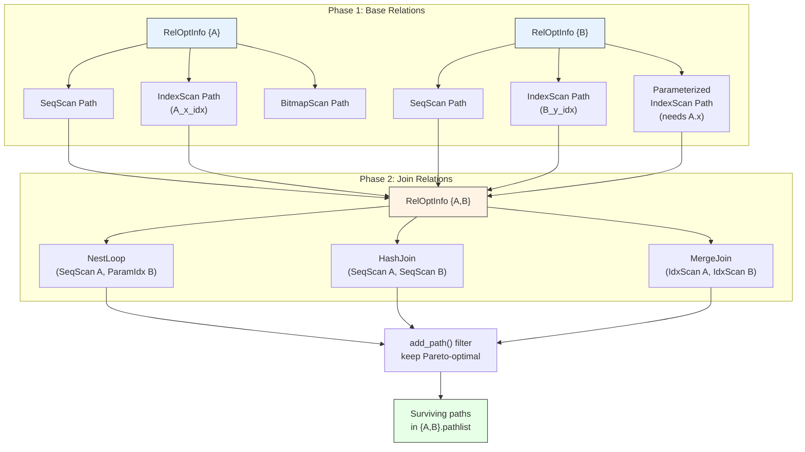

# Path Generation

Path generation is the core of the optimizer. For every relation (base table, subquery, or join combination), PostgreSQL enumerates all plausible access strategies as lightweight `Path` nodes. These Paths are then compared by cost, and only the cheapest survivors feed into higher-level join planning. The key files are `allpaths.c`, `indxpath.c`, and `joinpath.c`.

---

## Summary

Path generation proceeds in two stages:

1. **Base-relation paths** -- for each table in the query, generate paths for sequential scan, index scans, bitmap scans, TID scans, and any specialized scans (function scans, CTE scans, etc.).
2. **Join-relation paths** -- for each pair of relations that can be joined, generate paths for nested loop, merge join, and hash join, using the base-relation or lower-join paths as inputs.

Each generated Path is passed through `add_path()`, which implements a Pareto-dominance check: a path is discarded if another path for the same relation is cheaper on both startup and total cost and has equal-or-better sort ordering and parameterization.



---

## Key Source Files

| File | Purpose |
|------|---------|
| `src/backend/optimizer/path/allpaths.c` | `make_one_rel()`, `set_base_rel_pathlists()`, `set_rel_pathlist()` |
| `src/backend/optimizer/path/indxpath.c` | `create_index_paths()` -- index scan path generation |
| `src/backend/optimizer/path/joinpath.c` | `add_paths_to_joinrel()` -- join path generation |
| `src/backend/optimizer/path/joinrels.c` | `join_search_one_level()`, `make_join_rel()` |
| `src/backend/optimizer/path/tidpath.c` | TID scan path generation |
| `src/backend/optimizer/util/pathnode.c` | `add_path()`, path creation helpers |
| `src/backend/optimizer/util/relnode.c` | `build_simple_rel()`, `build_join_rel()` |
| `src/backend/optimizer/util/plancat.c` | `get_relation_info()` -- catalog lookups for rel metadata |
| `src/include/nodes/pathnodes.h` | Path, IndexPath, NestPath, MergePath, HashPath definitions |

---

## How It Works

### Phase 1: Base-Relation Paths

`set_base_rel_pathlists()` iterates over every base relation in the query and calls `set_rel_pathlist()` for each. The behavior depends on the relation type:

```
set_rel_pathlist(rel)
  switch on rel->rtekind:
    RTE_RELATION:
      create_seqscan_path()         -- always generated
      create_index_paths()          -- for each usable index
      create_tidscan_paths()        -- if WHERE has ctid = const
      consider_parallel_paths()     -- parallel seq/index scans
    RTE_SUBQUERY:
      set_subquery_pathlist()       -- plan subquery recursively
    RTE_FUNCTION:
      create_functionscan_path()
    RTE_VALUES:
      create_valuesscan_path()
    RTE_CTE:
      create_ctescan_path()
    ...
```

#### Sequential Scan

Always generated. A single `Path` node with `pathtype = T_SeqScan`. Cost is based on the number of pages and tuples:

```
startup_cost = 0
total_cost   = seq_page_cost * pages + cpu_tuple_cost * tuples
```

#### Index Scans (indxpath.c)

`create_index_paths()` is one of the most complex functions in the optimizer. For each index on the relation, it:

1. **Matches clauses to index columns.** Checks each RestrictInfo in the relation's `baserestrictinfo` and `joininfo` lists against each index column. A clause matches if it uses an operator from the index's operator family and references the indexed column.

2. **Builds index path groups.** For each set of matching clauses, creates an `IndexPath` representing a plain index scan or an index-only scan (if the index covers all needed columns via `amcanreturn`).

3. **Considers parameterized paths.** If a join clause like `t1.x = t2.y` matches an index on `t2.y`, a parameterized IndexPath is created that expects `t1.x` as a runtime parameter. This path is only usable as the inner side of a nested loop.

4. **Bitmap scans.** Multiple index scans on the same table can be combined with BitmapAnd/BitmapOr nodes. `create_index_paths()` generates `BitmapHeapPath` nodes for these combinations. This is useful when no single index matches all clauses but the intersection or union of multiple indexes does.

```
Index Path Selection:

  RestrictInfo list --> match_clauses_to_index()
                            |
                            v
                      matched clauses
                            |
            +---------------+---------------+
            v               v               v
      IndexPath       IndexPath       BitmapHeapPath
   (plain scan)    (index-only)     (multi-index combo)
```

#### Parallel Paths

If `max_parallel_workers_per_gather > 0` and the relation is large enough, parallel variants of sequential scans and index scans are generated. These go into `rel->partial_pathlist` and are later wrapped in `GatherPath` or `GatherMergePath` nodes.

### Phase 2: Join-Relation Paths

After all base-relation paths are generated, the optimizer combines relations into joins. For each join pair, `add_paths_to_joinrel()` in `joinpath.c` considers three join methods:

#### Nested Loop Join

```
For each outer path O and each inner path I:
  create NestPath(O, I)
  If I is parameterized by O's relation:
    The join clause is pushed into I as an index condition
  Else:
    The join clause is applied as a filter after the join
```

Nested loop is the only method that can exploit parameterized inner paths (index lookups driven by the outer row). It is particularly effective for small-outer/large-inner combinations.

**Materialization:** If the inner path is expensive to rescan, a `MaterialPath` or `MemoizePath` wrapper is added to cache the inner results.

#### Merge Join

```
For each pair of pathkeys matching a join clause:
  Sort outer if needed
  Sort inner if needed
  create MergePath(sorted_outer, sorted_inner)
```

Merge join requires both inputs to be sorted on the join key. If an input already has the right sort order (from an index scan or a lower merge join), no explicit sort is needed. The optimizer checks pathkeys to detect this.

#### Hash Join

```
For each hashable join clause:
  create HashPath(outer, inner)
  Inner side is hashed into a hash table
  Outer side probes the hash table
```

Hash join has no ordering requirements but has high startup cost (building the hash table). It is often the winner for large equi-joins when neither side has a useful sort order.

### The add_path() Filter

Every generated path passes through `add_path()` in `pathnode.c`. This function maintains the Pareto frontier of paths for each RelOptInfo:

```
add_path(rel, new_path):
  for each existing_path in rel->pathlist:
    if new_path dominates existing_path:
      remove existing_path
    if existing_path dominates new_path:
      discard new_path, return
  add new_path to rel->pathlist
```

**Dominance criteria:**
- Lower or equal total_cost
- Lower or equal startup_cost
- Equal or better pathkeys (sort ordering)
- Same or subset parameterization
- Fewer or equal disabled_nodes

This pruning is critical for keeping planning time manageable. Without it, the number of paths would explode exponentially with the number of tables.

---

## Key Data Structures

### Path (base type)

```c
typedef struct Path
{
    NodeTag     type;
    NodeTag     pathtype;       /* T_SeqScan, T_IndexScan, etc. */
    RelOptInfo *parent;         /* the relation this is a path for */
    PathTarget *pathtarget;     /* list of Vars/Exprs, width, cost */
    ParamPathInfo *param_info;  /* parameterization, or NULL */
    bool        parallel_aware; /* engage parallel-aware logic? */
    bool        parallel_safe;  /* OK to use as part of parallel plan? */
    int         parallel_workers; /* desired # of parallel workers */
    double      rows;           /* estimated number of result tuples */
    Cost        startup_cost;   /* cost expended before fetching any tuples */
    Cost        total_cost;     /* total cost (including startup) */
    int         disabled_nodes; /* count of disabled nodes at/below */
    List       *pathkeys;       /* sort ordering of output */
} Path;
```

### IndexPath

```c
typedef struct IndexPath
{
    Path        path;
    IndexOptInfo *indexinfo;    /* the index */
    List       *indexclauses;   /* index qual conditions */
    List       *indexorderbys;  /* ORDER BY expressions for amcanorderbyop */
    List       *indexorderbycols;
    ScanDirection indexscandir; /* forward or backward */
    Cost        indextotalcost; /* total cost of index scan itself */
    Selectivity indexselectivity; /* selectivity of index */
} IndexPath;
```

### NestPath, MergePath, HashPath

```c
typedef struct NestPath       /* also base for MergePath, HashPath */
{
    Path        path;
    JoinType    jointype;
    bool        inner_unique;  /* inner has at most one match per outer? */
    Path       *outerjoinpath; /* path for outer side */
    Path       *innerjoinpath; /* path for inner side */
    List       *joinrestrictinfo; /* RestrictInfos to apply to join */
} JoinPath;   /* NestPath is a typedef for JoinPath */

typedef struct MergePath
{
    JoinPath    jpath;
    List       *path_mergeclauses;  /* join clauses used for merge */
    List       *outersortkeys;      /* keys to sort outer, or NIL */
    List       *innersortkeys;      /* keys to sort inner, or NIL */
    bool        skip_mark_restore;  /* can avoid mark/restore? */
    bool        materialize_inner;  /* should inner be materialized? */
} MergePath;

typedef struct HashPath
{
    JoinPath    jpath;
    List       *path_hashclauses;   /* join clauses used for hashing */
    int         num_batches;        /* estimated # of hash batches */
    double      inner_rows_total;   /* inner rows including skipped ones */
} HashPath;
```

### RelOptInfo (path-relevant fields)

```c
typedef struct RelOptInfo
{
    ...
    List       *pathlist;           /* Paths for this relation */
    List       *ppilist;            /* ParamPathInfos used in pathlist */
    List       *partial_pathlist;   /* partial Paths (for parallel) */
    Path       *cheapest_startup_path;
    Path       *cheapest_total_path;
    List       *cheapest_parameterized_paths;
    ...
} RelOptInfo;
```

### IndexOptInfo

Describes an index available on a relation. Populated by `get_relation_info()` from the catalogs:

```c
typedef struct IndexOptInfo
{
    Oid         indexoid;       /* OID of the index */
    Oid         reltablespace;
    RelOptInfo *rel;           /* back-pointer to table's RelOptInfo */
    int         ncolumns;      /* number of columns in index */
    int         nkeycolumns;   /* number of key (non-INCLUDE) columns */
    int        *indexkeys;     /* column numbers, or 0 for expression */
    Oid        *opfamily;      /* operator families for each column */
    Oid        *opcintype;     /* opclass declared input data types */
    bool        unique;        /* is this a unique index? */
    bool        amcanorderbyop;
    bool        amcanreturn;   /* supports index-only scans? */
    bool        amhasgetbitmap;
    ...
} IndexOptInfo;
```

---

## Diagram: Path Generation for a Two-Table Join

```
Table A                              Table B
  |                                    |
  v                                    v
set_rel_pathlist(A)              set_rel_pathlist(B)
  +-- SeqScan Path                 +-- SeqScan Path
  +-- IndexScan(A_x_idx)          +-- IndexScan(B_y_idx)
  +-- BitmapScan(A_z_idx)         +-- IndexOnly(B_y_idx)
                                   +-- Parameterized IndexScan
                                       on B_y_idx (needs A.x)
       |                                    |
       +--------------------+---------------+
                            |
                            v
                add_paths_to_joinrel({A,B})
                    |
                    +-- NestLoop(SeqScan(A), SeqScan(B))
                    +-- NestLoop(SeqScan(A), ParamIdx(B))  <-- uses B_y_idx
                    +-- NestLoop(IdxScan(A), SeqScan(B))
                    +-- MergeJoin(IdxScan(A), IdxScan(B))  <-- both already sorted
                    +-- MergeJoin(SeqScan(A)+Sort, SeqScan(B)+Sort)
                    +-- HashJoin(SeqScan(A), SeqScan(B))
                    +-- ... more combinations ...
                            |
                            v
                      add_path() filters
                      keep Pareto-optimal paths
                            |
                            v
                   {A,B}.pathlist (survivors)
```

---

## Parameterized Paths

A parameterized path uses a join clause from a not-yet-joined relation as an index condition. This is how PostgreSQL handles nested-loop-with-inner-index-scan efficiently.

**Example:**
```sql
SELECT * FROM orders o JOIN customers c ON o.cust_id = c.id
```

If there is an index on `customers.id`, the optimizer creates a parameterized IndexPath for `customers` that treats `o.cust_id` as a runtime parameter. This path's `param_info` records that it requires values from the `orders` relation.

When this path is used as the inner side of a NestLoop, the executor passes each `o.cust_id` value down into the index scan, achieving efficient point lookups.

Parameterized paths compete with non-parameterized paths in `add_path()`. The comparison accounts for both cost and the estimated number of rows (since parameterized paths typically return fewer rows per invocation).

---

## Parallel Path Generation

For large tables, PostgreSQL can split the scan work across multiple workers:

1. **Partial paths** are generated by `set_rel_pathlist()` and stored in `rel->partial_pathlist`. A partial path returns only a subset of the relation's rows (whichever block range the worker is assigned).

2. **Gather paths** wrap a partial path to collect results from all workers. `GatherPath` produces unsorted output; `GatherMergePath` preserves the order of an ordered partial path.

3. **Parallel joins** can be built on top of partial paths. A `HashPath` with `parallel_aware = true` uses a shared hash table across workers.

The decision of whether to parallelize depends on the relation size versus `min_parallel_table_scan_size` and the availability of parallel workers.

---

## Connections

| Subsystem | Relationship |
|-----------|-------------|
| [Preprocessing](preprocessing) | Provides the simplified query tree with flattened joins |
| [Cost Model](cost-model) | Every path creation call invokes a cost function from costsize.c |
| [Join Ordering](join-ordering) | Controls which pairs of relations are joined, invoking add_paths_to_joinrel() for each |
| [GEQO](geqo) | Alternative join-order search that still uses the same path generation for each join |
| [Plan Creation](plan-creation) | Converts the winning Path tree into an executable Plan tree |
| [Access Methods](../02-access-methods/) | Index AMs declare capabilities (amcostestimate, amcanreturn, amhasgetbitmap) |
| [Statistics](../13-statistics/) | Selectivity of index clauses comes from pg_statistic via clausesel.c |
