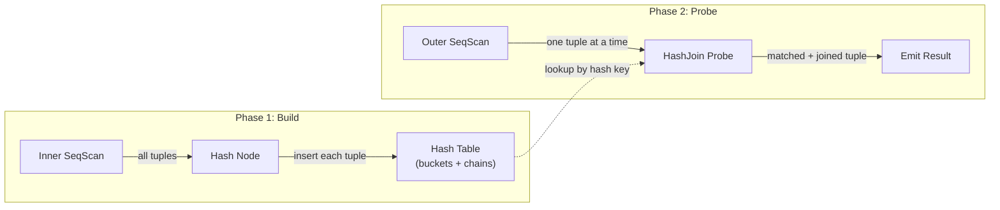

# Join Nodes

## Summary

PostgreSQL implements three physical join algorithms: **Nested Loop**, **Hash
Join**, and **Merge Join**. Each supports all logical join types (inner, left,
right, full, semi, anti). The planner chooses the algorithm based on cost
estimates considering data size, available indexes, sort order, and memory. All
three follow the Volcano iterator model -- they pull tuples from their outer
(left) and inner (right) child nodes and return joined result tuples one at a
time.

---

## Overview

| Algorithm | Best When | Complexity | Memory | Preserves Order |
|---|---|---|---|---|
| **Nested Loop** | Small inner, or indexed inner lookup | O(N * M) worst case | Minimal | Outer order preserved |
| **Hash Join** | Equi-joins on large unsorted inputs | O(N + M) | O(M) for hash table | No |
| **Merge Join** | Equi-joins on pre-sorted inputs | O(N + M) | Minimal | Yes (merge order) |

All three are implemented as `JoinState` subtypes sharing a common base:

```c
typedef struct JoinState {
    PlanState   ps;             /* base PlanState */
    JoinType    jointype;       /* INNER, LEFT, RIGHT, FULL, SEMI, ANTI */
    bool        single_match;   /* at most one match per outer? (semi-join opt) */
    ExprState  *joinqual;       /* join condition */
    ExprState  *ps.qual;        /* additional filter ("other qual") */
} JoinState;
```

---

## Key Source Files

| File | Purpose |
|---|---|
| `src/backend/executor/nodeNestloop.c` | Nested loop join |
| `src/backend/executor/nodeHashjoin.c` | Hash join (serial and parallel-aware) |
| `src/backend/executor/nodeMergejoin.c` | Merge join with state machine |
| `src/backend/executor/nodeHash.c` | Hash table build node (child of HashJoin) |
| `src/include/executor/hashjoin.h` | `HashJoinTable`, `HashJoinTupleData` structs |
| `src/include/nodes/execnodes.h` | `NestLoopState`, `HashJoinState`, `MergeJoinState` |

---

## How It Works

### Nested Loop Join

The simplest join algorithm. For each outer tuple, it scans the entire inner
side looking for matches. In practice, the inner side is almost always an
index scan parameterized by the outer tuple's join key.

```c
static TupleTableSlot *
ExecNestLoop(PlanState *pstate)
{
    NestLoopState *node = castNode(NestLoopState, pstate);

    for (;;)
    {
        /* Need a new outer tuple? */
        if (node->nl_NeedNewOuter)
        {
            outerTupleSlot = ExecProcNode(outerPlan);
            if (TupIsNull(outerTupleSlot))
                return NULL;            /* outer exhausted */

            /* Set outer tuple in expression context */
            econtext->ecxt_outertuple = outerTupleSlot;

            /* Pass join key as parameter to inner (parameterized) scan */
            node->nl_NeedNewOuter = false;
            node->nl_MatchedOuter = false;
            ExecReScan(innerPlan);       /* restart inner for new outer */
        }

        /* Get next inner tuple */
        innerTupleSlot = ExecProcNode(innerPlan);

        if (TupIsNull(innerTupleSlot))
        {
            /* Inner exhausted for this outer tuple */
            if (!node->nl_MatchedOuter && (jointype == JOIN_LEFT ||
                                            jointype == JOIN_ANTI))
            {
                /* Emit outer + NULLs for unmatched LEFT/ANTI */
                ...
                return result;
            }
            node->nl_NeedNewOuter = true;
            continue;
        }

        /* Test join qual */
        econtext->ecxt_innertuple = innerTupleSlot;
        if (ExecQual(joinqual, econtext))
        {
            node->nl_MatchedOuter = true;

            if (jointype == JOIN_ANTI)
                continue;               /* anti-join: skip matches */

            /* Apply other qual and project */
            if (otherqual == NULL || ExecQual(otherqual, econtext))
                return ExecProject(node->js.ps.ps_ProjInfo);
        }
    }
}
```

**Key optimization:** When the inner plan is a parameterized IndexScan, each
rescan is an efficient index lookup rather than a full table scan. The planner
uses `nestloop_params` to pass the outer tuple's join key as a parameter.

### Hash Join

A two-phase algorithm: **build** the hash table from the inner (smaller) side,
then **probe** with each outer tuple.



#### Phase 1: Build

The `Hash` node (a child of `HashJoin`) reads all inner tuples and inserts
them into an in-memory hash table:

```
ExecHashJoin (first call)
  |
  +-- ExecProcNode(Hash)
        |
        +-- ExecHash builds the hash table:
              loop:
                slot = ExecProcNode(inner_scan)
                if NULL, done building
                hashvalue = ExecHashGetHashValue(slot, ...)
                ExecHashTableInsert(hashtable, slot, hashvalue)
```

The hash table is organized as:

```
+------------------+
| Bucket Array     |    nbuckets entries (power of 2)
|  [0] --> tuple --> tuple --> NULL
|  [1] --> NULL
|  [2] --> tuple --> NULL
|  ...
+------------------+

bucket = hashvalue & (nbuckets - 1)  (for current batch)
batch  = (hashvalue >> nbits) & (nbatch - 1)
```

#### Multi-Batch (Hybrid Hash Join)

When the inner side exceeds `work_mem`, the hash join switches to multiple
batches. Tuples are partitioned by higher bits of the hash value:

```
                      hash value bits
               +------------------------+
               | batch bits | bucket bits|
               +------------------------+
                     |            |
                     v            v
               select batch   select bucket
               (0..nbatch-1)  (0..nbuckets-1)

Batch 0: built in memory, probed immediately
Batch 1..N: spilled to temp files, processed later
```

For each subsequent batch:
1. Read inner tuples from inner batch temp file, build hash table
2. Read outer tuples from outer batch temp file, probe
3. Output matches

The number of batches is always a power of two and can be **increased
dynamically** if the in-memory hash table grows too large. Increasing batches
only moves tuples to later batches, never earlier ones.

#### Phase 2: Probe

```
ExecHashJoin (subsequent calls, probe phase)
  |
  +-- outer_slot = ExecProcNode(outer_plan)
  +-- hashvalue = ExecHashGetHashValue(outer_slot, ...)
  +-- batch = CALC_BATCH(hashvalue)
  |
  +-- if batch == current_batch:
  |     +-- bucket = hashvalue & (nbuckets - 1)
  |     +-- walk bucket chain, test join quals
  |     +-- if match: return joined tuple
  |
  +-- else:
        +-- save outer tuple to batch temp file for later
```

#### Skew Optimization

When the outer relation has highly skewed values (from MCV statistics), the
matching inner tuples are placed in a separate **skew hash table** that stays
in memory as part of batch 0. This prevents the most common values from causing
large batch files:

```c
typedef struct HashSkewBucket {
    uint32        hashvalue;
    HashJoinTuple tuples;       /* chain of inner tuples */
} HashSkewBucket;
```

### Merge Join

Requires both inputs sorted on the join keys. Walks both sides in lockstep
using a **state machine** with 11 states:

```
State Machine:
  INITIALIZE_OUTER  --> get first outer tuple
  INITIALIZE_INNER  --> get first inner tuple
  SKIP_TEST         --> compare outer vs inner key
    outer < inner   --> SKIPOUTER_ADVANCE
    outer > inner   --> SKIPINNER_ADVANCE
    outer == inner  --> mark inner position, enter match loop
  JOINTUPLES        --> emit joined tuple
  NEXTINNER         --> advance inner, check still equal
  NEXTOUTER         --> advance outer
  TESTOUTER         --> if outer == mark, restore inner to mark
  ENDOUTER/ENDINNER --> one side exhausted
```

The mark/restore mechanism handles duplicate keys. When multiple outer tuples
match the same inner key range, the executor marks the first matching inner
tuple and restores to it for each new outer tuple with the same key.

```c
/* Simplified merge join logic */
for (;;)
{
    switch (node->mj_JoinState)
    {
        case EXEC_MJ_SKIP_TEST:
            compareResult = MJCompare(outerKey, innerKey);
            if (compareResult == 0)
            {
                ExecMarkPos(inner);     /* mark for restore */
                node->mj_JoinState = EXEC_MJ_JOINTUPLES;
            }
            else if (compareResult < 0)
                node->mj_JoinState = EXEC_MJ_SKIPOUTER_ADVANCE;
            else
                node->mj_JoinState = EXEC_MJ_SKIPINNER_ADVANCE;
            break;

        case EXEC_MJ_JOINTUPLES:
            /* emit the joined tuple */
            return result;

        case EXEC_MJ_NEXTINNER:
            innerTuple = ExecProcNode(inner);
            if (innerKey == outerKey)
                node->mj_JoinState = EXEC_MJ_JOINTUPLES;
            else
                node->mj_JoinState = EXEC_MJ_NEXTOUTER;
            break;

        case EXEC_MJ_NEXTOUTER:
            outerTuple = ExecProcNode(outer);
            if (outerKey == markKey)
            {
                ExecRestrPos(inner);    /* back to marked position */
                node->mj_JoinState = EXEC_MJ_JOINTUPLES;
            }
            else
                node->mj_JoinState = EXEC_MJ_SKIP_TEST;
            break;
        /* ... */
    }
}
```

**Merge join advantages:**
- O(N + M) with no memory overhead beyond sort buffers
- Input sort order is often "free" from index scans or prior Sort nodes
- Naturally handles FULL OUTER JOIN (both sides advance together)

---

## Key Data Structures

### HashJoinTableData

```c
typedef struct HashJoinTableData {
    int             nbuckets;           /* number of hash buckets (power of 2) */
    int             log2_nbuckets;      /* for fast modulo */
    HashJoinTuple  *buckets;            /* bucket chain heads */

    int             nbatch;             /* number of batches (power of 2) */
    int             curbatch;           /* current batch being processed */
    BufFile       **innerBatchFile;     /* temp files for inner batches */
    BufFile       **outerBatchFile;     /* temp files for outer batches */

    /* Skew optimization */
    HashSkewBucket *skewBucket;         /* skew hash table */
    int             skewBucketLen;

    /* Memory accounting */
    Size            spaceUsed;          /* current memory usage */
    Size            spaceAllowed;       /* work_mem budget */
    Size            spacePeak;          /* peak memory usage */

    /* Memory contexts */
    MemoryContext    hashCxt;           /* long-lived hash table storage */
    MemoryContext    batchCxt;          /* per-batch storage, reset between batches */
    MemoryContext    spillCxt;          /* temp file buffer storage */
    ...
} HashJoinTableData;
```

### NestLoopState

```c
typedef struct NestLoopState {
    JoinState   js;                     /* base JoinState */
    bool        nl_NeedNewOuter;        /* need to fetch next outer? */
    bool        nl_MatchedOuter;        /* current outer has a match? */
    TupleTableSlot *nl_NullInnerTupleSlot;  /* for LEFT joins */
} NestLoopState;
```

### MergeJoinState

```c
typedef struct MergeJoinState {
    JoinState   js;
    int         mj_JoinState;           /* state machine position */
    bool        mj_MatchedOuter;
    bool        mj_MatchedInner;
    TupleTableSlot *mj_MarkedTupleSlot; /* marked inner position */
    MergeJoinClauseData *mj_Clauses;    /* per-key comparison info */
    int         mj_NumClauses;
    ...
} MergeJoinState;
```

---

## Diagram: Join Algorithm Comparison

```
NESTED LOOP                    HASH JOIN                    MERGE JOIN

outer  inner                   inner   outer                outer    inner
  |      |                       |       |                    |        |
  v      v                       v       v                    v        v
+---+  +---+                  +------+ +---+              (sorted)  (sorted)
| a |->| x | scan all         |build | | a |                |        |
| b |->| x | for each         |hash  | | b | probe         a == 1? advance
| c |->| x | outer            |table | | c | table         b == 2? match!
+---+  +---+                  +------+ +---+               c == 3? advance

O(N*M)                         O(N+M)                      O(N+M)
best: indexed inner            best: equi-join              best: pre-sorted
```

### Parallel Hash Join

In parallel-aware hash join, workers cooperatively build a **shared** hash
table in DSM (dynamic shared memory). The build phase uses a Barrier IPC
primitive to synchronize:

```
PHJ_BUILD_ELECT            -- one worker elected to set up
PHJ_BUILD_ALLOCATE         -- elected worker allocates shared buckets
PHJ_BUILD_HASH_INNER       -- all workers hash inner tuples in parallel
PHJ_BUILD_HASH_OUTER       -- (multi-batch) all workers partition outer
PHJ_BUILD_RUN              -- build complete, all workers probe in parallel
PHJ_BUILD_FREE             -- one worker frees shared resources
```

Each worker probes independent outer tuples against the shared hash table,
producing non-overlapping result sets that the Gather node merges.

---

## Connections

| Topic | Link |
|---|---|
| Volcano model and tuple flow | [Volcano Model](volcano-model) |
| Scan nodes that feed joins | [Scan Nodes](scan-nodes) |
| Parallel hash join coordination | [Parallel Query](parallel-query) |
| Sort order enabling merge join | [Sort and Materialize](sort-and-materialize) |
| Join qual expression evaluation | [Expression Evaluation](expression-eval) |
| Planner join strategy selection | [Query Optimizer](../07-query-optimizer/) |
| Memory contexts for hash tables | [Memory Management](../10-memory/) |
