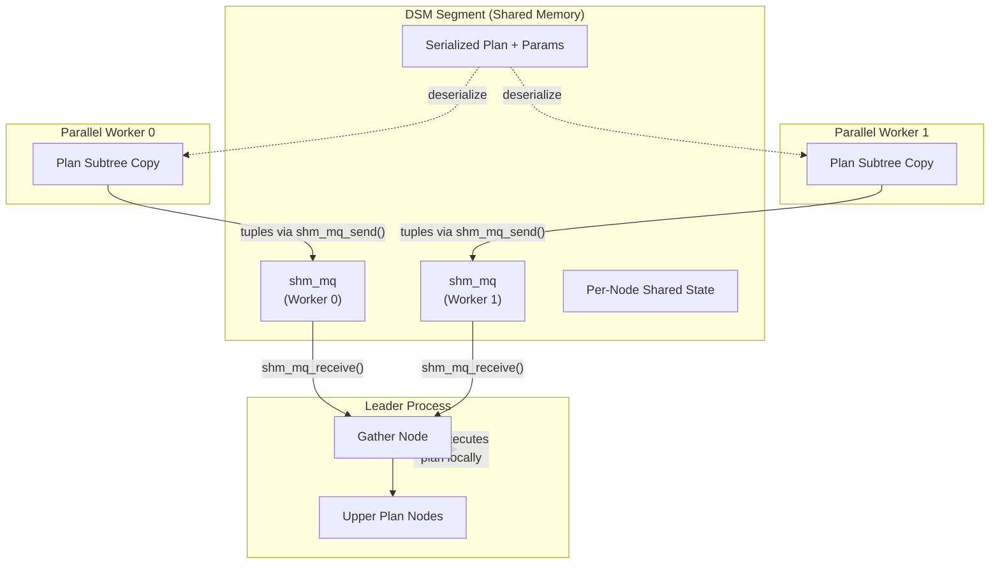

# Parallel Query Execution

## Summary

PostgreSQL's parallel query framework allows a single query to harness multiple
CPU cores by launching background worker processes that execute portions of the
plan tree concurrently. The leader process sets up a **dynamic shared memory**
(DSM) segment containing the serialized plan, parameters, and communication
channels. Workers attach to this shared memory, reconstruct the plan state, and
send result tuples back through **shared memory message queues** (`shm_mq`).
The **Gather** and **Gather Merge** nodes in the leader's plan tree collect
these tuples and feed them into the rest of the plan.

---

## Overview

### Architecture

```
+------------------+     +------------------+     +------------------+
|    Leader        |     |    Worker 0      |     |    Worker 1      |
|                  |     |                  |     |                  |
|  Gather          |     |  [plan subtree]  |     |  [plan subtree]  |
|    ^   ^   ^     |     |       |          |     |       |          |
|    |   |   |     |     |       v          |     |       v          |
|  shm_mq channels |<----|  shm_mq_send()  |<----|  shm_mq_send()  |
|    |   |   |     |     |                  |     |                  |
|    v   v   v     |     +------------------+     +------------------+
|  merge results   |              |                        |
|       |          |              +--------- DSM ----------+
|  upper plan      |              (shared plan, params,
|  nodes           |               tuple queues, state)
+------------------+
```



Each parallel-capable scan or join node implements four extra methods:

| Method | Purpose |
|---|---|
| `ExecXxxEstimate()` | Calculate DSM space needed for shared state |
| `ExecXxxInitializeDSM()` | Initialize shared state in DSM (leader) |
| `ExecXxxReInitializeDSM()` | Reset shared state for rescan |
| `ExecXxxInitializeWorker()` | Attach to shared state (worker) |

---

## Key Source Files

| File | Purpose |
|---|---|
| `src/backend/executor/execParallel.c` | Parallel executor setup, DSM layout, worker entry |
| `src/backend/executor/nodeGather.c` | Gather node: collect tuples from workers |
| `src/backend/executor/nodeGatherMerge.c` | Gather Merge: collect pre-sorted tuples |
| `src/backend/access/transam/parallel.c` | ParallelContext: worker lifecycle, DSM management |
| `src/backend/storage/ipc/shm_mq.c` | Shared memory message queue |
| `src/backend/executor/tqueue.c` | Tuple queue: serialize/deserialize tuples over shm_mq |
| `src/include/executor/execParallel.h` | `ParallelExecutorInfo` struct |
| `src/include/storage/shm_mq.h` | `shm_mq` handle types |

---

## How It Works

### 1. Setup Phase (Leader)

When `ExecutorStart` encounters a plan containing `Gather` or `Gather Merge`,
it calls `ExecInitParallelPlan()` which:

```
ExecInitParallelPlan(planstate, estate, gather_node)
  |
  +-- Calculate DSM size:
  |     PARALLEL_KEY_EXECUTOR_FIXED   -- eflags, tuple bound, jit flags
  |     PARALLEL_KEY_PLANNEDSTMT      -- serialized plan tree
  |     PARALLEL_KEY_PARAMLISTINFO    -- serialized parameters
  |     PARALLEL_KEY_BUFFER_USAGE     -- per-worker buffer stats
  |     PARALLEL_KEY_TUPLE_QUEUE      -- shm_mq for each worker
  |     PARALLEL_KEY_INSTRUMENTATION  -- per-node instrumentation slots
  |     PARALLEL_KEY_DSA              -- dynamic shared area handle
  |     + per-node estimated sizes (from ExecXxxEstimate)
  |
  +-- Allocate DSM segment
  |
  +-- Serialize plan and parameters into DSM
  |
  +-- Create shm_mq for each worker (PARALLEL_TUPLE_QUEUE_SIZE = 64KB)
  |
  +-- Walk plan tree, call ExecXxxInitializeDSM() for parallel-aware nodes
```

The DSM segment is organized with **magic number keys** so that workers can
locate each component:

```c
#define PARALLEL_KEY_EXECUTOR_FIXED     UINT64CONST(0xE000000000000001)
#define PARALLEL_KEY_PLANNEDSTMT        UINT64CONST(0xE000000000000002)
#define PARALLEL_KEY_PARAMLISTINFO      UINT64CONST(0xE000000000000003)
#define PARALLEL_KEY_BUFFER_USAGE       UINT64CONST(0xE000000000000004)
#define PARALLEL_KEY_TUPLE_QUEUE        UINT64CONST(0xE000000000000005)
#define PARALLEL_KEY_INSTRUMENTATION    UINT64CONST(0xE000000000000006)
#define PARALLEL_KEY_DSA                UINT64CONST(0xE000000000000007)
```

### 2. Worker Launch

Workers are launched via `LaunchParallelWorkers()`. Each worker:

1. Attaches to the DSM segment
2. Deserializes the plan tree from `PARALLEL_KEY_PLANNEDSTMT`
3. Restores the snapshot, transaction state, and GUC settings
4. Calls `ExecInitNode()` to build its own `PlanState` tree
5. For parallel-aware nodes, calls `ExecXxxInitializeWorker()` to attach to
   shared state (e.g., a `ParallelBlockTableScanDesc` for SeqScan)
6. Executes the plan subtree below the Gather point
7. Sends result tuples through `shm_mq_send()`

### 3. Tuple Queues (shm_mq)

Each worker has a dedicated `shm_mq` (shared memory message queue) for sending
tuples back to the leader. The queue is a ring buffer in shared memory:

```c
typedef struct shm_mq {
    slock_t     mq_mutex;
    PGPROC     *mq_receiver;
    PGPROC     *mq_sender;
    uint64      mq_bytes_read;      /* consumer position */
    uint64      mq_bytes_written;   /* producer position */
    Size        mq_ring_size;       /* ring buffer capacity */
    bool        mq_detached;
    uint8       mq_ring_offset;     /* offset to ring buffer start */
    char        mq_ring[FLEXIBLE_ARRAY_MEMBER];
} shm_mq;
```

Flow control: When the ring buffer is full, the sender blocks (sets latch and
sleeps). When the buffer is empty, the receiver blocks. The `PGPROC` pointers
allow direct latch-based wakeups without polling.

Tuples are serialized using the `tqueue` module. For tuples containing only
fixed-size, pass-by-value columns, no serialization is needed -- the
`MinimalTuple` is copied directly. For tuples with pass-by-reference or
record-type columns, the `tqueue` handles proper serialization and
reconstruction.

### 4. Gather Node

The Gather node pulls tuples from workers and optionally from its own local
execution of the plan subtree:

```c
static TupleTableSlot *
gather_getnext(GatherState *gatherstate)
{
    /* Try to get a tuple from any worker */
    while (gatherstate->nreaders > 0 || gatherstate->need_to_scan_locally)
    {
        /* Round-robin through workers */
        for (int i = 0; i < gatherstate->nreaders; i++)
        {
            MinimalTuple tup = TupleQueueReaderNext(
                gatherstate->reader[gatherstate->nextreader], ...);

            if (tup != NULL)
                return ExecStoreMinimalTuple(tup, slot, false);

            /* This reader is done -- remove it */
            ...
        }

        /* If no worker tuple, try local execution */
        if (gatherstate->need_to_scan_locally)
        {
            slot = ExecProcNode(outerPlanState(gatherstate));
            if (!TupIsNull(slot))
                return slot;
            gatherstate->need_to_scan_locally = false;
        }
    }

    return NULL;    /* all sources exhausted */
}
```

The `parallel_leader_participation` GUC controls whether the leader also
executes the plan locally. By default it does, which reduces idle time when
workers are busy.

### 5. Gather Merge Node

`Gather Merge` is used when each worker produces pre-sorted output (e.g.,
parallel index scan). It performs a **heap merge** to maintain global sort order:

```
Worker 0: [1, 4, 7, 10, ...]  (sorted)
Worker 1: [2, 5, 8, 11, ...]  (sorted)
Leader:   [3, 6, 9, 12, ...]  (sorted)

Gather Merge (binary heap):
  --> 1, 2, 3, 4, 5, 6, 7, 8, 9, 10, 11, 12, ...
```

### Parallel-Aware Node Types

| Node | Parallel Behavior |
|---|---|
| **SeqScan** | Workers claim block ranges via atomic counter in DSM |
| **IndexScan** | Workers claim index pages via `parallel_scan` descriptor |
| **IndexOnlyScan** | Same as IndexScan |
| **BitmapHeapScan** | Workers share TIDBitmap, claim pages to scan |
| **Hash Join** | Workers cooperatively build shared hash table (Parallel Hash) |
| **Hash (build)** | Shared hash table in DSA memory |
| **Append** | Workers claim child plans to execute |
| **Agg** | Partial aggregation per worker, finalize in leader |
| **Sort** | Each worker sorts independently, Gather Merge merges |
| **Memoize** | Per-worker caches (no sharing) |

### Parallel Hash Join in Detail

The most complex parallel-aware node. Workers synchronize through barriers
to cooperatively build and probe a shared hash table:

```
Phase                        Who             Action
-----                        ---             ------
PHJ_BUILD_ELECT              all             one worker elected
PHJ_BUILD_ALLOCATE           elected         allocate shared hash buckets (dsa_allocate)
PHJ_BUILD_HASH_INNER         all             each worker hashes its portion of inner
PHJ_BUILD_HASH_OUTER         all             (multi-batch) partition outer tuples
PHJ_BUILD_RUN                all             each worker probes with its outer tuples
PHJ_BUILD_FREE               elected         free shared resources
```

The shared hash table uses `dsa_allocate()` (dynamic shared area) for memory
allocation, allowing it to grow beyond the initial DSM segment size.

---

## Key Data Structures

### ParallelExecutorInfo

```c
typedef struct ParallelExecutorInfo {
    PlanState      *planstate;          /* plan subtree for workers */
    ParallelContext *pcxt;              /* parallel context */
    BufferUsage    *buffer_usage;       /* per-worker buffer stats */
    WalUsage       *wal_usage;          /* per-worker WAL stats */
    SharedExecutorInstrumentation *instrumentation;
    shm_mq_handle **tqueue;            /* tuple queue handles (one per worker) */
    dsa_area       *area;              /* dynamic shared area */
    ...
} ParallelExecutorInfo;
```

### FixedParallelExecutorState (in DSM)

```c
typedef struct FixedParallelExecutorState {
    int64       tuples_needed;          /* tuple bound from Limit */
    dsa_pointer param_exec;             /* serialized exec params */
    int         eflags;                 /* executor flags */
    int         jit_flags;              /* JIT compilation flags */
} FixedParallelExecutorState;
```

### GatherState

```c
typedef struct GatherState {
    PlanState       ps;
    bool            initialized;        /* workers launched? */
    bool            need_to_scan_locally; /* leader participates? */
    int64           tuples_needed;      /* bound from Limit */
    int             nworkers_launched;
    int             nreaders;           /* active tuple queue readers */
    int             nextreader;         /* round-robin index */
    TupleQueueReader **reader;          /* per-worker queue readers */
    ...
} GatherState;
```

---

## Diagram: DSM Segment Layout

```
+----------------------------------------------------------+
| Dynamic Shared Memory (DSM) Segment                      |
|                                                          |
| +------------------+  +-----------------------------+    |
| | Fixed State      |  | Serialized PlannedStmt      |    |
| | (eflags, bound,  |  | (plan tree + rtable)        |    |
| |  jit_flags)      |  +-----------------------------+    |
| +------------------+                                     |
|                                                          |
| +------------------+  +-----------------------------+    |
| | ParamListInfo    |  | Buffer/WAL Usage Arrays     |    |
| | (serialized)     |  | (one slot per worker)       |    |
| +------------------+  +-----------------------------+    |
|                                                          |
| +------------------------------------------------------+ |
| | Tuple Queues (shm_mq, one per worker)                | |
| |  [Worker 0 queue: 64KB ring buffer]                  | |
| |  [Worker 1 queue: 64KB ring buffer]                  | |
| |  [Worker 2 queue: 64KB ring buffer]                  | |
| +------------------------------------------------------+ |
|                                                          |
| +------------------------------------------------------+ |
| | Per-Node Shared State                                | |
| |  SeqScan: ParallelBlockTableScanDesc (atomic counter)| |
| |  Hash:    shared hash table metadata                 | |
| |  ...                                                 | |
| +------------------------------------------------------+ |
|                                                          |
| +------------------------------------------------------+ |
| | Instrumentation (EXPLAIN ANALYZE)                    | |
| | (per-node, per-worker counters)                      | |
| +------------------------------------------------------+ |
+----------------------------------------------------------+
```

---

## Connections

| Topic | Link |
|---|---|
| Executor overview | [Query Executor](index) |
| Gather node in the Volcano model | [Volcano Model](volcano-model) |
| Parallel scan coordination | [Scan Nodes](scan-nodes) |
| Parallel hash join | [Join Nodes](join-nodes) |
| Partial aggregation | [Aggregation](aggregation) |
| Parallel sort with Gather Merge | [Sort and Materialize](sort-and-materialize) |
| JIT in parallel workers | [Expression Evaluation](expression-eval) |
| Shared memory IPC primitives | [IPC](../11-ipc/) |
| Background worker framework | [Platform](../14-platform/) |
