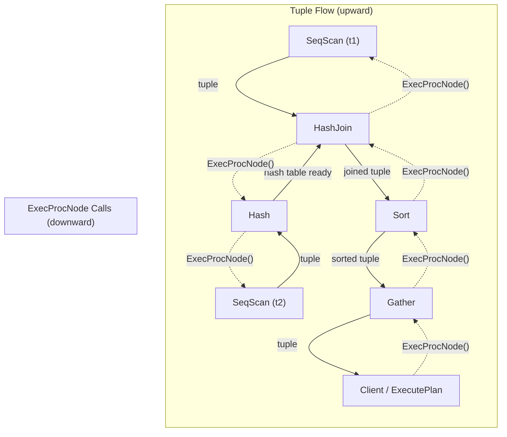

# Volcano Iterator Model

## Summary

PostgreSQL's executor uses the Volcano (iterator) model, where every plan node
implements the same three-method interface: **init**, **get-next-tuple**, and
**cleanup**. Nodes form a tree, and tuples flow upward on demand -- the root
node "pulls" tuples from its children, which pull from their children, all the
way down to the leaf scan nodes. This uniform interface makes it trivial to
compose arbitrary plan shapes, and it allows pipelined execution where most
tuples never materialize in full intermediate result sets.

---

## Overview

The Volcano model (named after Goetz Graefe's 1994 paper) is a
demand-driven evaluation strategy. Each operator in the query plan behaves
like an iterator with three operations:

| Operation | PostgreSQL Function | Purpose |
|---|---|---|
| **Open** | `ExecInitNode()` | Allocate state, open relations, recurse into children |
| **Next** | `ExecProcNode()` | Return the next result tuple, or NULL when exhausted |
| **Close** | `ExecEndNode()` | Release resources, close relations, recurse into children |

The key insight is that **every node has the same signature**. A Sort node, a
HashJoin node, and a SeqScan node all return a `TupleTableSlot *` from their
`ExecProcNode` call. This uniformity means the executor does not need to know
what type of node it is calling -- it simply invokes the function pointer.

---

## Key Source Files

| File | Purpose |
|---|---|
| `src/backend/executor/execProcnode.c` | Central dispatch: `ExecInitNode`, `ExecEndNode`, and first-call trampoline |
| `src/backend/executor/execMain.c` | `ExecutePlan()` loop that calls `ExecProcNode` on root |
| `src/backend/executor/execScan.c` | Generic scan loop used by all scan nodes |
| `src/include/nodes/execnodes.h` | `PlanState` base struct with `ExecProcNode` function pointer |

---

## How It Works

### The ExecProcNode Function Pointer

Every `PlanState` carries a function pointer that implements its get-next-tuple
logic:

```c
/* From execnodes.h */
typedef TupleTableSlot *(*ExecProcNodeMtd)(PlanState *pstate);

typedef struct PlanState {
    ...
    ExecProcNodeMtd ExecProcNode;       /* function to return next tuple */
    ExecProcNodeMtd ExecProcNodeReal;   /* actual implementation */
    ...
} PlanState;
```

During `ExecInitNode()`, each node type sets this pointer to its own
implementation:

```c
/* In ExecInitSeqScan() */
scanstate->ss.ps.ExecProcNode = ExecSeqScan;

/* In ExecInitHashJoin() */
hjstate->js.ps.ExecProcNode = ExecHashJoin;

/* In ExecInitSort() */
sortstate->ss.ps.ExecProcNode = ExecSort;
```

### The First-Call Trampoline

To avoid branching on every tuple for instrumentation setup, PostgreSQL uses a
trampoline pattern. Initially, `ExecProcNode` is set to `ExecProcNodeFirst()`:

```c
/* execProcnode.c */
static TupleTableSlot *
ExecProcNodeFirst(PlanState *node)
{
    /* If instrumentation is active, wrap with ExecProcNodeInstr */
    if (node->instrument)
        node->ExecProcNode = ExecProcNodeInstr;
    else
        node->ExecProcNode = node->ExecProcNodeReal;

    return node->ExecProcNode(node);
}
```

After the first call, subsequent calls go directly to the real implementation
(or the instrumentation wrapper), with zero overhead from the trampoline.

### The Instrumentation Wrapper

When `EXPLAIN ANALYZE` is active, `ExecProcNodeInstr()` wraps the real function
to capture timing and row counts:

```c
static TupleTableSlot *
ExecProcNodeInstr(PlanState *node)
{
    TupleTableSlot *result;

    InstrStartNode(node->instrument);
    result = node->ExecProcNodeReal(node);
    InstrStopNode(node->instrument, TupIsNull(result) ? 0.0 : 1.0);

    return result;
}
```

### The ExecInitNode Dispatch

`ExecInitNode()` is a large switch statement that maps `Plan` node tags to
their initialization functions:

```c
PlanState *
ExecInitNode(Plan *node, EState *estate, int eflags)
{
    PlanState *result;

    if (node == NULL)
        return NULL;

    check_stack_depth();

    switch (nodeTag(node))
    {
        /* Control nodes */
        case T_Result:
            result = (PlanState *) ExecInitResult(...);
            break;

        /* Scan nodes */
        case T_SeqScan:
            result = (PlanState *) ExecInitSeqScan(...);
            break;
        case T_IndexScan:
            result = (PlanState *) ExecInitIndexScan(...);
            break;

        /* Join nodes */
        case T_NestLoop:
            result = (PlanState *) ExecInitNestLoop(...);
            break;
        case T_HashJoin:
            result = (PlanState *) ExecInitHashJoin(...);
            break;

        /* Materialization nodes */
        case T_Sort:
            result = (PlanState *) ExecInitSort(...);
            break;
        case T_Agg:
            result = (PlanState *) ExecInitAgg(...);
            break;

        /* ... ~40 node types total ... */
    }

    /* Initialize any subPlan expressions (correlated subqueries) */
    ...
    return result;
}
```

### The Demand-Driven Pipeline

Consider this plan for `SELECT * FROM t1 JOIN t2 ON t1.id = t2.id WHERE t1.x > 10`:

```
            Limit
              |
          Hash Join
          /        \
     Seq Scan      Hash
      (t1)          |
                  Seq Scan
                   (t2)
```

Execution proceeds as follows:

```
1. ExecutePlan() calls ExecProcNode(Limit)
2. Limit calls ExecProcNode(HashJoin)
3. HashJoin needs to build hash table first:
   a. Calls ExecProcNode(Hash) repeatedly
   b. Hash calls ExecProcNode(SeqScan-t2) repeatedly
   c. Each tuple from t2 is inserted into the hash table
   d. When SeqScan-t2 returns NULL, hash table is complete
4. HashJoin enters probe phase:
   a. Calls ExecProcNode(SeqScan-t1) for outer tuple
   b. Hashes the join key, probes the hash table
   c. If match found and quals pass, returns joined tuple
5. Limit receives tuple, decrements count
6. If count > 0, repeat from step 1
```

The critical point is that **steps 4a-4c happen one tuple at a time**. The
SeqScan on t1 does not materialize all its tuples -- it returns them one by one
as the HashJoin requests them. This is the pipelining property.

### Pipeline Breakers

Some nodes must consume all input before producing any output. These are called
**pipeline breakers** or **blocking operators**:

| Node | Why it blocks |
|---|---|
| **Sort** | Must see all tuples to determine ordering |
| **Hash** (build side) | Must build complete hash table before probing |
| **Agg** (hash strategy) | Must hash all groups before returning results |
| **Material** | Buffers all input for potential rescans |
| **WindowAgg** | Must buffer entire partition |

Non-blocking (pipelined) nodes like SeqScan, NestLoop, Limit, and the probe
side of HashJoin can begin returning tuples immediately.

---

## Key Data Structures

### The ExecScan Loop

All scan nodes share a common loop implemented in `execScan.c`:

```c
TupleTableSlot *
ExecScan(ScanState *node,
         ExecScanAccessMtd accessMtd,    /* e.g., SeqNext */
         ExecScanRecheckMtd recheckMtd)  /* e.g., SeqRecheck */
{
    ExprContext *econtext = node->ps.ps_ExprContext;
    ExprState  *qual = node->ps.qual;

    for (;;)
    {
        TupleTableSlot *slot;

        slot = ExecScanFetch(node, accessMtd, recheckMtd);
        if (TupIsNull(slot))
            return NULL;

        /* Place tuple in scan context for qual evaluation */
        econtext->ecxt_scantuple = slot;

        /* Check quals */
        if (qual == NULL || ExecQual(qual, econtext))
        {
            /* Project if needed, otherwise return scan tuple */
            if (node->ps.ps_ProjInfo)
                return ExecProject(node->ps.ps_ProjInfo);
            else
                return slot;
        }

        /* Tuple failed qual -- reset and try next */
        ResetExprContext(econtext);
    }
}
```

This loop encapsulates the universal scan pattern: fetch, filter, project. Each
scan type only needs to supply its own `accessMtd` (how to get the next raw
tuple) and `recheckMtd` (for recheck after index-based filtering).

### TupleTableSlot

The universal container for tuples flowing between nodes:

```c
typedef struct TupleTableSlot {
    NodeTag          type;              /* slot type tag */
    uint16           tts_flags;         /* TTS_FLAG_EMPTY, TTS_FLAG_SHOULDFREE, etc. */
    AttrNumber       tts_nvalid;        /* number of valid Datum columns */
    const TupleTableSlotOps *tts_ops;   /* virtual method table */
    TupleDesc        tts_tupleDescriptor;
    Datum           *tts_values;        /* column values */
    bool            *tts_isnull;        /* column null flags */
    MemoryContext    tts_mcxt;          /* memory context owning the slot */
    ...
} TupleTableSlot;
```

Three slot implementations exist:

| Type | Storage | Use Case |
|---|---|---|
| `HeapTupleTableSlot` | On-disk heap tuple | SeqScan, IndexScan results |
| `MinimalTupleTableSlot` | Headerless tuple | Hash tables, tuple stores, inter-node transfer |
| `VirtualTupleTableSlot` | Datum/isnull arrays | Projections, computed results |

---

## Diagram: Demand-Driven Tuple Flow

```
    Client
      ^
      | receiveSlot()
      |
  ExecutePlan
      ^
      | ExecProcNode()
      |
   [Limit]  -----> returns tuple or NULL
      ^
      | ExecProcNode()
      |
  [Hash Join]
      ^           ^
      |           |
  ExecProcNode  ExecProcNode
      |           |
  [Seq Scan]   [Hash]
    (outer)      ^
                 | ExecProcNode()
                 |
              [Seq Scan]
               (inner)

  Data flows UP (demand-driven)
  Control flows DOWN (recursive calls)
```



### Rescan Protocol

When a node needs to re-read its input (for example, the inner side of a nested
loop on each new outer tuple), it calls `ExecReScan()`:

```c
void ExecReScan(PlanState *node)
{
    if (node->chgParam != NULL)     /* parameter changed? */
        /* propagate rescan to children that depend on the param */

    switch (nodeTag(node->plan))
    {
        case T_SeqScan:
            ExecReScanSeqScan((SeqScanState *) node);
            break;
        case T_IndexScan:
            ExecReScanIndexScan((IndexScanState *) node);
            break;
        /* ... */
    }
}
```

For parameterized nodes (like an inner IndexScan in a NestLoop), the parameter
change propagates through `chgParam` bitmapsets. A node only rescans if a
parameter it depends on has actually changed.

---

## Performance Considerations

**Function pointer overhead.** Calling through a function pointer prevents the
compiler from inlining the callee. For very simple nodes (Result, Limit), this
overhead is measurable. PostgreSQL mitigates this by using `pg_attribute_always_inline`
on hot-path internal functions like `SeqNext()`.

**Pipeline depth.** Deep plan trees mean deep call stacks. Each `ExecProcNode`
call adds a frame. PostgreSQL checks `check_stack_depth()` during init to guard
against stack overflow on pathologically deep plans.

**Tuple slot materialization.** When tuples cross node boundaries, they may need
to be "materialized" from virtual form into minimal tuples (for hash tables) or
heap tuples (for sorting). The `tts_ops->materialize` virtual method handles
this transparently.

---

## Connections

| Topic | Link |
|---|---|
| Executor overview and lifecycle | [Query Executor](index) |
| Scan node implementations | [Scan Nodes](scan-nodes) |
| Join algorithm details | [Join Nodes](join-nodes) |
| Expression evaluation in qual checks | [Expression Evaluation](expression-eval) |
| Parallel query extensions to the model | [Parallel Query](parallel-query) |
| Plan tree construction | [Query Optimizer](../07-query-optimizer/) |
