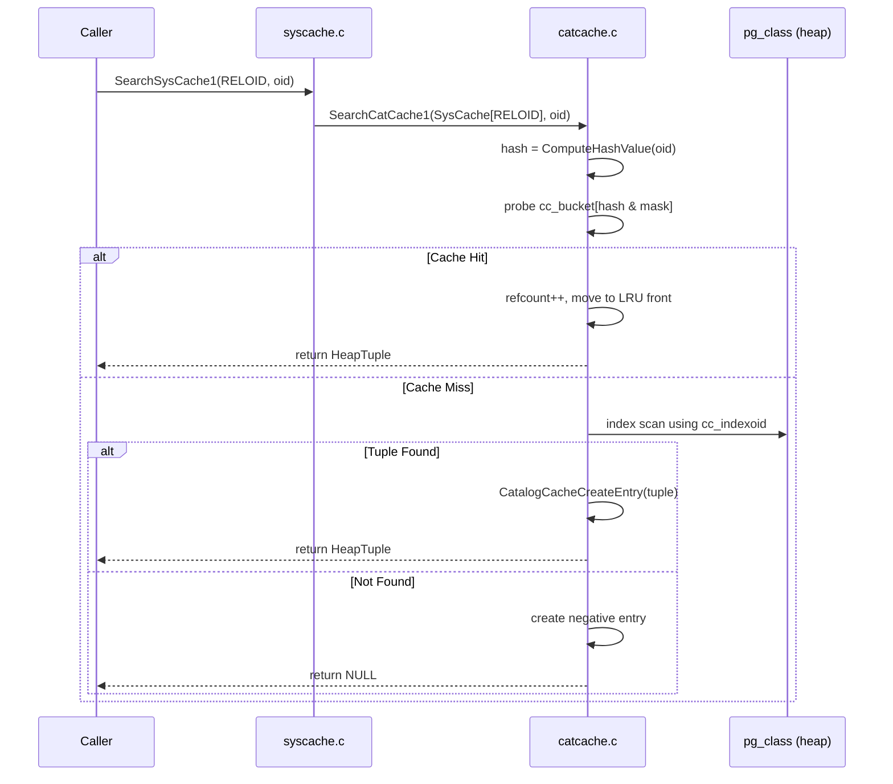

# Catalog Cache (catcache & syscache)

PostgreSQL's system catalogs (`pg_class`, `pg_attribute`, `pg_proc`, `pg_type`, and dozens more) are ordinary heap tables. The **catalog cache** (catcache) provides a per-backend, in-memory hash table that avoids repeated heap scans for frequently accessed catalog tuples. The **system cache** (syscache) is a thin naming layer on top of catcache that maps symbolic cache identifiers (like `PROCOID` or `RELOID`) to specific catcache instances.

## Overview

Every backend maintains its own private set of catcaches. There are roughly 80+ distinct caches (one per unique index on a system catalog that warrants caching). Each catcache is a hash table keyed by 1-4 columns that correspond to the columns of a unique index on the underlying catalog.

A lookup proceeds as:
1. Hash the search keys.
2. Probe the hash bucket.
3. On hit, return the cached `HeapTuple` (bumping the reference count).
4. On miss, perform an index scan of the catalog table, insert the result into the cache, and return it.
5. If the index scan finds nothing, insert a **negative cache entry** -- a sentinel proving the tuple does not exist.

## Key Source Files

| File | Role |
|------|------|
| `src/backend/utils/cache/catcache.c` | Core hash table implementation, lookup, insertion, invalidation |
| `src/backend/utils/cache/syscache.c` | Named cache IDs, `SearchSysCache*()` convenience functions |
| `src/include/utils/catcache.h` | `CatCache`, `CatCTup`, `CatCList`, `CatCacheHeader` structs |
| `src/include/utils/syscache.h` | `SysCacheIdentifier` enum, `SearchSysCache1..4()` prototypes |
| `src/backend/utils/cache/lsyscache.c` | Higher-level convenience wrappers (e.g., `get_rel_name()`) |
| `src/include/catalog/syscache_ids.h` | Auto-generated enum of all cache IDs |

## How It Works

### Initialization

During backend startup, `InitCatalogCache()` (in `syscache.c`) iterates over the `cacheinfo[]` array -- a static table that maps each `SysCacheIdentifier` to its catalog OID, index OID, key columns, and initial bucket count. For each entry it calls `InitCatCache()`, which allocates the `CatCache` struct but does **not** yet open the catalog or read its `TupleDesc`. That deferred work happens on first use via `CatalogCacheInitializeCache()`.

```c
/* From syscache.c -- the cache descriptor array is generated from
   MAKE_SYSCACHE macros in catalog header files */
static CatCache *SysCache[SysCacheSize];
```

### Lookup Path: SearchCatCache

The hot path is `SearchCatCacheInternal()`, called by the public `SearchCatCache1()` through `SearchCatCache4()` functions:

```
SearchSysCache1(RELOID, relid)
  -> SearchCatCache1(SysCache[RELOID], relid)
    -> SearchCatCacheInternal(cache, 1, relid, 0, 0, 0)
      1. Compute hash: CatalogCacheComputeHashValue()
      2. Probe bucket: HASH_INDEX(hash, cc_nbuckets)
      3. Walk dlist looking for matching keys
      4. Hit -> move to front of LRU list, bump refcount, return
      5. Miss -> SearchCatCacheMiss()
            -> index scan of catalog
            -> CatalogCacheCreateEntry() to insert result
            -> return new entry (or negative entry if not found)
```

The hash table uses **power-of-2 sizing** with a bitmask (`h & (sz - 1)`) rather than modulo. Buckets are doubly-linked lists (`dlist_head`) maintained in LRU order so repeated lookups of the same key hit the list head.

### Negative Caching

When a search finds no matching tuple, catcache inserts a `CatCTup` with `negative = true` and no tuple data. Subsequent lookups for the same key return `NULL` immediately without touching the catalog. This is critical for performance in scenarios like function resolution, where the parser may probe for overloads that do not exist.

A negative entry is invalidated just like a positive one -- via hash value match in `CatCacheInvalidate()`.

### List Searches: SearchCatCacheList

Some lookups need all tuples matching a partial key (e.g., all attributes of a relation). `SearchCatCacheList()` returns a `CatCList` -- an array of `CatCTup` pointers for all matching tuples. List entries have their own hash table (`cc_lbucket`) and are separately reference-counted.

### Reference Counting and the "Dead" Flag

Every `CatCTup` has a `refcount`. Callers receive a reference via `SearchSysCache*()` and must call `ReleaseSysCache()` when done. When an invalidation arrives, the entry is marked `dead = true`. A dead entry is invisible to new searches but is not freed until its refcount drops to zero. This prevents use-after-free in code that holds a pointer across operations that might trigger invalidation.

{: .warning }
Forgetting to call `ReleaseSysCache()` causes a resource leak that is detected by the ResourceOwner system at transaction end. The backend will emit a WARNING and force-release the reference.

### Invalidation

`CatCacheInvalidate(cache, hashValue)` scans the hash bucket for entries whose hash matches and marks them dead (or removes them if refcount is zero). It also scans the `CatCList` entries. The actual invalidation is triggered by the `inval.c` dispatcher, which receives sinval messages and calls `SysCacheInvalidate()` for the appropriate cache ID and hash value.

### Create-in-Progress Protection

A subtle race exists: what if an invalidation message arrives while we are in the middle of building a new cache entry (between the catalog scan and the insertion)? The `CatCInProgress` stack handles this. Before performing a catalog scan for a miss, the code pushes a `CatCInProgress` entry. If an invalidation callback fires during the scan and matches the in-progress entry's hash, it sets `dead = true` on the stack entry. After insertion, the code checks this flag and, if set, immediately marks the new entry as dead.

```c
typedef struct CatCInProgress
{
    CatCache   *cache;
    uint32      hash_value;
    bool        list;
    bool        dead;       /* set by invalidation callback */
    struct CatCInProgress *next;
} CatCInProgress;
```

## Key Data Structures

### CatCache

```
CatCache
  +-- id                  cache identifier (SysCacheIdentifier)
  +-- cc_nbuckets         number of hash buckets (power of 2)
  +-- cc_bucket[]         array of dlist_head (hash chains)
  +-- cc_nkeys            number of key columns (1..4)
  +-- cc_keyno[]          attribute numbers of key columns
  +-- cc_hashfunc[]       hash function for each key
  +-- cc_fastequal[]      equality function for each key
  +-- cc_reloid           OID of the cached catalog relation
  +-- cc_indexoid          OID of the underlying unique index
  +-- cc_ntup             current number of cached tuples
  +-- cc_nlbuckets        number of list-search hash buckets
  +-- cc_lbucket[]        hash chains for CatCList entries
```

### CatCTup (individual cached tuple)

```
CatCTup
  +-- cache_elem          dlist node in hash bucket chain
  +-- hash_value          hash of lookup keys
  +-- keys[4]             cached key datums
  +-- refcount            active reference count
  +-- dead                invalidated but not yet freed?
  +-- negative            is this a negative (not-found) entry?
  +-- tuple               HeapTupleData with actual tuple data following
  +-- c_list              pointer to containing CatCList, or NULL
  +-- my_cache            back-pointer to owning CatCache
```

### CatCList (partial-key list result)

```
CatCList
  +-- cache_elem          dlist node in list hash bucket
  +-- hash_value          hash of partial key
  +-- keys[4]             partial key datums
  +-- refcount            active reference count
  +-- dead                invalidated?
  +-- ordered             are members in index order?
  +-- nkeys               number of key columns used for this list
  +-- n_members           number of matching tuples
  +-- members[]           flexible array of CatCTup pointers
```

### Syscache Lookup Flow



## Rehashing

When the number of entries in a catcache grows large relative to the bucket count, `RehashCatCache()` doubles the number of buckets. The threshold is when `cc_ntup` exceeds `cc_nbuckets * 2`. Since bucket count is always a power of 2, rehashing simply recomputes `HASH_INDEX` for each entry and moves it. The same mechanism exists for list buckets via `RehashCatCacheLists()`.

## CATCACHE_STATS

When compiled with `#define CATCACHE_STATS`, each `CatCache` tracks hit rates, miss rates, negative hits, and invalidation counts. An `on_proc_exit` handler prints these statistics to the server log. This is invaluable for diagnosing cache pressure in workloads with many distinct catalog lookups.

## The lsyscache.c Convenience Layer

Most callers do not use `SearchSysCache*()` directly. Instead, they call functions in `lsyscache.c` like `get_rel_name()`, `get_atttype()`, or `get_func_rettype()`. These wrappers handle the `SearchSysCache` / extract attribute / `ReleaseSysCache` pattern in a single call, reducing boilerplate and preventing reference leaks.

## Connections

- **[Relation Cache](relation-cache)** -- The relcache is built on top of multiple syscache lookups (pg_class, pg_attribute, pg_index, etc.).
- **[Invalidation](invalidation)** -- Catcache invalidation is driven by sinval messages dispatched through `inval.c`.
- **[Plan Cache](plan-cache)** -- Plan invalidation can be triggered by catcache invalidation callbacks registered by `plancache.c`.
- **Chapter 1 (Storage)** -- Cache misses ultimately read catalog pages through the buffer manager.
- **Chapter 10 (Memory)** -- All catcache entries live in `CacheMemoryContext`, which persists for the backend's lifetime.
