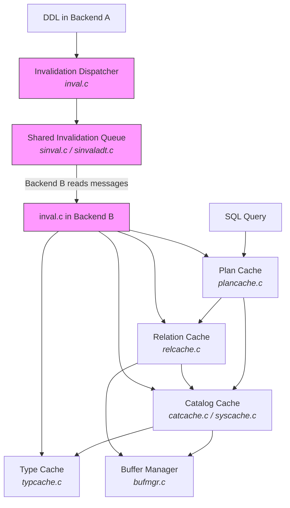

# Chapter 9: Caches

PostgreSQL is a process-per-connection system. Every backend needs fast access to metadata about tables, types, operators, and plans -- but that metadata lives in ordinary heap tables (the system catalogs) on disk. Without caching, even a simple `SELECT 1` would trigger dozens of catalog lookups through the full buffer manager path.

The caching subsystem solves this by maintaining **per-backend, in-process-memory caches** that keep hot catalog data a pointer dereference away. The tradeoff is coherence: when one backend runs `ALTER TABLE`, every other backend's cached view of that table becomes stale. PostgreSQL addresses this through a **shared invalidation (sinval) message queue** -- a lockless, ring-buffer-based broadcast channel in shared memory.

## The Caching Layers

PostgreSQL maintains several distinct caches, each specialized for a different access pattern:

| Cache | Scope | Keyed By | Stores | Source |
|-------|-------|----------|--------|--------|
| **Catalog Cache (catcache)** | Per-backend | Up to 4 key columns | Individual catalog tuples | `src/backend/utils/cache/catcache.c` |
| **System Cache (syscache)** | Per-backend | Cache ID + keys | Wrapper over catcache with named IDs | `src/backend/utils/cache/syscache.c` |
| **Relation Cache (relcache)** | Per-backend | Relation OID | Full `RelationData` structs | `src/backend/utils/cache/relcache.c` |
| **Plan Cache (plancache)** | Per-backend | Query string / source | Parsed, rewritten, and planned query trees | `src/backend/utils/cache/plancache.c` |
| **Type Cache (typcache)** | Per-backend | Type OID | Operator families, comparison procs, tuple descriptors | `src/backend/utils/cache/typcache.c` |
| **Invalidation Dispatcher** | Per-backend + shared | -- | Pending invalidation messages | `src/backend/utils/cache/inval.c` |
| **Sinval Queue** | Shared memory | -- | Ring buffer of `SharedInvalidationMessage` | `src/backend/storage/ipc/sinval.c` |

## Lifecycle of a Cache Lookup

A typical flow when executing a prepared statement:

1. **Plan cache** checks if the `CachedPlanSource` is still valid (`is_valid` flag).
2. If valid, the cached plan references relations by OID. The **relcache** returns the `RelationData` for each OID, building it from catalog lookups if not already cached.
3. Each catalog lookup goes through **syscache** (a named wrapper) which delegates to the appropriate **catcache**. The catcache hashes the lookup keys and probes its hash table. On a miss, it performs an index scan of the underlying system catalog through the buffer manager.
4. During query execution, if the executor needs to compare composite types or look up hash/equality operators, it consults the **type cache**.

## Invalidation Flow

When `Backend A` runs `ALTER TABLE foo ADD COLUMN bar int`:

1. `heap_update()` on `pg_attribute` calls `CacheInvalidateHeapTuple()`.
2. `inval.c` queues a catcache invalidation message (keyed by hash value) and a relcache invalidation message (keyed by relation OID).
3. At `CommandCounterIncrement()`, Backend A processes its own pending invalidations so subsequent commands in the same transaction see the new state.
4. At `COMMIT`, the pending messages are sent to the **sinval shared queue** via `SendSharedInvalidMessages()`.
5. Other backends call `AcceptInvalidationMessages()` at the start of each transaction (and at other safe points). Each message triggers registered callbacks that mark the appropriate cache entries as invalid or remove them.

{: .note }
Backends that fall too far behind on the sinval queue receive a `PROCSIG_CATCHUP_INTERRUPT` signal, forcing them to catch up before the circular buffer wraps around and overwrites unread messages.

## Key Design Decisions

**Per-backend, not shared.** The caches live in each backend's private memory. This avoids locking overhead on the read path (which dominates), at the cost of duplicated memory across connections.

**Lazy invalidation.** Entries are not eagerly pushed to other backends. Instead, invalidation messages are queued and processed opportunistically. This means a backend may briefly serve queries using stale metadata, but transactional DDL and locking protocols ensure this never produces incorrect results.

**Negative caching.** The catalog cache stores "negative" entries -- proof that a tuple with certain keys does not exist. This is critical for avoiding repeated fruitless catalog scans (e.g., checking for a non-existent function overload).

**Reference counting.** Both `CatCTup` and `CachedPlan` entries are reference-counted. An invalidation marks the entry as "dead" but does not free it until all active references are released. This prevents dangling pointers mid-query.

## Chapter Contents

| Page | What You'll Learn |
|------|-------------------|
| [Catalog Cache](catalog-cache) | catcache hash tables, syscache named lookups, negative entries, reference counting |
| [Relation Cache](relation-cache) | RelationData construction, init files, three-phase bootstrap, invalidation |
| [Plan Cache](plan-cache) | Generic vs. custom plans, cost-based switching, invalidation triggers |
| [Type Cache](type-cache) | Operator and comparison function lookup, domain constraints, composite types |
| [Invalidation](invalidation) | sinval message types, the shared queue, callback registration, cross-backend coherence |

## Connections

- **Chapter 1 (Storage)** -- Catalog cache misses fall through to the buffer manager for actual disk I/O.
- **Chapter 3 (Transactions)** -- Invalidation messages are transactional; they are only broadcast on commit.
- **Chapter 5 (Locking)** -- DDL acquires `AccessExclusiveLock` to ensure no backend can use a stale relcache entry for the locked relation.
- **Chapter 7 (Optimizer)** -- The plan cache feeds pre-optimized plans back to the optimizer's `GetCachedPlan()` path.
- **Chapter 10 (Memory)** -- All caches allocate from `CacheMemoryContext`, a long-lived memory context.
- **Chapter 11 (IPC)** -- The sinval queue is a shared-memory data structure managed by `sinvaladt.c`.
