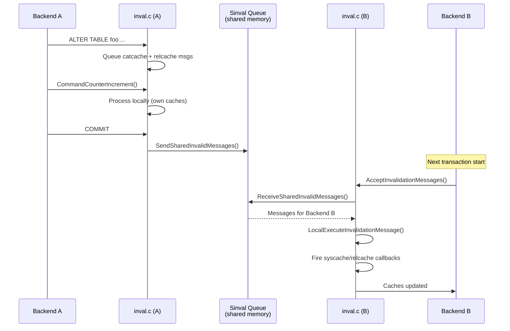

# Cache Invalidation and Cross-Backend Coherence

PostgreSQL runs each backend as an independent process with private caches. When one backend modifies a system catalog (via DDL or catalog DML), every other backend must eventually learn that its cached data may be stale. The **shared invalidation (sinval)** system provides this cross-backend coherence through a shared-memory message queue and a per-backend dispatch layer.

## Overview

The invalidation system has two layers:

1. **`inval.c`** -- The per-backend **invalidation dispatcher**. It accumulates invalidation events during a transaction, processes them locally at command boundaries, broadcasts them to other backends on commit, and dispatches incoming messages to registered callback functions.

2. **`sinval.c` / `sinvaladt.c`** -- The **shared invalidation queue** in shared memory. A circular buffer that all backends write to (on commit) and read from (opportunistically). Backends that fall too far behind are signaled to catch up.

Together, these ensure that every backend's caches eventually converge to a consistent view, while allowing reads to proceed without locking.

## Key Source Files

| File | Role |
|------|------|
| `src/backend/utils/cache/inval.c` | Per-backend invalidation dispatcher, callback management, transactional queuing |
| `src/include/utils/inval.h` | Public API for invalidation: `CacheInvalidateHeapTuple()`, callback registration |
| `src/backend/storage/ipc/sinval.c` | Send/receive shared invalidation messages |
| `src/backend/storage/ipc/sinvaladt.c` | Shared memory ring buffer implementation |
| `src/include/storage/sinval.h` | `SharedInvalidationMessage` union, message type definitions |

## How It Works

### Step 1: Generating Invalidation Events

When a catalog tuple is inserted, updated, or deleted via `CatalogTupleInsert()`, `CatalogTupleUpdate()`, or `CatalogTupleDelete()`, the catalog access code calls `CacheInvalidateHeapTuple()`. This function:

1. Calls `PrepareToInvalidateCacheTuple()` from `catcache.c`, which determines which catcaches could contain entries for this tuple and computes the hash value for each.
2. Queues a `SharedInvalCatcacheMsg` for each affected catcache.
3. If the tuple is from `pg_class`, `pg_attribute`, `pg_index`, or `pg_constraint` (for foreign keys), also queues a `SharedInvalRelcacheMsg` for the affected relation.
4. If the change affects snapshot validity, queues a `SharedInvalSnapshotMsg`.

These messages are **not sent immediately**. They are stored in per-transaction arrays in `TopTransactionContext`.

### Step 2: Local Processing at Command Boundary

At `CommandCounterIncrement()`, `CommandEndInvalidationMessages()` is called. It:

1. Processes all pending catcache invalidations locally (so subsequent commands in the same transaction see the updated catalog state).
2. Processes all pending relcache invalidations locally.
3. Fires registered syscache and relcache callbacks.
4. Optionally writes invalidation records to WAL (when `wal_level = logical`, for logical decoding of in-progress transactions).

The messages remain in the transaction's pending lists for eventual broadcast.

### Step 3: Broadcast on Commit

At transaction commit, `AtEOXact_Inval(true)` sends all accumulated messages to the shared invalidation queue via `SendSharedInvalidMessages()`. On abort, `AtEOXact_Inval(false)` processes the messages locally (to undo any catalog state the aborted transaction loaded) but does not broadcast them.

### Step 4: Other Backends Read Messages

Other backends call `AcceptInvalidationMessages()` at safe points -- typically at the start of each transaction, after acquiring locks, and during `ProcessCatchupInterrupt()`. This function calls `ReceiveSharedInvalidMessages()`, which reads messages from the shared queue and dispatches each one to `LocalExecuteInvalidationMessage()`.

`LocalExecuteInvalidationMessage()` examines the message type and calls the appropriate handler:

| Message Type ID | Struct | Handler |
|----------------|--------|---------|
| >= 0 (catcache ID) | `SharedInvalCatcacheMsg` | `SysCacheInvalidate(id, hashValue)` |
| -1 (`SHAREDINVALCATALOG_ID`) | `SharedInvalCatalogMsg` | `CatalogCacheFlushCatalog(catId)` |
| -2 (`SHAREDINVALRELCACHE_ID`) | `SharedInvalRelcacheMsg` | `RelationCacheInvalidateEntry(relId)` |
| -3 (`SHAREDINVALSMGR_ID`) | `SharedInvalSmgrMsg` | `smgrcloserellocator(rlocator)` |
| -4 (`SHAREDINVALRELMAP_ID`) | `SharedInvalRelmapMsg` | `RelationMapInvalidate(dbId)` |
| -5 (`SHAREDINVALSNAPSHOT_ID`) | `SharedInvalSnapshotMsg` | `InvalidateCatalogSnapshot()` |
| -6 (`SHAREDINVALRELSYNC_ID`) | `SharedInvalRelSyncMsg` | `CallRelSyncCallbacks(relid)` |

After processing all messages, the system fires any registered callbacks.



### The Shared Invalidation Queue (sinvaladt.c)

The queue is a **circular buffer** in shared memory, sized at startup. Each backend maintains a read pointer (`nextMsgNum`) tracking how far it has read. Key properties:

- **Lock-free reads**: Backends read from the queue without taking a lock on the buffer (they use their own local state to track position).
- **Lightweight write locking**: Writers acquire a lightweight lock briefly to insert messages.
- **Catchup signal**: If a backend's read pointer falls so far behind the oldest writer that the buffer would wrap around, `sinvaladt.c` sends a `PROCSIG_CATCHUP_INTERRUPT` signal to the lagging backend. The handler sets `catchupInterruptPending = true`, and at the next safe point the backend processes all pending messages.
- **Reset on overflow**: If a backend has fallen impossibly far behind (the queue has wrapped past it), a full cache reset is triggered via the `resetFunction` callback, which calls `InvalidateSystemCaches()` to flush everything.

{: .warning }
A backend stuck in a long-running query (or idle in transaction) blocks the sinval queue from advancing past its read pointer. This can force the queue to grow or, in extreme cases, trigger `PROCSIG_CATCHUP_INTERRUPT` processing that interrupts client I/O.

### Callback Registration

Higher-level caches (plan cache, type cache, etc.) register callbacks to be notified of invalidation events:

```c
/* Register a per-catcache callback */
CacheRegisterSyscacheCallback(PROCOID, PlanCacheObjectCallback, (Datum) 0);

/* Register a relcache callback */
CacheRegisterRelcacheCallback(PlanCacheRelCallback, (Datum) 0);
```

When `inval.c` processes a catcache invalidation for `PROCOID`, it calls `CallSyscacheCallbacks(PROCOID, hashvalue)`, which iterates over all registered callbacks for that cache ID.

There is a hard limit of 64 syscache callbacks and 64 relcache callbacks. This is sufficient because callbacks are registered once per subsystem, not per cached entry.

## Key Data Structures

### SharedInvalidationMessage

A union type that fits all message variants in a compact format:

```
SharedInvalidationMessage (union)
  +-- id                    message type (first byte, shared by all variants)
  |
  +-- cc (SharedInvalCatcacheMsg)
  |     id >= 0             catcache ID
  |     dbId                database OID (0 for shared catalogs)
  |     hashValue           hash of the invalidated tuple's keys
  |
  +-- cat (SharedInvalCatalogMsg)
  |     id = -1             flush entire catalog
  |     dbId, catId         which catalog in which database
  |
  +-- rc (SharedInvalRelcacheMsg)
  |     id = -2             relcache invalidation
  |     dbId, relId         which relation (0 = all)
  |
  +-- sm (SharedInvalSmgrMsg)
  |     id = -3             storage manager file invalidation
  |     rlocator            RelFileLocator
  |
  +-- rm (SharedInvalRelmapMsg)
  |     id = -4             relation map invalidation
  |     dbId
  |
  +-- sn (SharedInvalSnapshotMsg)
  |     id = -5             snapshot invalidation
  |     dbId, relId
  |
  +-- rs (SharedInvalRelSyncMsg)
        id = -6             replication relation sync
        dbId, relid
```

### TransInvalidationInfo

Per-subtransaction control structure that tracks ranges of messages in the pending arrays:

```
TransInvalidationInfo
  +-- parent                enclosing subtransaction's info
  +-- catcache messages     range [start..end) in the catcache msg array
  +-- relcache messages     range [start..end) in the relcache msg array
```

On subtransaction commit, the child's ranges are absorbed into the parent. On abort, the child's messages are processed locally and discarded.

### Transactional vs. Non-Transactional Invalidation

Most invalidation messages are transactional -- queued during the transaction and only broadcast on commit. Two exceptions:

- **smgr invalidation** (`CacheInvalidateSmgr`): Sent immediately when a physical file is created or removed. Other backends must stop caching file descriptors for the old file.
- **relmap invalidation** (`CacheInvalidateRelmap`): Sent immediately when the `pg_filenode.map` is updated. Required because relmap changes happen outside normal catalog update paths.

These non-transactional messages use `SendSharedInvalidMessages()` directly, bypassing the per-transaction queuing.

### Inplace Updates

Some catalog updates (e.g., updating `pg_class.relfrozenxid` during VACUUM) are done as **inplace heap updates** that do not go through normal transactional machinery. The invalidation system handles these via `PreInplace_Inval()`, `AtInplace_Inval()`, and `ForgetInplace_Inval()`, which manage a separate invalidation context that sends messages immediately within the inplace update's critical section.

## The debug_discard_caches GUC

When compiled with `DISCARD_CACHES_ENABLED` (assert-enabled builds), the `debug_discard_caches` GUC causes all caches to be flushed at every possible invalidation point. This is useful for testing that code correctly handles cache invalidation, but has extreme performance impact. Values:

| Value | Behavior |
|-------|----------|
| 0 | Normal (default in production builds) |
| 1 | Discard caches at every `AcceptInvalidationMessages()` |
| 3 | Also discard caches recursively during cache rebuilds |
| 5 | Maximum aggressiveness |

## Connections

- **[Catalog Cache](catalog-cache)** -- Catcache invalidation is the most frequent message type. `CatCacheInvalidate()` is called for each matching catcache.
- **[Relation Cache](relation-cache)** -- Relcache invalidation messages trigger `RelationCacheInvalidateEntry()`. Init file deletion is coordinated here.
- **[Plan Cache](plan-cache)** -- Registers both relcache and syscache callbacks to detect when cached plans become stale.
- **[Type Cache](type-cache)** -- Registers syscache callbacks for `pg_type` and `pg_opclass` changes.
- **Chapter 3 (Transactions)** -- Invalidation messages are transactional: broadcast on commit, processed locally on abort.
- **Chapter 5 (Locking)** -- DDL takes `AccessExclusiveLock` to ensure invalidation is processed before any concurrent backend can access the modified object.
- **Chapter 11 (IPC)** -- The sinval queue is a shared-memory IPC mechanism. `PROCSIG_CATCHUP_INTERRUPT` uses the signal infrastructure.
