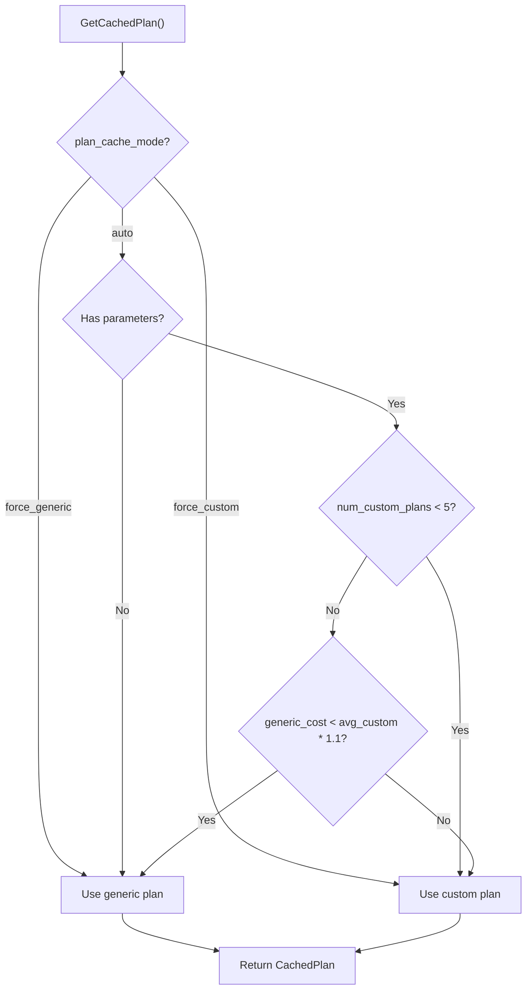
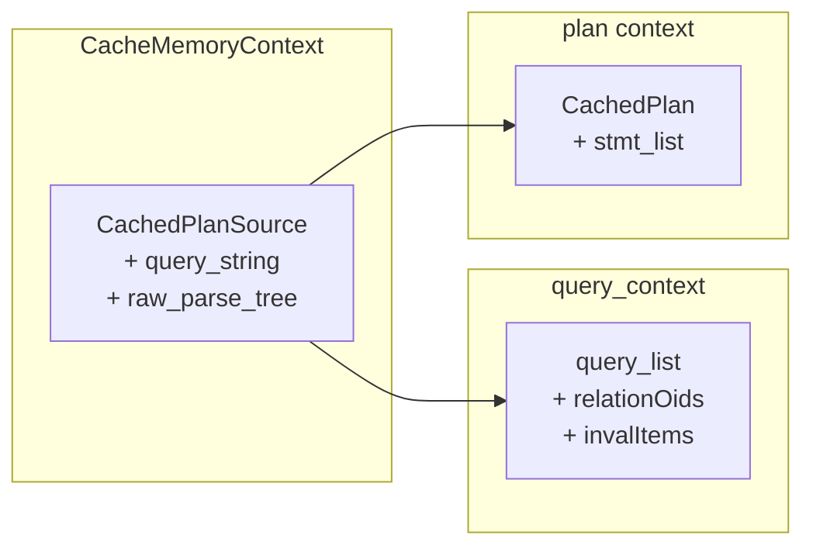

# Plan Cache

The **plan cache** stores parsed, analyzed, rewritten, and planned query trees so that prepared statements, PL/pgSQL functions, and other repeated queries avoid redundant work. Its most interesting responsibility is deciding when to use a **generic plan** (parameter-independent, reusable across executions) versus a **custom plan** (optimized for specific parameter values).

## Overview

The plan cache is organized around two core structs:

- **`CachedPlanSource`** -- Represents a SQL query that may be executed multiple times. Holds the query text, the parse tree, the rewritten query tree, and metadata for invalidation tracking. Lives for the duration of the backend (once "saved").

- **`CachedPlan`** -- Represents an actual execution plan derived from a `CachedPlanSource`. May be generic or custom. Reference-counted and freed when no longer needed.

The lifecycle is: parse once, rewrite once (until invalidated), plan once or many times (depending on generic vs. custom), execute many times.

## Key Source Files

| File | Role |
|------|------|
| `src/backend/utils/cache/plancache.c` | Plan cache management, generic/custom decision, invalidation |
| `src/include/utils/plancache.h` | `CachedPlanSource`, `CachedPlan`, `CachedExpression` structs |

## How It Works

### Creating and Saving a Plan Source

When a `PREPARE` statement is executed (or PL/pgSQL compiles a query):

1. `CreateCachedPlan()` allocates a `CachedPlanSource` with the raw parse tree and query text.
2. `CompleteCachedPlan()` stores the analyzed-and-rewritten query list, the parameter types, and dependency information (relation OIDs and `PlanInvalItem`s).
3. `SaveCachedPlan()` moves the source into permanent storage and links it into the `saved_plan_list`. Only saved plans receive sinval invalidation events.

### Getting a Plan: GetCachedPlan

The central function is `GetCachedPlan()`. Its logic:

```
GetCachedPlan(plansource, boundParams, owner, queryEnv)
  1. RevalidateCachedQuery()
     - If plansource->is_valid is false (invalidated by DDL):
       a. Re-analyze and rewrite from the raw parse tree
       b. Update relationOids and invalItems
       c. Set is_valid = true
     - Also re-validate if search_path changed, or RLS context changed

  2. choose_custom_plan(plansource, boundParams)
     - Decides generic vs. custom (see below)

  3. If generic plan chosen:
     - CheckCachedPlan() -- verify the existing generic plan is still valid
     - If valid, bump refcount and return it
     - If invalid, rebuild via BuildCachedPlan(NULL params)

  4. If custom plan chosen:
     - BuildCachedPlan(boundParams) -- plan with specific parameter values
     - Return the one-shot plan (will be freed after execution)
```

### Generic vs. Custom Plan Decision

This is the plan cache's most nuanced feature. The decision is in `choose_custom_plan()`:

```c
/* Simplified logic from plancache.c */
static bool
choose_custom_plan(CachedPlanSource *plansource, ParamListInfo boundParams)
{
    /* GUC override */
    if (plan_cache_mode == PLAN_CACHE_MODE_FORCE_GENERIC_PLAN)
        return false;
    if (plan_cache_mode == PLAN_CACHE_MODE_FORCE_CUSTOM_PLAN)
        return true;

    /* If no parameters, generic is always fine */
    if (boundParams == NULL)
        return false;

    /* Use custom for the first 5 executions to gather cost data */
    if (plansource->num_custom_plans < 5)
        return true;

    /* Compare average custom cost to generic cost */
    avg_custom_cost = plansource->total_custom_cost / plansource->num_custom_plans;
    if (plansource->generic_cost < avg_custom_cost * 1.1)
        return false;   /* generic is close enough, use it */

    return true;  /* custom is significantly cheaper */
}
```

The key insight: for the first 5 executions, PostgreSQL always uses custom plans to accumulate cost statistics. After that, it switches to the generic plan if the generic plan's cost is within 10% of the average custom plan cost. This avoids the overhead of re-planning every execution when the generic plan is good enough.



{: .note }
The `plan_cache_mode` GUC (`auto`, `force_generic_plan`, `force_custom_plan`) allows administrators to override the automatic decision. This is useful when parameter skew causes the automatic heuristic to make poor choices.

### Plan Invalidation

The plan cache registers three kinds of callbacks with `inval.c`:

1. **`PlanCacheRelCallback`** -- Fired on relcache invalidation. Iterates all saved plan sources and marks any that depend on the invalidated relation's OID as `is_valid = false`. Also invalidates the generic plan if present.

2. **`PlanCacheObjectCallback`** -- Fired on `PROCOID` or `TYPEOID` syscache invalidation. Matches against the `PlanInvalItem` lists in saved plans. This catches function drops, type changes, and domain constraint modifications.

3. **`PlanCacheSysCallback`** -- Fired on changes to `pg_namespace`, `pg_operator`, and similar broad catalogs. Invalidates **all** saved plans, since the impact is too diffuse to track per-plan.

When a plan source is invalidated, the next call to `GetCachedPlan()` triggers `RevalidateCachedQuery()`, which re-analyzes and re-plans. If the underlying schema change makes the query invalid (e.g., a dropped column), the re-analysis throws an error.

### Oneshot Plans

For ad-hoc queries that will execute exactly once, `CreateOneShotCachedPlan()` creates a lightweight plan source that skips data copying, invalidation tracking, and saving. The plan lives in the caller's memory context and is freed when that context is destroyed. This avoids the overhead of the full plan cache machinery for `EXECUTE` of non-prepared queries.

### CachedExpression

For simple scalar expressions (e.g., column defaults, partition bound expressions), the plan cache provides `CachedExpression` -- a minimal wrapper that tracks invalidation but does not store the original parse tree. If invalidated, the caller is responsible for rebuilding. This avoids the weight of a full `CachedPlanSource` for expressions that rarely change.

## Key Data Structures

### CachedPlanSource

```
CachedPlanSource
  +-- raw_parse_tree        original parse tree (or NULL)
  +-- analyzed_parse_tree   pre-analyzed tree (or NULL)
  +-- query_string          SQL text
  +-- query_list            rewritten query trees (List of Query)
  +-- relationOids          OIDs of referenced relations
  +-- invalItems            PlanInvalItem list (functions, types)
  +-- search_path           search_path at parse time
  +-- gplan                 cached generic CachedPlan (or NULL)
  +-- is_valid              false if invalidated, needs revalidation
  +-- is_saved              true if in saved_plan_list
  +-- is_oneshot            true for oneshot plans
  +-- generic_cost          cost of the generic plan
  +-- total_custom_cost     accumulated cost of custom plans
  +-- num_custom_plans      count for averaging
  +-- num_generic_plans     count of generic plan uses
  +-- generation            incremented on each replan
```

### CachedPlan

```
CachedPlan
  +-- stmt_list             list of PlannedStmt nodes
  +-- is_valid              false if invalidated
  +-- is_saved              in long-lived context?
  +-- is_oneshot            oneshot plan?
  +-- planRoleId            role the plan was created for
  +-- dependsOnRole         is plan role-specific?
  +-- saved_xmin            TransactionXmin at plan time
  +-- generation            matches CachedPlanSource.generation
  +-- refcount              live references
  +-- context               MemoryContext holding this plan
```

### Memory Layout



The separation of `query_context` from the main context allows the rewritten query tree to be discarded and rebuilt without disturbing the plan source itself.

## Connections

- **[Catalog Cache](catalog-cache)** -- Plan invalidation is triggered by catcache invalidation callbacks.
- **[Relation Cache](relation-cache)** -- Plans track `relationOids` and are invalidated when those relations change.
- **[Invalidation](invalidation)** -- The plan cache registers relcache and syscache callbacks via `CacheRegisterRelcacheCallback()` and `CacheRegisterSyscacheCallback()`.
- **Chapter 7 (Optimizer)** -- `BuildCachedPlan()` calls the planner to generate execution plans.
- **Chapter 8 (Executor)** -- The executor receives `PlannedStmt` nodes from the cached plan.
- **Chapter 6 (Parsing)** -- Plan invalidation triggers re-parsing and re-analysis from the raw parse tree.
